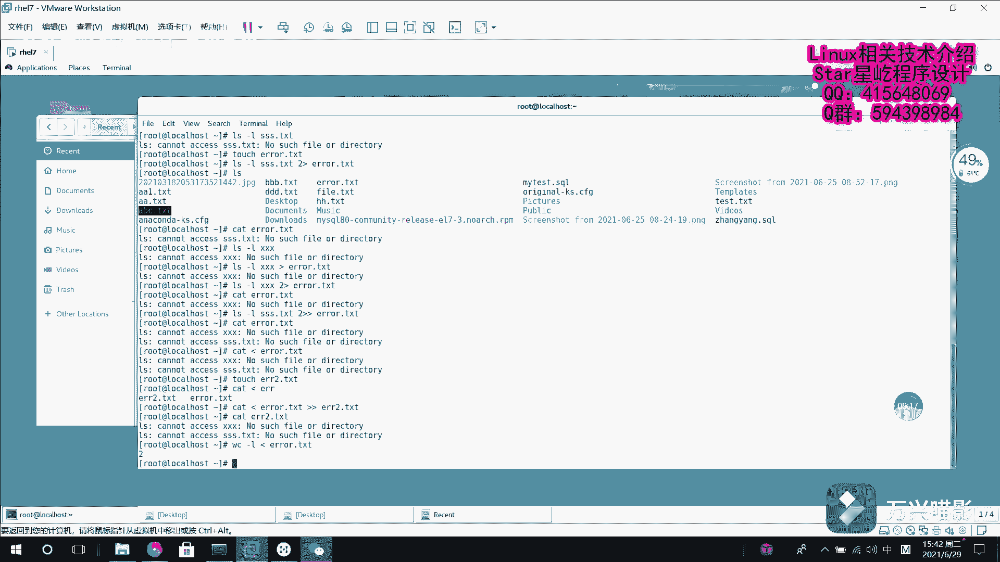

# Linux从入门到精通：P22：重定向技术1 🚀

## 概述
在本节课中，我们将要学习Linux系统中的一项核心技能——重定向技术。重定向技术允许我们改变命令输入和输出的默认来源与去向，是高效使用Shell进行文件操作和数据处理的基础。我们将从基本概念入手，通过实际案例，逐步掌握输入重定向和输出重定向的几种主要模式。

---

## 重定向技术简介
Linux重定向技术分为**输入重定向**和**输出重定向**。

简单来说，**输入重定向**是将文件内容导入到命令中，作为命令的输入。**输出重定向**则是将原本要输出到屏幕上的数据信息，写入到指定的文件中。

在日常学习和工作中，相较于输入重定向，我们更多地使用到输出重定向。

---

## 重定向的五种模式
重定向技术主要分为五种操作模式。以下是这五种模式的简要说明：

1.  **标准覆盖输出重定向**：使用一个向右的箭头 `>` 表示。
2.  **标准追加输出重定向**：使用两个向右的箭头 `>>` 表示。
3.  **错误覆盖输出重定向**：使用 `2>` 表示。
4.  **错误追加输出重定向**：使用 `2>>` 表示。
5.  **输入重定向**：使用一个向左的箭头 `<` 表示。

在错误重定向中出现的数字 `2` 具有特定含义，这引出了我们需要理解的三个核心概念。

---

## 标准输入/输出流与文件描述符
在Linux中，“一切皆文件”，输入和输出操作也被视为对文件的操作。为了区分不同的数据流，系统为它们分配了唯一的**文件描述符**。

以下是三个最常用的标准流：

*   **标准输入 (stdin)**：文件描述符为 `0`。默认从键盘获取输入，但也可以通过重定向从文件或其他命令获取。
    *   **公式/代码表示**：`0`
*   **标准输出 (stdout)**：文件描述符为 `1`。默认将命令的正常输出结果显示在屏幕上。
    *   **公式/代码表示**：`1`
*   **标准错误输出 (stderr)**：文件描述符为 `2`。默认将命令的错误信息显示在屏幕上。
    *   **公式/代码表示**：`2`

因此，在重定向时，`>` 默认是 `1>` 的简写，代表重定向**标准输出**。而 `2>` 则明确指定重定向**标准错误输出**。

---

## 实践案例：输出重定向
上一节我们介绍了重定向的基本模式，本节中我们通过实际操作来感受它们的具体用法。

首先，我们创建一个测试文件并尝试标准输出重定向。

**标准覆盖输出重定向 (`>`)**
以下操作演示如何使用 `>` 将命令输出写入文件，并注意其覆盖特性。

```
# 创建一个文件并写入内容
echo “第一次写入内容” > file.txt
cat file.txt

# 再次使用 ‘>’ 写入，会覆盖原有内容
echo “第二次写入内容” > file.txt
cat file.txt
```

执行后，`file.txt` 中只保留“第二次写入内容”，第一次的内容被覆盖。

**标准追加输出重定向 (`>>`)**
如果希望新的内容追加到文件末尾，而不是覆盖，就需要使用 `>>`。

```
# 追加内容到文件末尾
echo “第三次追加内容” >> file.txt
cat file.txt
```

此时，`file.txt` 中将包含“第二次写入内容”和“第三次追加内容”两行。

---

## 实践案例：错误重定向
接下来，我们看看如何处理命令执行中的错误信息。

**错误覆盖输出重定向 (`2>`)**
以下操作演示如何将错误信息重定向到文件。

```
# 查询一个不存在的文件，错误信息会显示在屏幕
ls -l no_such_file.txt

# 将错误信息覆盖写入 error.log 文件
ls -l no_such_file.txt 2> error.log
cat error.log
```

**错误追加输出重定向 (`2>>`)**
同样，错误信息也可以追加到文件。

```
# 将另一个错误信息追加到 error.log 文件
ls -l another_missing_file.txt 2>> error.log
cat error.log
```

此时，`error.log` 文件中将包含两条错误记录。

---

## 实践案例：输入重定向
最后，我们来学习输入重定向的用法，它可以将文件内容作为命令的输入。

**基本输入重定向 (`<`)**
输入重定向最直接的用途是将文件内容传递给需要输入的命令。

```
# 使用 cat 命令查看文件内容（传统方式）
cat error.log

# 使用输入重定向，将文件内容传递给 cat 命令
cat < error.log
```

以上两种方式效果相同，都显示了 `error.log` 的内容。

**输入重定向与其他命令结合**
输入重定向可以方便地与其他命令配合使用。

```
# 统计文件行数：将文件内容传递给 wc -l 命令
wc -l < error.log

# 组合使用：将文件A的内容写入文件B
cat < error.log > backup_error.log
cat backup_error.log
```

---

## 总结
本节课中我们一起学习了Linux的重定向技术。

我们首先了解了**输入重定向**和**输出重定向**的基本概念。然后，详细探讨了五种重定向模式：标准覆盖输出(`>`)、标准追加输出(`>>`)、错误覆盖输出(`2>`)、错误追加输出(`2>>`)以及输入重定向(`<`)。



为了理解这些符号的含义，我们引入了**标准输入(stdin/0)**、**标准输出(stdout/1)** 和**标准错误输出(stderr/2)** 这三个核心数据流及其**文件描述符**的概念。


最后，我们通过一系列实践案例，演示了如何将命令输出保存或追加到文件、如何分离并记录错误信息，以及如何将文件内容作为命令的输入。掌握这些重定向技巧，将极大提升你在命令行下的工作效率和数据管理能力。