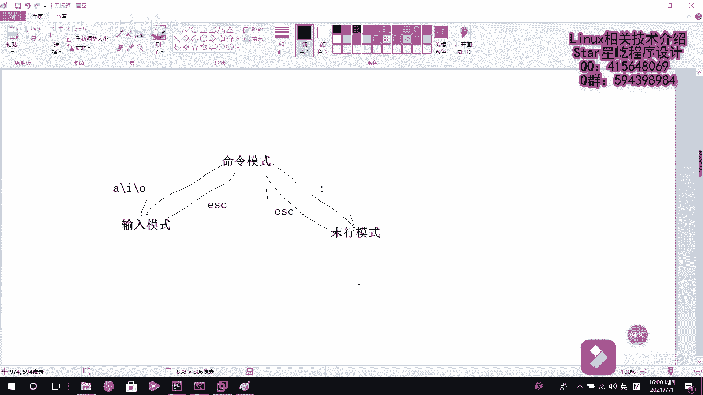

# 【Linux】从入门到精通 ｜ 零基础自学 ｜ 全套教程 ｜ RHCSA ｜ RHCE ｜ Linux爱好者 - P24：024-vim编辑器介绍 - Yo_Holly - BV1Df4y187g7

在本视频当中啊，我将给大家介绍linux系统当中的文本编辑器。呃，几乎啊所有的linux呃系统当中啊都会内建一个文本编辑器，叫VI文本编辑器。它的话已经做的相当棒了，但是仍存在很多优可以优化的地方。

后来啊推出这个增强版本的VI编辑器，叫VIM文本编辑器。它的话比较实用的一个改进，就是说它可以以字体的颜色去辨别语法的正确，就是说方便了程序设计，然后被很多程序员使用。

很多程序员都很都很喜欢去使用这个VIM文本编辑器。说起这个VIM文本编辑器啊，不得不提的一点是呃在lininux系统当中啊，一切都是一切接文件嘛，而配置一个服务啊，或者是修改一些什么选项参数的话。

其实都是修改呃服务的一些配置文件，修改文件参数。这个时候避免不了的需要有一个文本编辑器去对文件进行编辑。然后这个这个时候啊VIM就起到一个很好的一个文本编辑功能。VIM啊它也被很多这个厂商和用户认可。

得到了很多厂商的认可。它之所以能够得到大家的认可。原因在于这个VIM编辑器中设置了三种模式，能够在三种模式当中方便的切换，然后简化简化工作。然后接下来我介绍下这三种模式。三种模式的话分别是命令模式。

然后命令模式输入模式。以及墨航模式。但是这三个模式分别都做哪些工作？首先啊这个命令模式的话，它是控制公标移动，可以可以对文本进行复制、粘贴、删除和查找等工作。

然后这个输入模式的话就是正常的文本文本的录入工作嘛。然后墨豪模式的话就是保存和退出文档以及设置编译环境。呃，这几种模式之间的一个切换的话是这么一个关系。命令模式和输入模式之间的话，可以。相互切换。

然后命令模式和末行模式之间也可以相互切换。然后从这个。命令模式进入到输入模式的话，是通过可以通过这几个键A。啊，好。几个这几个键让它进入输入模式，然后从这个输入模式。退退换到这个命令模式的话。

是使用的是ESC键。呃，在这块，你像这个墨航模式，墨航模式退退出到这退入到这个命令模式的话，也是用ESC键。就是说是这个命令模式进入到墨航模式的话，它是有一个重要的一个是用这个冒号，然后它就进去了。

然后你进入你相应的一些操作。就是他们呃他们之间的一个切换，了解了这个多个模式之间的一个呃切换。也就是说我操作这个呃文本编辑器的时候，我知道该它具体有哪几种模式，我具体具体进到哪种模式下的话。

就可以满足我目前呃哪些需求。了解这个之后肯定就需要对它进行一些操作。像以往我们在windows上使用的那个文本编辑器的话，你比如那个note pad加加，它上面给你提供了很多的那个功能按功能按钮。

让后你就是说是能在GUI界面中很方便的通过点点点就进完成了很多的操作。但是在linux当中啊，这个文本编辑器的话，它就是一个纯字符的界面，它也没有也没有那些很多的那个快捷图标。所以的话这个时候。

很多那个快捷命令，就起到一个很重要的一个角色了。呃，然后所以就是说在这个呃linux下学习文本编辑器的一个去编辑文件，学习这个命。学习快捷操作命令的话也是很重要的。

