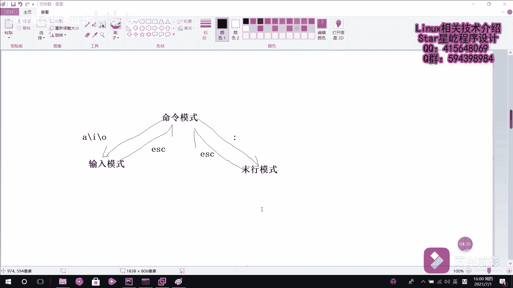

Linux入门到精通：P24：VIM编辑器介绍 🖋️

在本节课中，我们将要学习Linux系统中一个强大且必不可少的工具——VIM文本编辑器。几乎所有Linux系统都内置了VI编辑器，而VIM是其增强版本，通过语法高亮等功能极大地便利了程序开发和系统配置工作。由于Linux中一切皆文件，配置服务或修改参数本质上就是编辑文件，因此掌握一个高效的文本编辑器至关重要。

---

### 三种核心模式

VIM之所以被广泛认可，关键在于它设置了三种工作模式，并能在这三种模式间灵活切换，从而简化操作流程。

以下是VIM的三种核心模式及其主要功能：

1.  **命令模式**
    *   这是启动VIM后的默认模式。
    *   在此模式下，可以控制光标移动，并对文本进行复制、粘贴、删除和查找等操作。
    *   不能直接输入或编辑文字。

2.  **输入模式**
    *   在此模式下，可以进行正常的文字录入和编辑工作，就像使用普通的记事本一样。

3.  **末行模式**
    *   在此模式下，可以执行保存文件、退出编辑器以及设置编辑环境等命令。

---

### 模式间的切换

理解了三种模式的功能后，我们来看看它们之间如何切换。这是高效使用VIM的基础。

模式切换关系如下图所示，其核心枢纽是**命令模式**：

```
输入模式 <--> 命令模式 <--> 末行模式
```

具体的切换按键如下：

*   **从命令模式进入输入模式**：按下以下任意键
    *   `a`：在光标**后**插入
    *   `i`：在光标**前**插入
    *   `o`：在当前行**下方**新建一行并插入
*   **从输入模式或末行模式返回命令模式**：按下 `Esc` 键
*   **从命令模式进入末行模式**：按下 `:`（冒号）键

---

### 为何需要学习快捷命令

在Windows的图形界面编辑器（如Notepad++）中，我们可以通过点击菜单和按钮来完成大部分操作。然而，VIM运行在纯字符界面，没有这些图形化控件。

因此，掌握各种**快捷操作命令**就显得尤为重要。这些命令能让你在双手不离开键盘主区的情况下，高效地完成所有编辑任务，这也是VIM强大生产力的来源。



---


本节课中我们一起学习了VIM编辑器的基本概念。我们了解了VIM在Linux系统中的重要性，认识了其三种核心工作模式（命令模式、输入模式、末行模式）以及它们之间的切换方法。最后，我们明白了学习VIM快捷命令的必要性，为后续深入学习具体的编辑操作打下了坚实的基础。