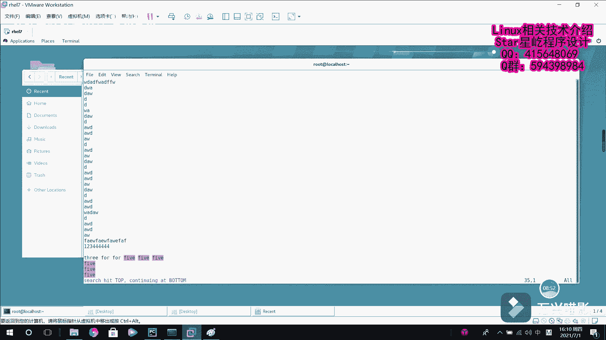

# 【Linux】从入门到精通 ｜ 零基础自学 ｜ 全套教程 ｜ RHCSA ｜ RHCE ｜ Linux爱好者 - P25：025-vim编辑器使用 - Yo_Holly - BV1Df4y187g7

紧接着我们就介绍一些在VIM文本编辑器当中一些常用的命令。我们介绍这个命令的话是从三种模式啊，不同从不同的模式去介绍。首先我们从入手的是这个命令模式。因为我们进去的话，它就是命令模式。

然后在这个命令模式下，我们有哪些呃可以去操作的内容呢？首先我先。进入到这个AA点TST这个文件，然后进来以后，它默认的就是命令模式。然后在这个下面的话，然后是两个D按两个D代表删除删除一行。

看啊DD这个的话，它其实啊是说它是删除的话，其实它是剪切，它更说剪切的话可能更合适一点。因为它删除之后，其实他把刚才删除的那个内容的话，它还仍在那个就是保留区给它保留着呢。

比如说我们现在啊把它放到最后一行，按这个P一个小写的P，它就把刚才的内容给粘贴出出来了。这样的话就是说呃刚才那个DD的话，是删除或者剪切。然后比如说啊我现在刚才是删除了一行。

现在我想删除三行或者删除对应的多少行，该怎么操作。这个的话，我就在前面加一个数字，比如说3DD，它就把三行给三行给删除了，删除了三行。呃，其次的话就是说这个复制。

比如说我现在需要复制这个DAW按YY它就是复制。然后比如说我复制到这个下面。输入输入一个P粘贴，它就粘贴下来，粘贴粘贴粘贴。比如说假如说啊一行复制的话，可能现在不太满足我的需求了。

我需要呃复制这个前五行，然后把它输出到文末，然后这个时候也是同样在前面加入你需要复制行数行的那个数字，比如说是我现在需要复制前前五行，我输入5YY。然后我走到行末，然后按一个P粘贴。

它就把前五行就粘贴到最后一行了。其次的话就是如果我做了这个操作之后，我可能哎呀后悔了，觉得就是这个操作可能做的不太合理。然后我想撤销它，这个时候是按UU的话就是撤销，把刚才的就撤销了。就是不断的按U。

他就会把按照你的执行顺序，把刚才的操作都给。呃，撤销回去。呃，说完了这个命令模式啊，呃，紧接着我们介绍这个在墨行模式当中一些常用的命令。墨行模式啊，刚才在上一个视频当中，我们介绍是呃按ESC之后。

它不是回回退。然后我输入一个冒号，就代表我现在已经进入到墨行模式了。然后比如说我现在按ESCIESC它就退退到这个命令模式了。我现在比如说我在这个行末，我在行末加一些内容，比如说。

我安排我随便输入一些内容。然后我现在的话需要把刚才我输入的内容仅保存，我就输入一个Wright。他就把刚才的内容就保存了。如果我是想要说我是退出的话，按Q就行了，它就退出了。呃。

有一些情况就是说可能他退出的时候，他不能直接他不允许你直接退出。比如ESC我进入到这个墨方模式，然后我在里面再加一些内容。然后我现在进入到墨航模式，比如说我现在要退出，它就不能退出了。

因为你刚才已经对它修改过了。现在你要退出，如果要是你不保存，想还想退出的话，那就叫强制退出了。强制退出的话是一个感叹号，代表强制。这个时候它就退出了。退出的时候就是说刚才我的修改就丢弃了，然后直接退出。

看刚才的修改它没有。比如说我现在在这个末尾的话。输入输入一堆数字，然后我现在既想保存，又想退出WQ，它就退出了。这个时候他们内容也保存了。还有一些比较特殊的情况的话，就是说你也需要就是说WQ保存的时候。

就是保存并退出的时候，它报错了。这个时候如果你还想退出，也是加一个感叹号，它可以呃强制进行退出。紧接着就是说我再次打开我这个A点TST文件。现在比如说我看我这个文档的话，它有很多行。

我具体想看哪一行和别人沟通的时候不太清楚。也假如说AAWD可能好有好几行都从都有这个AWD。说描述不太清楚。如果这个时候有一个能添加一个行号的话，那就很方便呀。我告诉他，我觉得第23行怎么怎么怎么了。

这个时候如果要设置行号的话，就需要加一个set。Number。他就把行浩加上了。如果要是你觉得航浩很麻烦，想去掉航浩的话，就s no number。哦，这个的话是。S都。

那no娜这个的话就把这个行数就给去掉了。其次的话就是说是我在这个墨航模式的话，我也是可以呃执行一些命令的。比如说我现在啊想再加一个感叹号，就代感叹号的话，代表执行。然后我现在想执行一个。

我现在在文本编辑器里面，我想执执行终端里面一个命令。然后比如说我现在想获取时间，我感叹号加上这个date，然后它就直接执行了。这块的话，它就会告诉你现在的话是系统时间是多少，然后你再按回车。

它就回到这个文本编辑器了。然后还有的还有一个的话，就是比如说我现在做一个操作吧，我把这个写一下。哇。哇。哇这个的话就是说我刚才编辑了一个就是这个。呃，三个one三个two。

然后比如说我现在想把这个这一行第一个one替换成s睿，他做的话就是这样的，也就是说S。首先是S的话代表搜索。然后紧接着的话，后面这块是待替换的内容，比如说是one，然后我要替换成什么。

比如替换成three。然后它替换的话，后面就是这这种情况下，它是在这一行找找第一个，然后对它进行替换，其余的话也能匹配，但是这个命令的话，只只替换第一个。

如果我现在呃想做的是替换所有的替换该行所有的这个时候如我替换的话，就需要S，就是说我需要做的话，就是说我在当前行，然后替换one。然后把它替换成，比如说是phone。然后全局替换lobal。

该行所有的都替换，它就都替换了。如果现在我再做一些操作。我在其他行再写一些to。哎，我现在的需求就是说我把全文当中啊所有的to都替换成fi。这个时候就是说我首先需要加一个百分号代表全文，然后S代表搜索。

然后紧接着我是需要替换to，然后把它替换成five，然后是所有都替换。这样的话，他就把所有的全文当中所有的to都替换成了five，这就是呃替换替换命令。然后在墨行模式的话，它还有还可以做的操作。

就是我直接返直接斜线。然后比如说我要搜five。他就会把所有的five给找到。呃，这个的话斜线去找的话，它是在文本当中啊，从上从上往下搜索该自助串。比如说我现在要要要就是说还有一种需求是加一个问号。

是从可能我要找的那个的话，你看刚我这个five在下面，它是从上往下找，可能就会比较麻烦。我现在。我要从下往上找就会比较快一点嘛。然后我加一个问号，这个的话是呃代表从下往上找，然后我要找的内容是five。

然后我一输出它它的话直接就找到我所有的five。

对，这个WQ进行退出。

