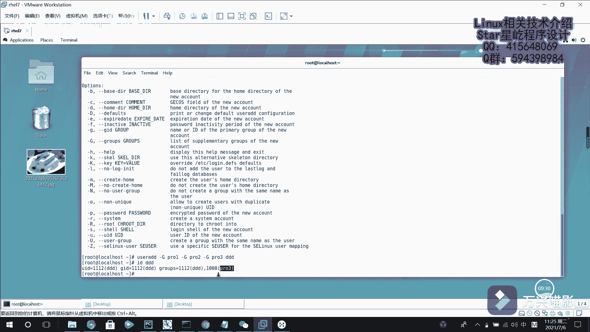

# Linux用户管理：P26：用户身份与基础命令

## 概述
在本节课中，我们将要学习Linux系统中用户管理的基础知识。Linux是一个多用户、多任务的操作系统，理解用户和组的概念是进行系统管理和权限控制的第一步。我们将介绍Linux中的用户身份分类，并学习创建用户、创建组以及设置密码的核心命令。

## 用户身份介绍
Linux系统为了保证安全性与稳定性，设计了不同的用户身份来管理系统和运行服务。

上一节我们介绍了Linux多用户的特点，本节中我们来看看具体的用户身份分类。

Linux系统中的用户身份主要分为以下三类：
1.  **管理员用户**：确切地说，管理员是**UID（用户ID）为0**的用户。通常，系统会将`root`用户的UID设置为0，因此`root`用户就是系统管理员。
2.  **系统用户**：UID范围从**1到999**。系统为每个服务程序（如Web服务器、数据库）创建独立的系统用户来运行它。这样做的目的是隔离服务，当某个服务出现安全漏洞时，可以限制被破坏的范围，避免危及整个服务器。
3.  **普通用户**：UID从**1000**开始。这是由管理员创建的、用于完成日常工作和登录系统的用户。即使1000之前有未使用的UID，也会被系统保留，供系统用户使用。

## 用户组的概念
为了便于管理具有相同权限或任务的多个用户，Linux引入了用户组（Group）的概念。

理解了单个用户的身份后，我们来看看如何将多个用户组织起来。每个用户都属于一个或多个组，其中：
*   **基本组（初始组）**：用户在创建时被自动分配或指定的主要组。一个用户有且只有一个基本组，类似于用户的“家庭”。
*   **扩展组（附加组）**：用户可以被加入到其他多个组中，从而获得这些组的权限。这类似于一个人在公司中属于不同的部门或项目组。

通过将用户加入特定的组，管理员可以方便地为整个组统一设置权限。例如，可以设置只有“技术部”组的成员才能访问特定的数据库目录。

## 用户管理基础命令
接下来，我们将学习管理用户和组最常用的几个命令。

### 查看用户信息：`id`命令
`id`命令用于显示指定用户的详细信息，包括用户ID（UID）、组ID（GID）以及所属的组。

命令格式如下：
```bash
id [用户名]
```
例如，查看`root`用户的信息：
```bash
id root
```
输出会显示类似`uid=0(root) gid=0(root) groups=0(root)`的信息，表明其UID和GID都是0。

### 创建用户：`useradd`命令
`useradd`命令用于创建新的用户账户。创建用户时，可以指定各种选项。

以下是创建用户时可以使用的部分关键选项：
*   `-e YYYY-MM-DD`：设置账户的过期日期。适用于创建临时账户（如实习生账户）。
    ```bash
    useradd -e 2021-08-06 intern
    ```
*   `-u UID`：指定用户的UID。可用于为特殊用户分配特定的ID。
    ```bash
    useradd -u 888 developer
    ```
*   `-g 组名/GID`：指定用户的基本组。
    ```bash
    useradd -g project_team alice
    ```
*   `-G 组名1,组名2,...`：指定用户的扩展组列表，用户将被加入到这些组中。
    ```bash
    useradd -G dev,test bob
    ```

如果创建用户时不使用任何选项，系统会执行以下操作：
1.  在`/etc/passwd`文件中创建用户信息。
2.  在`/etc/shadow`文件中创建加密的密码信息（初始锁定）。
3.  在`/etc/group`文件中创建一个与用户同名的新组，作为该用户的基本组。
4.  创建用户的家目录（通常为`/home/用户名`）并复制默认配置文件。

### 创建组：`groupadd`命令
`groupadd`命令用于创建新的用户组。

命令格式非常简单：
```bash
groupadd [组名]
```
例如，创建一个名为`project_adv`的组：
```bash
groupadd project_adv
```

### 设置或修改密码：`passwd`命令
新创建的用户账户默认是锁定的，无法登录。`passwd`命令用于为用户设置或修改登录密码。

命令格式如下：
```bash
passwd [用户名]
```
如果省略用户名，则修改当前登录用户自己的密码。执行命令后，系统会提示输入并确认新密码。出于安全考虑，系统会要求密码具有一定的复杂性（如长度、字符种类）。
```bash
passwd alice
```




## 总结
本节课中我们一起学习了Linux用户管理的基础知识。我们首先了解了三种用户身份：管理员（UID=0）、系统用户（UID 1-999）和普通用户（UID>=1000）。然后，我们认识了用户组的概念，包括基本组和扩展组，它们用于高效地管理用户权限。最后，我们掌握了四个核心命令：使用`id`查看用户信息，使用`useradd`创建用户（并可指定过期时间、UID、所属组等），使用`groupadd`创建用户组，以及使用`passwd`为用户设置密码。这些是管理Linux系统用户账户的基石。