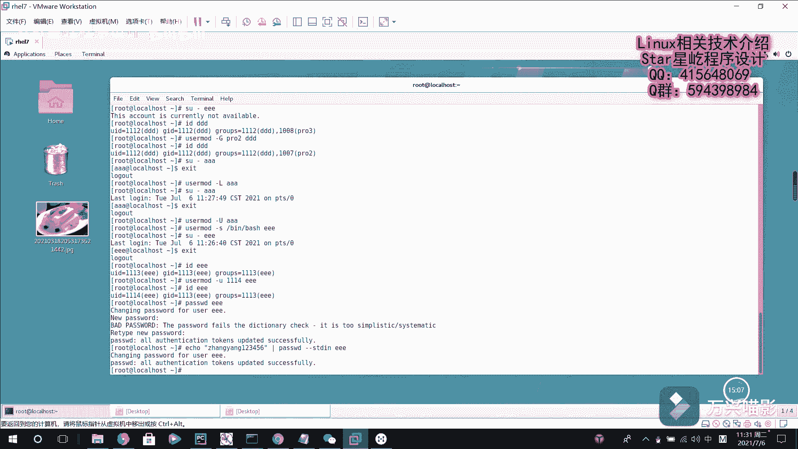

# 【Linux】从入门到精通 ｜ 零基础自学 ｜ 全套教程 ｜ RHCSA ｜ RHCE ｜ Linux爱好者 - P27：027-Linux用户管理2（echo、SHELL、usermod） - Yo_Holly - BV1Df4y187g7

然后其实啊紧接着就是介绍一个命令的话，就是现在啊就是说我现在假如说我eco一下刀了默认的share的话是使用的这个是binbu这个sha。也就是说是呃系统默认就使用这个share。

但如果我要是创建用户的时候，我需要人工给他指定一个share的话，比如说我指指定这个share就是。2滋病。下面这个no了O。这个的话它和那个呃下面的bu它是不同的。

就是说是那个的话是指定了一个默认的sha。虽然就是说这个no log no login，它也是一个默认实中的一个成员，但是他和这个bu解释器有着天壤之别。

就是说是如果我一旦给用户指定了这个 no login的话，他就就是说是我就把这个用户给锁定了，也就是说这个用户他就登录不了系统了。比是说叫EEE1EE然后现在IDE1E。然后E11这个用户是没问题的。

比说我输输入杠，然后EEE。这个时候也就是说这个账户是不可用的，他就会提示你说这个账户不可用。对，这这一块的话，这个就是说是我已经给用户啊，就是关于创建用户的一些信息，我已经进行了创建用户了。

如果我之后需要修改一些用户信息的话，该怎么做？也就是说有一个Uus the mode这个命令。这个命令的话，我可以改更改用户的这个变更用户的扩展组。

比如说刚才有一个这个IDDDD它的扩展组的话是PRO3pro3。然后现在我us the user the mode。杠大G。然后我现在的话就是比如说把它指定成PRO2。

然后是DDD然后现在IDDED它的话现在的话它这个扩展组就变成这个proI了。如果就是说是我这个用户的话。呃，现在啊就是很多用户都是可以登录系统的。你比如说现在我速度呃到到这个AAA用户。

我我马上就切到他这个对应的这个执行环境下面了。现在啊比如说我现在想锁定这个AA用户怎么做us the user指定杠大L lock，然后我锁定AAA。他就会把AAA用户给锁定了。

然后我现在再再去登录AAA的时候，然后就会。这个时候这个用户就是锁定的。会禁会禁止他登录登录系统。这个的话是在这个搜就是说这个root用户的话，他还以切换切换过去。

如果你要是拿这个就是说普通的这个AAA去登录本系统的话，他应该是登录就可以就登录不进去了。然后我现在退出它这个环境，然后我现在啊需要对它进行解锁，允许它登录到系统，也就是杠大U。

然后指定AA这个时候就把它的这个刚才那个锁定给解除了。呃，刚才啊说是说在这个刚才做了这么一件事，就是说这个EE的话，就是说我把它这个锁定了。也就是说我就进入就是说这个用户是无效的。现在的话。

我现在我如果想给他改变一下他这个执行线，比如说。这块的话也是杠S，然后比如说把它指定成并下面的bu室。然后是名字叫一1。然后修改了，刚才的话，一1是登录不过去的，说是用户无效，现在我再登录，呃。

现在就可以登录了。也就是说这个用户现在就是一个有效的用户了。然后比如说现在我ID11EE1E的话，现在它的这个UID是1113。比如说我现在想更改它的UID也是U的 mood，然后指定这个杠U小写EU。

比如说我指定成为1114，然后。是E1E用户，然后我现在在查IEIDEEE用户。然后现在的话他这个UID就变成了1114了。就是刚才啊就是说我设置这些用户的时候，都没有给他们指定密码。

然后现在啊我要介绍一个，就是说是刚才已经用过了一个，就是passWD。它的话是现在啊他是就是说一个修改密码的。比如说我现在要给EEE修改下密码。比后说我现在是给他修改一I密码。修改了密码。

然后你这个的话，它这个密码就更新更新成更新成功了。呃，它提示的话其实就是说也就是说这个密码太简单了。对。呃，这一块的话，如果要是说我想把一个输入，就是说我通过一个输入流，然后去更新这个密码的话。

它其实就是这样的。也就是说依靠命令。然后我比如说我现在把它设置一个很复杂的密码，张扬123456。然后我现在通过这个管道符给他传过来。也就是说我现在拿到这个张扬123456这个字符串了。

然后我使用passWpassWWD，也就是有个刚刚STDSTDLN然后让他对应的给哪个用户修改密码，比如说我现在给他是1E用户。呃，这个时候的话它就会提示你EE用户的话，这个密码更新成功。

这个的话是呃允许就是说通过这个标准输入去修改密码。passWD的话，它是支持这一项的。

