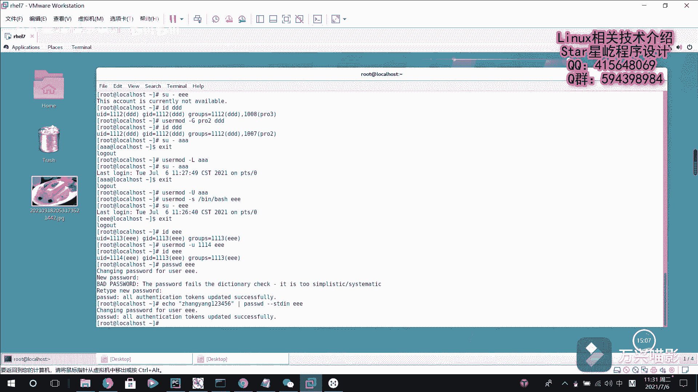

# Linux用户管理：P27：用户信息修改与锁定

## 概述
在本节课中，我们将学习如何修改已创建用户的属性，包括其登录Shell、用户组、用户ID以及账户锁定状态。我们还将学习如何使用`passwd`命令，并通过管道流的方式为用户设置密码。

---

上一节我们介绍了用户创建的基础命令`useradd`。本节中我们来看看如何对已存在的用户信息进行修改。

### 修改用户的默认Shell
创建用户时，系统会为其分配一个默认的登录Shell，通常是`/bin/bash`。但我们可以为用户指定不同的Shell。

例如，`/sbin/nologin`是一个特殊的Shell。虽然它也是系统Shell的一员，但它与`/bin/bash`解释器有本质区别。一旦为用户指定了`nologin`，该用户将被锁定，无法登录系统。

以下是创建用户并指定`nologin` Shell的示例：
```bash
useradd -s /sbin/nologin e1e
```
此时，尝试切换到`e1e`用户会失败，系统会提示“该账户不可用”。

### 使用`usermod`命令修改用户属性
如果创建用户后需要修改其信息，可以使用`usermod`命令。

#### 修改用户的附加组
`usermod`命令可以更改用户的附加组（扩展组）。例如，用户`ddd`原本的附加组是`pro3`。

以下是修改其附加组为`pro2`的命令：
```bash
usermod -G pro2 ddd
```
执行后，使用`id ddd`命令查看，会发现其附加组已变为`pro2`。

#### 锁定与解锁用户账户
许多用户可以正常登录系统。例如，我们可以切换到`aaa`用户。如果想锁定`aaa`用户，禁止其登录，可以使用以下命令：
```bash
usermod -L aaa
```
锁定后，尝试切换到`aaa`用户会失败。此时，如果`aaa`用户尝试从登录界面登录系统，也将无法进入。需要注意的是，`root`用户依然可以切换到被锁定的用户环境。

要解锁用户，允许其重新登录，使用以下命令：
```bash
usermod -U aaa
```

#### 修改用户的Shell和UID
我们之前将用户`e1e`的Shell设置为`/sbin/nologin`导致其无法登录。现在可以将其修改回有效的Shell，例如`/bin/bash`：
```bash
usermod -s /bin/bash e1e
```
修改后，`e1e`用户就可以正常登录了。

`usermod`命令也可以修改用户的UID（用户ID）。例如，查看`e1e`的当前UID是1113。
以下是将其UID修改为1114的命令：
```bash
usermod -u 1114 e1e
```
再次使用`id e1e`命令查看，其UID已更新为1114。

### 使用`passwd`命令管理密码
之前创建用户时，我们并未设置密码。`passwd`命令用于修改用户密码。

#### 交互式修改密码
直接为指定用户修改密码，系统会提示你输入新密码：
```bash
passwd e1e
```
输入密码后，密码即更新成功。如果密码过于简单，系统会给出警告，但通常仍会接受。

#### 通过管道流设置密码
我们也可以通过标准输入流（stdin）来为用户设置密码，这在脚本自动化中非常有用。

以下是具体方法，使用`echo`命令生成密码字符串，然后通过管道`|`传递给`passwd`命令的`--stdin`选项：
```bash
echo "ZhangYang123456" | passwd --stdin e1e
```
这条命令会将“ZhangYang123456”设置为`e1e`用户的新密码，并提示更新成功。`passwd`命令支持通过`--stdin`选项从标准输入读取密码。

---




## 总结
本节课中我们一起学习了Linux用户管理的进阶操作。我们掌握了使用`usermod`命令修改用户的Shell、附加组、UID以及锁定/解锁账户。同时，我们也深入了解了`passwd`命令的两种用法：交互式修改密码和通过管道流非交互式设置密码。这些技能对于系统管理员进行日常用户账户维护至关重要。