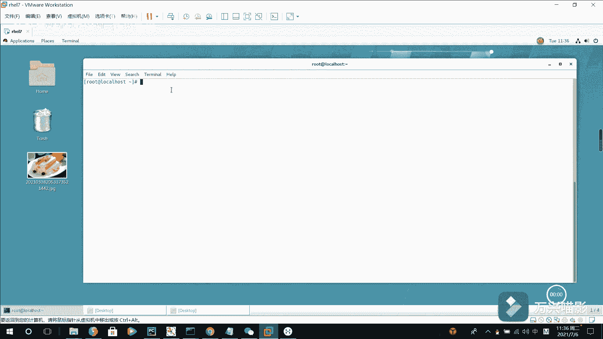
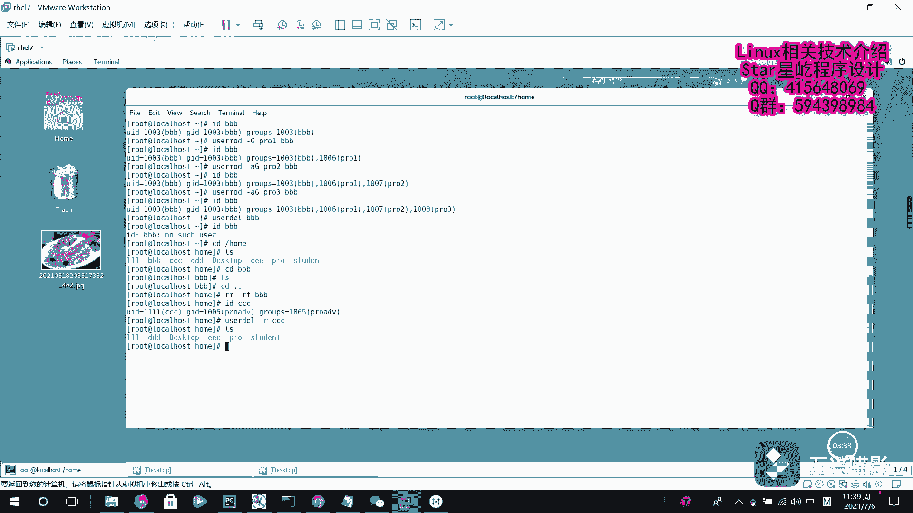

# Linux用户管理：P28：用户组修改与删除

## 概述
在本节课中，我们将学习如何修改用户的扩展组，以及如何从系统中删除用户及其相关文件。我们将重点介绍 `usermod` 和 `userdel` 命令的使用方法。

---



## 为用户添加扩展组
上一节我们介绍了用户的基本管理命令。一个用户可以属于多个扩展组。如果需要将用户分配到不同的扩展组，可以按以下步骤操作。

首先，查看现有用户 `BBB` 的信息。可以看到它目前只有一个基本组 `BBB`。

```bash
id BBB
```

现在，使用 `usermod` 命令的 `-G` 选项为用户 `BBB` 指定一个扩展组，例如 `pro1`。

```bash
usermod -G pro1 BBB
```

再次查看用户 `BBB` 的信息，会发现它多了一个扩展组 `pro1`。

```bash
id BBB
```

## 为用户添加多个扩展组
如果想让用户拥有多个扩展组，可以使用 `usermod` 命令的 `-aG` 选项（`-a` 表示追加，`-G` 指定组）。例如，为用户 `BBB` 添加扩展组 `pro2`。

```bash
usermod -aG pro2 BBB
```

使用 `id` 命令查看，可以看到用户 `BBB` 现在有两个扩展组了。

```bash
id BBB
```

可以继续使用此命令添加更多扩展组，例如添加 `pro3`。

```bash
usermod -aG pro3 BBB
id BBB
```

通过以上命令，可以持续为用户添加扩展组。

---

## 删除用户
如果确认某个用户不再需要登录系统，可以使用 `userdel` 命令删除该用户的所有信息。默认情况下，执行删除操作时，用户的**家目录**会保留下来，需要手动处理。

例如，删除用户 `BBB`。

```bash
userdel BBB
```

执行后，检查用户 `BBB`，系统会提示该用户不存在。

```bash
id BBB
```

此时，查看 `/home` 目录，会发现 `BBB` 的家目录仍然存在。

```bash
ls -l /home/
```

由于用户已被删除，其家目录通常也不再需要。可以手动删除它。

```bash
rm -rf /home/BBB
```

## 删除用户同时删除家目录
如果希望在删除用户的同时，一并删除其家目录，可以使用 `userdel` 命令的 `-r` 选项（递归删除）。

例如，删除用户 `CCCC` 及其家目录。

```bash
userdel -r CCCC
```

执行后，再次查看 `/home` 目录，`CCCC` 对应的家目录已被删除。

```bash
ls -l /home/
```

---



## 总结
本节课中我们一起学习了如何管理用户的扩展组以及如何删除用户。我们掌握了以下核心操作：
*   使用 `usermod -aG <组名> <用户名>` 为用户添加扩展组。
*   使用 `userdel <用户名>` 删除用户（保留家目录）。
*   使用 `userdel -r <用户名>` 删除用户及其家目录。

这些是Linux用户管理的基础操作，对于系统维护至关重要。