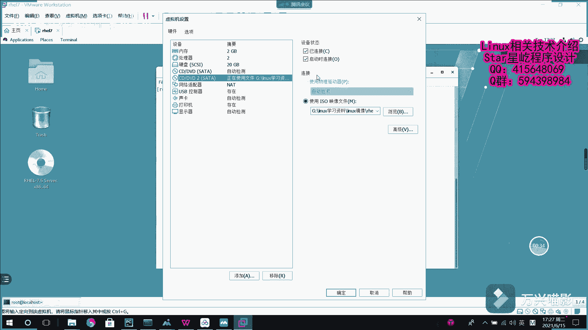

# 【Linux】从入门到精通 ｜ 零基础自学 ｜ 全套教程 ｜ RHCSA ｜ RHCE ｜ Linux爱好者 - P2：002-yum源配置 - Yo_Holly - BV1Df4y187g7

worktation这个虚拟机管理工具，然后又借助这个红帽7。5系统的镜像，然后安装了一个虚拟机。然后有了虚拟机以后之后，假如说咱们需要部署一些你像HTTPD啊。

这这个外部服务或者是DNS的name地这些服务的话，咱们肯定需要找到一个软件源。然后这个时候咱们就需要配置一个样源。样源的话，它分为多种方式去配置。咱们首先要先介绍这个呃本地源本地源的话，它就是说是。

呃，我首先啊就是说我在这块有个CD，我点这个已连接啊，然后确定它在这块的话，就把这个光光点就加载到这个系统里面了。然后咱们使用DF杠H这个命令啊，然后去查看，你看这块的话就已经有了这个呃系统这个镜像了。

然后咱们现在为它创建一个挂挂载区域，比如说叫MNT下面的temp。然后咱们现在对它进行挂载mount，咱们把这个DEV下面的SR1，然后把它挂载到mount下面的tempamp，这就是挂载完了。

然后咱们再看一下。

然后你看这块的话，就是说把DEV下载SR1就已经挂载到这个下面了。挂载它下挂载它下面以后，它这个是临时挂载之后的话，就是说你重启之后它就不生效了。现在啊咱们需要对它进行永久挂载。对。

这样的话就写到这个配置文件里面ETCFStable里面。然后在这个里面，咱们写写一个呃永久配置的一条信息。其实啊对服务化，对什么的配置的话，其实就是就是修改它的配置文件。然后在这块的话。

咱们需要把它当成一个系统的一个永久的一个镜像。然后咱们也需要对它进行配置，然后ISO9660，这个是光碟方式，然后完了以后是DEFAULTS默认。00，然后直接保存并退出，然后。

mount杠A现在的话就再次查看，它依然是在这块挂载。然后的话咱们CE到就是那个样源配置的地方。REPUS点D这个下面L，然后咱们就现在看一下啊。

为我们点readd hat点这个手机里面没有任何的配置信息。所以咱们现在杠RF。先把它下面所有的东西给删掉。当前位置下所有的东西删掉LS现在没有任何信息了，咱们现在开始自己创建。

假如说啊咱们叫AAA点REPO。然后首先啊在里面的话刚开始是什么？就是说首先先写给他写一个配置这一块的话，文件名叫AAA点REPO咱们这块的描述信息也叫REPO内部的话，这块就是给他写一个描述信息嘛。

假如说就是假如就是说是。呃，也叫直接就写个AA吧，为了测试嘛，是吧？假如说然后完了的话是URL。然后等于fare冒号三个斜线，下面的mount下面的tempamp，然后是GPG check等于0。

然后是in aablein aable等于一，就是说我开启这个镜像，开启这个配置。然后完了以后是young make。是哎呃这块的话是base uL，刚才少写了一点base uL。呃。

这个的话首先啊就是上面这个方括号包裹的这个AAA啊，它是对这个亚它是亚么源的一个唯一标识符，避免去其他的样么仓库信息啊重复。然后紧接着这个内啊下面就是说写了1个AAA4个A，其实啊可以也可以写其他信息。

这一块的话是主要是对啊你这个亚母仓库进行描述。比如说你你配置这个亚么仓库，主要让它用来做什么事情。再者下面这个是baseUL。这个的话就是告诉别人啊，就是说我这个亚目源仓库，它在哪哪个位置。

然后这个GPG check它是说啊我需要对这个呃亚目源做一些校验信息嘛，零是不需要，一是需要的。然后再者就是说这个了就是说我是否开启这个亚仓库。然后这些配置都已经配置好之后。

然后首先首先就需要首先就需要做的一件事情，就是说我首先。养母克林哦。首先要刷新，然后杨杨和。开始吧。哦，这样的话一个亚母源就配置好了。然后比如说咱们现在装1个CD，就装一个比较基础的压源杠丝装。杠外。

假如说装1个HPTPD，你看它就已经有缘去有缘了，他就可以去安装一些基础的软件包了。

