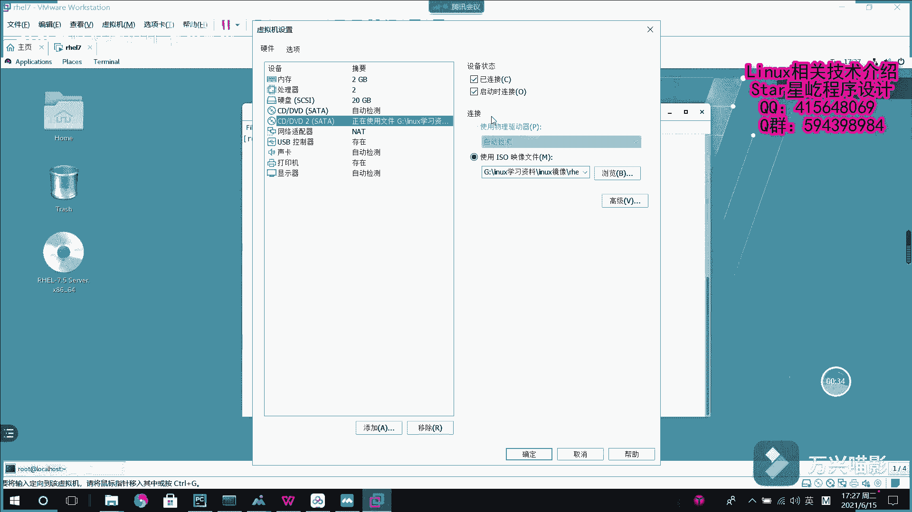

# Linux入门到精通：002：yum源配置 📦

## 概述
在本节课中，我们将学习如何在Linux系统中配置yum软件源。yum源是安装和管理软件包的关键。我们将从创建一个本地yum源开始，逐步讲解挂载系统镜像、永久挂载以及编写yum源配置文件的全过程。

---

## 准备工作
上一节我们介绍了如何安装虚拟机。现在，我们有了一个运行红帽7.5系统的虚拟机。为了后续部署如HTTPD或DNS等服务，我们需要一个可靠的软件安装来源，即yum源。

## 挂载系统镜像
首先，我们需要将红帽系统的安装镜像加载到虚拟机中。这通常通过连接虚拟光驱实现。



连接后，使用 `df -h` 命令可以查看系统是否识别了该镜像设备。

```bash
df -h
```
接下来，我们需要为这个镜像文件创建一个挂载点，并将其挂载到系统目录中。

以下是具体操作步骤：
1.  创建一个挂载目录，例如 `/mnt/temp`。
2.  使用 `mount` 命令将光驱设备（通常是 `/dev/sr1`）挂载到该目录。

```bash
mkdir /mnt/temp
mount /dev/sr1 /mnt/temp
```
再次使用 `df -h` 命令确认挂载是否成功。此时，`/dev/sr1` 应该显示已挂载到 `/mnt/temp`。

需要注意的是，这种挂载方式是临时的，系统重启后会失效。

## 配置永久挂载
为了使挂载在系统重启后依然有效，我们需要将其写入配置文件 `/etc/fstab`。

对服务的配置，本质上就是修改其对应的配置文件。将镜像配置为永久挂载源也是如此。

编辑 `/etc/fstab` 文件，添加以下一行配置信息：
```
/dev/sr1 /mnt/temp iso9660 defaults 0 0
```
保存并退出后，执行 `mount -a` 命令重新加载所有挂载配置。此时，使用 `df -h` 查看，镜像依然处于挂载状态。

## 配置本地yum源
挂载好镜像后，我们就可以将其配置为yum的软件仓库。yum源的配置文件位于 `/etc/yum.repos.d/` 目录下。

首先，进入该目录并查看现有配置。
```bash
cd /etc/yum.repos.d/
ls
```
为了确保配置清晰，我们可以先清理该目录下所有现有的 `.repo` 文件（请谨慎操作，建议先备份）。
```bash
rm -rf ./*
```
现在，我们开始创建自己的yum源配置文件。例如，创建一个名为 `aaa.repo` 的文件。

以下是配置文件的详细内容与解释：
1.  `[aaa]`：这是yum源的唯一标识符，用于区分不同的软件仓库，不能与其他仓库重复。
2.  `name=aaa`：对此yum仓库的描述信息，可以自由定义。
3.  `baseurl=file:///mnt/temp`：这是最关键的部分，指明了软件仓库的具体位置。`file://` 表示使用本地文件路径，后面接我们刚才的挂载点。
4.  `gpgcheck=0`：设置为0表示安装软件包时不进行GPG签名校验。在生产环境中，为了安全，建议设置为1并配置GPG密钥。
5.  `enabled=1`：设置为1表示启用这个yum仓库。

将上述内容写入 `aaa.repo` 文件并保存。

## 测试yum源
配置文件完成后，需要让yum识别并更新缓存。

首先，执行以下命令清除旧的yum缓存并建立新缓存：
```bash
yum clean all
yum makecache
```
现在，yum源就配置成功了。我们可以尝试安装一个软件包来测试，例如安装 `httpd` 服务。
```bash
yum install httpd -y
```
如果配置正确，yum将能够从我们配置的本地镜像中找到 `httpd` 软件包并开始安装。

---


## 总结
本节课中，我们一起学习了如何为Linux系统配置本地yum源。我们掌握了挂载系统镜像、将其设置为永久挂载、以及编写yum仓库配置文件的核心步骤。理解并掌握yum源的配置，是后续顺利安装和管理各种软件服务的基础。