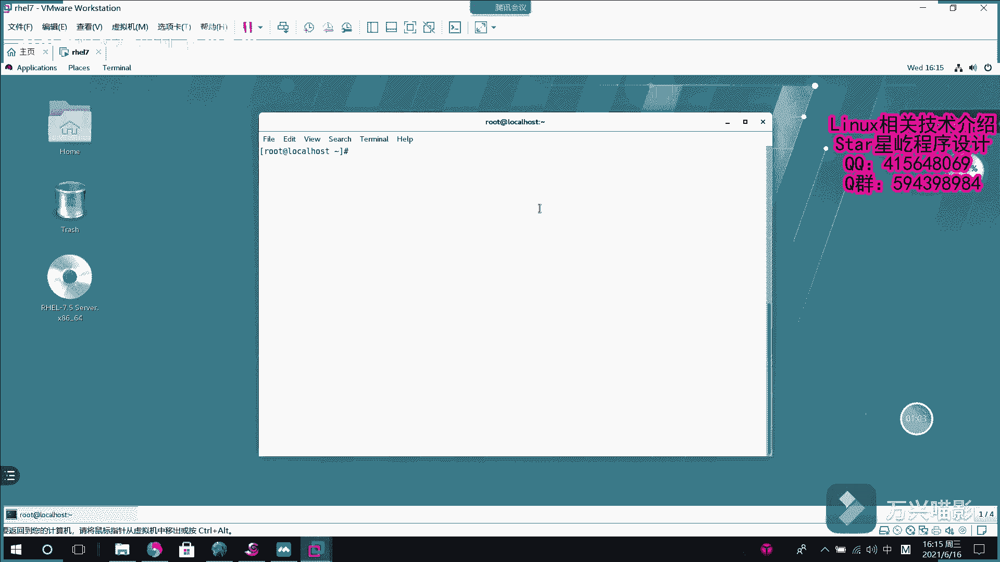

# 【Linux】从入门到精通 ｜ 零基础自学 ｜ 全套教程 ｜ RHCSA ｜ RHCE ｜ Linux爱好者 - P3：003-MariaDB安装 - Yo_Holly - BV1Df4y187g7

呃，现在介绍的一个呃一是一个数据库，呃，叫马瑞DB。呃，他和那个me的关系的话，他就是说之前开发那个mesq的那一个一个团队啊，就是一个分支啊，然后他去做了一个这个数据库叫马若dB。

它是一个就是说是呃mysq的一个简单替代品呃，就是说为什么要有马络DB这个数据库呢。首先就是说谈到这个mys9年的时候，这个oracle收购了这个上公司上公司下面有一个对应的一个呃开源项目叫mys。

然后也就是说现在oracle的话，它是一个商业公司。一个开源的软件，就是说成了他公司的一项产品了。这个的话可能就会面临收费的一个可能性。所以的话为了就是说是避免他收费之后，大家没有就是说数据库用。

然后原班人马又开发了这个马dB数据库作为mes的一个简单替代品。

首先安装这个RDP数据库的话。就是说首先对这个数据库进行安装。安装的话是使用这个组安装，然后也就是说把马入DB相关的。嗯，一系列包都给他装好。

现在的话他就开始安装一就是说我所有就是说需要用到的这个软件包。呃，这个的话你看my杠thon，然后马DB杠 server这些的话就是说它需要使用到的一个包它安装了。然后这个包的话，它依赖哪个包。

然后它也会给它解决。这个的话就源于这个。然后它嗯就是说它和那个RPM安装方式不同的一点是y解决了这个依赖项。也就是说我安一个软件的时候，它会依赖哪些软件，我通过这种方式安装的时候就会自动解决依赖问题。

然后首先啊到达这一步的时候，我们就已经把这个数据库给安装好了。然后紧接着我们就是启动服务，启动马马DB服务。然后紧接着呃我们把它加入到开机自启向里面，也就开机的时候，它默认自动启动。呃。

这一切做完之后啊，然后现在需要做一件事情，就是说是这个命令叫mesqin installation。他主要做的一件事情就是说是安全初始化，他做一个安全初始化的工作。

然后这块的话是你是否要进入当前的那个用root的密码是，然后是否是否设置密码是，然后设置一个呃密码，这样就这块就可以了。自己给他设置一个密码。然后是两次介入。

然后这块的话提示是是否要移除那些匿名的用户也移除吧。然后是远端登录。移除禁止表达登录。然后是移除这个测试数据库，也是移除这一块的话是再者的话就是说是呃重新配置这个权限也是。到达这一步的话。

对马DP基础的一个配置就结束了。然后紧接着我们就可以使用这个RDB了。

