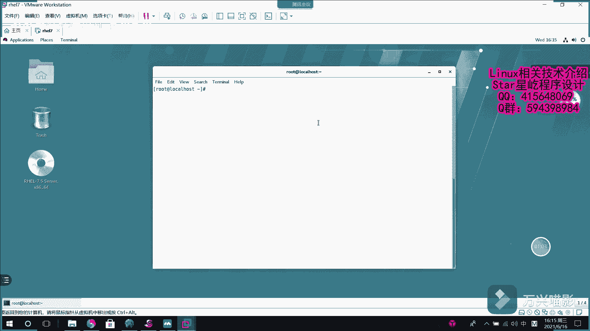

# Linux数据库入门：003：MariaDB安装与配置 🗄️

在本节课中，我们将学习如何在Linux系统上安装和配置MariaDB数据库。MariaDB是MySQL的一个流行分支，以其开源和社区驱动的特性而广受欢迎。我们将从安装开始，逐步完成服务启动、安全初始化等基本配置，为后续的数据库操作打下基础。

## 安装MariaDB

上一节我们介绍了MariaDB的背景，本节中我们来看看如何将其安装到系统中。我们将使用`yum`包管理器进行安装，它能自动处理软件依赖关系。

执行以下命令开始安装MariaDB及其相关组件：
```bash
sudo yum install mariadb-server mariadb -y
```
此命令会安装`mariadb-server`（服务器端）和`mariadb`（客户端）等核心软件包。`yum`工具会自动解析并安装所有必需的依赖项，这与需要手动解决依赖的`rpm`安装方式不同，更为便捷。

## 启动服务与设置开机自启



软件安装完成后，我们需要启动MariaDB服务并确保它在系统启动时自动运行。

以下是启动服务并将其加入开机自启项的命令：
```bash
sudo systemctl start mariadb
sudo systemctl enable mariadb
```
第一条命令`start`用于立即启动MariaDB服务。第二条命令`enable`则配置系统在每次启动时自动运行该服务。

## 运行安全初始化脚本

服务启动后，为了保障数据库的基本安全，我们需要运行一个安全初始化脚本。这个脚本会引导我们完成一系列安全设置。

执行以下命令启动安全配置向导：
```bash
sudo mysql_secure_installation
```
运行此命令后，系统会交互式地引导您完成以下配置步骤。以下是每个步骤的说明和推荐操作：

*   **设置root用户密码**：为数据库的root管理员账户设置一个强密码。
*   **移除匿名用户**：删除允许任何人无需密码登录数据库的匿名账户，提升安全性。
*   **禁止root远程登录**：限制root账户只能从本地计算机登录，防止来自网络的未授权访问。
*   **移除测试数据库**：删除默认安装的名为`test`的数据库，该数据库可能被用于安全测试或攻击。
*   **重新加载权限表**：使上述所有安全更改立即生效。

完成这些步骤后，MariaDB的基础安装与安全配置就全部结束了。

## 访问MariaDB

现在，您已经成功安装并配置了MariaDB。您可以使用以下命令以root用户身份登录到数据库控制台：
```bash
mysql -u root -p
```
系统会提示您输入刚才设置的root密码，输入正确后即可进入MariaDB的交互式命令行界面，开始执行SQL命令来管理数据库。

---


本节课中我们一起学习了在Linux系统上安装MariaDB数据库的完整流程。我们首先使用`yum`命令安装了软件包，然后启动了服务并设置了开机自启，最后通过`mysql_secure_installation`脚本完成了重要的安全初始化配置。现在，您的系统已经拥有了一个可运行且基本安全的MariaDB数据库环境。