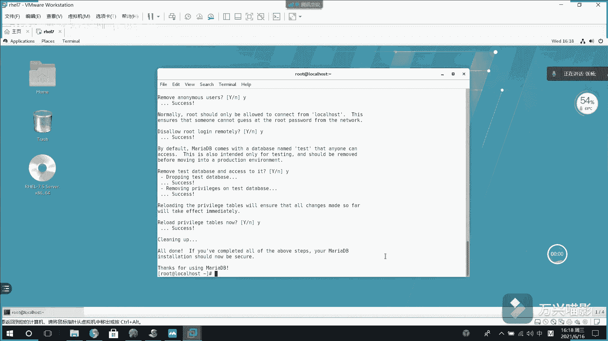

# 【Linux】从入门到精通 ｜ 零基础自学 ｜ 全套教程 ｜ RHCSA ｜ RHCE ｜ Linux爱好者 - P4：004-MariaDB数据库操作 - Yo_Holly - BV1Df4y187g7

上一个视频啊，我们对这个马roDB数据库进行了一个安装。然后紧接着我们就去学习一些关于马roDB的一个操作。刚才啊在第一个视频当中啊提到马roDB啊，它是myl的一个简单替代品。

所以的话就是说它身上有很多my的影子。比如说我们现在正在假如说我们要连接这个数据库连接的时候，这个命令是啥？my使用myq去连接杠U是指定一个用户使用哪个用户去登录，然后杠P的话就是说我一会要输入密码。

假如说我这样它它会提示你建入密码，这块的话是密额密码，你看不见，然后你看这就进来了，进来以后，它和那个my的区别是啥？myq进来以后，这块是myq这块的话。

它给变成了马roDB也就是说是我对这个数据库的话，有一个标志性的一个有一个标志吧。大家进来以后就知道哎，我现在用的是马roDB。

然后紧接着就不是现在进来了，大家使用这个命令，收收dbas就可以查看所有关于这个数据库的一个里面所有的数据库。然后你看这个这的话就是默认的一些数据库。然后目前的话就是说可能之后会用到的默认数据库。

就是这个mesq，它里面会有一些用户信息，还有一些权限的一些信息都在它里面保存着。然后现在啊假如说咱们使用到这个mesq数据，使用这个数据库，这个数据库是一个只读的。

然后咱们现在假如说呃s show table。你看它里面有这么多的表，然后就是说常用的一个表是这个user表。咱们啊现在就是说使用这个命列DESC然后users这样的话。

我就可以看到这个users当时就是说它的一个结构，这个的话这个这个表结构是什么？它的它的字段名字段每个字段的数据类型是否为空，呃关键类型，然后默认是什么，然后额外的描述信息是什么。你看这就描述的很清楚。

就把它这个表的一个属性字段以及描述信息就给展示出来了。然后在这一块的话，就是说你看啊看到这一块以后，它有一个useruser的话是这个用户信息。

所以我现在就可以使用这个查询语句select新 selectlect user。user from，然后我从这个里面从哪个表里面，从user表里面去查询。

然后你看我就可以查询出来这个里面它里面有的用户是root rootot用户。然后紧接着啊咱们就是说是再学习一个命令是create database吧 database。首先啊就是说用的用的时候。

首先我需要创建数据库，先创建一个数据库，create database。然后比如说我们这个数据库的名字叫呃my test创建好这个之后，然后你看show databases。

我就可以看收 databases这块就有一个my testest了。然后看到有这个数据库之后，我们就然后使用这个数据库，使用这个数据库，然后有了数据库之后，数据库里面是以一张表。

一张表的方式去对数据进行记录。所以现在我们需要学习一条语句叫建表语句，然后也就是刚才是创建数据库是create database创建表的话就是create table，然后给它起一个表名，然后这块的话。

比如说咱们的表名叫test。然后括号里面写它的属性字段。比如说有一个I类型是。然后pro呃它是它是主件。然后它是设置为自增长。呃，然后再有一个name是叫和叉类型的，这也就是字符串类型。

比如说它的长度是呃是50。然后紧接着在后面啊还需要写的是engineer等于inODB。也就是说我首先要指定一下数据库引擎，使用哪个数据库引擎。然后完了以后，这个数据库啊。

它显示的时候肯定会有字符编码机。然后我这块的话给他设置一个字符编码是UTF杠8。然后这后面的话comment这个的话是一个备注信息。我对这个表有一个描述。假如说我就他就是说this is。呃。

Test test。然后分号。这就是一个建表信息，他就把一个表给建好了。然后我收tables使用这个命令，我就可以查看呃这个数据库下对应的所有的表。呃。

然后啊就是说现在这个已经有一个一个数据库数据库表了。比如说啊我建了一个个一个表之后，然后之后就是说某个时间我可能不知道我当时创建这个表的时候，我的建表语句是啥了。然后我可以使用这条。

就是说是show createate tablecreate table创建表，然后表是哪个表表示test表。然后你看这块的话，它把对应的这个建表信息就给展示出来了。

然后当时我创建的时候是具体是怎么创建的字段都使用的是哪些。然后你看它就给显示出来了。

