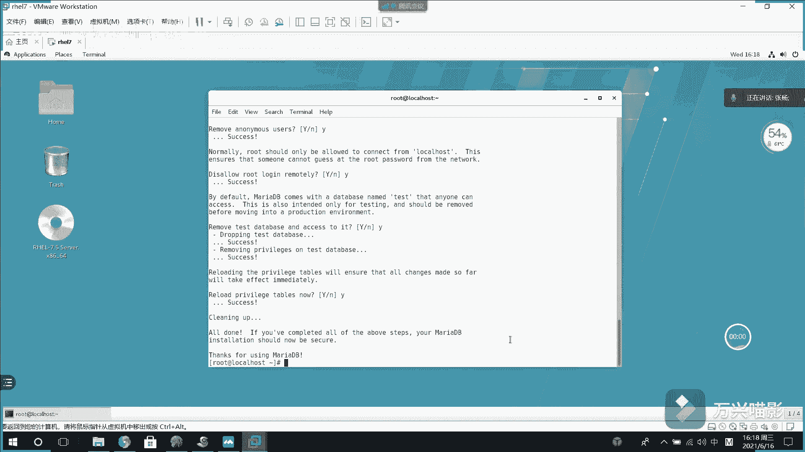

# Linux数据库管理：004：MariaDB数据库操作指南 🗄️

在本节课中，我们将学习MariaDB数据库的基本操作，包括如何连接数据库、查看信息、创建数据库和表，以及查询数据。这些是管理数据库的基础技能。

## 连接数据库

上一节我们介绍了MariaDB的安装，本节中我们来看看如何连接并开始使用它。MariaDB是MySQL的一个替代品，因此许多操作命令与MySQL相似。

连接数据库的命令是 `mysql`，使用 `-u` 参数指定用户名，`-p` 参数表示需要输入密码。命令执行后会提示输入密码，输入时密码不可见。

```bash
mysql -u root -p
```

成功连接后，命令行提示符会从 `mysql>` 变为 `MariaDB [(none)]>`，这标志着当前使用的是MariaDB数据库。

## 查看数据库信息

连接成功后，我们可以查看数据库系统中的信息。



使用 `SHOW DATABASES;` 命令可以列出当前数据库服务器中的所有数据库。

```sql
SHOW DATABASES;
```

执行后会显示默认存在的数据库列表，其中 `mysql` 数据库非常重要，它存储了用户信息和权限数据。

## 使用特定数据库与查看表结构

要操作某个数据库，需要先切换到该数据库。

使用 `USE` 命令可以切换到指定的数据库。例如，切换到 `mysql` 数据库：

```sql
USE mysql;
```

`mysql` 数据库是只读的，用于存储系统信息。切换后，可以使用 `SHOW TABLES;` 命令查看该数据库中的所有表。

```sql
SHOW TABLES;
```

在众多表中，`user` 表记录了用户信息。要查看一个表的具体结构（即有哪些字段，各是什么类型），可以使用 `DESC` 命令。

以下是查看 `user` 表结构的命令：

```sql
DESC user;
```

该命令会展示表的字段名、数据类型、是否允许为空、键类型、默认值和额外描述信息。

了解了表结构后，就可以使用查询语句从表中获取数据。例如，查询 `user` 表中的用户名：

```sql
SELECT user FROM user;
```

这条命令会返回 `user` 表中所有用户的用户名。

## 创建数据库与数据表

掌握了查看信息的操作后，接下来我们学习如何创建自己的数据库和数据表。

首先，使用 `CREATE DATABASE` 语句创建一个新数据库。例如，创建一个名为 `mytest` 的数据库：

```sql
CREATE DATABASE mytest;
```

创建完成后，再次使用 `SHOW DATABASES;` 命令，就能看到新创建的 `mytest` 数据库。

数据库本身用于组织数据，具体的数据存储在“表”中。因此，我们需要在数据库内创建表。

使用 `USE` 命令切换到新创建的数据库：

```sql
USE mytest;
```

然后，使用 `CREATE TABLE` 语句创建表。建表时需要定义表名和表的结构（即字段定义）。

以下是一个创建 `test` 表的示例，它包含一个自增长的主键 `id` 和一个字符串类型的 `name` 字段：

```sql
CREATE TABLE test (
    id INT PRIMARY KEY AUTO_INCREMENT,
    name VARCHAR(50)
) ENGINE=InnoDB DEFAULT CHARSET=utf8 COMMENT='This is a test table.';
```

代码解释：
*   `CREATE TABLE test`: 创建名为 `test` 的表。
*   `id INT PRIMARY KEY AUTO_INCREMENT`: 定义一个整数类型的 `id` 字段，它是主键且自动增长。
*   `name VARCHAR(50)`: 定义一个最大长度为50的字符串类型 `name` 字段。
*   `ENGINE=InnoDB`: 指定表的存储引擎为InnoDB。
*   `DEFAULT CHARSET=utf8`: 设置表的默认字符编码为UTF-8。
*   `COMMENT='...'`: 为表添加注释说明。

表创建成功后，可以使用 `SHOW TABLES;` 命令查看当前数据库下的所有表。

如果之后忘记了某张表是如何创建的，可以使用 `SHOW CREATE TABLE` 命令来查看完整的建表语句。

例如，查看 `test` 表的创建语句：

```sql
SHOW CREATE TABLE test;
```

该命令会详细展示创建 `test` 表时使用的所有SQL语句和参数。


## 总结

本节课中我们一起学习了MariaDB数据库的基础操作。我们首先学会了使用 `mysql -u root -p` 命令连接数据库。然后，掌握了查看数据库 (`SHOW DATABASES`)、切换数据库 (`USE`)、查看表 (`SHOW TABLES`) 和表结构 (`DESC`) 的方法。最后，我们重点学习了如何创建自己的数据库 (`CREATE DATABASE`) 和数据表 (`CREATE TABLE`)，并了解了如何查看建表语句 (`SHOW CREATE TABLE`)。这些是进行后续数据插入、更新和删除等操作的重要基础。