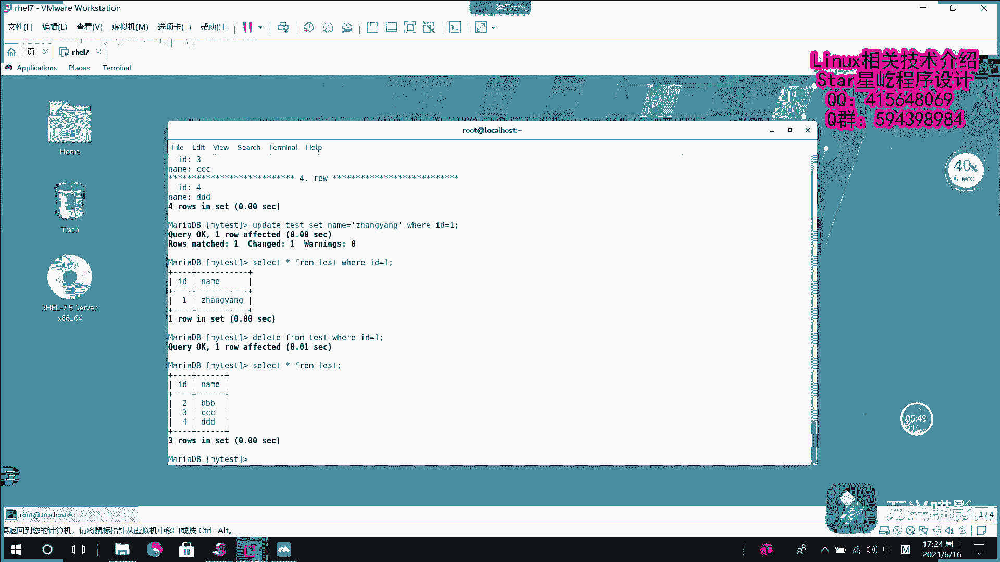

# 【Linux】从入门到精通 ｜ 零基础自学 ｜ 全套教程 ｜ RHCSA ｜ RHCE ｜ Linux爱好者 - P5：005-MariaDB增删改查 - Yo_Holly - BV1Df4y187g7

他那个视频啊，就是说介绍了一个就是说如果啊我过一段时间想查看这个数据库表的一个建表结构的建表语句的话，我是可以使用这个命令s create。tableable，然后加上数据库名。

然后它就会把这个显示出来。现在啊就是说我现在假如说啊我不需要了解它的建表结构，只需要了解它里面啊各个字段它的一个呃。情况各个字段的描述情况，我就使用这个DESC，然后test。

也就是describe test。然后我就可以看到它里面哎有哪些字段，有ID有name，这个ID是主件。然后它额外的话加了一个自增长，这就是这个表的一个基础的一个字段属性，然后以及一些约束。

然后现在啊就是介绍一下，就是假如说呃我现在啊有了数据库表以后，假如说我现在先查询一下 from test你看里面没有任何一条数据，以的话，现在首先需要数据库表里面插入数据插入的话是使用的是iner句。

然后我需要插入到哪个数据库表里面。然后这个表的话，刚才咱们看到这个ID是自增长的自增长的这个字段的话，我们是不需要人为给它复制的，它会就是说根据我现在已有的项进行累加。然后看他假如说现在我到时期了。

下一项我就是18是吧？它会进行一个自增长。然后现在所以的话现在我们要插入数据的话，是不是只需要处理一下这个name就可以了。这个name的话，如说刚开始咱们这块的话是test。

然后里面写一个字段哪个字段，然后对应的value对。然后然后这个的话就是对应前面那个字段你给他付一个直角，说是AAAAA。这就插入一条数据了，然后插入数据之后，等会咱们多插入几条啊。然后DDD。

插入了4条数据，咱们现在需要查询这个数据，查询数据的时候啊，就是需要使用到这个slect语句。slect的话就是说slect它后面紧接着就需要写属性名ID name是有这两个属性是吧？from。

从哪个表，从test表里面，它就可以查询出来。刚才咱们的44条这个操作的这个刚才那个插入的话，咱们4条数据插入以后的一个显示。然后这块的话，你看刚才咱们写的是ID name。

也就是说我对所有的属项都进行一个查询。这个时候如果要是为了方便起见，就可以不写那么多了，直接写一个新进行，就是说代替，他就把所有的属性就都查出来看查询结果一样。但是这个时候你看查询的时候。

就是说他把所有的查都查询出来了。可能假如说我某个时刻，我只想查询用户名是CCC那个用户它的一些信息，这个时候我就需要使用到这个lect假如说新 from test，这是查询所有的一个语句。

然后我需要针对我自己的一个需求去查询，是不是就需要使使用到这个where。然后比如name等于。CCCC。然后他就查询出来了。然后这块的话就是说它是这这么显示的，然后现在啊去给大家介绍一个。

就是说是一个结束的时候，不是可以是可以是分号结束。分号的话，你看它是这样以表格这样的方式，还有一种方式是以杠大G的方式结束。你看这种方式的话，它是啥，它是把一项操作得旋转90度，然后也就是纵向的去显示。

你看这个时候显示的话，你看IDEnameAA它是不是就把这个原来是行着的东西，我旋转了90度，然后达到了一个这样的效果，这就是分号和杠G的一个区别，这是在查询这一块，然后啊现在啊咱们再做一个操作。

就是说一般啊数据库表的话是有增山改差嘛，然后这个时候就是说如果我们需要修改啊。修改某条数据是使用的是update，然后up updatedate呃update哪哪个表呃，是test表，然后是set。

然后假如说nameset哪个属性啊，设置这个属CC，就是说name这个属性，假如说我是CCCC，然后对应的ID。假如说我是ID等ID等于一的用户，然后我把他的名字，假如说改成张扬。做了这么一个操作。哎。

你看它有一行受影响，然后现在的话我再我再查询一下新 fromtest where，然后ID等于一，我看它更改了吧。你看刚才的话它是AAA现在我把它的名字就改成了张扬，这就是这个修改修改这个操作。

然后还有的话是删除是delete from deleteele delete就删除嘛，from from我从哪个表里面去删除，从test表里面，然后删除的条件是啥？ID等于一的这条记录，我对它进行删除。

哎，有一停是有一条受影响。然后我现在在查询th from from test。它里面一对应的这条记录就给删除了。呃，以上就是数据库增山改查的一个基本操作。

