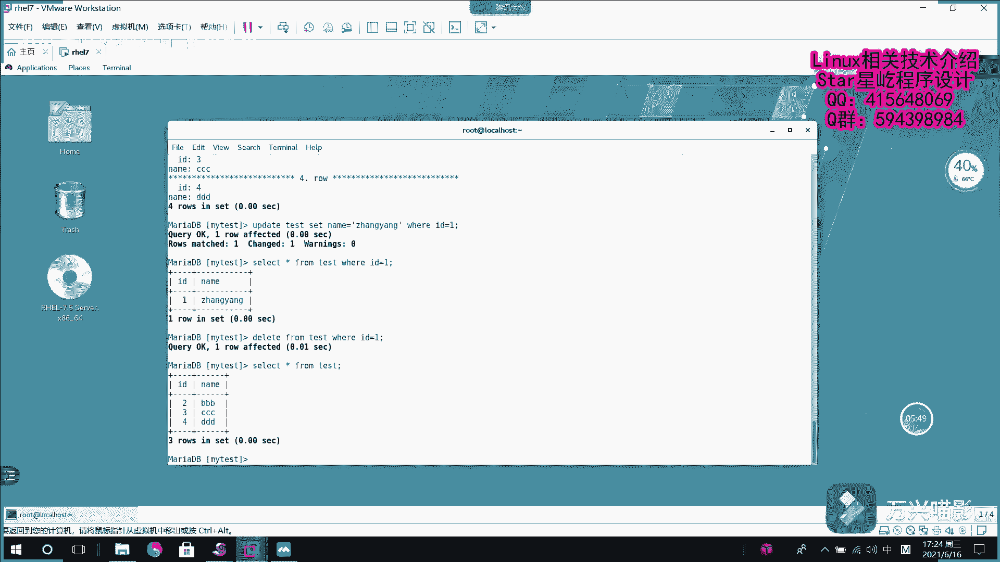

# Linux数据库管理：005：MariaDB增删改查基础教程 📚

在本节课中，我们将学习MariaDB数据库中最核心的操作——数据的增删改查。这些操作是管理任何数据库的基础，我们将通过简单的命令和示例来掌握它们。

## 查看表结构 🔍

上一节我们介绍了如何创建数据库和表，本节中我们来看看如何查看已存在表的结构信息。

如果需要查看数据库表的建表语句，可以使用 `SHOW CREATE TABLE` 命令。

```sql
SHOW CREATE TABLE 数据库名.表名;
```

如果只需要了解表中各个字段的描述情况，例如字段名、类型、约束等，则使用 `DESC` 命令。

```sql
DESC 表名;
```
或者使用其完整形式：
```sql
DESCRIBE 表名;
```

执行该命令后，可以看到表的字段、类型、是否为主键、是否自增长等属性。

## 插入数据 ➕

了解了表结构后，接下来我们需要向表中插入数据。插入数据使用 `INSERT` 语句。

以下是插入数据的基本语法和步骤：
1.  指定要插入数据的表名。
2.  对于自增长字段（如ID），无需手动赋值，数据库会自动累加。
3.  为其他字段指定对应的值。

```sql
INSERT INTO 表名 (字段名) VALUES (对应值);
```
例如，向 `test` 表插入一条 `name` 为 ‘AAAAA’ 的记录：
```sql
INSERT INTO test (name) VALUES ('AAAAA');
```
可以连续插入多条数据。

## 查询数据 🔎

数据插入后，我们需要使用 `SELECT` 语句来查询数据。

最基本的查询是检索表中所有记录的所有字段。

```sql
SELECT * FROM 表名;
```
这里的 `*` 是通配符，代表所有字段。

如果只需要查询特定条件下的数据，则需要使用 `WHERE` 子句来添加查询条件。

```sql
SELECT * FROM 表名 WHERE 条件;
```
例如，查询 `name` 为 ‘CCCC’ 的用户信息：
```sql
SELECT * FROM test WHERE name = 'CCCC';
```

关于查询结果的显示，有两种常用方式：
*   以分号 `;` 结束：结果以横向表格形式显示。
*   以 `\G` 结束：结果纵向显示，每一项单独成行，更便于阅读长字段内容。

## 修改数据 ✏️

当数据需要更新时，我们使用 `UPDATE` 语句进行修改。

修改数据需要明确三个要素：要修改的表、要修改的字段和新值、以及修改哪些行的条件。

```sql
UPDATE 表名 SET 字段名 = 新值 WHERE 条件;
```
例如，将 `test` 表中 `ID` 为 1 的记录的 `name` 改为 ‘张扬’：
```sql
UPDATE test SET name = '张扬' WHERE ID = 1;
```
执行后，可以使用查询语句验证数据是否已更新。

## 删除数据 🗑️

最后，我们学习如何使用 `DELETE` 语句删除数据。

删除操作需要谨慎，务必通过 `WHERE` 子句指定明确的删除条件，否则会删除整张表的数据。

```sql
DELETE FROM 表名 WHERE 条件;
```
例如，删除 `test` 表中 `ID` 为 1 的记录：
```sql
DELETE FROM test WHERE ID = 1;
```
执行后，该条记录将从表中永久移除。



---


本节课中我们一起学习了MariaDB的四大基本操作：插入(`INSERT`)、查询(`SELECT`)、更新(`UPDATE`)和删除(`DELETE`)。掌握这些命令是进行数据库管理和后续更复杂操作的基础。请务必通过实践来熟悉每个语句的用法和效果。