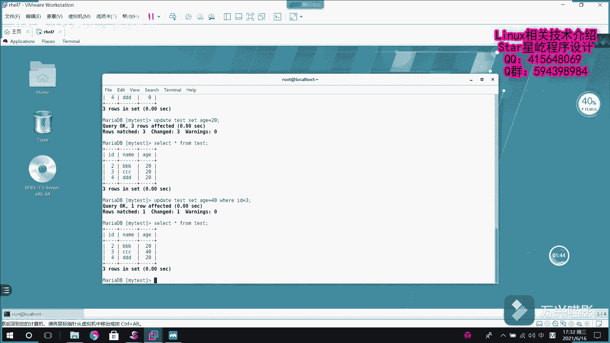

# 【Linux】从入门到精通 ｜ 零基础自学 ｜ 全套教程 ｜ RHCSA ｜ RHCE ｜ Linux爱好者 - P6：006-MariaDB增加列 - Yo_Holly - BV1Df4y187g7

呃，然后啊咱们看咱们就是说刚才的话是演示了一个这个数据库的这个数据库表的一个增删改查。咱们操作的是这个这个表，它的话，你看现在只有ID和name，这是之前我已经建好的一个情况下，假如说之后我有一个需求。

说是说我需要对这个表里面啊，所有的用户所有的用户加一个年龄这个属性。然后这个时候的话，我就需要对数据库进行操作了。这个时候就是说我需要使用的一个语句，就是说。语法就是utter table。

然后数据库名test。然后。对它进行什么进行增加增加什么，增加一个列。然后列明是什么？列名假如说是H，然后H它是什么类型的int类型的，它它具体要做到怎样飞空。你看三条就会受到影响，然后int的话。

它会默认把这些所有的东西都会给它复制成为0。默认值复成0。然后如果假如说我会针对一些需求再去修改的话，就可以这样去改。假如说upupdate update。

假如说是update test set age等于20。这的话，我把三条就都改了，它就都修改了。如果要是我针对某一个的话，假如说我把它改成40。然后这个的话不就是使用到刚才的那个语句了。

就是那个条件语句，假如说ID等于3，把它修改成这样，再次进行查询，它的年龄就是40，其余的就是20了。这个就是说是我对数据库增加一列，然后的时候的一就是说针对需求增加列的时候，该怎么去做。

