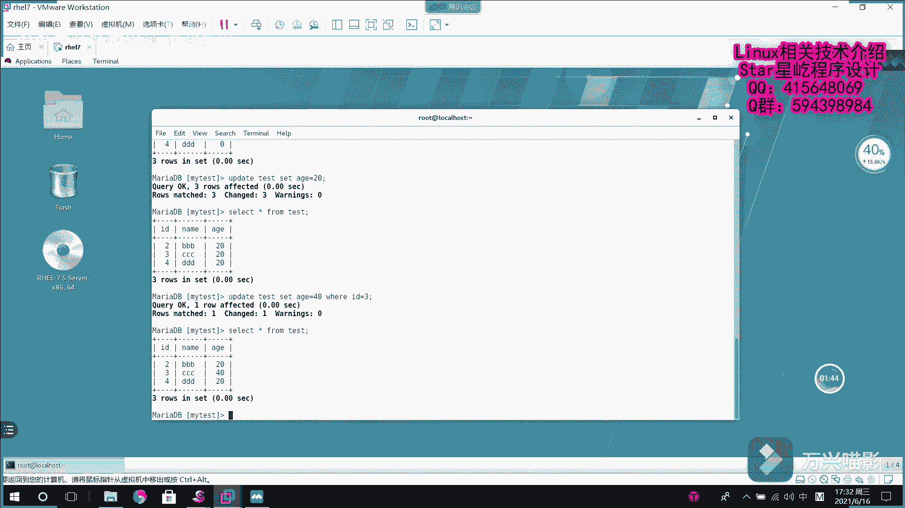

# Linux数据库管理：006：MariaDB增加列

在本节课中，我们将学习如何在MariaDB数据库的现有表中增加新的列。这是数据库结构维护和适应新需求的常见操作。

上一节我们介绍了数据库表的基本增删改查操作。本节中我们来看看如何修改表的结构，特别是增加新的字段。

## 增加列的基本语法

要对现有表增加列，需要使用 `ALTER TABLE` 语句。其核心语法结构如下：

```sql
ALTER TABLE 表名 ADD COLUMN 列名 数据类型 [约束];
```

*   **`ALTER TABLE`**： 这是修改表结构的关键字。
*   **`表名`**： 指定要修改的表的名称。
*   **`ADD COLUMN`**： 表示要执行的操作是增加一个列。
*   **`列名`**： 为新列指定的名称。
*   **`数据类型`**： 定义新列存储数据的类型，例如 `INT`（整数）、`VARCHAR`（字符串）等。
*   **`约束`**： 可选项，用于定义列的规则，例如 `NOT NULL`（非空）。

## 操作演示

假设我们有一个名为 `test` 的数据库，其中包含一个 `users` 表。该表目前只有 `id` 和 `name` 两列。

现在有一个新需求：需要为所有用户记录增加一个“年龄”属性。这时就需要对表结构进行修改。

以下是操作步骤：

1.  **查看当前表结构**： 首先确认表现有的列。
    ```sql
    USE test;
    DESCRIBE users;
    ```
    查询结果可能显示只有 `id` 和 `name` 列。

2.  **执行增加列操作**： 使用 `ALTER TABLE` 语句增加一个名为 `age`、数据类型为 `INT` 的列。
    ```sql
    ALTER TABLE test.users ADD COLUMN age INT NOT NULL;
    ```
    执行成功后，系统会提示影响了多少行数据（本例中表内已有的3条记录都会受到影响）。对于数值类型且设置了 `NOT NULL` 约束的新列，MariaDB会自动为已有记录填充默认值（例如 `INT` 类型默认为0）。

3.  **验证结果**： 再次查看表结构，确认新列 `age` 已添加成功。
    ```sql
    DESCRIBE users;
    ```

## 对新列的数据操作

增加列之后，通常需要为新列填充或更新数据。以下是常见的操作：

*   **批量更新数据**： 如果需要将所有用户的年龄初始设置为20岁，可以使用 `UPDATE` 语句。
    ```sql
    UPDATE test.users SET age = 20;
    ```
    这条语句会将表中所有记录的 `age` 列值更新为20。



*   **条件更新数据**： 如果只想更新特定记录，例如将 `id` 为3的用户的年龄改为40岁，则需要结合 `WHERE` 条件子句。
    ```sql
    UPDATE test.users SET age = 40 WHERE id = 3;
    ```
    执行后，只有满足 `id=3` 条件的记录会被更新。


*   **查询验证**： 使用 `SELECT` 语句查看更新后的数据。
    ```sql
    SELECT * FROM test.users;
    ```
    此时可以看到，`id` 为3的记录年龄是40，其余记录年龄是20。

本节课中我们一起学习了如何使用 `ALTER TABLE ... ADD COLUMN ...` 语句为MariaDB数据库表增加新列。这是适应业务变化、扩展表功能的基础技能。记住，修改表结构前，最好在测试环境进行操作，并对重要数据进行备份。