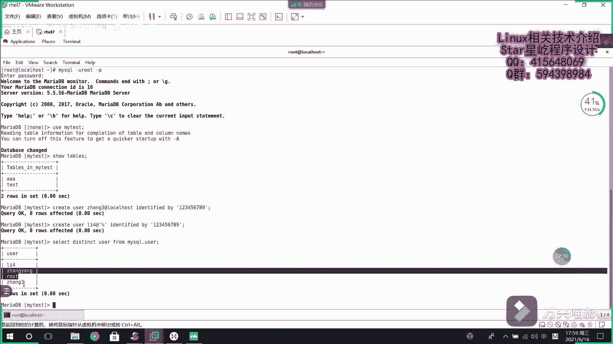
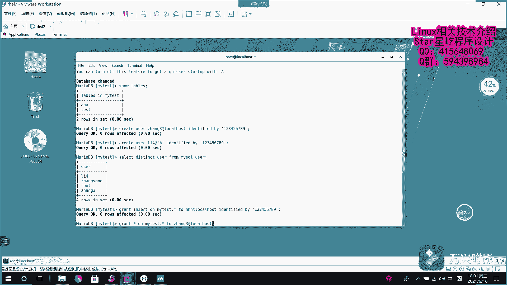

# 【Linux】从入门到精通 ｜ 零基础自学 ｜ 全套教程 ｜ RHCSA ｜ RHCE ｜ Linux爱好者 - P7：007-MariaDB授权 - Yo_Holly - BV1Df4y187g7

呃，接下来就是说分享一下这个创建用户，你想就是说我现在有了这个数据库以后啊，我肯定就是说不同的人去操作它操作的时候，就是说不同的人有不同的权限。root的话，它是作为管理人，他有所有的权限。

然后其余人的话，可能你会对他进行授权，所以这一块的话是对作一个权限操作。首先啊需要做的是就是说分享的是如何去对给数据库创建用户回忆一下，之前啊咱们有那个建数据库的操作是create database。

然后一个数据库名，这是创建数据库，创建表的话是create table。然后对应的创建用户的话是create user。然后我创建一个用户，然后用户名是啥？假如说我的用户名叫，假如说叫张三啊，艾。

然后后面的话是指定一个用户，他是本地用户还是全局用户，本地用户的话，我就可以是local host。logo host，然后后面的话给他呃设置一个密码。

identifiedidentified by一个密码。假如说密码，我设置123456789。啊，这就一个用户就创建好了。然后我再创建一个全局用户，假如说叫李四。叫李四，李四的话。

他是允许所有的IP就是说允许远端访问。然后百分号的话就代表所有。你看也创建好了，然后我现在我需要查询刚才所有的那个刚才已创建的一个用户。然后我就是不是就需要使用到mycle。

就是说系统默认数据库myscle里面的一个user表里面对应的优er属性，我要查他的user，查他有哪些用户。然后因为啊可能会出现重复的像名字重复的，所以我直接给他用一个dsistinct。

然后让他去下重。你看我现在系统里面有的用户叫李四。呃，张扬是之前以前我创建的root是系统默认的一个管理员，张三刚才创建了李四和张三是吧？现在是不是已经可以看到这个李四和张三这两个用户了？

然后这就是创建了，我把用户创建好之后，是不是需要对用户授权。然后其实呃还有一种创建还有一种创建方式啊，是这样的。就是说我我我在创建用户的同时，对用户进行授权。比如说我现在创建一个用户。

他有这个insert权限。然后有音色的权限在。在哪个表，假如说在哪个数据库，比如说我对他让他对my test数据库里面的所有表都有增加的权限。然后对哪个用户，我给他起一个用户名，比如说叫哈哈哈。

然后艾特local local host。然后他的这个密码是I登记fi。Identified by。假如说也是123456789。然后我就创建了。然后这个的话就是说我我在创建用户的同时对用户进行授权。

这是一个连带操作。如果我要使用的是之前那个create user，我创建了用户，单纯的对用户进行授权的时候，这个时候该怎么做，同样也是greetgreat语句对它进行授权。

比如说我现在需要再次创建一个管理员，也就是说我把所有的权限都给到他，在哪个表，假如说我是对my test，我my test表里面的所有数据库里面的所有表，然后我把所有的权限都付给哪个用户，针对张三。

张三是呃，张三，刚才是local host，本地的张张三，然后对他进行授权，授予所有权限也。

啊就是说我要是把所有的权限都付给这个张三，这个用户的话，不是用新不能代表，这块不能用新用的是这个or用or，然后直接把所有的权限付给他。然后这这个时候张三就拥有了所有的操作权限。

就是说说对这个my my test的数据库里面，所有表具有所有操作权限。然后我再次进行授权，假如说我授一授予insert和slect查询权限。然后在这个my test。然后。

表里面所有的表针对这个李四李四这个用户，李四这个用户李四用户的话，他是这个全局可以访问的。对他进行授权。如果这个时候就是说我已经对我所有的用户进行了授权了。这个时候如果我需要查询。

就是说我系统里面所有用户他都具有哪些权限，这个时候该我该怎么做。然后这个时候其实。其实我可以使用这个语句收，假如说我需要查询张三有哪些选点，showshow grade就可以使用这个命令啊。

gre greats for张三，刚才没有查查询出来是呃，我我没有指定这个后面他的这个访问权访问范围。这个张三的话是仅张仅在本地可以访问。你看这块的话。

就是说我刚才啊就是说我把所有的权限都付给这个张三了。也就是说我对mat test数据库里面所有的表。张三这个用户啊在这个数据库下，他就相当于是一个管理员，他有所有的权限。然后啊一般啊就是说如果呃。

查询就是说你像那些远程用户的话，就是说李四我就可以直接查询他他的话默认的话是后面就是说会会给你就是说他会匹配的用户是全局的用户，就是说访问范围是所有的都可以所有IP都可以访问。

