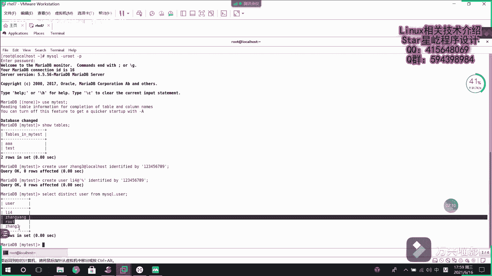
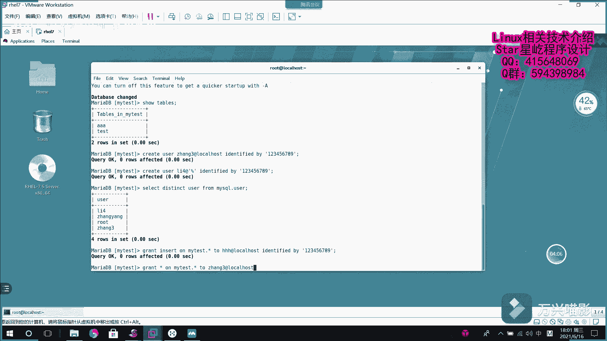

# Linux数据库管理教程：007：MariaDB用户授权

在本节课中，我们将要学习如何在MariaDB数据库中创建用户并为其分配权限。这是数据库安全管理的基础，确保不同用户只能访问和操作其被授权的部分。

上一节我们介绍了数据库和表的基本操作，本节中我们来看看如何管理数据库用户及其权限。

## 创建用户

首先，我们需要学习如何创建数据库用户。回忆一下，创建数据库的命令是 `CREATE DATABASE`，创建表的命令是 `CREATE TABLE`。创建用户的命令是 `CREATE USER`。

以下是创建用户的基本语法：

```sql
CREATE USER '用户名'@'主机名' IDENTIFIED BY '密码';
```

*   **`'用户名'`**： 你希望创建的用户名称。
*   **`'@'主机名'`**： 指定用户可以从哪里连接到数据库。`localhost` 表示只能从本机连接，`%` 表示可以从任何主机（远程）连接。
*   **`IDENTIFIED BY '密码'`**： 为该用户设置登录密码。

例如，创建一个只能从本机登录的用户“张三”：

```sql
CREATE USER 'zhangsan'@'localhost' IDENTIFIED BY '123456789';
```

创建一个允许从任何IP地址远程登录的用户“李四”：

```sql
CREATE USER 'lisi'@'%' IDENTIFIED BY '123456789';
```

用户创建完成后，可以查询系统中有哪些用户。用户信息存储在默认的 `mysql` 数据库的 `user` 表中。

```sql
SELECT DISTINCT User FROM mysql.user;
```

这条命令会列出所有不重复的用户名。

## 为用户授权



创建用户后，需要为他们分配具体的操作权限。授权使用 `GRANT` 语句。

以下是授权的基本语法：

```sql
GRANT 权限列表 ON 数据库名.表名 TO '用户名'@'主机名';
```

*   **`权限列表`**： 可以是 `SELECT`， `INSERT`， `UPDATE`， `DELETE`， `ALL PRIVILEGES`（所有权限）等，多个权限用逗号分隔。
*   **`数据库名.表名`**： 指定权限作用于哪个数据库的哪张表。`*.*` 代表所有数据库的所有表，`数据库名.*` 代表指定数据库的所有表。

例如，授予用户“张三”对 `mytest` 数据库所有表的全部权限：

```sql
GRANT ALL PRIVILEGES ON mytest.* TO 'zhangsan'@'localhost';
```

授予用户“李四”对 `mytest` 数据库所有表的查询（`SELECT`）和插入（`INSERT`）权限：

```sql
GRANT SELECT, INSERT ON mytest.* TO 'lisi'@'%';
```

## 创建用户并同时授权

MariaDB 也支持在一条语句中同时创建用户并授权。这通过 `GRANT` 命令的扩展语法实现。

语法如下：



```sql
GRANT 权限列表 ON 数据库名.表名 TO '新用户名'@'主机名' IDENTIFIED BY '密码';
```

例如，创建一个本地用户“haha”，并直接授予其对 `mytest` 数据库所有表的插入权限：

```sql
GRANT INSERT ON mytest.* TO 'haha'@'localhost' IDENTIFIED BY '123456789';
```

## 查看用户权限

授权完成后，可能需要查看某个用户具体拥有哪些权限。可以使用 `SHOW GRANTS` 命令。

语法如下：

```sql
SHOW GRANTS FOR '用户名'@'主机名';
```

例如，查看本地用户“张三”的权限：

```sql
SHOW GRANTS FOR 'zhangsan'@'localhost';
```

查看远程用户“李四”的权限（注意，对于 `'%'` 主机，通常可以省略主机名部分，系统会自动匹配）：

```sql
SHOW GRANTS FOR 'lisi';
```

执行此命令后，会列出授予该用户的所有权限语句。

---


本节课中我们一起学习了 MariaDB 的用户与权限管理。我们掌握了如何使用 `CREATE USER` 创建用户，使用 `GRANT` 语句为用户分配权限，以及如何查看用户的现有权限。理解并正确配置用户权限是保障数据库安全的重要环节。