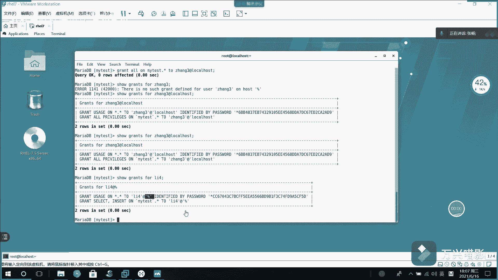

# 【Linux】从入门到精通 ｜ 零基础自学 ｜ 全套教程 ｜ RHCSA ｜ RHCE ｜ Linux爱好者 - P8：008-MariaDB撤权及用户权限查看 - Yo_Holly - BV1Df4y187g7

上一个视频当中啊给大家分享了这个就是说如果我现在有一些用户的时候，我针对不同的数据库啊，我可能需要对它授予不同的权限，也就是grreeen操作去进行授权，权限授予之后，假如说比如在未来的某个时刻啊。

我可能不想让他有这个权限了。这个时候我就需要对它的权限进行撤销。然后撤销权限的话，我们使用的是这个revo命令revo的话，它是什么？比如说我现在我需要对我需要在这个my test的数据库里面的所有表。

然后之前啊张三不是有所有的权限嘛？我现在啊就是说从张三里面把刚才在my test所有表里面的一个所有操作的话。

把其中操作里面的这个slide给去掉，就是查询权限给去掉。张三是local host，本地的哦，是张三。然后我再再次再次去查询张三所拥有的权限。然后这块要注意啊。

本地用户的话一定需要加上local host的啊。如果要是全局用户的话，是不需要加具个的。然后你看看到这块以后，张三现在拥有的话就是增加更新删除创建jo以及其其余的一些操作。但是这个里面的话。

他现在已经没有slack权限了，他不能查询了。然后这这个的话是对用户呃就是说撤销权限。然后有了这个之后，如果要之后我需就是你刚才啊咱们遇到了一个问题，就是说本地用户的话。

就是说本地范围内可以访问的用户的话，他后面必须加。但如果用户很多的情况下，我不知道他这个用户到底是全局可以访问的，或者是某个固定的IP可以访问，或者是本地的一个用户。

这个时候是不是我需要查询这个呃所有的用户它的一个就是说是主机的它它对应的一个使用范围是吧？这个时候我们就需要操作的一个表，就是那个我们需要从呃from哪个表从my的优乐表里面去查询。然后查询的时候。

现在咱们需要介绍一个就是这个它是一个连接函数。它的话主要做的一件事情是什么？他是把多个字符串，然后拼接起来进行显示。比如啊咱们现在先先举个例子。就是说先使用一下这个拼接函数。比如说我开始先是这，然后说。

张三。然后。逗号，比如说我中间有1一个线，然后连让他连接李四。你看这个字符串就拼接起来了。然后现在的话咱们需要使用这个字符串拼接功能，然后去把咱们所有的用户信息给读出来。然后读成的状态读成的效果就是啥？

就就比如说张三艾特local host，咱们需要读成这样的格式。现在咱们就做这么一件事，瘦。假如说是这样吧，DSCDSCmyscle下面的user。咱们先看看这里面都都有哪些属性。首先啊user的话。

就刚才咱们需要的那个就是说张三艾特loc host，它是不是首先需要使用这个user用户名，然后中间加一个艾，然后最后有一个这个hos host host的话是主机名。

咱们现在需要使用这两项去把它拼接起来是吧？现在咱们就做这么一件事。st，然后con。然后首先啊假如说咱们首先先写一个拼接项，假如说提示他这个是用户，然后冒号逗号。然后下来的话这一块啊。

如果要是一个固定的字符串，你直接就是引号里面放进去就可以了。如果是数据库的字段名，你直接写字段名。然后中间是。艾进行连接。然后后面的话是主机名host。然后后面再加一个分号，因为它咱们是多项。

可能会有多项加个分号吧。然后这个的话是从mysq的优乐表里面去查找。然后你看现在我就把用系统里面所有的一个用户信息就都给查询出来了。

