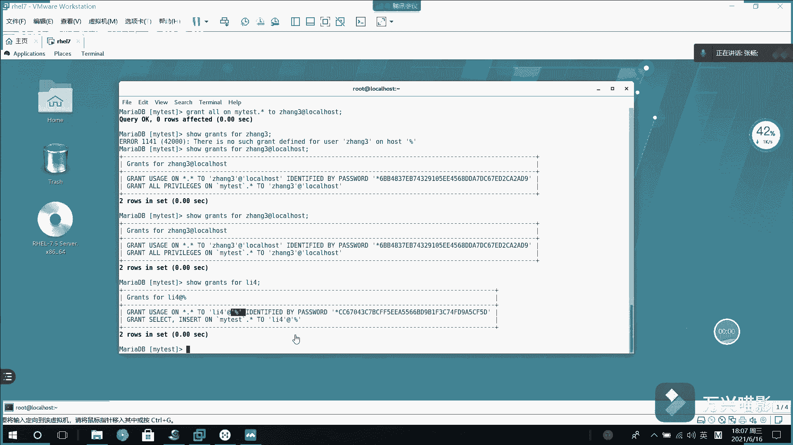

# Linux数据库管理：008：MariaDB撤权及用户权限查看 🔐

在本节课中，我们将学习如何在MariaDB中撤销已授予用户的权限，以及如何查看所有用户的完整信息。这是数据库安全管理的重要环节。

## 权限撤销操作

上一节我们介绍了如何使用`GRANT`命令为用户授权。本节中我们来看看如何撤销这些权限。



撤销权限使用`REVOKE`命令。例如，如果之前用户“张三”在`my_test`数据库的所有表上拥有全部权限，现在需要撤销其查询权限，可以执行以下操作：

```sql
REVOKE SELECT ON my_test.* FROM '张三'@'localhost';
```

执行后，再次查询用户“张三”的权限，会发现`SELECT`权限已被移除，仅保留增加、更新、删除、创建等操作。需要注意的是，对于本地用户，必须在用户名后指定`@'localhost'`；对于全局用户，则无需指定主机部分。

## 查看用户信息

在实际管理中，用户可能很多，我们有时需要明确每个用户的访问范围（如本地、特定IP或全局）。这时就需要查询系统用户表来获取详细信息。

以下是查询用户信息的方法：

我们需要从`mysql.user`表中查询。为了清晰地显示“用户名@主机名”的格式，我们将使用字符串拼接函数`CONCAT`。

`CONCAT`函数的作用是将多个字符串连接成一个字符串显示。例如：

```sql
SELECT CONCAT('张三', '-', '李四');
```

此语句的输出结果为“张三-李四”。

现在，我们使用这个函数来格式化显示所有用户信息。首先，查看`mysql.user`表的结构，确认包含`User`（用户名）和`Host`（主机名）字段。

```sql
DESC mysql.user;
```

接下来，执行查询，将用户名和主机名拼接为“用户@主机”的格式：

```sql
SELECT CONCAT('用户: ', User, '@', Host) AS '用户信息' FROM mysql.user;
```

执行此命令后，系统内所有用户的完整访问信息都将被清晰地列出。

## 课程总结


本节课中我们一起学习了MariaDB的两个关键管理操作：使用`REVOKE`命令撤销用户的特定权限，以及使用`CONCAT`函数查询并格式化显示数据库中的所有用户及其访问主机信息。掌握这些技能有助于你更精细地控制数据库访问安全。