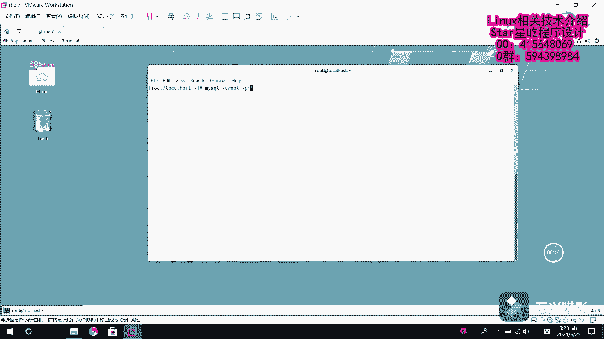

# 【Linux】从入门到精通 ｜ 零基础自学 ｜ 全套教程 ｜ RHCSA ｜ RHCE ｜ Linux爱好者 - P9：009-MariaDB修改用户密码(已知密码) - Yo_Holly - BV1Df4y187g7

哦，在这个视频当中啊，我们将要介绍的是mycyclq修改密码，给用户修改密码。首先啊我们先连接到这个数据库，连接到这个马TB数据库。

然后输入密码进入数据库了。首先啊查找就是说系统当中有哪些用户。然后这个的话就是查询那个mycyclq里面的那个user表。mys它是mycyclq里面U的表里面需要查询他他的用户名和他的。就是主机范围。

然后我们是从这个my circle点us表里面去进行查询。然后这样的话就是我们获取到了系统里面有哪些用户这个列表。然后比如啊现在我们需要对张扬这个用户去修改他的密码。

然后这样的话就是说第一种方法是set。pass word， password word。呃， passwords word，然后for，然后是哪个用户是张扬这个用户，然后艾，然后他是哪个主机范围。

上面咱们可以看到他的host是呃。百分号，也就是代表所有。然后咱们在这一块的话，对它设置一个密码，也就是说等于passpa word，然后里面写输入它的密码，比如说设置一个密码，123456。

然后这就设置好了，然后退出咱们试着用这个密码去登录一下这个马入DB。用户是张扬，然后密码这块输入咱们刚才改的密码，123456，然后顺利的进来了。直接这样的话，就把张扬这个用户的密码进行修改了。

然后第二种方式就是说我同样是先首先先登录到这个。数据库就是马DB数据库。哎，密码错了。然后啊紧接着就是需要使用的是这个update这条就是说是更新语句。然后我们是更新哪个表myscle里面的user表。

然后对它进行设置，设置哪个设置它的密码，然后将它的密码设置。比如说在这块，我们把它的密码改成readd hand。red hand。然后我们在这块的话，首先需要一个条件判断，然后是是哪个用户。呃。

张扬这个用户，然后and并列关系嘛，然后他的这个主机范围是什么？主机范围是通配所有。然后我们刷新这个。权限。然后退出再使用这个去登录。哎，用户是张扬。然后他的密码是red hunt。看也就登录了。

这个的话是在呃我知道root用户密码的情况下，我知道密码，然后我去更改其他用户的一些呃密码。

