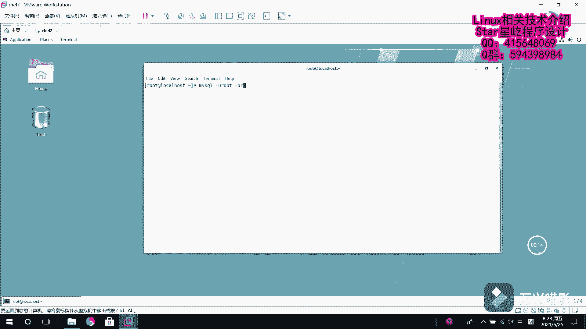

# Linux数据库管理：009：修改MariaDB用户密码（已知密码） 🛠️

在本节课中，我们将学习如何在已知当前密码的情况下，修改MariaDB数据库用户的密码。我们将介绍两种不同的方法，并通过实际操作演示每一步。

---

## 连接到MariaDB数据库

首先，我们需要连接到MariaDB数据库服务器。打开终端，使用以下命令进行连接：



```bash
mysql -u root -p
```

系统会提示您输入root用户的密码。输入正确密码后，您将进入MariaDB的命令行界面。

---

## 查看现有用户

在修改密码之前，我们先查看一下数据库中有哪些用户。这有助于我们确认要修改的用户名及其主机范围。

以下是查询用户列表的SQL语句：

```sql
SELECT User, Host FROM mysql.user;
```

这条命令从`mysql.user`系统表中查询所有用户的用户名（`User`）和允许登录的主机（`Host`）。执行后，您将看到一个用户列表。

---

## 方法一：使用SET PASSWORD语句修改密码

上一节我们查看了现有用户，本节中我们来看看第一种修改密码的方法。这种方法使用`SET PASSWORD`语句，直接且易于理解。

假设我们需要为用户“张扬”修改密码，并且从查询结果得知其`Host`为`%`（代表允许从任何主机连接）。

以下是修改密码的步骤：

1.  在MariaDB命令行中，执行以下命令：
    ```sql
    SET PASSWORD FOR '张扬'@'%' = PASSWORD('123456');
    ```
    这条命令将用户“张扬”的密码设置为“123456”。

2.  退出MariaDB，使用新密码尝试登录以验证修改是否成功：
    ```bash
    mysql -u 张扬 -p
    ```
    输入新密码“123456”，如果能够成功登录，则说明密码修改成功。

---

## 方法二：使用UPDATE语句修改密码

除了`SET PASSWORD`语句，我们还可以通过直接更新系统表的方式来修改用户密码。本节中我们来看看这种方法。

首先，确保您已使用root账户登录到MariaDB。

以下是使用UPDATE语句修改密码的步骤：

1.  执行以下SQL更新语句：
    ```sql
    UPDATE mysql.user SET Password = PASSWORD('redhat') WHERE User = '张扬' AND Host = '%';
    ```
    这条命令在`mysql.user`表中，找到用户名为“张扬”且主机为“%”的记录，并将其密码字段更新为“redhat”的加密值。

2.  修改系统表后，必须执行权限刷新操作，使更改立即生效：
    ```sql
    FLUSH PRIVILEGES;
    ```

3.  退出MariaDB，使用新密码“redhat”登录用户“张扬”以验证修改：
    ```bash
    mysql -u 张扬 -p
    ```
    输入密码“redhat”，成功登录即表示修改完成。

---

## 课程总结


本节课中我们一起学习了在已知密码的情况下，修改MariaDB用户密码的两种方法：
1.  **使用`SET PASSWORD`语句**：语法简单直接，`SET PASSWORD FOR '用户名'@'主机' = PASSWORD('新密码');`。
2.  **使用`UPDATE`语句更新系统表**：通过`UPDATE mysql.user`直接修改用户数据，修改后**必须**执行`FLUSH PRIVILEGES;`使权限生效。

这两种方法均适用于您拥有数据库管理权限（如root）并知晓当前密码的场景。请根据实际情况选择使用。