# Linux运维基础：23：Bash脚本编程入门 🐧

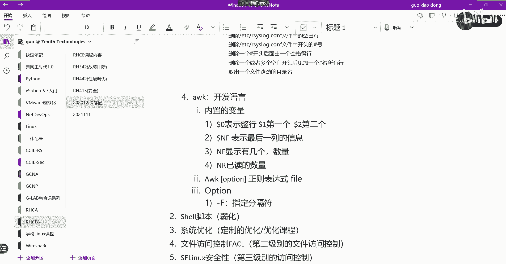

在本节课中，我们将要学习Bash脚本编程的基础知识。Bash脚本是Linux系统管理和自动化运维的核心工具，掌握它对于理解系统工作原理和提升工作效率至关重要。我们将从脚本的基本概念、执行方法、变量分类以及简单的控制结构入手，帮助你迈出Shell编程的第一步。

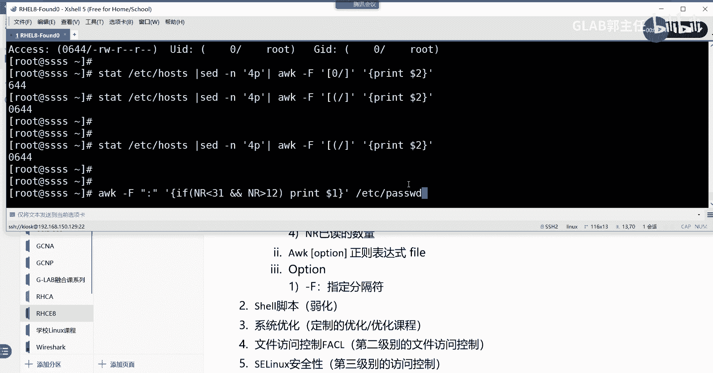

## 概述 📋

Bash是大多数Linux发行版默认的命令行解释器（Shell）。Bash脚本本质上是一系列Bash命令的集合，被保存在一个文件中，可以由Bash解释器按顺序执行。它的主要特点是简单、可移植性强，只要有Bash环境就能运行。

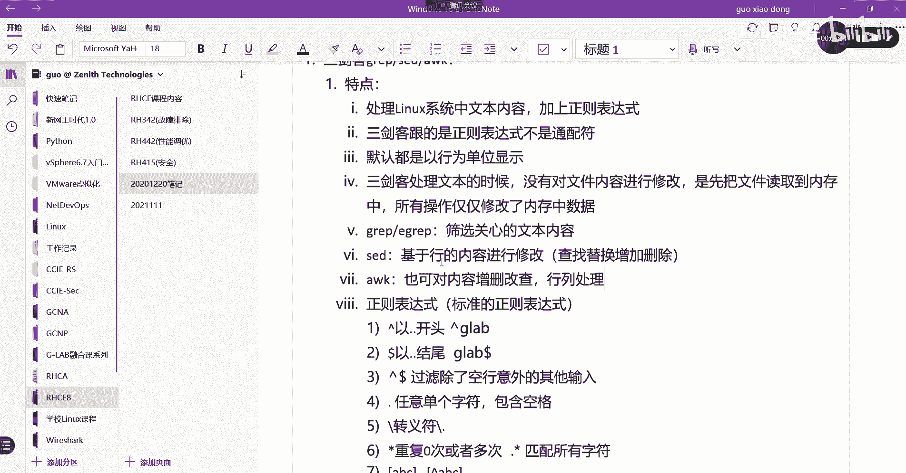

## 脚本的解释器与执行 🚀

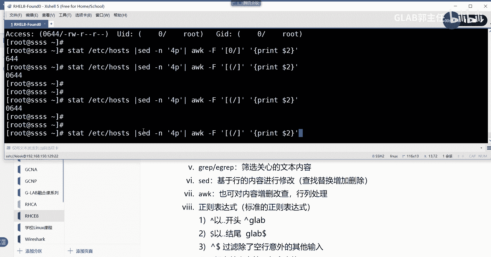

上一节我们介绍了Bash脚本的基本概念，本节中我们来看看如何编写和执行一个简单的脚本。

任何一门编程语言都需要解释器来执行代码。对于Bash脚本而言，其解释器就是系统自带的 `/bin/bash` 程序。我们当前操作的命令行界面本身就是一个Bash解释器环境。

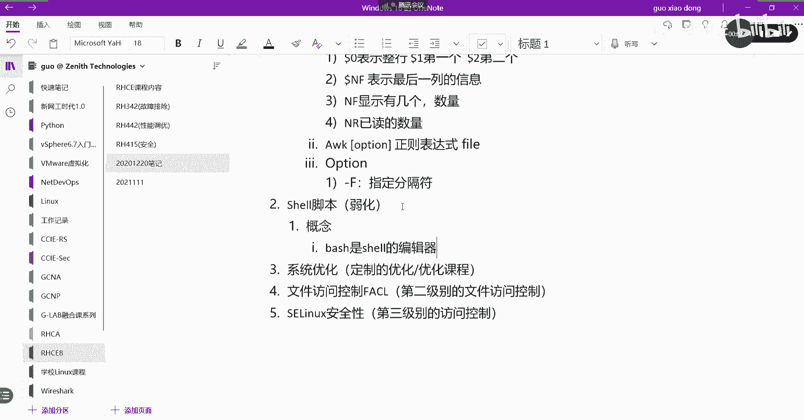

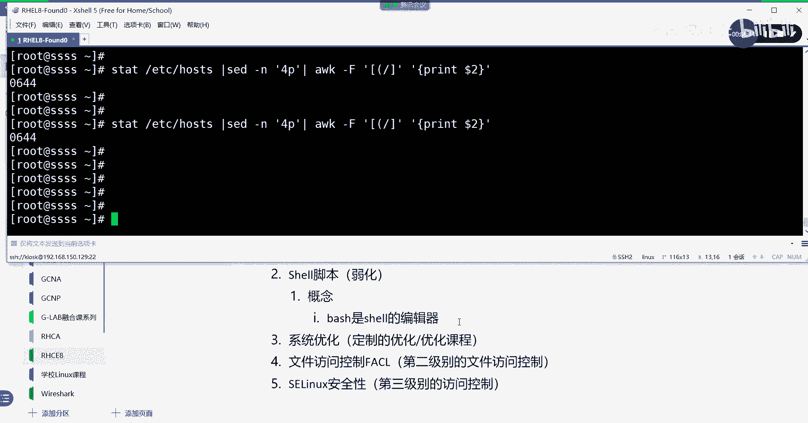

### 编写第一个脚本

创建一个脚本文件，例如 `hello.sh`。脚本的第一行必须指定使用的解释器。

```bash
#!/bin/bash
# 这是我的第一个Bash脚本
echo “Hello World”
```

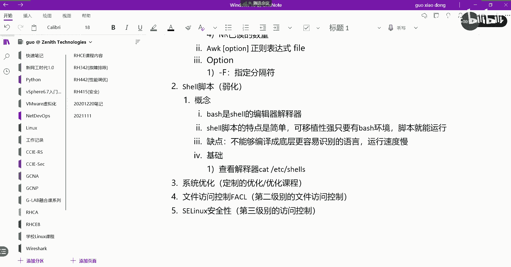

*   **`#!/bin/bash`**： 这行称为 `shebang`，用于指定执行此脚本的解释器路径。
*   **`# 注释`**： 以 `#` 开头的行是注释，不会被解释器执行。
*   **`echo “Hello World”`**： 这是脚本的主体，一条简单的输出命令。

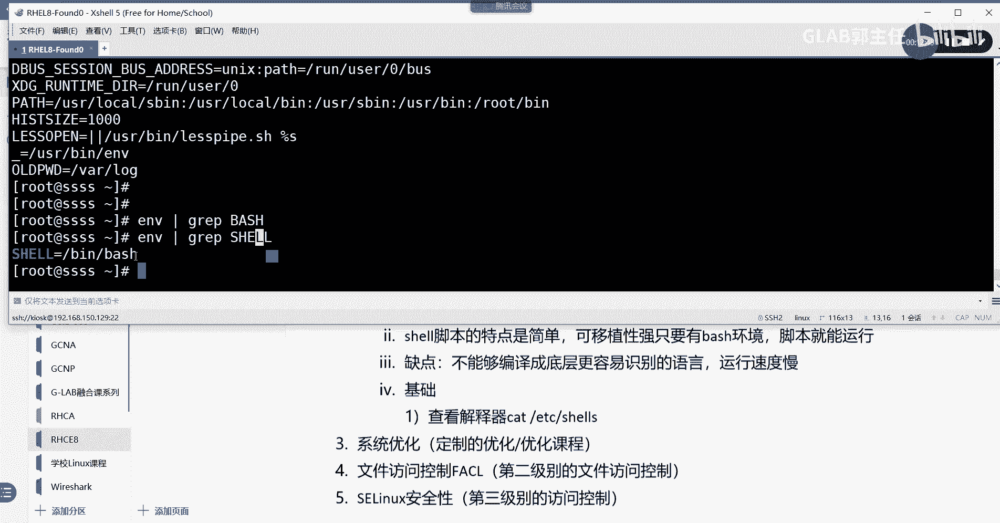

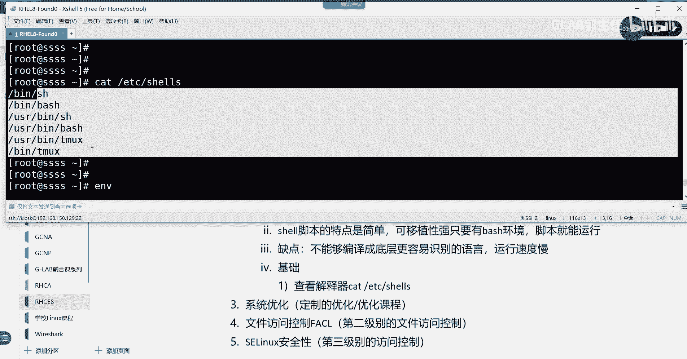

### 脚本的三种执行方法

脚本写好后，有多种方式可以执行它。以下是三种主要方法：

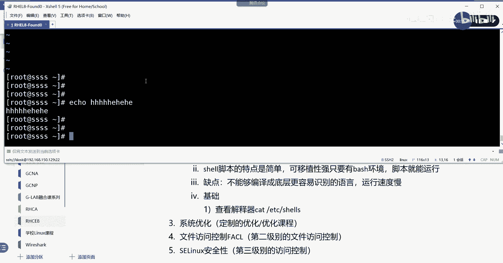

1.  **使用指定的解释器执行**： 直接调用 `bash` 命令来运行脚本文件。
    ```bash
    bash hello.sh
    ```
    这种方法直接指定了使用 `/bin/bash` 解释器来执行脚本。

2.  **使用当前Shell环境执行**： 使用 `source` 命令或 `.` 命令。
    ```bash
    source hello.sh
    # 或
    . hello.sh
    ```
    这种方法使用当前Shell进程的解释器来执行脚本文件中的命令。脚本中定义的变量会影响当前Shell环境。

3.  **作为可执行文件运行**： 为脚本文件添加可执行权限后，直接通过路径执行。
    ```bash
    chmod +x hello.sh
    ./hello.sh
    ```
    这是Linux中执行可执行程序的标准方式。**注意：此方法要求文件必须拥有执行权限（`x`）**。红帽认证考试中通常推荐这种方式。

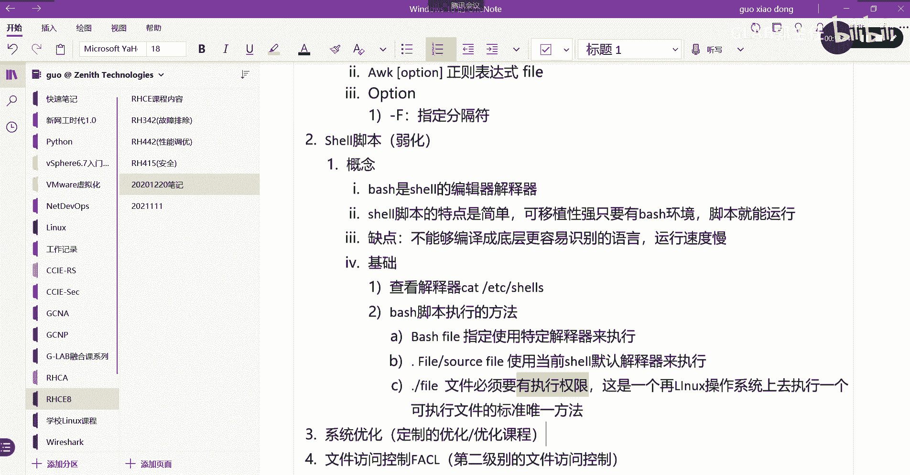

## 理解Bash变量 🔢

上一节我们学会了如何执行脚本，本节中我们来深入理解Bash脚本中变量的作用域和类型，这是编写复杂脚本的基础。

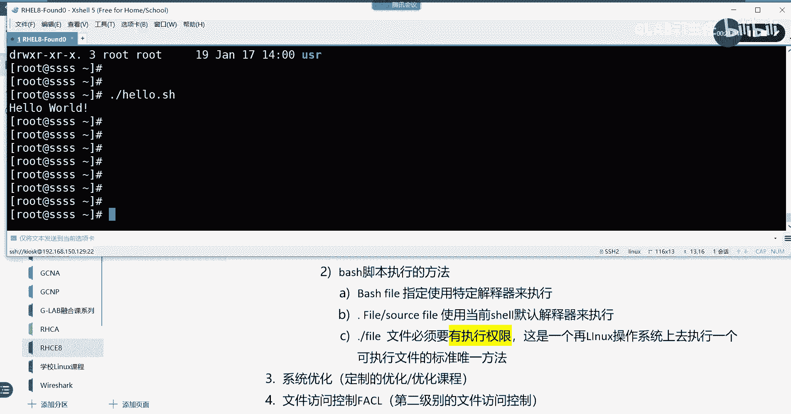

在Bash中，变量用于存储数据。Bash是弱类型语言，**所有变量默认都是字符串类型**。变量主要分为三类：局部变量、环境变量（全局变量）和特殊变量。


### 局部变量

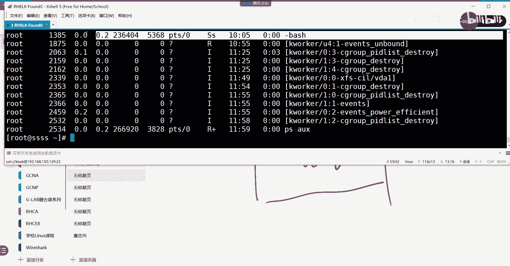


局部变量的作用域仅限于定义它的那个Shell进程。每个独立的Shell会话（例如通过SSH新开的窗口，或在Shell中启动的子Shell）都有自己独立的变量空间。

**定义与查看局部变量**：
```bash
# 定义一个局部变量
my_var=“GLAB”
# 查看变量的值，使用 $ 符号引用变量
echo $my_var
```
在另一个独立的Shell终端或子Shell中，将无法访问到 `my_var` 这个变量。

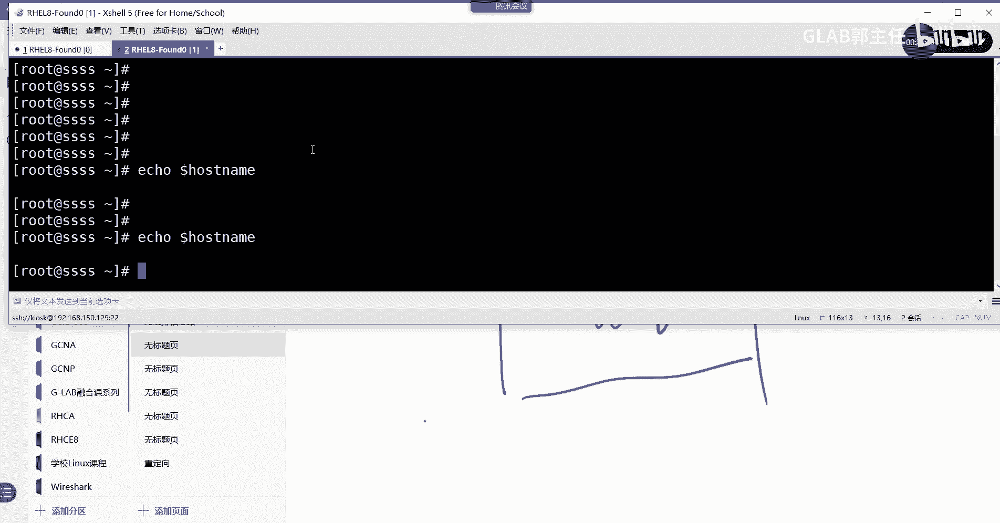

### 环境变量（全局变量）


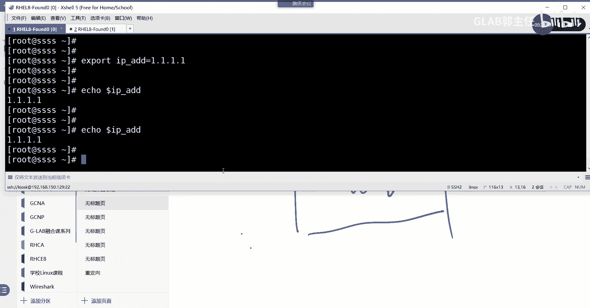

环境变量可以被当前Shell进程及其**子进程**继承。它们通常用于配置Shell环境和用户环境。


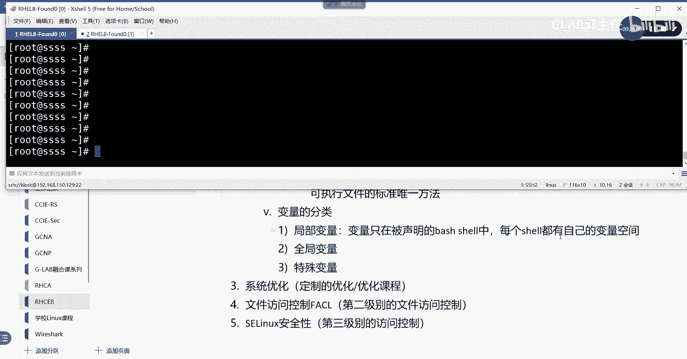

**定义环境变量**：
```bash
# 方法1：使用 export 将已定义的变量升级为环境变量（临时生效）
my_global_var=“value”
export my_global_var


# 方法2：定义并导出一步完成
export ANOTHER_VAR=“another_value”
```
通过 `export` 导出的变量，在其**子Shell**中可以被访问到。

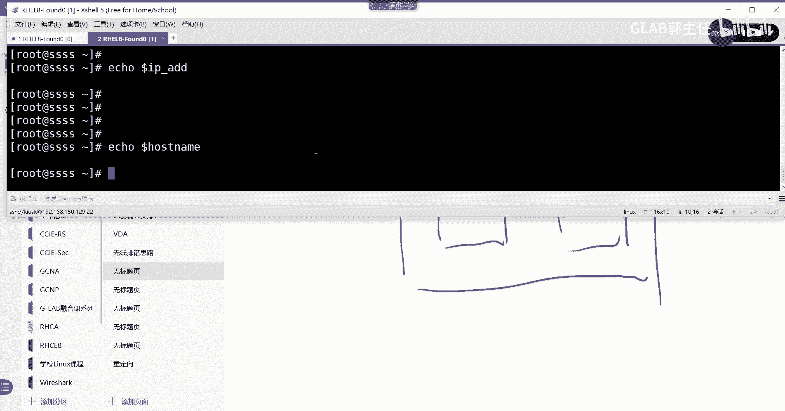


**永久生效的环境变量**：
若希望环境变量在任何新的Shell会话中都能自动生效，需要将其定义在Shell的配置文件中，如 `~/.bashrc`（对当前用户）或 `/etc/profile`（对所有用户）。
```bash
# 编辑 ~/.bashrc 文件，在末尾添加
export PERMANENT_VAR=“I_am_here_forever”
# 保存后，执行以下命令使配置立即生效，或重新登录
source ~/.bashrc
```

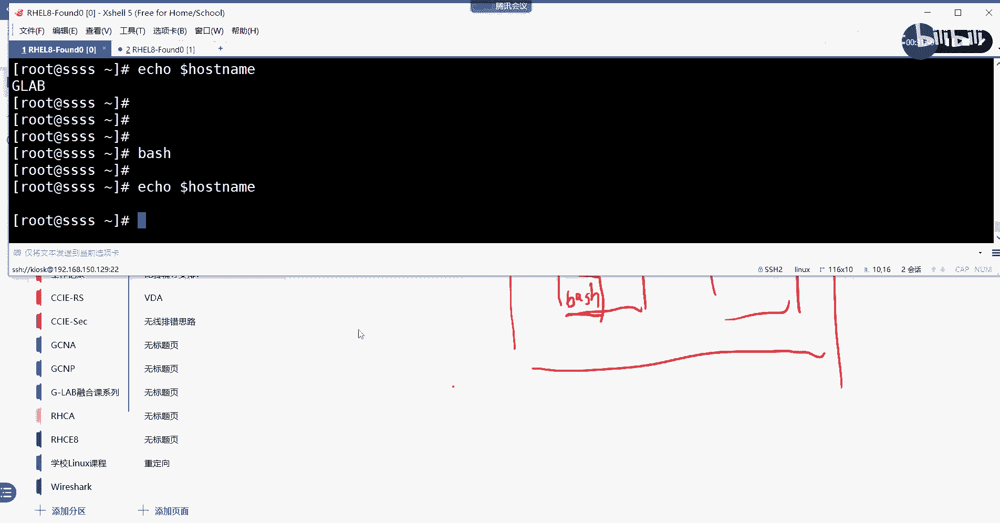

**重要概念**：
*   **命令行启动的脚本**： 使用 `bash script.sh` 或 `./script.sh` 执行脚本时，会启动一个**子Shell**。这个子Shell会继承父Shell的所有**环境变量**，但**不会**继承父Shell的**局部变量**。
*   **系统自动执行的脚本**（如定时任务 `cron`）： 这种脚本通常由系统服务启动，没有交互式父Shell可以继承。因此，脚本中所需的所有环境变量都必须在脚本内部或通过系统级配置文件明确定义。

### 特殊变量


Bash提供了一些预定义的特殊变量，用于获取脚本运行时的相关信息，例如参数。

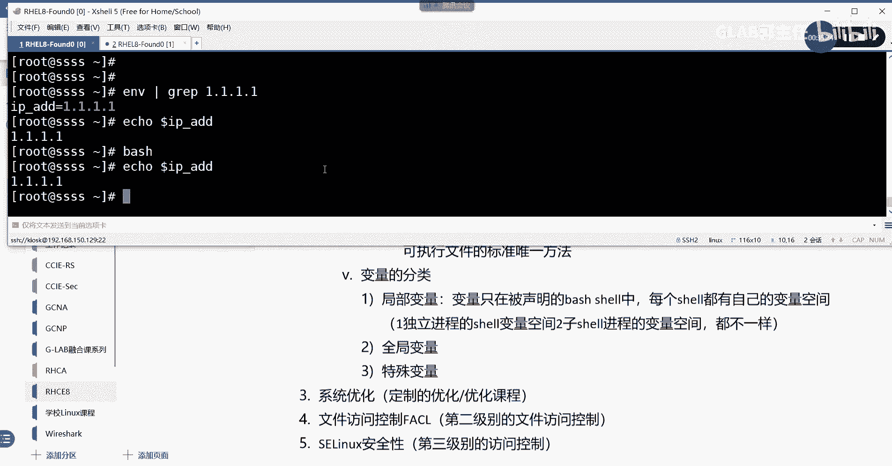

**一个演示特殊变量的脚本** (`args.sh`)：
```bash
#!/bin/bash
echo “This script‘s name is: $0“
echo “Total number of parameters is: $#“
echo “All parameters are: $@“
echo “The first parameter is: $1“
echo “The second parameter is: $2“
```


**执行并观察结果**：
```bash
chmod +x args.sh
./args.sh apple banana orange
```
输出将会是：
```
This script‘s name is: ./args.sh
Total number of parameters is: 3
All parameters are: apple banana orange
The first parameter is: apple
The second parameter is: banana
```

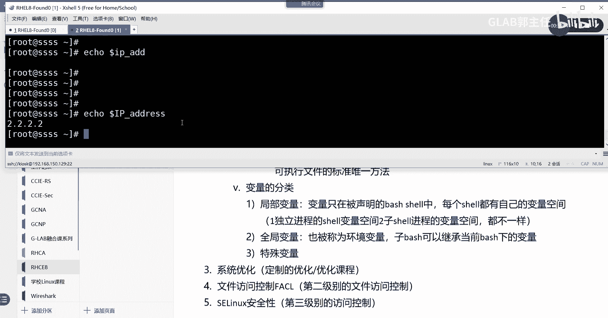

以下是常用特殊变量的含义：
*   **`$0`**： 当前脚本的文件名。
*   **`$#`**： 传递给脚本的参数个数。
*   **`$@`** 或 **`$*`**： 所有参数列表。
*   **`$1`, `$2`, `$3`...**： 第1、2、3...个参数。这些也称为**位置参数**。
*   **`$?`**： 上一个命令的退出状态（0通常表示成功）。
*   **`$$`**： 当前Shell进程的ID。

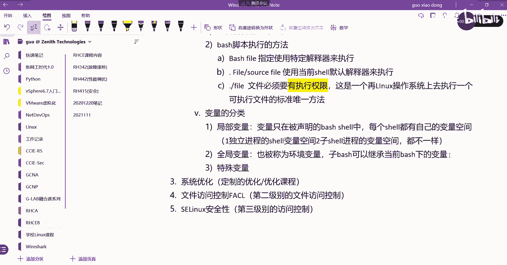

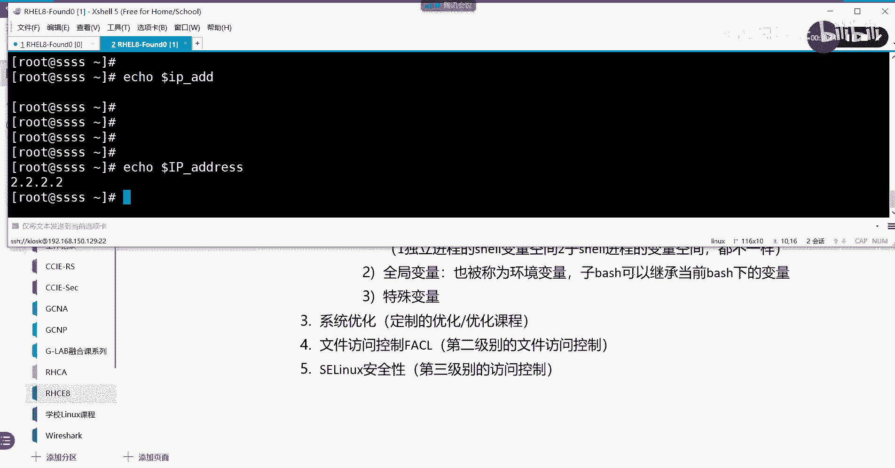

## 基础控制结构：条件与循环 ⚙️

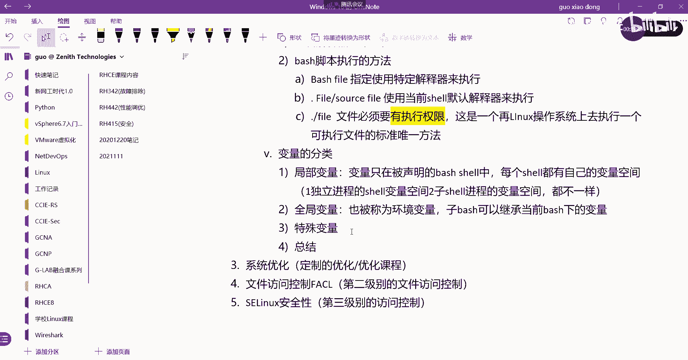

理解了变量之后，我们就可以组合它们，利用控制结构来编写更有逻辑的脚本。所有编程语言都离不开条件判断和循环，Bash也不例外。

### 条件判断 (if)

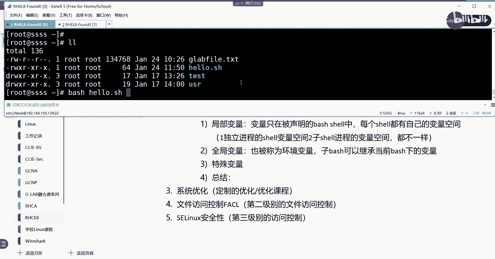

Bash中使用 `if`、`then`、`elif`、`else`、`fi` 关键字进行条件判断。

**单分支判断**：
```bash
if [ 条件判断式 ]; then
    # 条件成立时执行的命令
fi
```

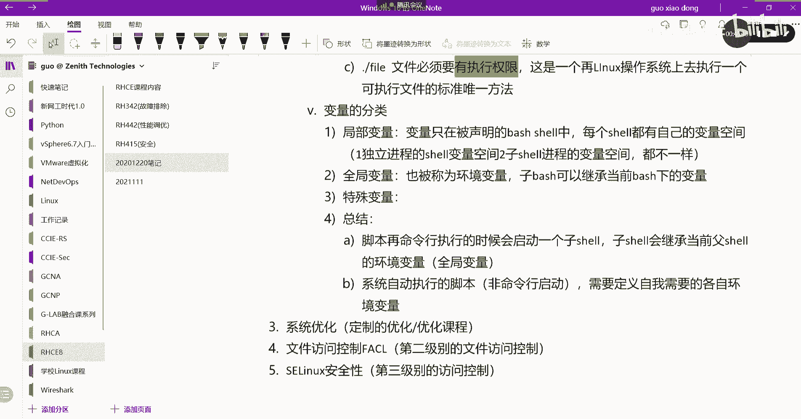

**双分支判断**：
```bash
if [ 条件判断式 ]; then
    # 条件成立时执行的命令
else
    # 条件不成立时执行的命令
fi
```

**多分支判断**：
```bash
if [ 条件1 ]; then
    # 条件1成立时执行
elif [ 条件2 ]; then
    # 条件2成立时执行
else
    # 所有条件都不成立时执行
fi
```
**注意**： `[ ]` 是 `test` 命令的简写，用于进行条件判断，括号内左右必须要有空格。

### 循环 (for, while)

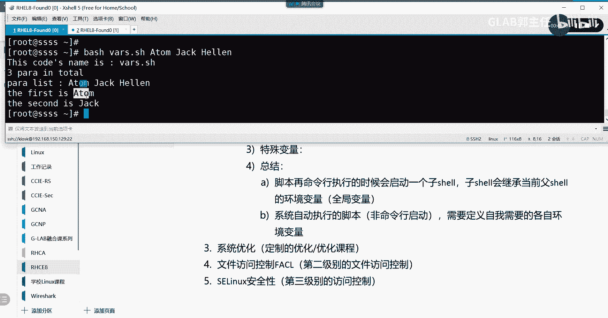

**for循环**： 用于遍历一个列表。
```bash
for 变量 in 列表
do
    # 针对列表中每个元素执行的命令
done
```
**示例**：遍历两个主机名并执行命令。
```bash
for host in servera serverb
do
    ssh $host hostname
done
```

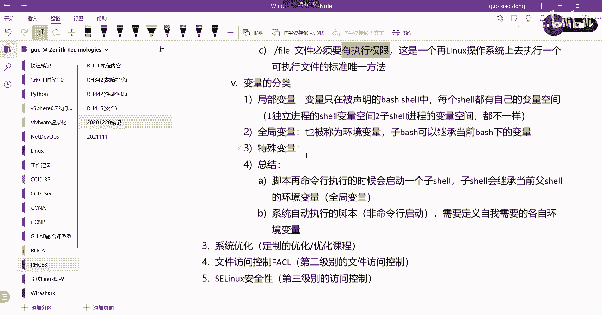

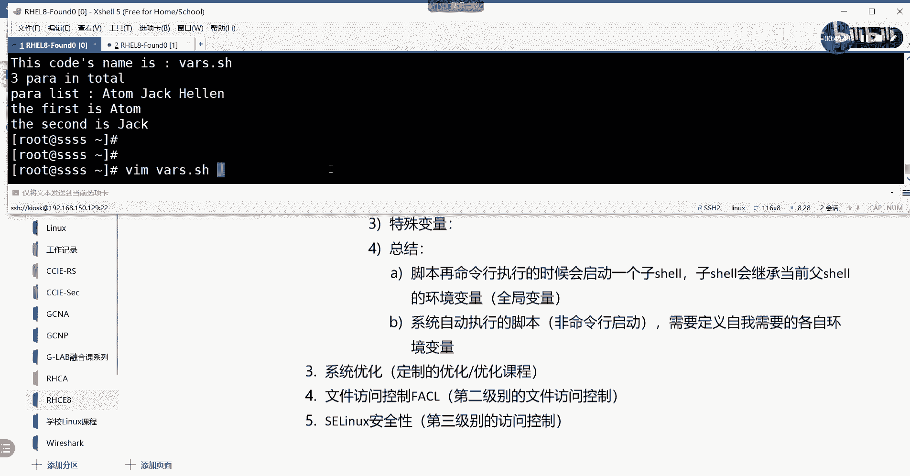

**while循环**： 当条件为真时，持续执行循环体。
```bash
while [ 条件判断式 ]
do
    # 条件为真时执行的命令
done
```

## 实践练习 🧪

理论需要结合实践。以下是两个简单的实验，帮助你巩固所学知识。

### 练习1：创建基础脚本

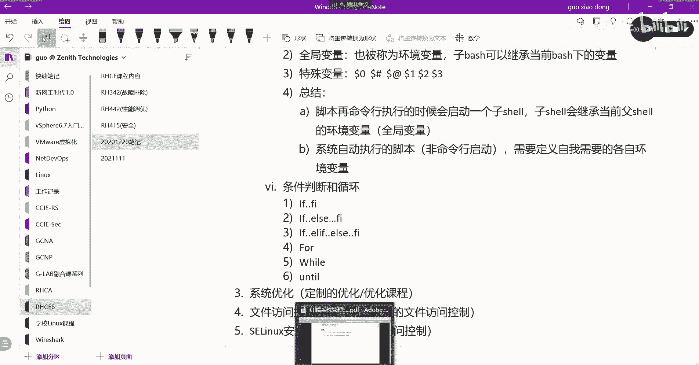

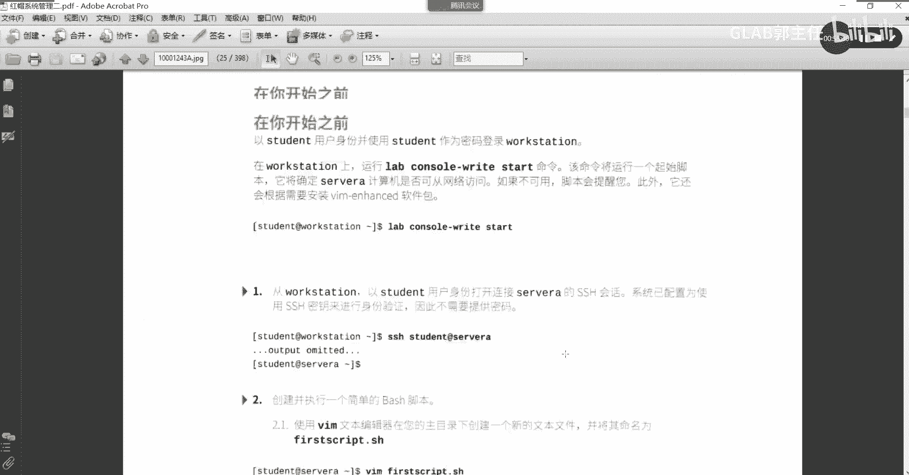

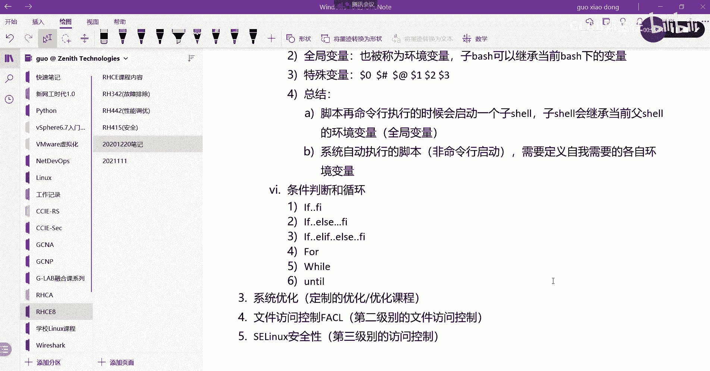

这个练习的目的是熟悉脚本的创建、编辑和执行流程。

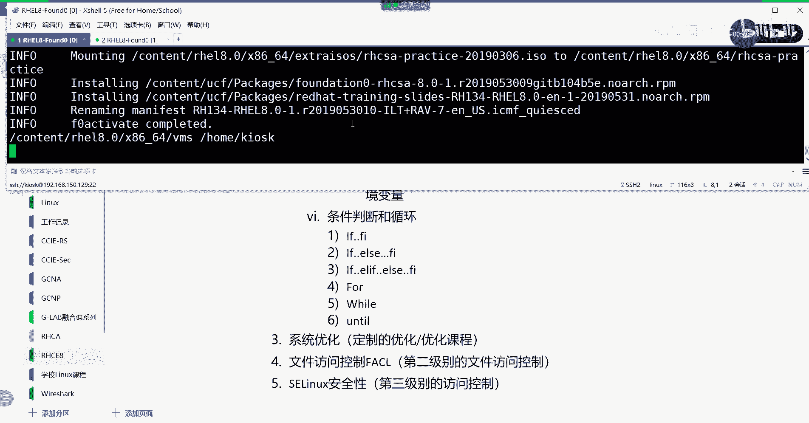

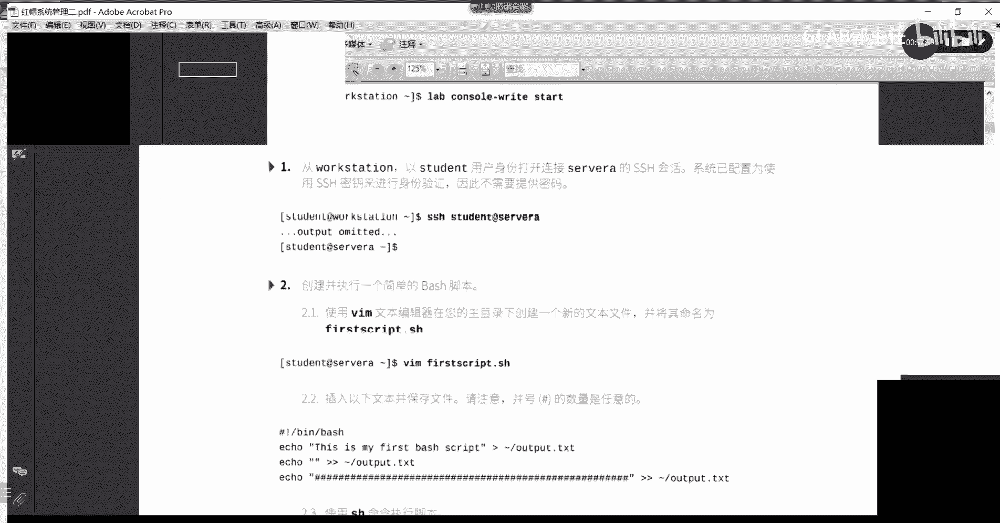

1.  创建一个脚本，将系统信息输出到文件。
2.  脚本内容可以包括使用 `echo` 输出标题，以及执行 `lsblk`（列出块设备）和 `df -h`（查看磁盘空间）等命令，并将结果追加到同一个文件中。
3.  为脚本添加执行权限并用 `./` 方式运行。

### 练习2：使用循环

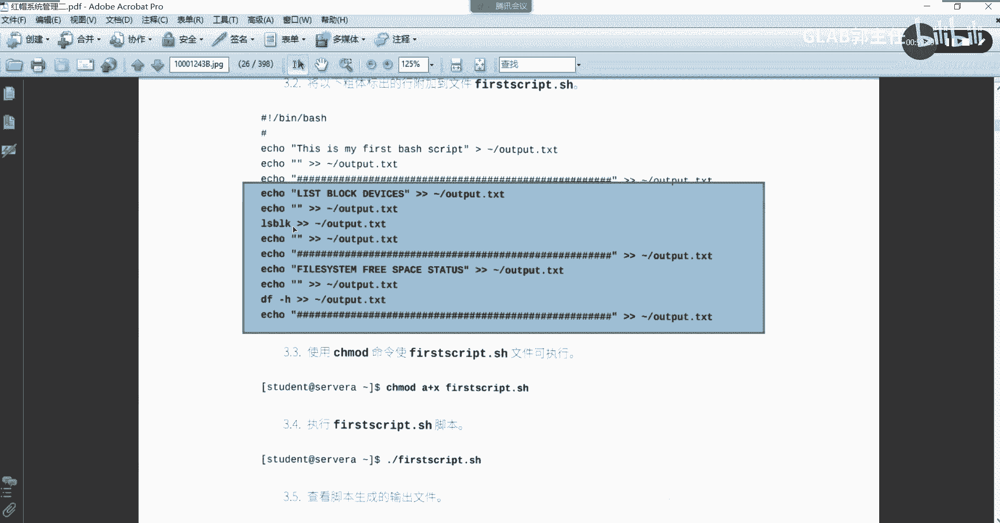

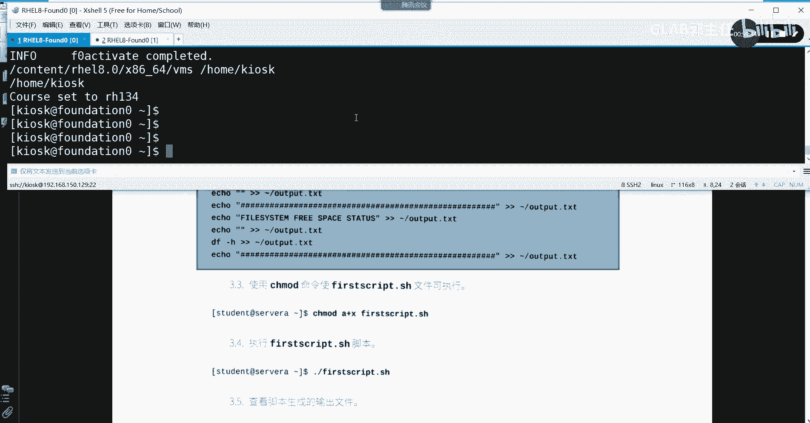

这个练习将演示如何使用 `for` 循环来简化重复性任务。

1.  编写一个脚本，使用 `for` 循环遍历一个包含若干主机名（如 `servera`, `serverb`）的列表。
2.  在循环体内，尝试通过 `ssh`（或模拟）获取每个主机的 `hostname`。
3.  执行脚本，观察它如何自动化地完成对多个目标的操作。

## 总结 📝

本节课中我们一起学习了Bash脚本编程的入门知识。我们从Bash脚本的基本概念和三种执行方法开始，深入探讨了局部变量、环境变量和特殊变量的区别与用法，这是理解脚本行为的关键。接着，我们介绍了构成脚本逻辑骨架的条件判断（`if`）和循环（`for`, `while`）结构。最后，通过实践练习将理论应用于实际。

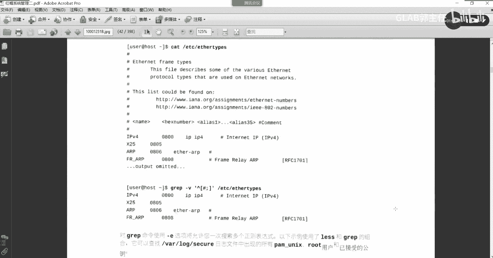

记住，Bash脚本的强大之处在于它能将你在命令行中熟练使用的所有命令组合起来，实现自动化。不断练习，从编写简单的小工具开始，你将逐渐掌握这项运维工程师的核心技能。