# Linux容器入门：1：容器介绍与基础概念 🐳

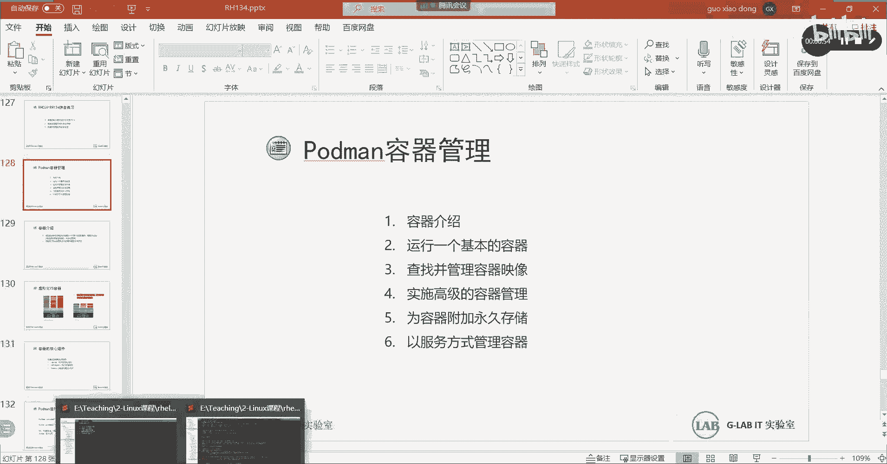

在本节课中，我们将要学习Linux容器的基本概念、工作原理以及它与传统虚拟化的区别。容器是现代应用部署和运维中的重要技术，理解其核心思想是掌握后续操作的基础。

---

## 什么是容器？

容器是一组与系统其他部分隔离的进程集合。通俗地讲，容器就是一个打包好的应用，它运行在一个独立的“盒子”里。这个“盒子”里的内容与其他容器是隔离的，并且不会相互影响。容器的主要目的是打包应用程序，以简化部署流程。

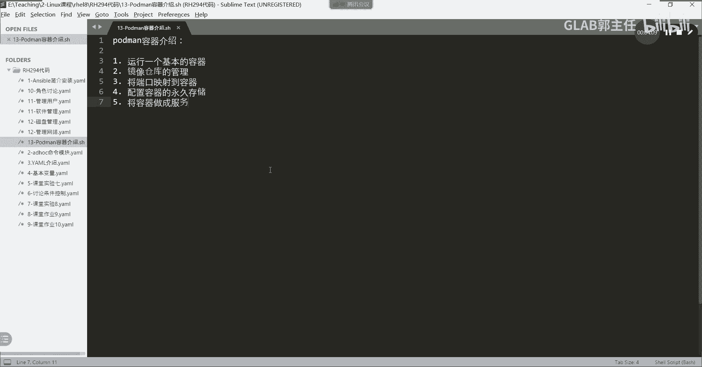

## 容器与虚拟化的区别

为了更好地理解容器，我们先回顾一下传统的虚拟化技术。

**传统虚拟化（如VMware、KVM）** 的架构通常如下：
1.  在底层物理硬件上安装一个虚拟化层（Hypervisor）。
2.  在虚拟化层上安装完整的客户操作系统（Guest OS）。
3.  在客户操作系统上运行应用程序。

这种架构的缺点是层次多，资源消耗大，每个虚拟机都包含一个完整的操作系统内核。

**容器技术** 的架构则不同：
1.  在Linux内核之上直接安装容器引擎（如Docker/Podman）。
2.  在容器引擎上直接运行应用程序，**没有独立的客户操作系统内核**。

因此，我们可以总结：**容器是一个没有独立内核的、轻量级的“虚拟机”**。它更注重应用本身的快速部署和运行。

## 容器的三大隔离组件

容器之所以能实现轻量级的隔离，主要依赖于Linux内核的三大技术：
*   **Control Groups (cgroups)**: 用于限制和隔离进程组所使用的物理资源（如CPU、内存）。
*   **Namespaces**: 为进程提供独立的系统视图，实现网络、进程ID、文件系统等的隔离。
*   **SELinux**: 提供强制访问控制安全层，进一步增强隔离性。

## 容器的运行原理与管理工具

当前，在Linux系统上管理容器的主流工具是 **Podman**，它已经取代了早期的Docker。Podman与Docker命令兼容，但它是遵循 **OCI（开放容器倡议）** 标准的开源工具，更符合云原生的发展趋势。

容器的运行可以概括为两个方向：
1.  **镜像生成容器**：通过容器镜像（Image）库，生成容器的可运行实例（运行层）。
2.  **内核管理容器**：系统的容器运行时（如`runc`）通过调用Linux内核，来管理和控制这些运行中的容器。

简单来说，镜像是容器的模板，容器是镜像的运行实例，而Linux内核是最终负责隔离和资源管理的基石。

---

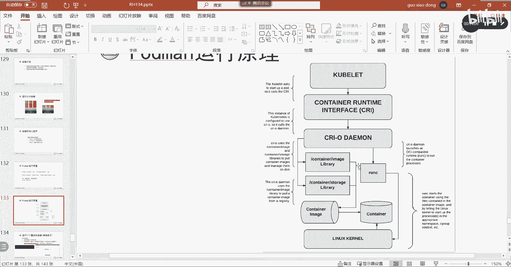

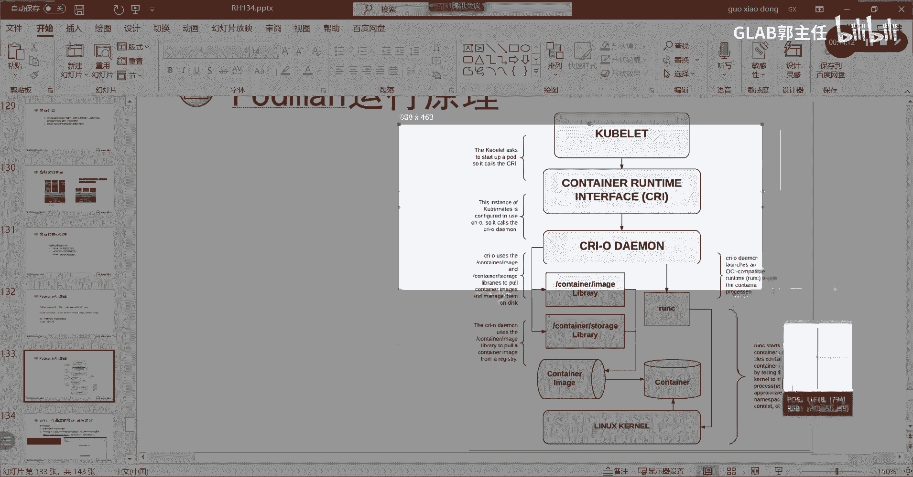

上一节我们介绍了容器的核心概念，本节中我们来看看如何准备实验环境并进行最基本的容器操作。

## 实验环境说明

为了进行容器实验，我们使用基于RHEL 8.2的练习环境。该环境中已经预设了以下内容：
*   一台用于运行容器的主机（例如 `servera`）。
*   一台搭建好的私有容器镜像仓库主机（例如 `utility`）。

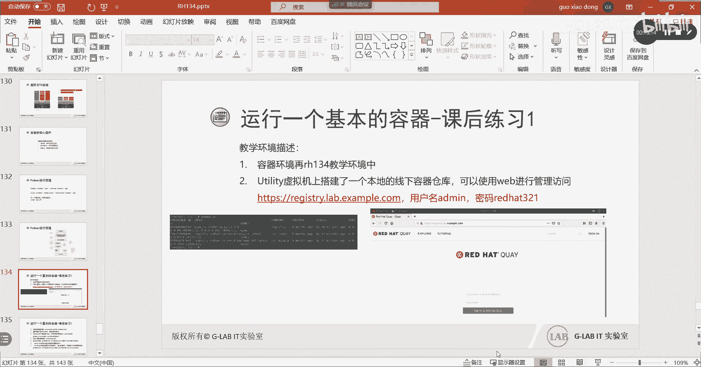

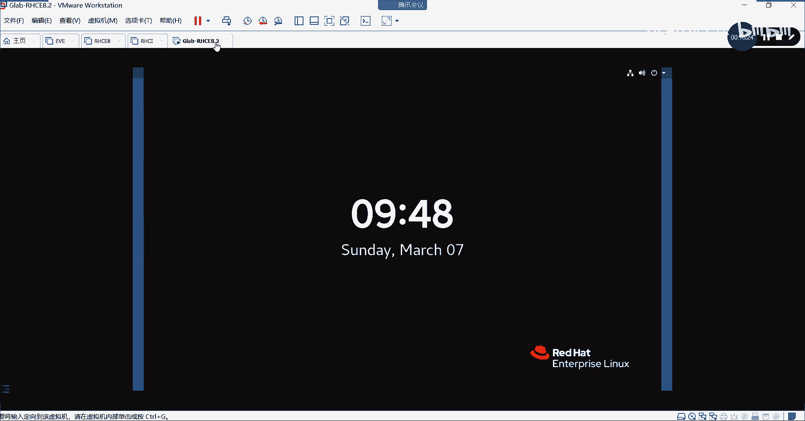

所有实验所需的镜像都将从这个私有仓库中获取。

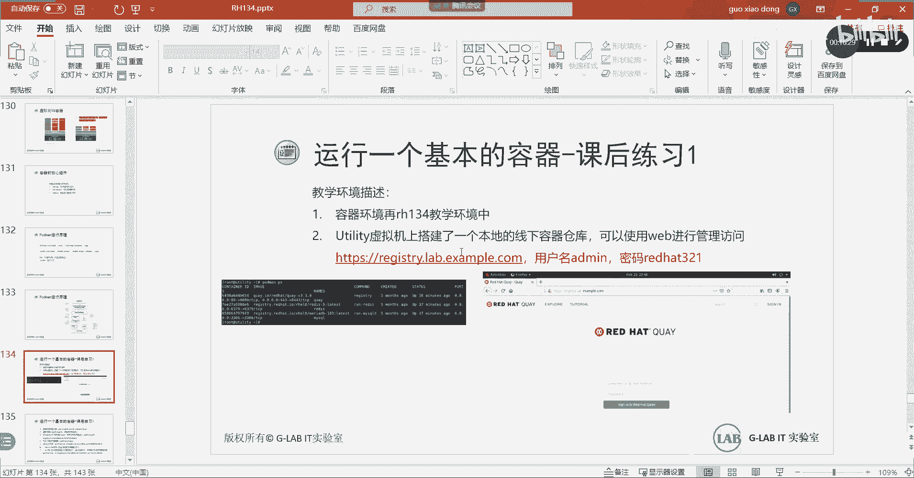

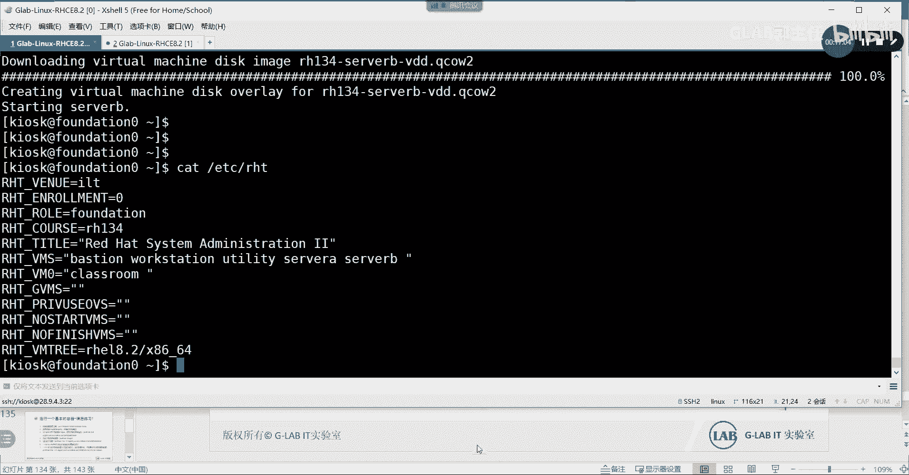

以下是登录实验环境的基本信息：
*   **用户名**: `root`
*   **密码**: `redhat321`

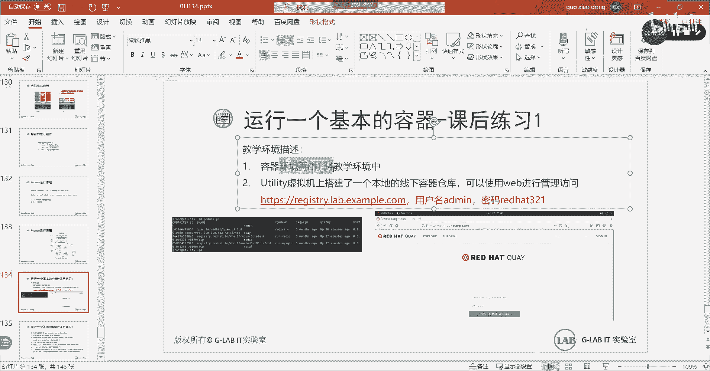

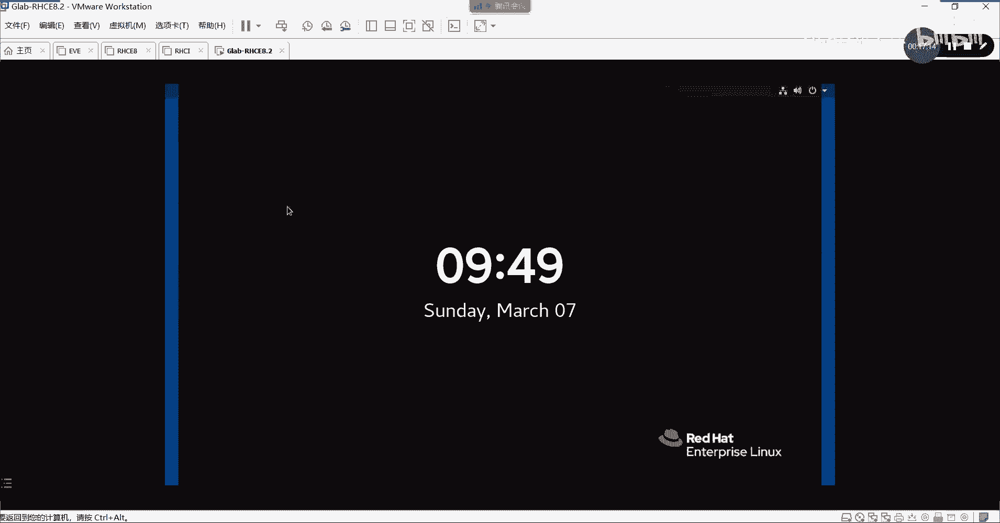

## 安装容器管理工具

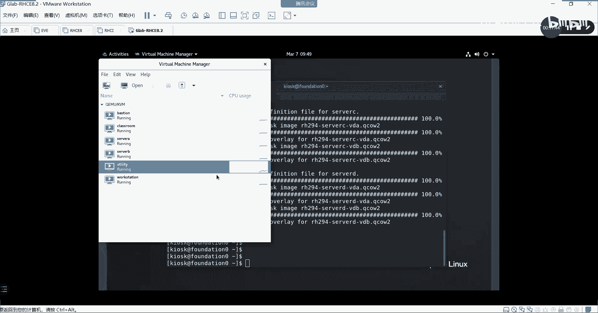

在运行容器的主机上，首先需要安装容器管理工具套件。

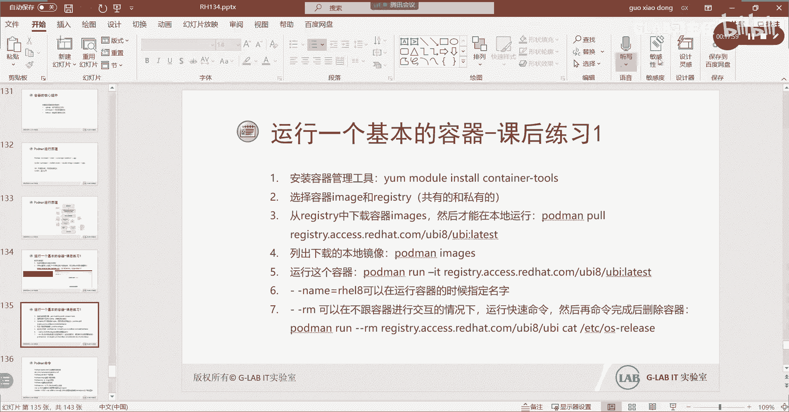

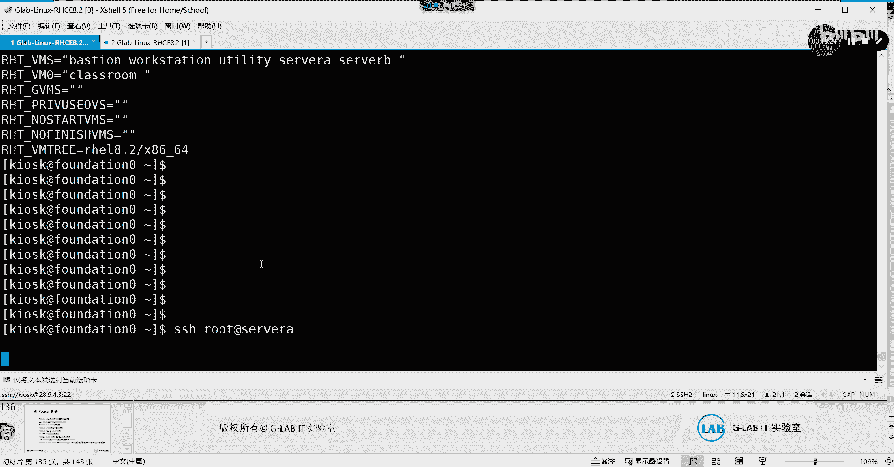

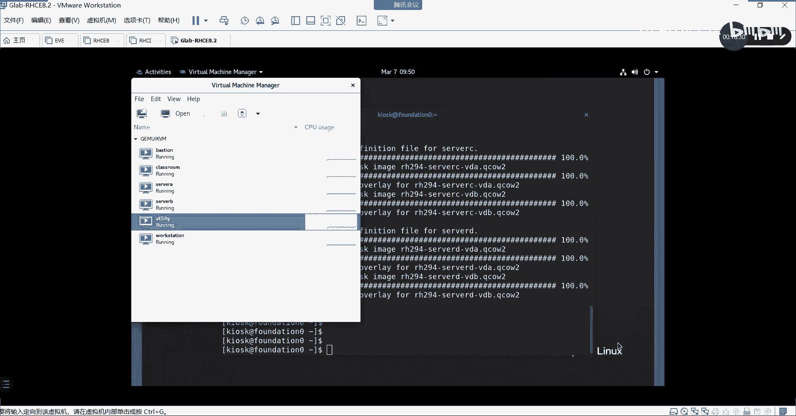

执行以下命令进行安装：
```bash
yum install -y container-tools
```
这个软件包组包含了Podman等必要的容器工具。

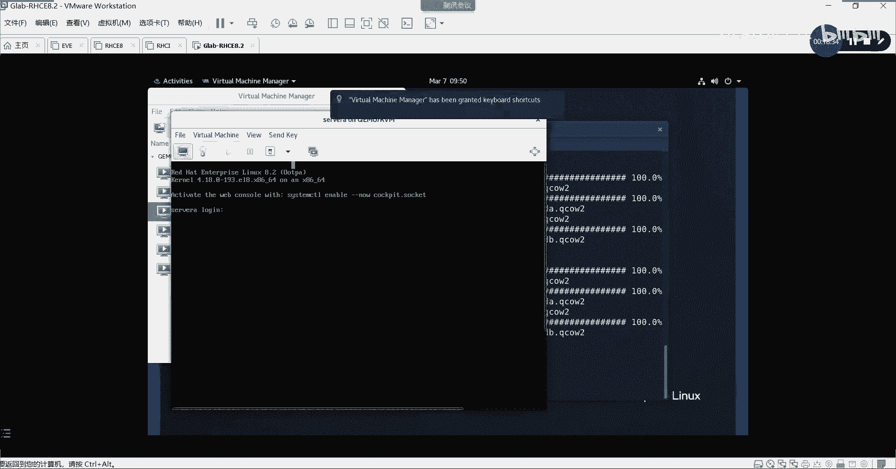

安装完成后，你就可以使用 `podman` 命令来管理容器了。Podman的命令与Docker高度兼容，如果你熟悉Docker，可以轻松上手。

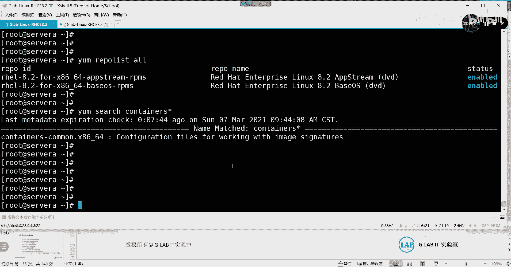

---

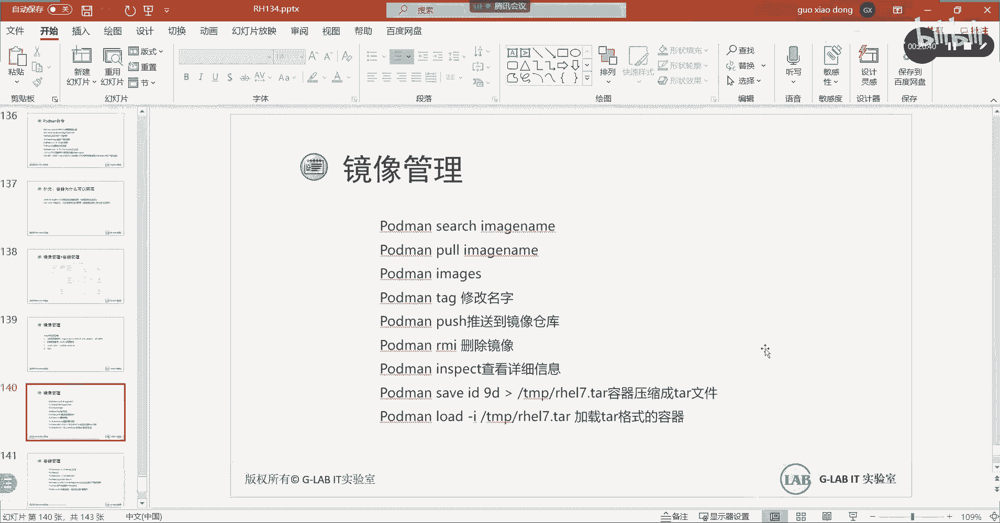

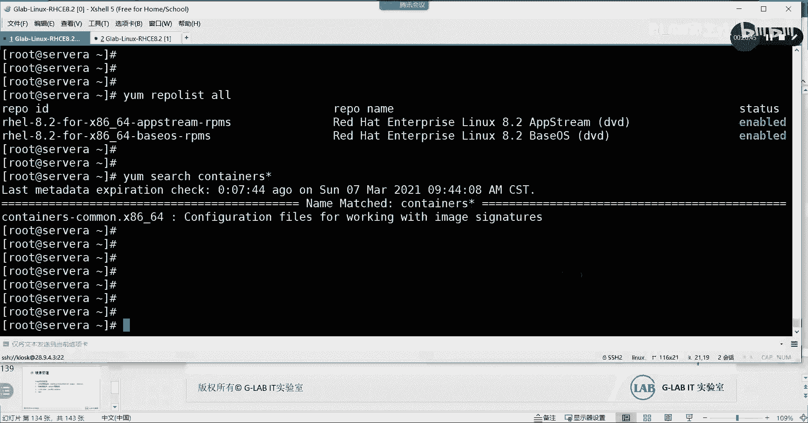

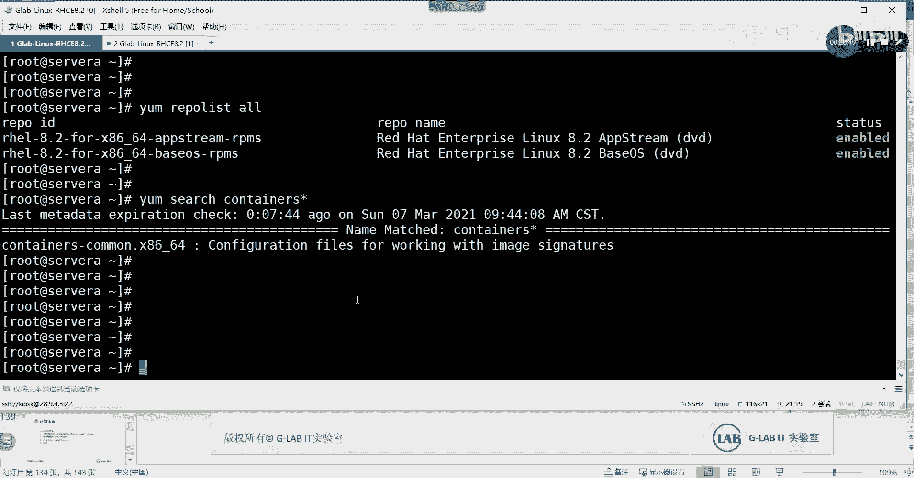

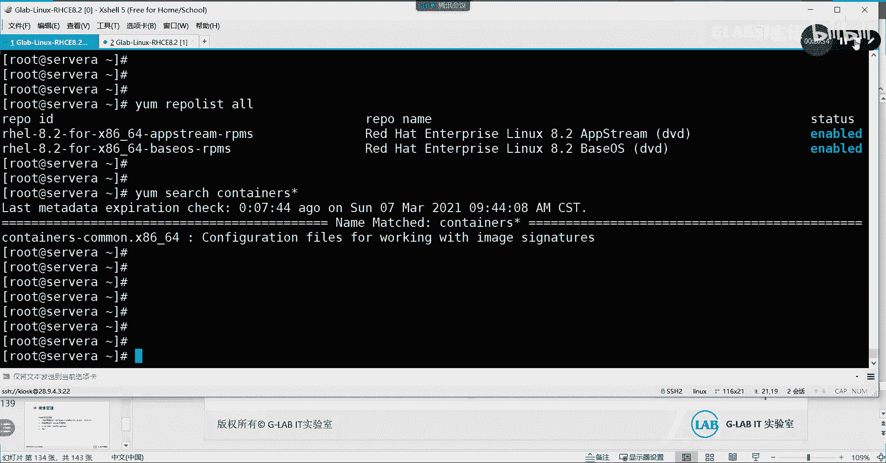

本节课中我们一起学习了容器的基本定义、它与传统虚拟化的核心区别，以及容器的隔离原理和主流管理工具Podman。我们还介绍了实验环境的构成，并完成了容器管理工具的安装。理解这些基础是后续学习容器运行、镜像管理和网络配置的关键。