# Linux运维基础：22：三剑客入门

在本节课中，我们将要学习Linux系统中处理文本内容的三个强大工具，俗称“三剑客”：`grep`、`sed`和`awk`。它们是系统管理员和运维工程师日常工作中不可或缺的工具，主要用于搜索、过滤和转换文本数据。我们将从正则表达式的基础开始，逐步掌握每个工具的核心用法。

## 正则表达式基础

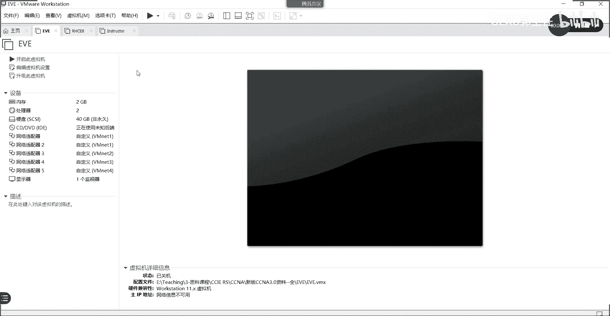

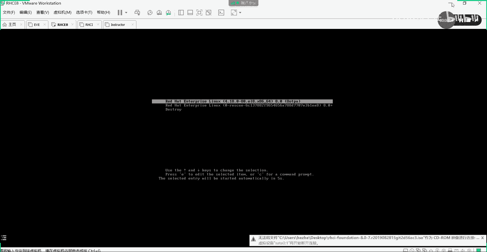

上一节我们介绍了三剑客的主要用途是处理文本。本节中我们来看看它们共同依赖的核心——正则表达式。正则表达式是一种用于描述字符串模式的强大语法，不同于之前学习的通配符，它主要用于文本匹配和提取。

以下是正则表达式中一些核心符号的含义：

*   `^`：匹配以指定字符开头的行。例如 `^GLAB` 匹配以“GLAB”开头的行。
*   `$`：匹配以指定字符结尾的行。例如 `GLAB$` 匹配以“GLAB”结尾的行。
*   `^$`：匹配空行（不包含任何字符，包括空格）。
*   `.`：匹配任意单个字符（包括空格）。
*   `\`：转义符，将特殊字符恢复其字面意义。例如 `\.` 匹配一个真正的点号“.”。
*   `*`：重复前面的字符零次或多次。例如 `a*` 可以匹配“”（空）、“a”、“aa”等。
*   `[abc]`：匹配方括号内的任意一个字符。例如 `[abc]` 匹配“a”、“b”或“c”。
*   `[^abc]`：匹配不在方括号内的任意一个字符。例如 `[^abc]` 匹配除了“a”、“b”、“c”之外的任意字符。
*   `\{n,m\}`：将前面的字符重复 n 到 m 次。例如 `a\{2,4\}` 匹配“aa”、“aaa”或“aaaa”。
*   `\(ab\).*\1`：分组与后向引用。`\(ab\)` 将“ab”视为一个组，`.*` 匹配任意字符，`\1` 表示引用第一个分组（即“ab”）的内容。

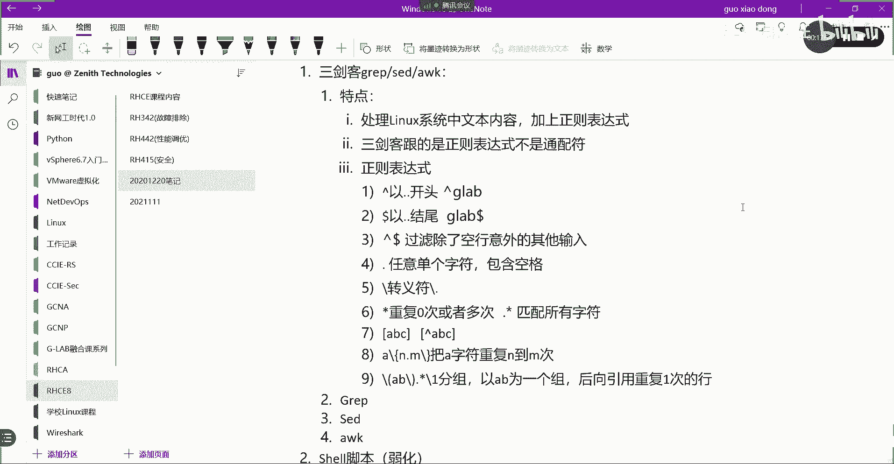

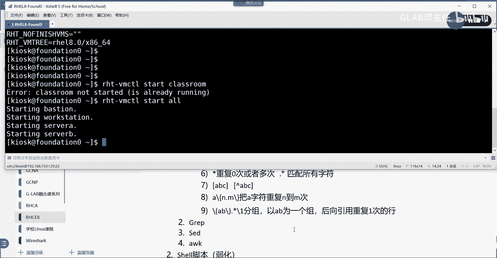

除了标准正则表达式，还有扩展正则表达式，语法更简洁。使用 `grep -E` 或 `egrep` 命令来启用。

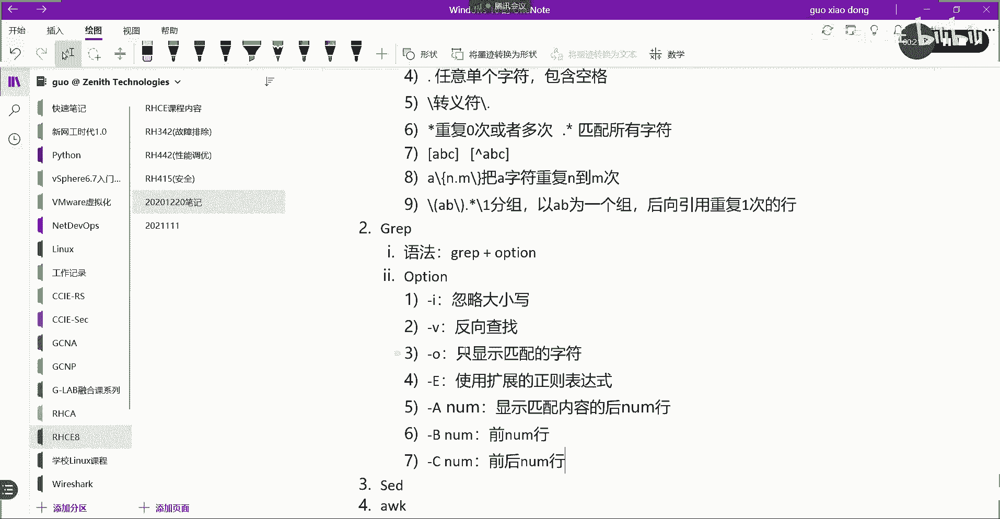

以下是扩展正则表达式的几个关键符号：

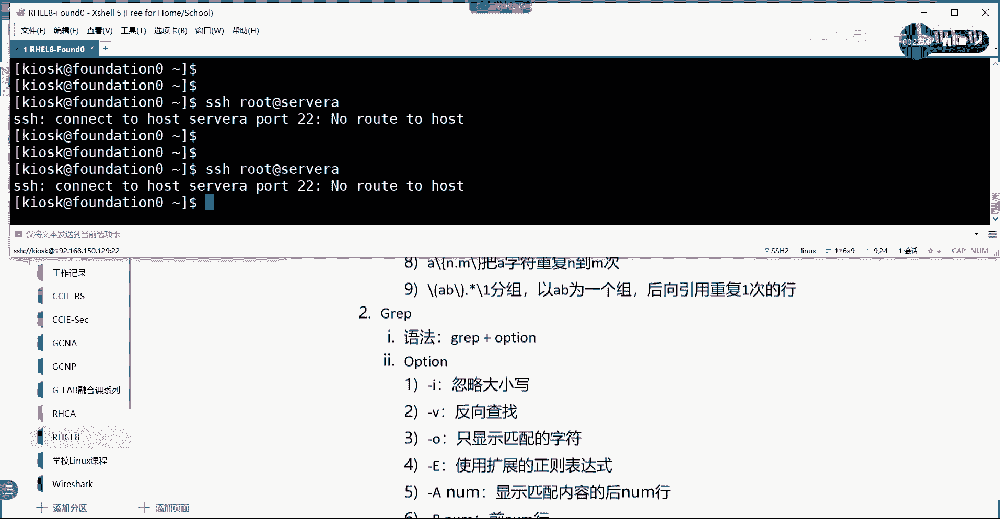

*   `+`：重复前面的字符一次或多次。
*   `?`：重复前面的字符零次或一次。
*   `|`：或操作符。例如 `a|b` 匹配“a”或“b”。
*   `()`：分组，功能同标准表达式中的 `\(\)`，但写法更简单。
*   `{n,m}`：重复前面的字符 n 到 m 次，无需反斜杠。

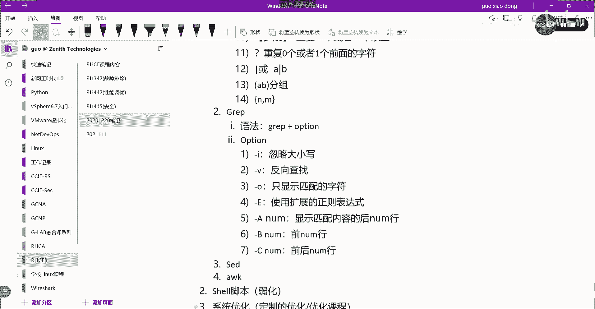

## grep：文本搜索工具

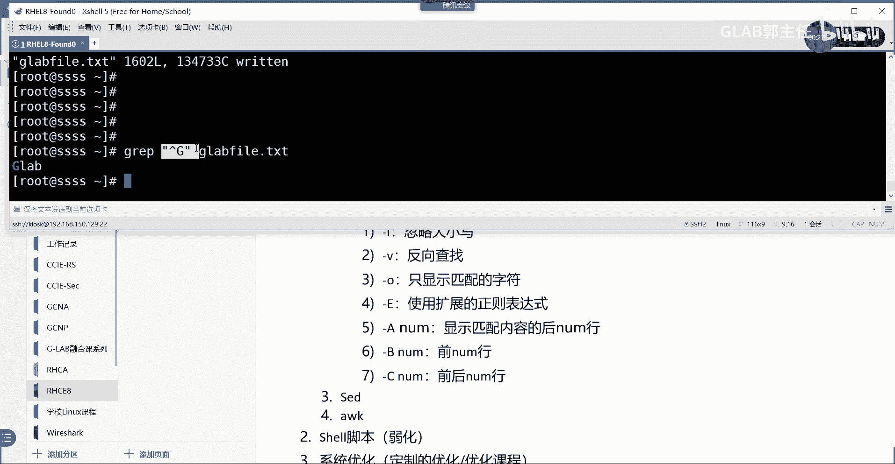

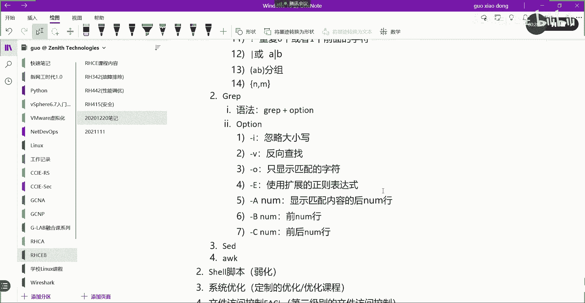

了解了正则表达式后，我们首先学习三剑客中的第一个——`grep`。`grep` 用于在文件中搜索匹配指定模式的行，并将结果输出到屏幕。

它的基本语法是：
```bash
grep [选项] ‘模式’ 文件名
```

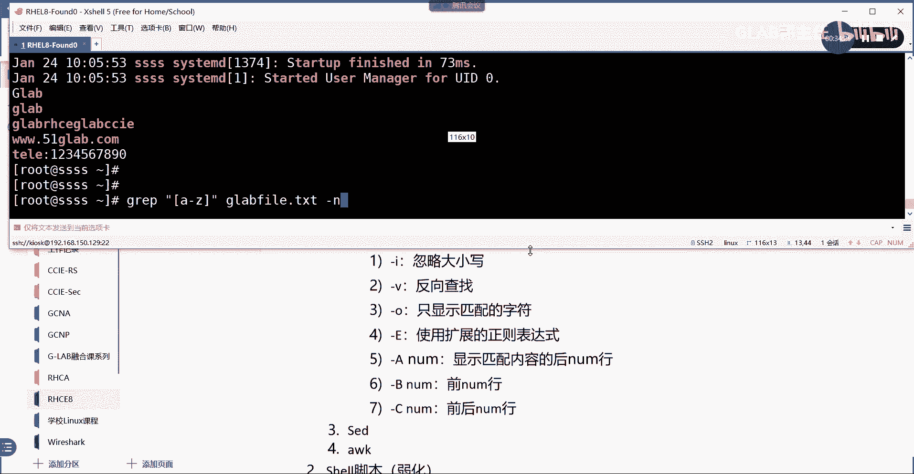

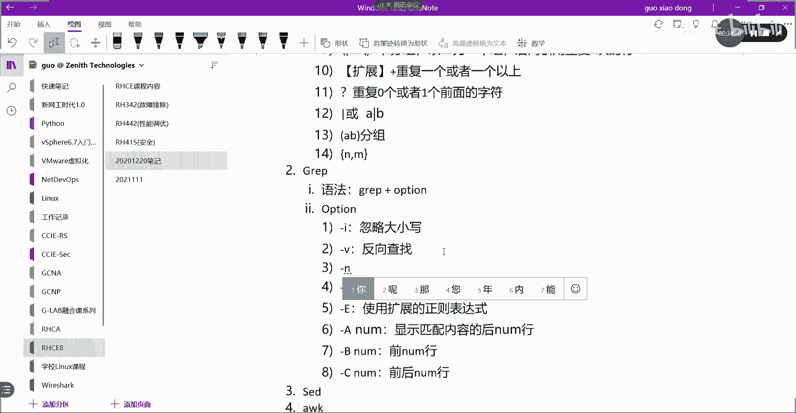

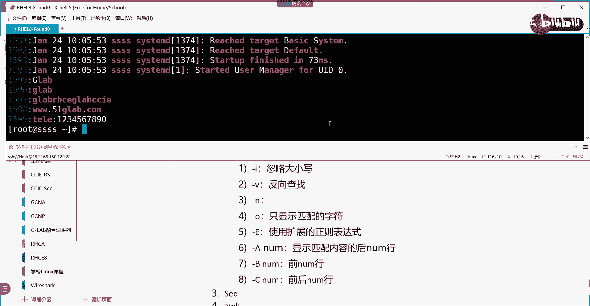

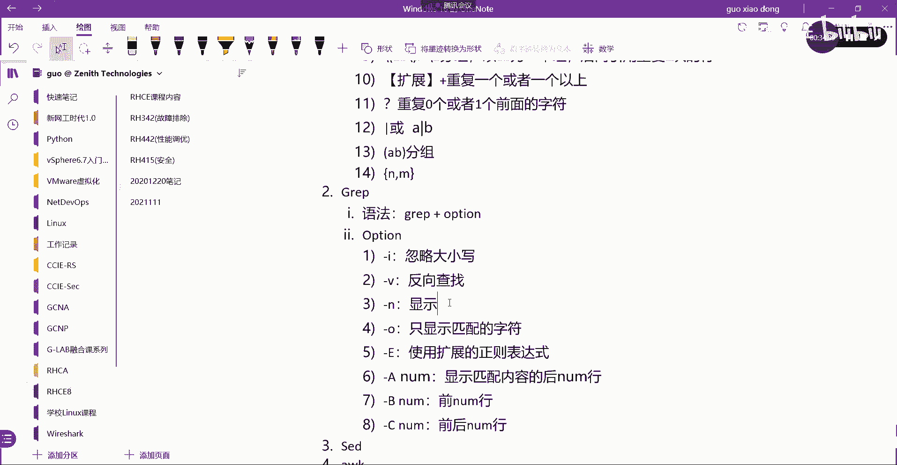

以下是 `grep` 命令的一些常用选项：

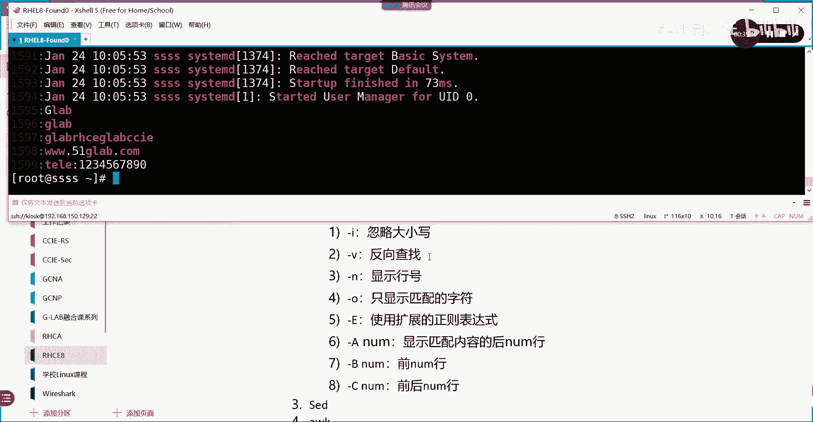

*   `-i`：忽略大小写。
*   `-v`：反向查找，显示不匹配的行。
*   `-o`：只显示匹配到的字符串本身，而非整行。
*   `-E`：使用扩展正则表达式。
*   `-A n`：显示匹配行及其后面的 n 行。
*   `-B n`：显示匹配行及其前面的 n 行。
*   `-C n`：显示匹配行及其前后各 n 行。
*   `-n`：显示匹配行的行号。

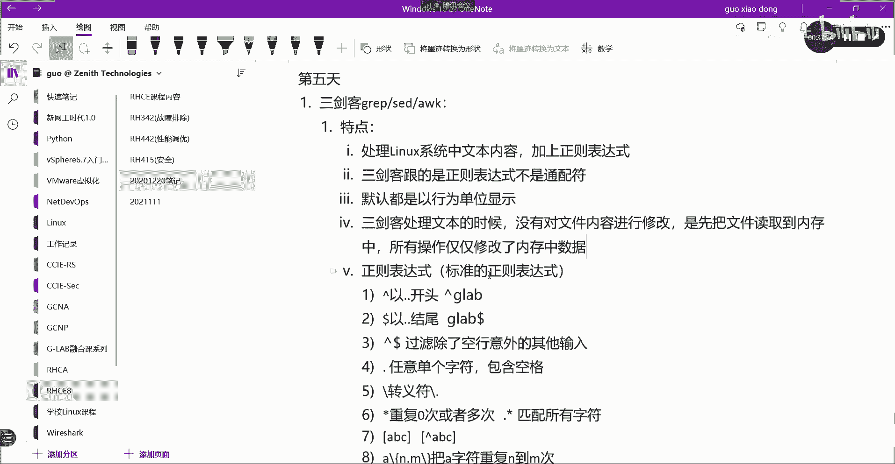

**重要特点**：`grep`（以及后续的 `sed` 和 `awk`）在处理文本时，默认**不会修改原始文件**。它们将文件内容读入内存，在内存中进行匹配和操作，结果仅显示在屏幕上。

**实践示例**：从 `ifconfig` 命令输出中提取 IP 地址。
```bash
ifconfig ens160 | grep -oE ‘([0-9]{1,3}\.){3}[0-9]{1,3}‘
```
这个命令通过管道将 `ifconfig` 的输出传给 `grep`。`-oE` 表示使用扩展正则表达式且只输出匹配部分。正则表达式 `([0-9]{1,3}\.){3}[0-9]{1,3}` 精确匹配了 IPv4 地址的格式。

## sed：流编辑器

接下来我们看看第二个工具——`sed`。`sed` 是一个功能更强大的流编辑器，它可以对文本进行查找、替换、删除、插入等更复杂的操作。

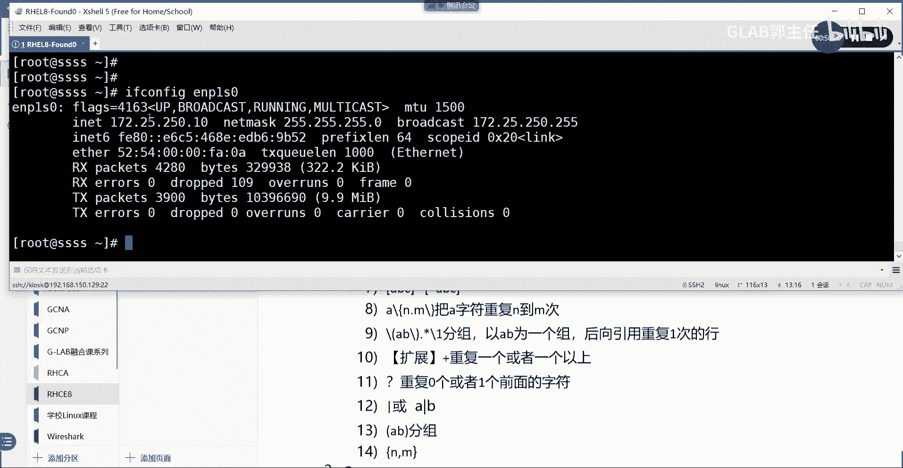

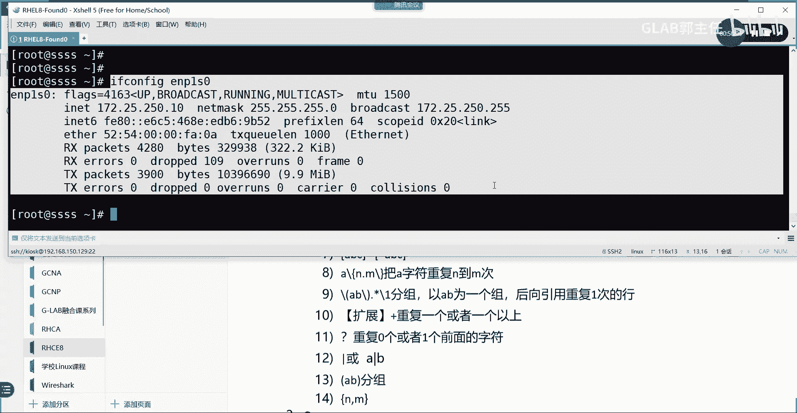

`sed` 是一个**纯文本的行编辑器**，它以行为单位进行处理，这与全屏编辑器 `vi` 不同。它同样默认不修改源文件，所有操作先在内存中进行。若需直接修改文件，必须使用 `-i` 选项。

它的语法结构相对复杂：
```bash
sed [选项] ‘地址 命令‘ 文件名
```

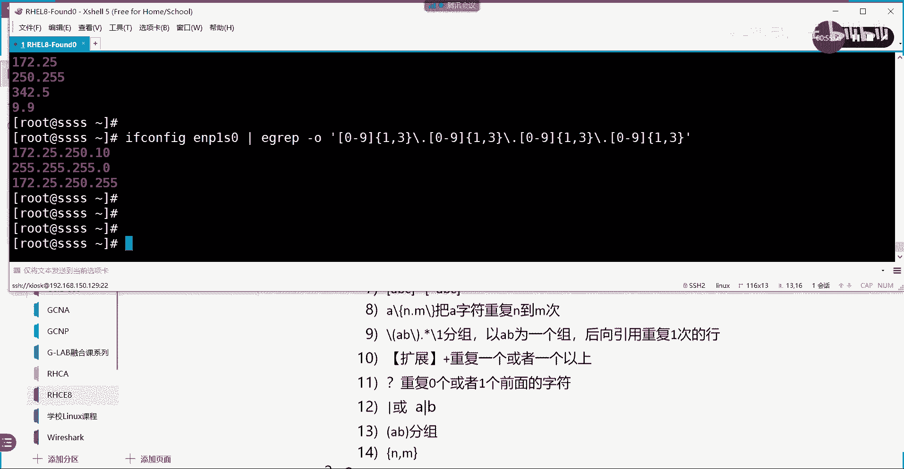

**选项 (`option`)** 部分包括：

*   `-n`：仅显示被处理过的行。
*   `-i`：直接修改源文件（谨慎使用）。
*   `-e`：执行多个脚本命令。
*   `-r`：使用扩展正则表达式。

**地址 (`address`)** 用于指定要处理的行，可以是：

*   `n`：第 n 行。
*   `n,m`：第 n 到 m 行。
*   `/pattern/`：匹配该模式的行。
*   `n,+m`：从第 n 行开始的 m 行。
*   `/pattern1/,/pattern2/`：从匹配 `pattern1` 的行开始，到匹配 `pattern2` 的行结束。

**命令 (`command`)** 是执行的操作，常见的有：

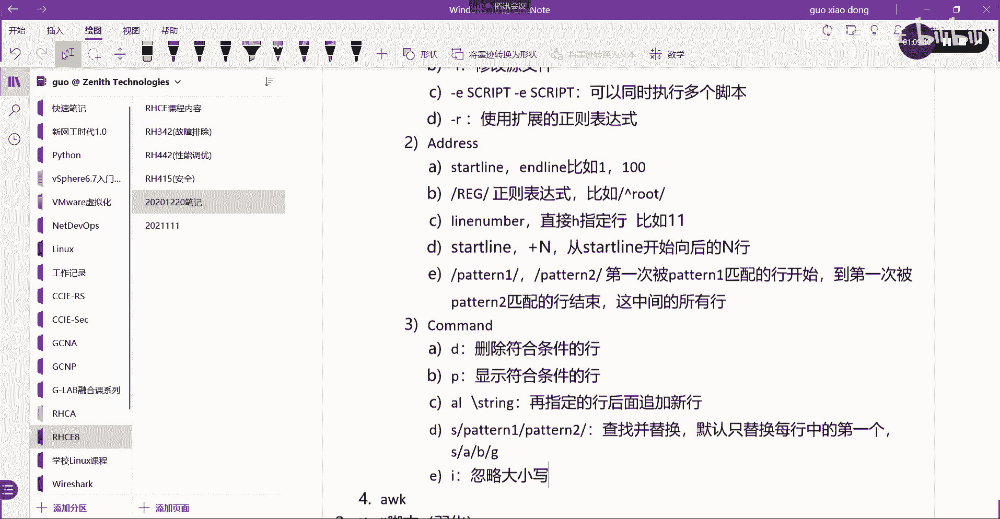

*   `d`：删除符合条件的行。
*   `p`：打印符合条件的行（常与 `-n` 联用）。
*   `a \string`：在指定行后追加新行，内容为 `string`。
*   `i \string`：在指定行前插入新行。
*   `s/pattern1/pattern2/`：查找 `pattern1` 并替换为 `pattern2`。默认只替换每行中第一个匹配项。
*   `s/pattern1/pattern2/g`：全局替换，替换行中所有匹配项。
*   `I`：忽略大小写（用于 `s` 命令）。

**实践示例**：同样是从 `ifconfig` 输出中提取 IP 地址，这次使用 `sed`。
```bash
ifconfig ens160 | sed -n ‘2p‘ | sed ‘s/.*inet //‘ | sed ‘s/ netmask.*//‘
```
这个例子分步演示：
1.  `sed -n ‘2p‘`：仅打印第二行（IP地址所在行）。
2.  `sed ‘s/.*inet //‘`：将行首到“inet ”的部分替换为空，即删除IP前的字符。
3.  `sed ‘s/ netmask.*//‘`：将第一个空格“ netmask”开始到行尾的部分替换为空，即删除IP后的字符。

更高级的一行命令写法，利用了分组和后向引用：
```bash
ifconfig ens160 | sed -rn ‘2s/.*inet (.*) netmask.*/\1/p‘
```
*   `-rn`：使用扩展正则表达式并静默模式。
*   `2s`：针对第二行进行替换操作。
*   `.*inet (.*) netmask.*`：匹配整行，并用 `(.*)` 捕获 IP 地址部分作为一个分组。
*   `\1`：在替换部分引用第一个分组的内容。
*   `p`：打印替换后的行。最终只输出 IP 地址。

## 课程总结

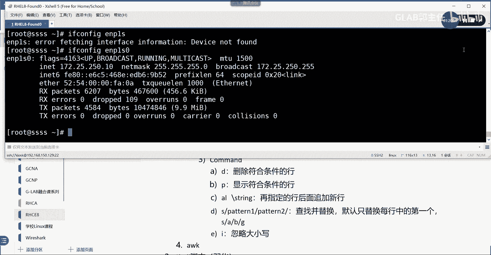

本节课中我们一起学习了 Linux 三剑客的基础知识。我们首先认识了正则表达式，它是三剑客高效工作的基石。然后，我们深入了解了 `grep` 命令，它擅长快速搜索和过滤文本。最后，我们学习了更强大的流编辑器 `sed`，它能够进行复杂的文本转换和编辑。记住，这些工具默认都只输出结果而不修改原文件，这保证了操作的安全性。掌握它们将极大提升你在 Linux 系统下处理文本和日志的效率。