# Ansible 条件与循环：42：条件判断与循环控制

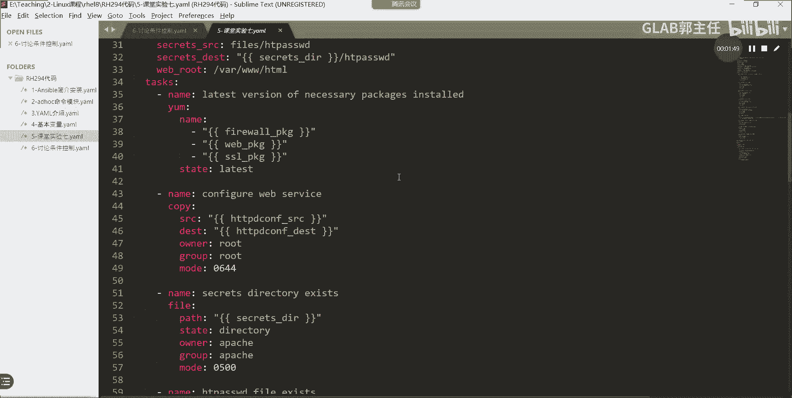

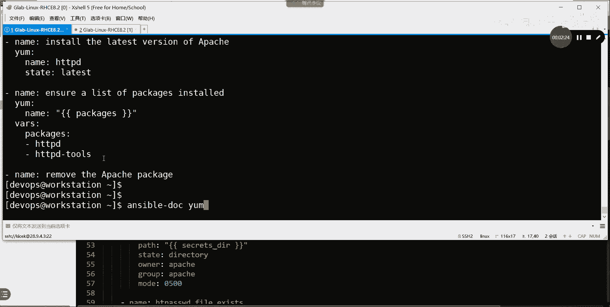

在本节课中，我们将学习 Ansible 中两个核心的控制结构：条件判断与循环。它们能帮助我们编写更智能、更高效、更易于维护的自动化脚本。

上一节我们介绍了 Ansible 的基本模块和变量使用。本节中我们来看看如何通过条件与循环来优化我们的 Playbook。

## 条件判断的必要性

在编写 Playbook 时，我们可能会遇到一个问题：如果某个任务执行失败，后续所有任务都将停止。例如，修改 Nginx 配置文件时，如果配置错误，服务将无法启动，后续任务也无法执行。

为了解决这个问题，我们需要引入条件判断。在执行关键任务（如重启服务）前，先检查前置条件（如配置文件语法）是否满足。

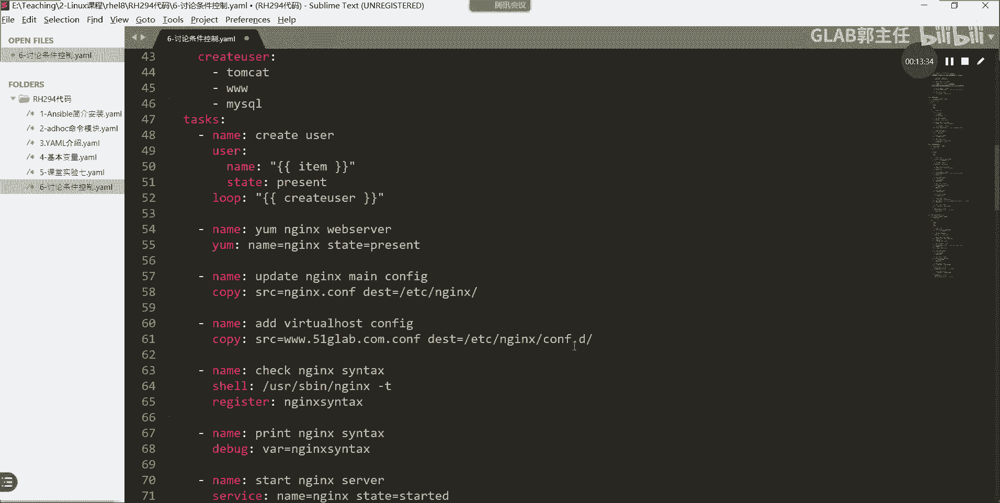

## 循环的必要性

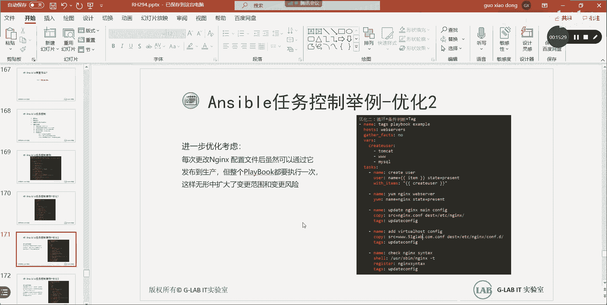

另一个常见需求是批量操作，例如创建多个用户。如果为每个用户都编写一个独立的任务，代码会非常冗长。

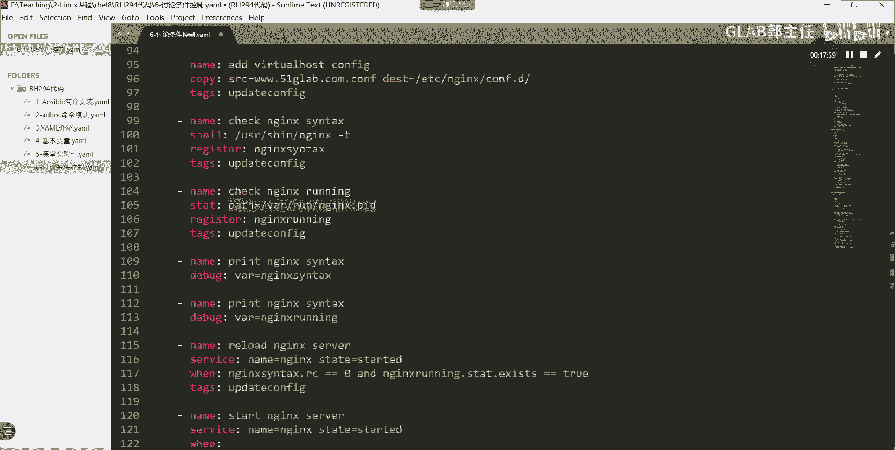

此时，我们可以使用循环。通过将用户列表定义为变量，并在任务中循环调用，可以用简短的代码完成大量重复工作。

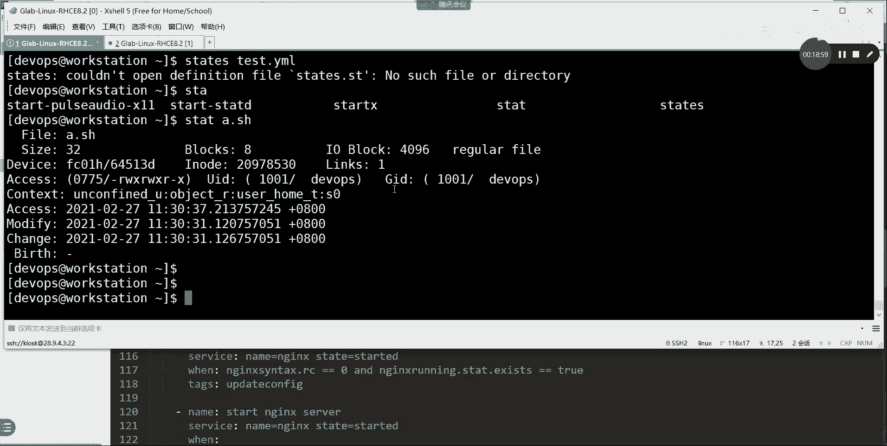

以下是优化 Playbook 的核心方法：

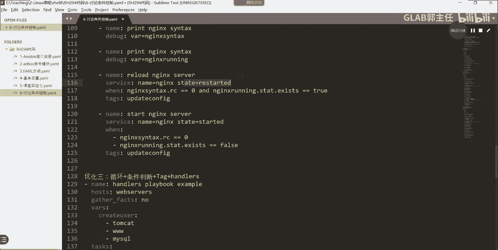

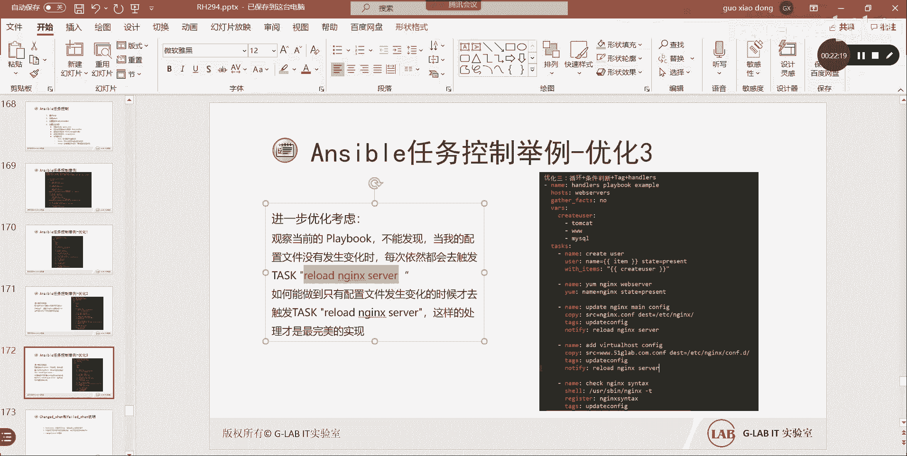

1.  **使用 `when` 进行条件判断**
    *   语法：`when: "条件表达式"`
    *   示例：`when: nginx_test_result.rc == 0` （检查 Nginx 配置测试是否成功）

2.  **使用 `loop` 进行循环迭代**
    *   语法：`loop: "{{ 列表变量 }}"`
    *   示例：`loop: "{{ user_list }}"` （遍历用户列表）

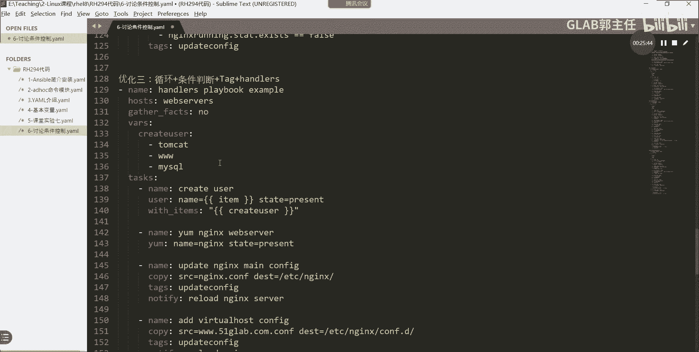


3.  **使用 `tags` 标记任务**
    *   语法：`tags: tag_name`
    *   作用：允许在运行 Playbook 时，通过 `--tags` 参数只执行特定标记的任务，实现更精细的控制。

4.  **使用 `notify` 和 `handlers` 触发处理程序**
    *   `notify` 语法：在任务中声明 `notify: handler_name`
    *   `handlers` 语法：在 Playbook 末尾定义 `handlers` 块，其中包含名为 `handler_name` 的任务。
    *   作用：只有当某个任务**实际发生了改变**（changed）时，才会触发对应的 `handler` 执行。这避免了不必要的服务重启。

## 实践案例一：基础条件与循环

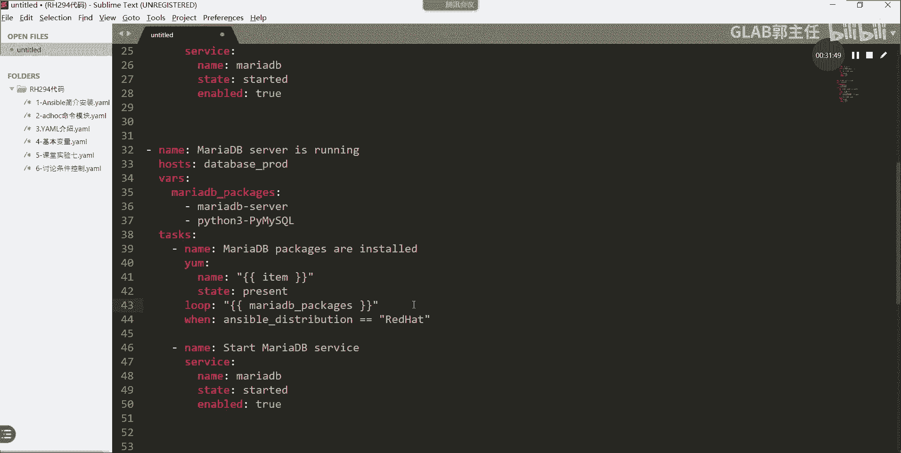

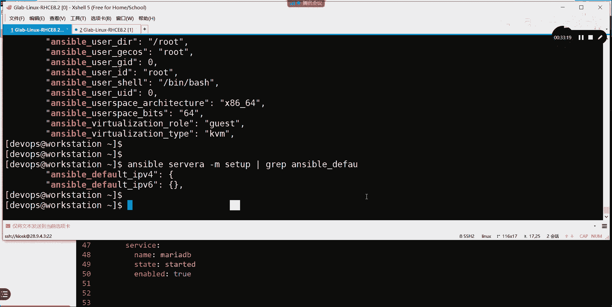

**需求**：编写一个 Playbook，包含两个 Play。
1.  在 `database_dev` 主机组上，循环安装 `mariadb-server` 和 `firewalld` 软件包，并启动 `mariadb` 服务。
2.  在 `database_prod` 主机组上，**仅当**系统发行版为 “RedHat” 时，才安装上述软件包并启动服务。

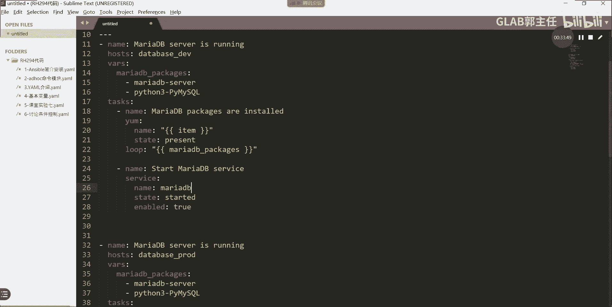

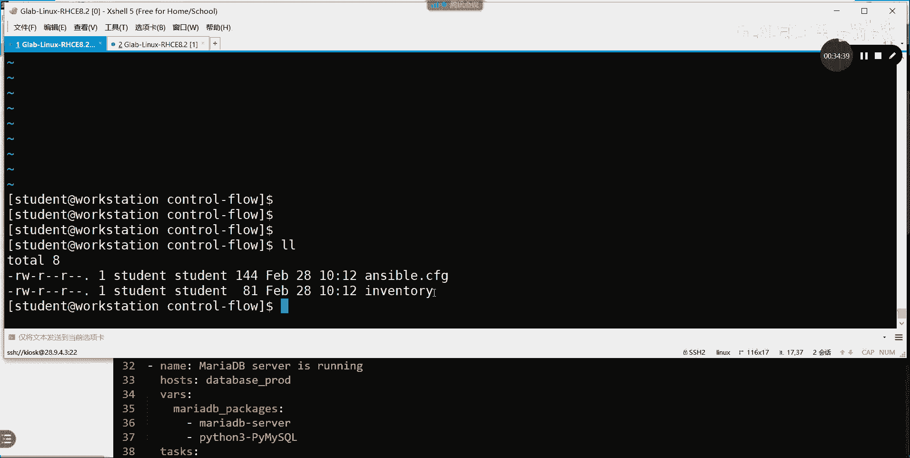

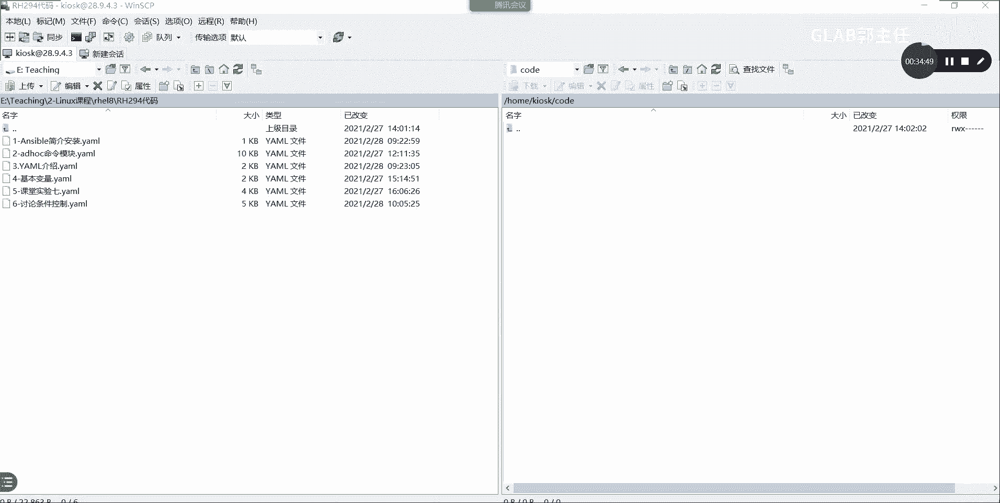

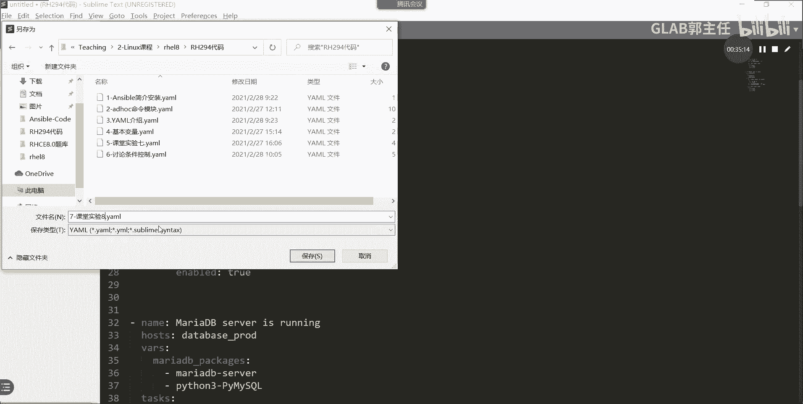

**关键点分析**：
*   Play 1 使用 `loop` 循环安装多个包。
*   Play 2 使用 `when` 条件判断，条件中使用了 Ansible 事实变量 `ansible_distribution`。

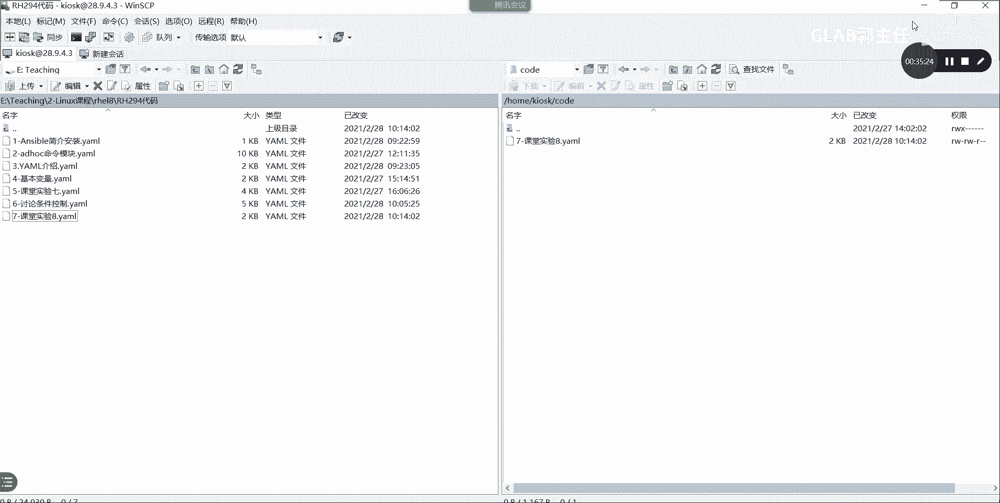

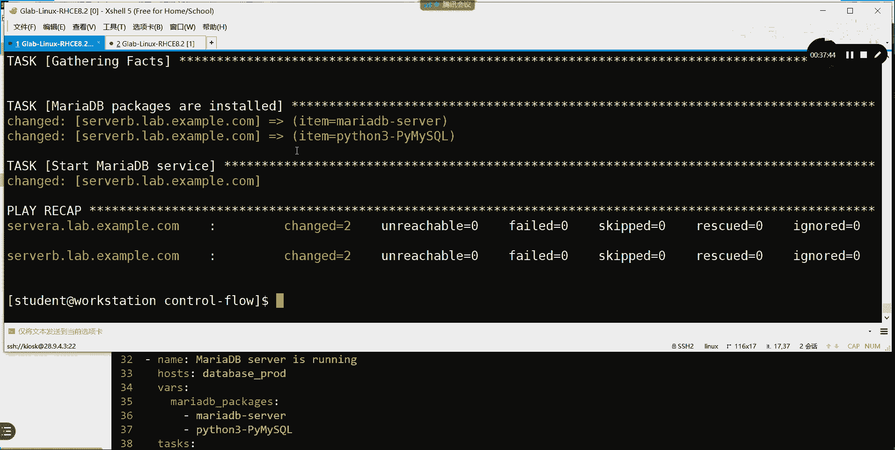

**示例代码**：
```yaml
---
- name: 为开发数据库服务器安装软件
  hosts: database_dev
  vars:
    db_packages:
      - mariadb-server
      - firewalld
  tasks:
    - name: 安装 MariaDB 软件包
      yum:
        name: "{{ item }}"
        state: present
      loop: "{{ db_packages }}"
    - name: 启动并启用 MariaDB 服务
      service:
        name: mariadb
        state: started
        enabled: yes

- name: 为生产数据库服务器安装软件（仅限 RedHat）
  hosts: database_prod
  vars:
    db_packages:
      - mariadb-server
      - firewalld
  tasks:
    - name: 安装 MariaDB 软件包（条件判断）
      yum:
        name: "{{ item }}"
        state: present
      loop: "{{ db_packages }}"
      when: ansible_distribution == "RedHat"
    - name: 启动并启用 MariaDB 服务
      service:
        name: mariadb
        state: started
        enabled: yes
```

## 实践案例二：使用 Handlers

**需求**：编写一个 Playbook 来配置 MariaDB。
1.  安装 MariaDB 软件包。如果安装任务被执行（即系统原本没有安装），则**必须**紧接着设置数据库 root 密码。
2.  确保 MariaDB 服务运行。
3.  从远程 URL 下载一个配置文件到服务器。只要此配置文件被下载或更新，就**必须**重启 MariaDB 服务使其生效。

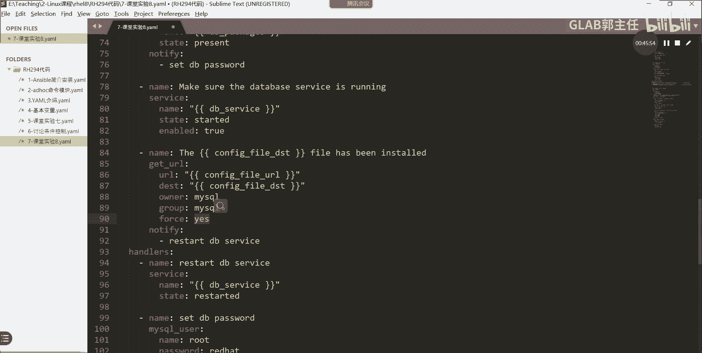

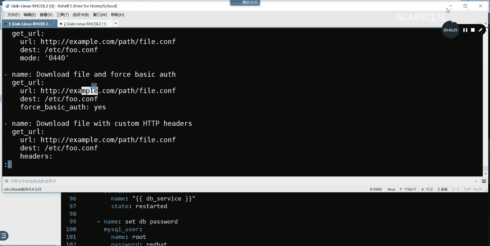

**关键点分析**：
*   任务1（安装包）使用 `notify` 触发名为 “set password” 的 handler。
*   任务3（下载配置）使用 `notify` 触发名为 “restart db” 的 handler。
*   所有 handlers 在 `handlers` 部分集中定义。

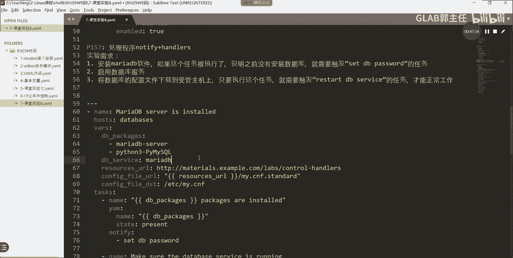

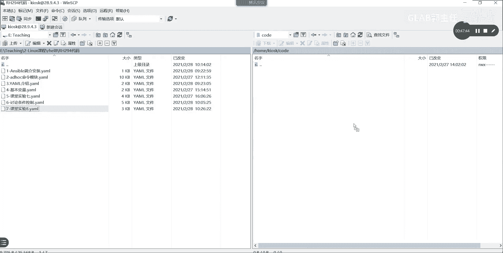

**示例代码**：
```yaml
---
- name: 配置 MariaDB 数据库
  hosts: database
  vars:
    db_packages:
      - mariadb-server
      - firewalld
    db_service: mariadb
    config_url: http://example.com/my.cnf
    config_local_path: /etc/my.cnf.d/custom.cnf
  tasks:
    - name: 安装 MariaDB 软件包
      yum:
        name: "{{ db_packages }}"
        state: present
      notify: set password

    - name: 确保 MariaDB 服务正在运行
      service:
        name: "{{ db_service }}"
        state: started
        enabled: yes

    - name: 下载 MariaDB 配置文件
      get_url:
        url: "{{ config_url }}"
        dest: "{{ config_local_path }}"
        force: yes
      notify: restart db

  handlers:
    - name: set password
      mysql_user:
        name: root
        password: redhat
        state: present

    - name: restart db
      service:
        name: "{{ db_service }}"
        state: restarted
```

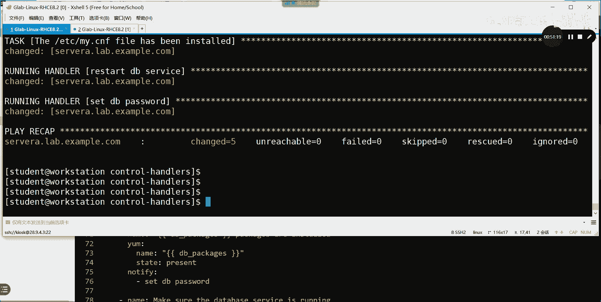

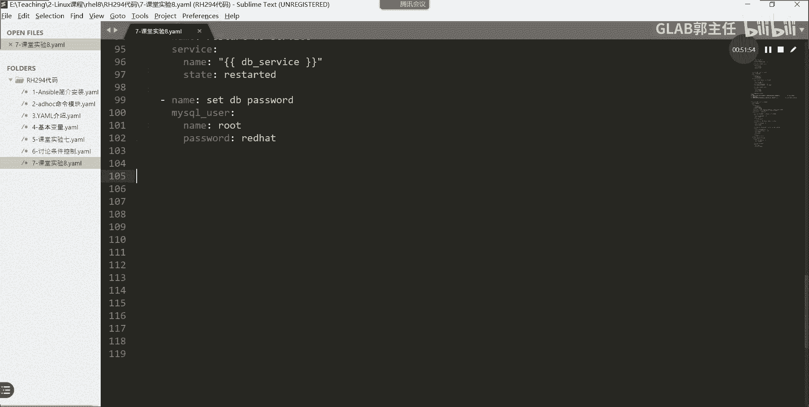

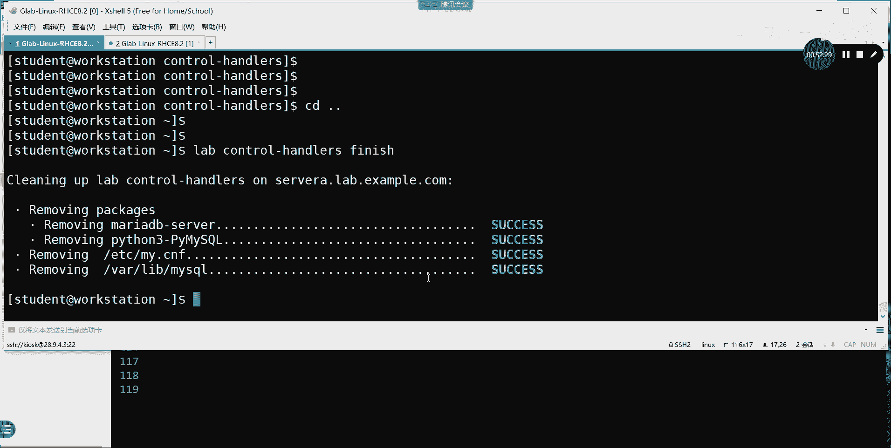

本节课中我们一起学习了 Ansible 的条件判断 (`when`)、循环 (`loop`)、任务标记 (`tags`) 以及处理程序 (`notify` & `handlers`)。这些控制结构是编写强大、灵活、高效 Ansible Playbook 的基石，请务必理解其应用场景并多加练习。