# Ansible角色讲解：P1：Ansible角色概念与分类

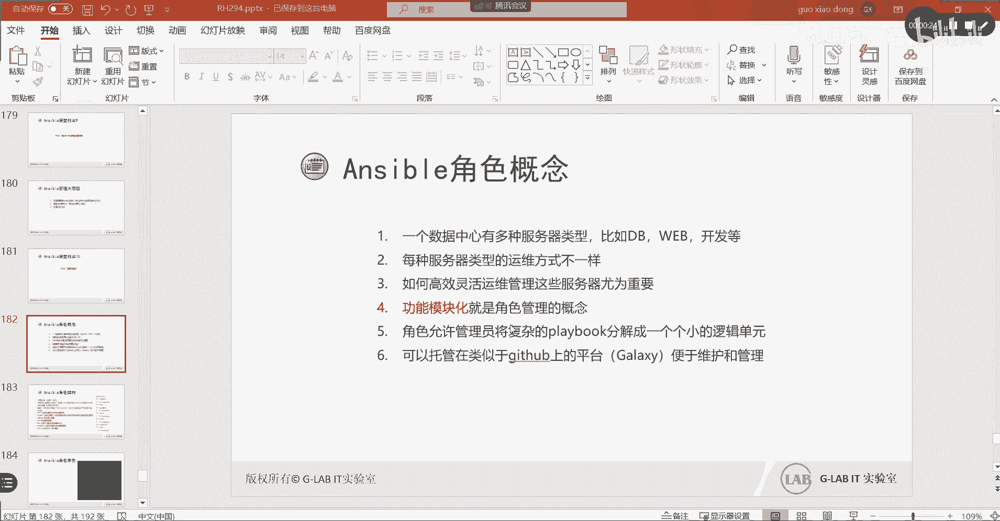

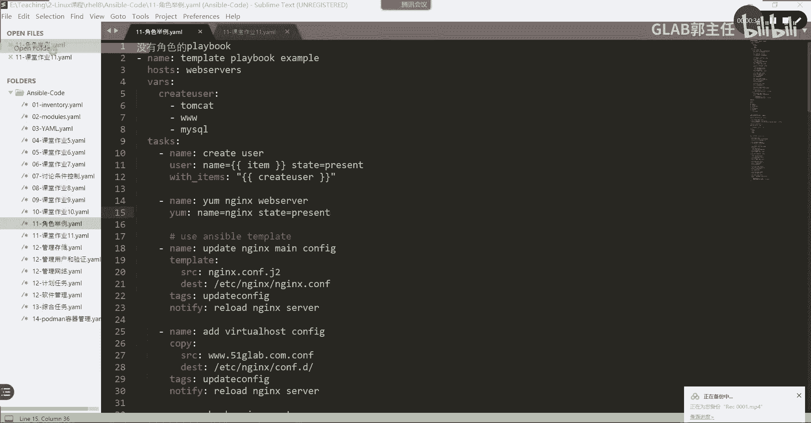

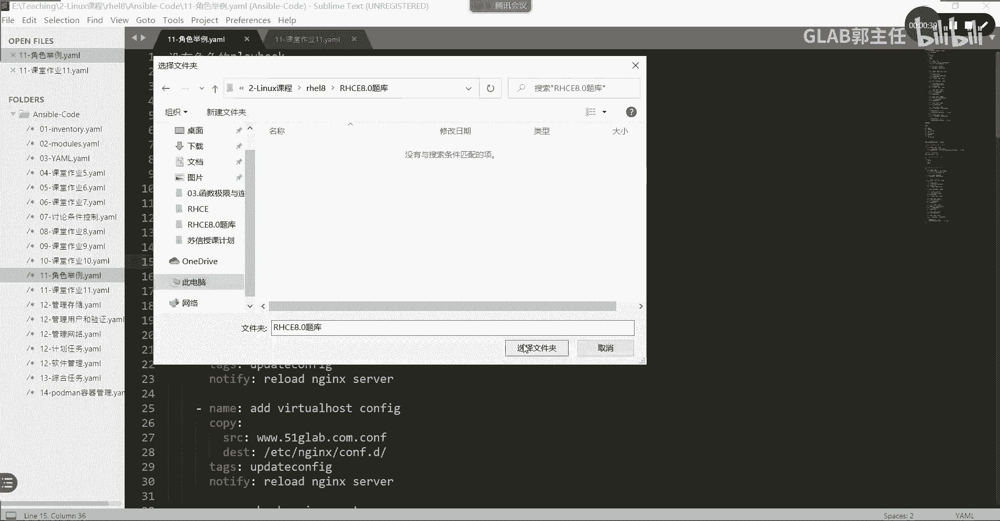

在本节课中，我们将要学习Ansible角色的核心概念、分类以及它们如何帮助我们高效地组织和管理复杂的自动化任务。通过理解角色，你可以将Playbook模块化，实现代码的复用和共享。

## 概述

上一节我们回顾了RHCE考试中涉及的主要知识点，本节中我们来看看Ansible中一个非常重要的概念——角色。角色是Ansible实现功能模块化和代码复用的核心机制。

## 角色的概念与应用背景

一个数据中心通常包含多种类型的服务器，例如数据库服务器和Web服务器。部署不同类型的服务器需要执行不同的任务，例如安装特定的软件包、配置服务和设置用户账户。

如何高效地统一管理这些不同类型的服务器至关重要。功能模块化就是角色管理的核心思想。角色允许管理员将复杂的Playbook拆分成一个个小的、逻辑独立的单元。

这些角色可以托管在类似于GitHub的公共平台——Ansible Galaxy上，供所有人共享和复用。如果你需要部署某个特定的服务，可以直接在Galaxy上搜索并下载对应的角色，经过简单修改即可使用。

**一句话总结**：角色实现了功能的模块化，它将一个复杂的Playbook分解，并将整个模块打包共享，便于维护和协作。

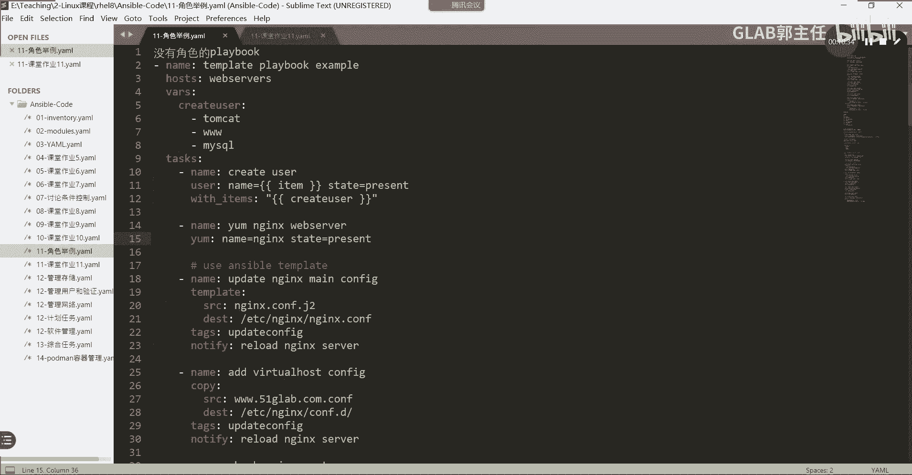

## 角色的目录结构

从表面上看，一个角色就是一个具有特定名称的目录。例如，一个名为 `webserver` 的角色，其本质就是一个名为 `webserver` 的目录。

在这个角色目录下，包含一系列具有特定功能的子目录。每个子目录通常都包含一个 `main.yml` 文件，用于定义该部分的功能。

以下是角色目录的标准结构及其作用：

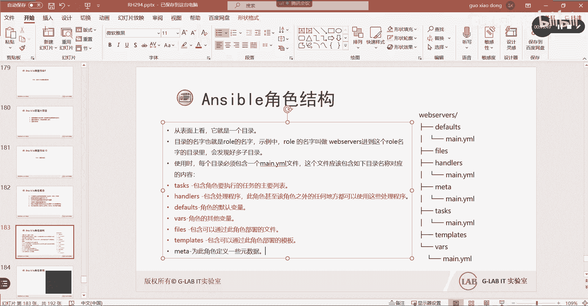

*   **tasks/**：存放角色要执行的主要任务列表，即主任务逻辑，定义在 `tasks/main.yml` 中。
*   **handlers/**：存放被 `notify` 语句触发后需要执行的处理程序，定义在 `handlers/main.yml` 中。
*   **defaults/**：存放角色的默认变量，这些变量的优先级最低。
*   **vars/**：存放角色的其他变量，优先级高于 `defaults/` 中的变量。
*   **files/**：存放需要复制到受控节点的静态文件。
*   **templates/**：存放Jinja2模板文件。
*   **meta/**：存放角色的元数据信息，例如作者、许可证、依赖关系等（此部分非核心）。

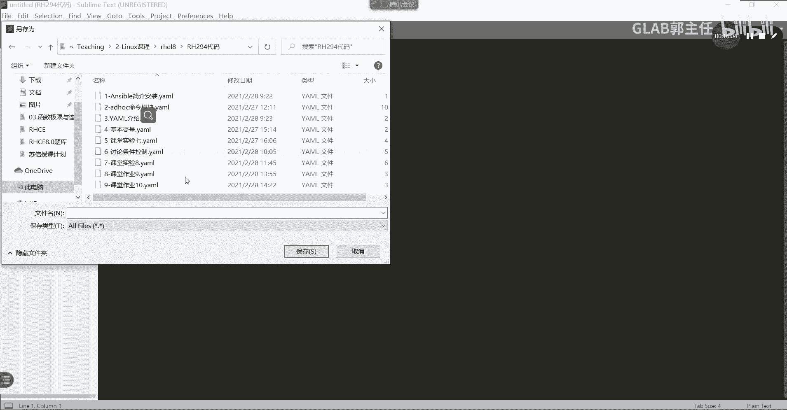

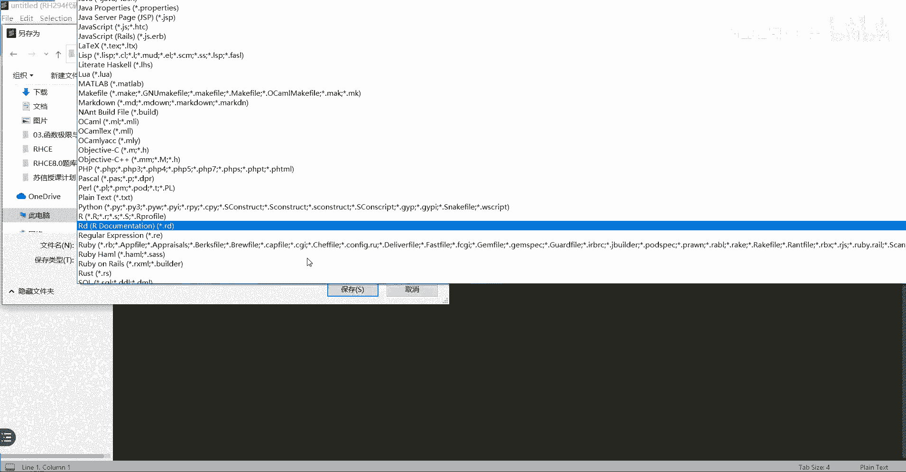

通过这种结构，一个完整的Playbook被拆散并组织到不同的子目录中，使得代码结构清晰，易于维护。

## 角色使用示例：对比与调用

为了理解角色的优势，我们首先看一个没有使用角色的复杂Playbook示例。这个Playbook可能包含创建用户、安装软件包、配置模板、触发处理程序以及复杂的逻辑控制。

当使用角色来实现相同需求时，我们会创建一个角色目录（例如 `nginx`），然后根据功能将上述Playbook的内容拆分并放入对应的子目录中：
*   `files/` 目录存放要分发的配置文件。
*   `handlers/` 目录存放重启服务等处理任务。
*   `vars/` 目录存放变量定义。
*   `templates/` 目录存放Jinja2模板文件。
*   `tasks/main.yml` 则包含主要的任务流程。

角色定义完成后，如何调用它呢？调用方式非常简单。你只需要在一个新的Playbook文件中，通过 `roles` 关键字来引用它。

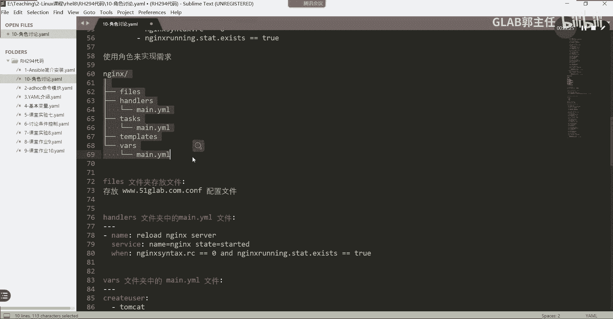

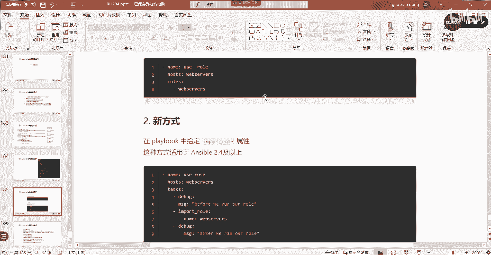

**调用角色的Playbook示例**：
```yaml
---
- name: Configure webserver
  hosts: webservers
  roles:
    - nginx
```
执行这个Playbook时，Ansible会自动加载 `nginx` 角色目录下的所有子目录和YAML脚本。其他用户只需下载这个角色，并根据需要修改 `files/` 或 `templates/` 目录下的具体内容，而无需改动核心的任务逻辑，这极大地提升了运维效率和代码的可维护性。

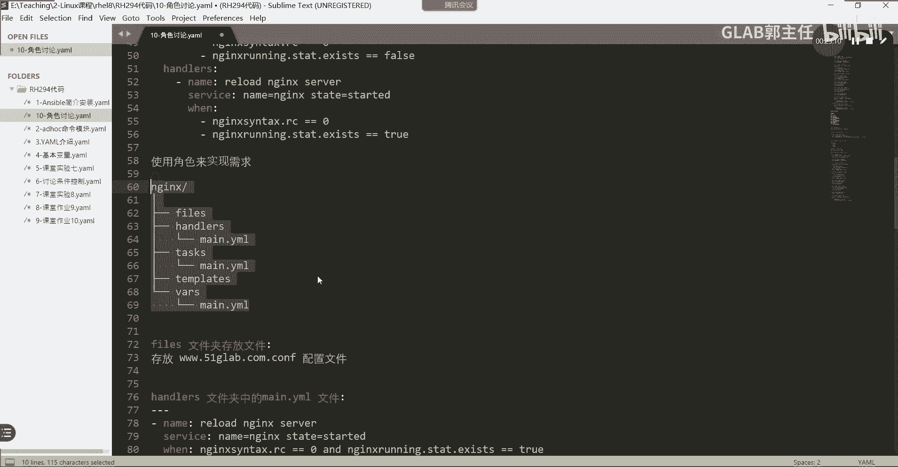

## Ansible Galaxy

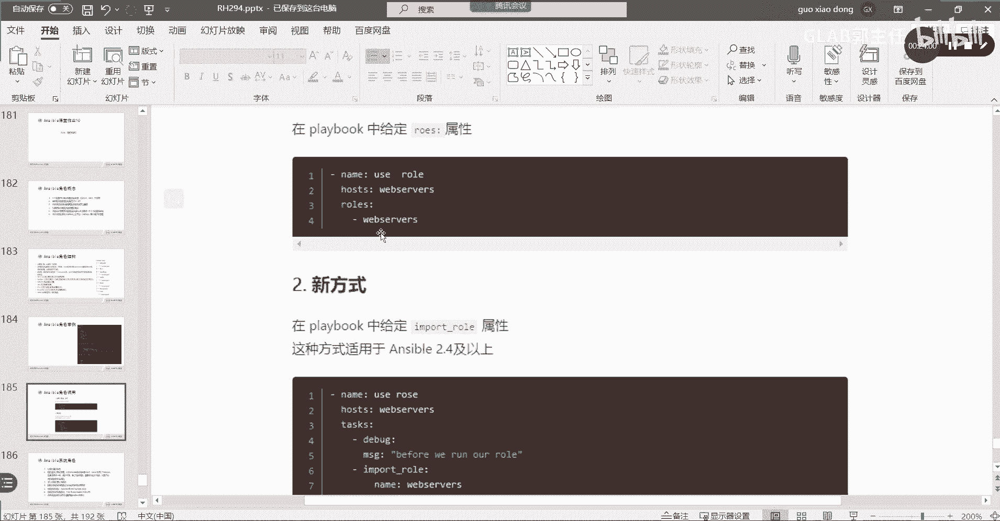

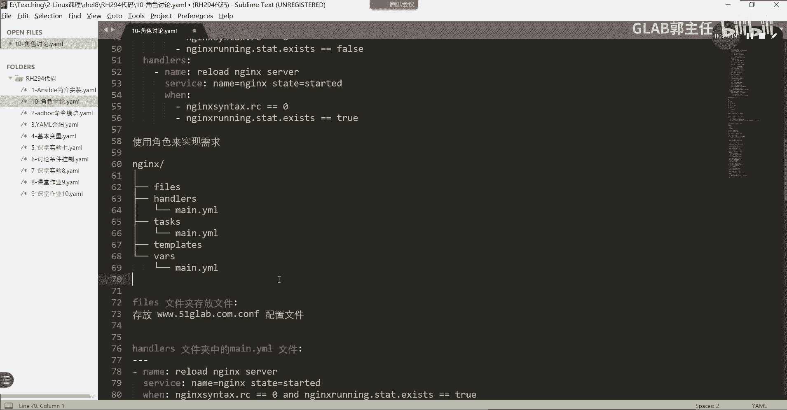

Ansible Galaxy (`galaxy.ansible.com`) 是一个类似于GitHub的公共平台，专门用于共享Ansible角色。你可以在这里搜索、下载社区贡献的各种角色，例如配置Apache、管理Cisco网络设备等。

所有与角色相关的操作，如创建、下载、上传、搜索等，都可以通过 `ansible-galaxy` 这个命令行工具来完成。

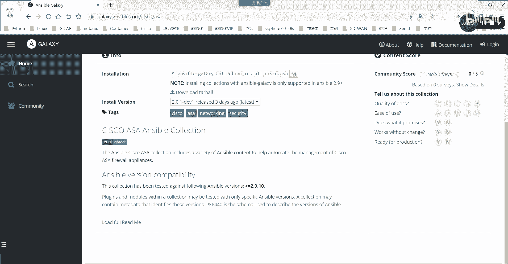

**常用 `ansible-galaxy` 命令**：
*   `ansible-galaxy search <role_name>`：在Galaxy上搜索角色。
*   `ansible-galaxy install <role_name>`：从Galaxy下载并安装角色。
*   `ansible-galaxy list`：列出已安装的角色。
*   `ansible-galaxy init <role_name>`：初始化并创建一个新角色的目录结构。

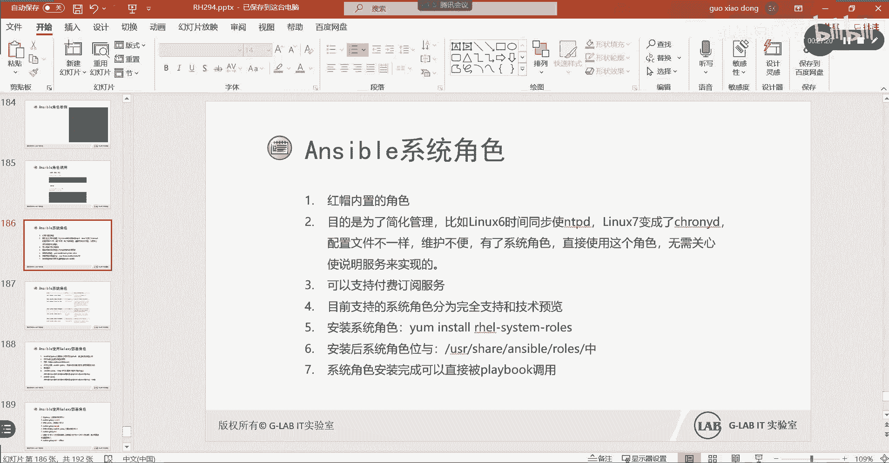

## 角色的分类：普通角色与系统角色

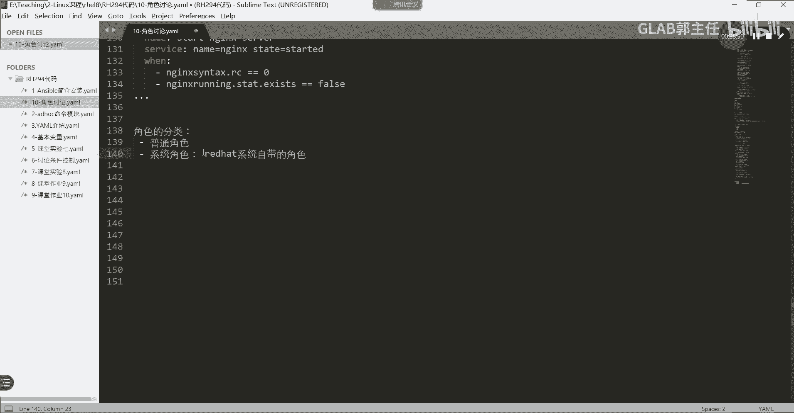

角色主要分为两类：普通角色和系统角色。

**普通角色**：由用户自行创建和定义的角色，例如我们上面创建的 `nginx` 角色。

**系统角色**：由红帽（Red Hat）官方提供并维护的角色。这些角色随系统软件包发布，安装后即可使用，无需用户从头定义。它们旨在简化通用系统任务的管理，并保证在不同RHEL版本间行为的一致性。

当前主要的红帽系统角色包括：
1.  **rhel-system-roles.kdump**：用于内核崩溃转储。
2.  **rhel-system-roles.network**：**非常重要**，用于网络配置（如IP地址修改）。这是官方推荐的网络配置方式。
3.  **rhel-system-roles.selinux**：用于管理SELinux策略和状态。
4.  **rhel-system-roles.timesync**：**RHCE考试涉及**，用于系统时间同步（自动适配chrony或ntpd）。
5.  其他如 `postfix`, `firewall`, `tuned` 等角色处于技术预览或开发阶段。

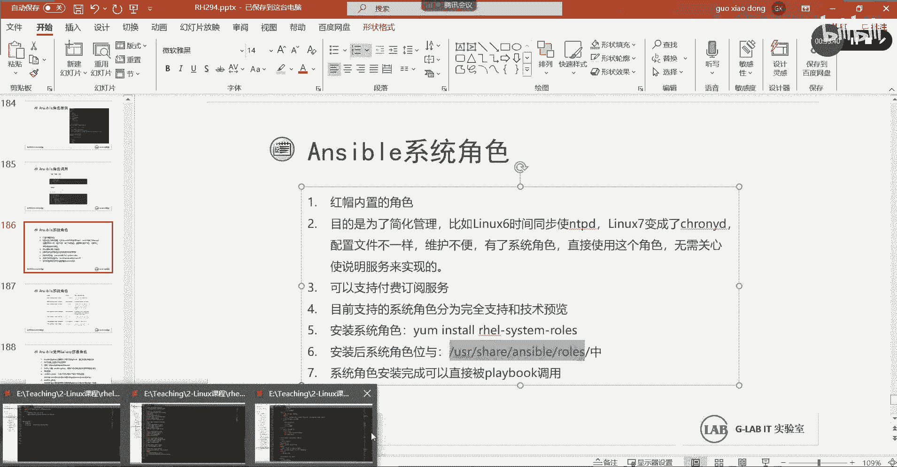

## 系统角色的安装与使用

系统角色需要通过YUM包管理器安装：
```bash
yum install rhel-system-roles
```
安装后，系统角色的默认路径是 `/usr/share/ansible/roles`。

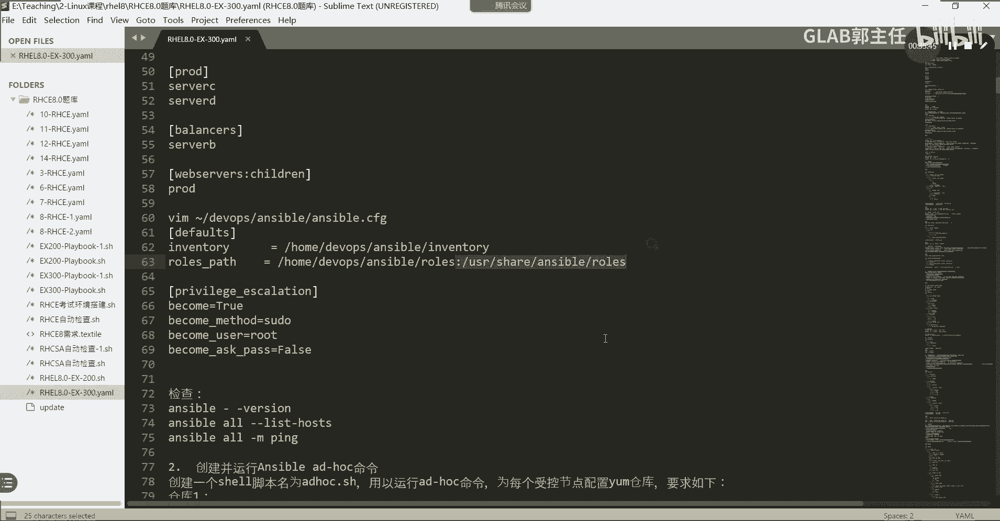

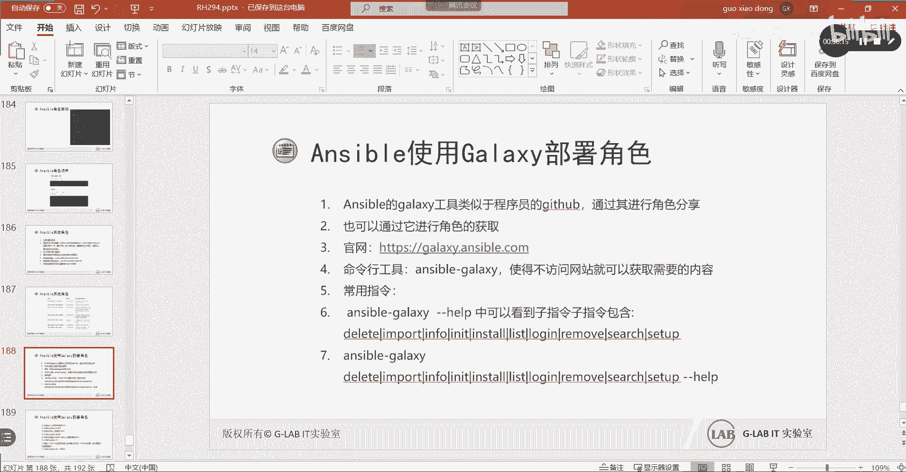

**重要配置**：在Ansible 2.8及更早版本中，必须在 `ansible.cfg` 配置文件中通过 `roles_path` 参数指定系统角色的路径，Ansible才能找到并使用它们。通常需要同时指定普通角色路径和系统角色路径。

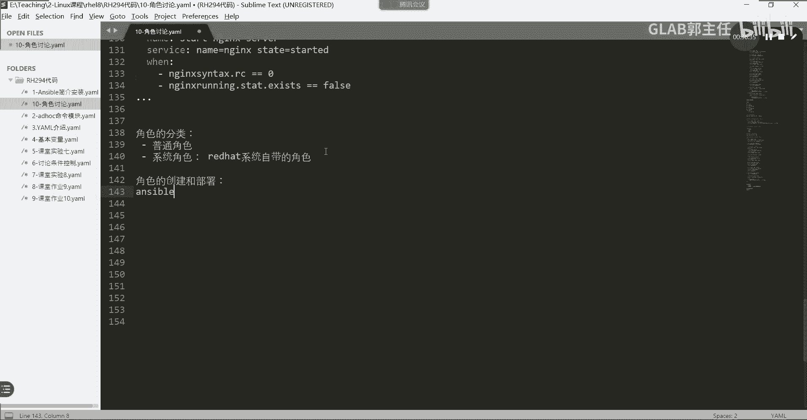

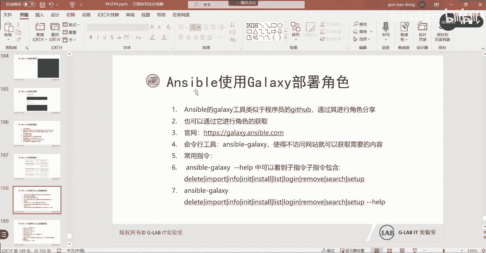

**ansible.cfg 配置示例**：
```
[defaults]
roles_path = ~/.ansible/roles:/usr/share/ansible/roles
```
从Ansible 2.9开始，系统角色路径无需手动指定，Ansible会自动识别。

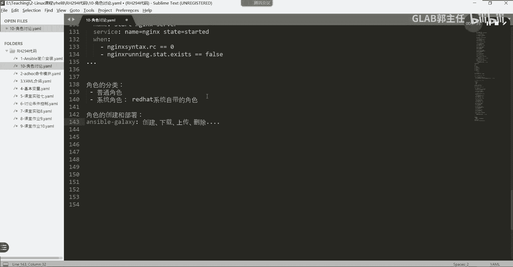

系统角色安装并配置好路径后，就可以像普通角色一样，在Playbook的 `roles` 关键字下调用。

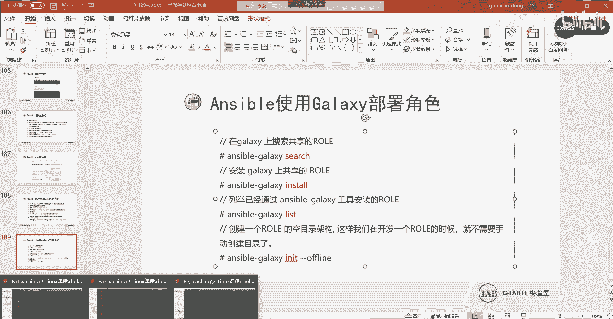

## 总结

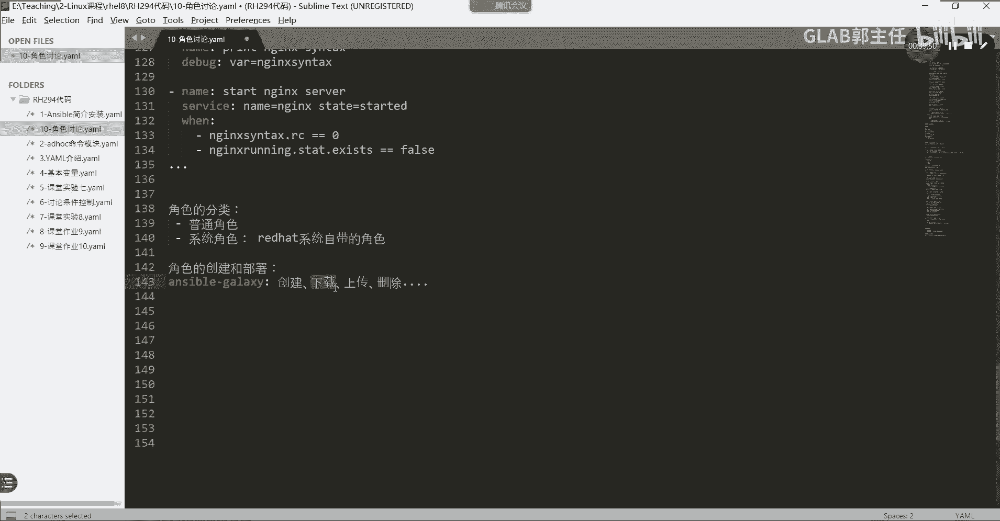

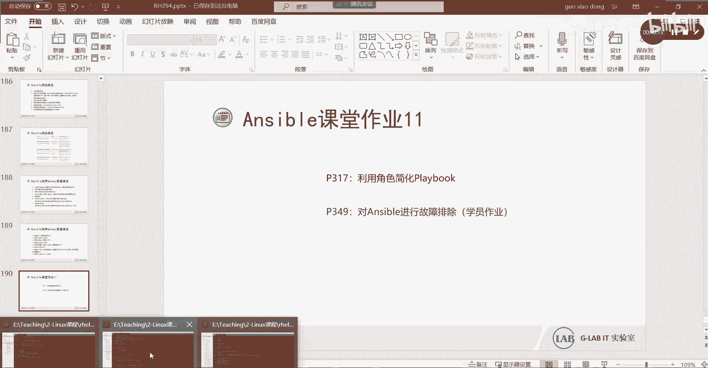

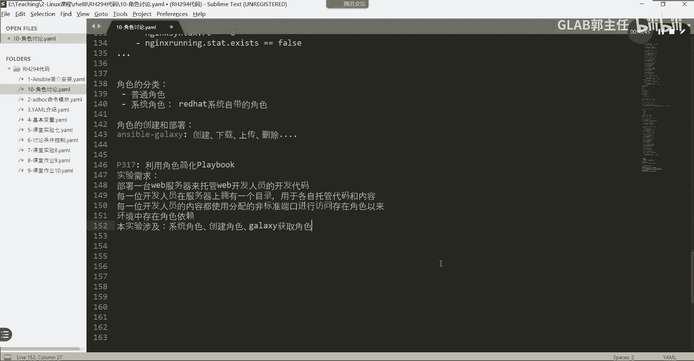

本节课中我们一起学习了Ansible角色的核心知识。我们首先了解了角色产生的背景及其模块化、可复用的核心价值。接着，我们深入探讨了角色的标准目录结构，并通过示例对比了使用角色前后的Playbook差异。我们还介绍了共享角色的公共平台Ansible Galaxy及其命令行工具。最后，我们区分了用户自定义的普通角色和红帽官方提供的系统角色，并讲解了系统角色的安装、配置与调用方法。掌握角色是编写高效、可维护Ansible自动化代码的关键一步。