# Ansible 排错教程：1：Ansible Playbook 排错思路 🐞

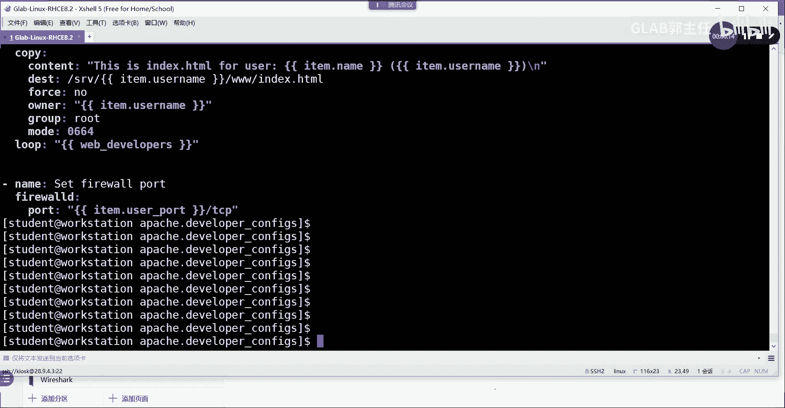

在本节课中，我们将学习如何系统地排查 Ansible Playbook 执行过程中遇到的问题。我们将问题分为两大类：Playbook 本身的问题和受控主机上的问题，并介绍相应的检查方法和工具。

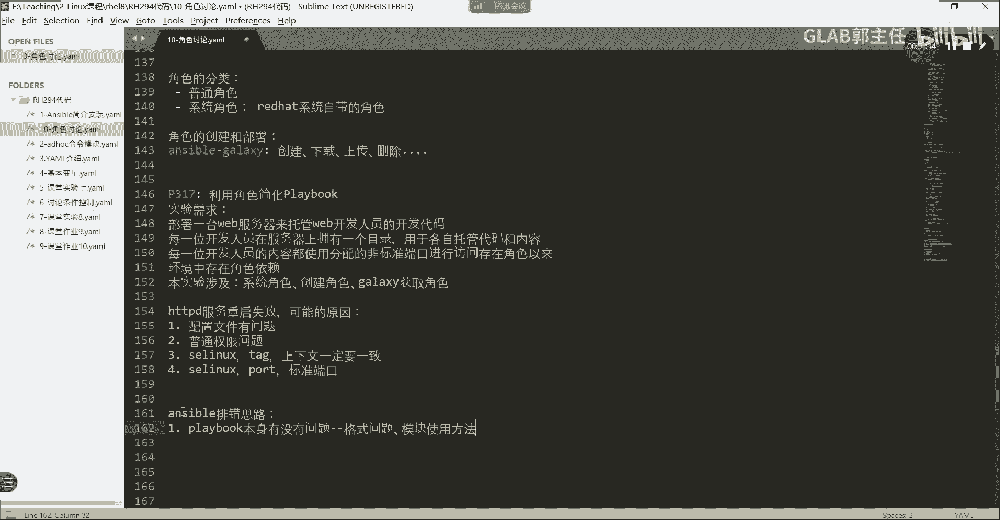

---

上一节我们介绍了课程概述，本节中我们来看看 Ansible 排错的核心思路。总的来说，问题主要来源于两个方面。

## Playbook 本身的问题

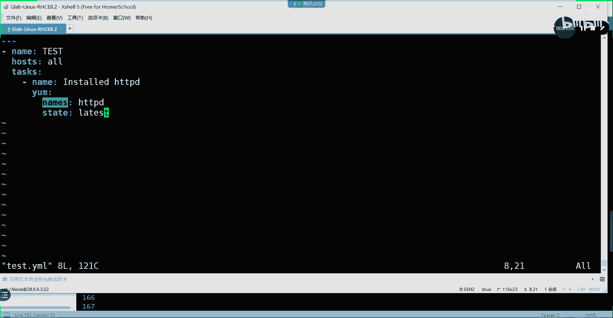

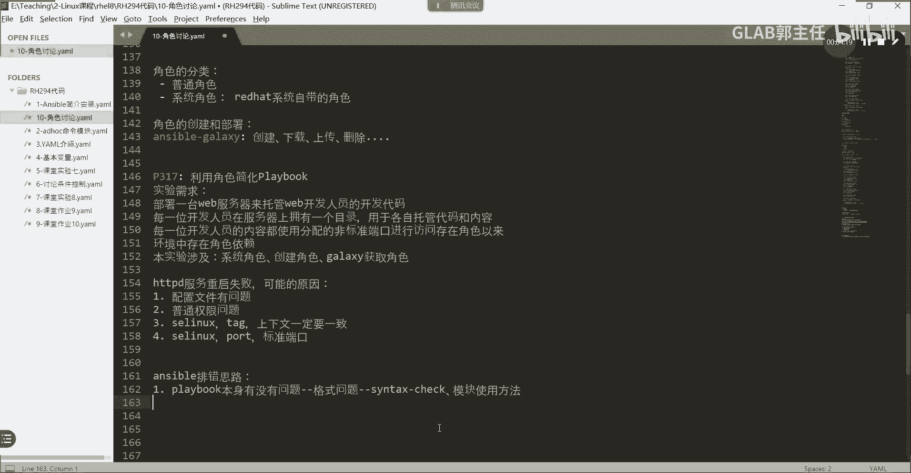

首先，我们需要检查 Playbook 脚本本身是否存在问题。这包括格式规范和模块使用是否正确。

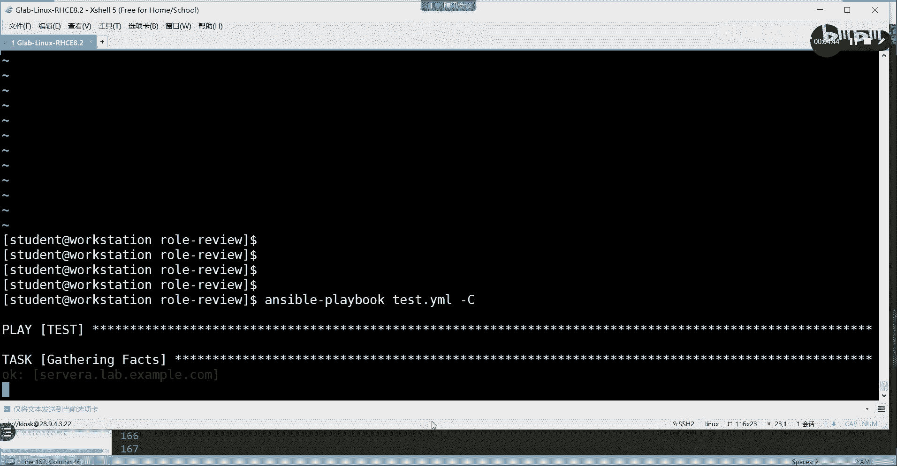

以下是检查 Playbook 本身问题的两个主要方面：

1.  **格式问题**：例如缩进不符合 YAML 规范。可以使用 `--syntax-check` 参数进行语法检查。
    ```bash
    ansible-playbook test.yml --syntax-check
    ```

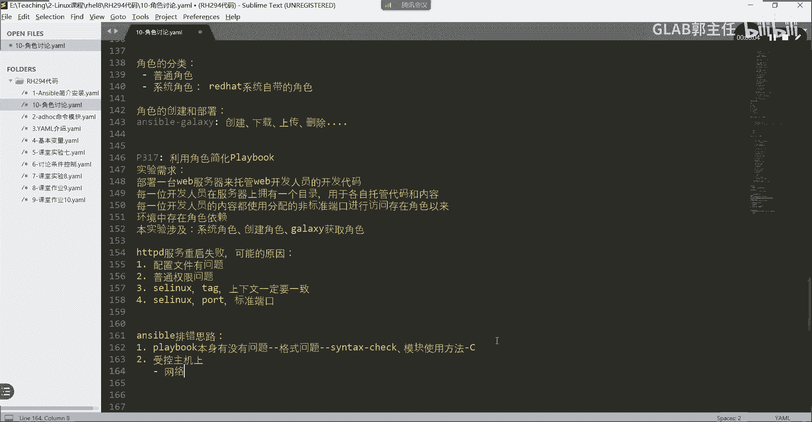

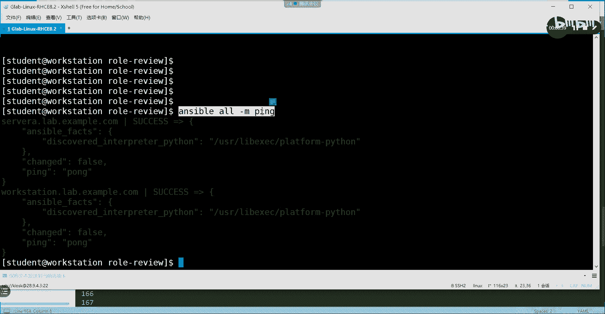

2.  **模块使用问题**：例如使用了错误的模块参数名。这无法通过语法检查发现，需要使用 `-C`（或 `--check`）参数进行模拟运行来检查。
    ```bash
    ansible-playbook test.yml -C
    ```
    这个命令会在内存中模拟运行 Playbook，检查任务逻辑和模块调用是否正确，但不会在受控主机上实际执行任何更改。

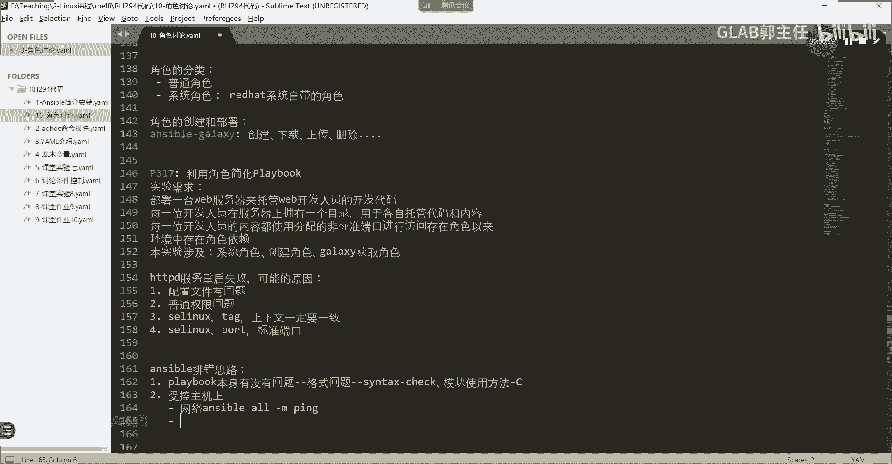

---

上一节我们介绍了如何检查 Playbook 本身的问题，本节中我们来看看当 Playbook 本身无误后，在受控主机上可能遇到的障碍。

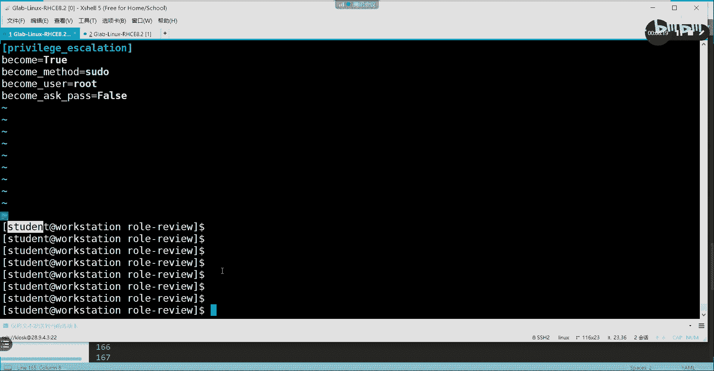

## 受控主机上的问题

当 Playbook 本身没有问题后，Ansible 需要通过网络将指令下发到受控主机并执行。这个阶段常见的问题如下：

以下是受控主机上需要排查的几个关键点：

1.  **网络连通性**：控制节点必须能够通过网络访问受控主机。可以使用 `ansible` 命令的 `ping` 模块进行测试。
    ```bash
    ansible all -m ping
    ```
    如果 ping 不通，则需要检查网络配置、防火墙或 SSH 服务状态。

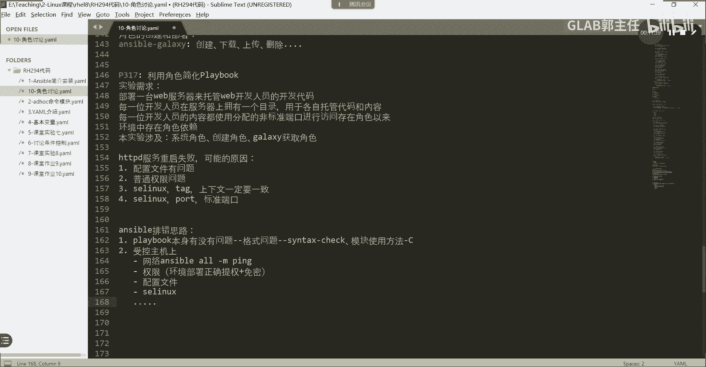

2.  **权限问题**：Ansible 通常使用普通用户连接受控主机，但执行某些任务（如安装软件）需要 `sudo` 权限。需要确保：
    *   在 Ansible 配置或 Playbook 中正确配置了提权方式（如 `become: yes`）。
    *   该用户在受控主机的 `sudoers` 配置中拥有相应的权限（例如，用户属于 `wheel` 组且该组被授权）。


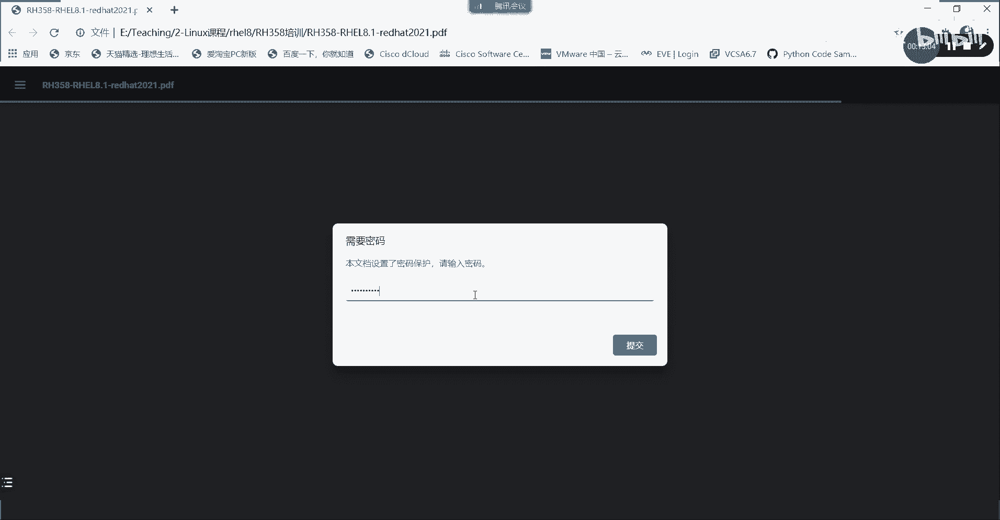

3.  **目标服务或配置问题**：Playbook 执行失败，可能是因为要部署的服务本身有复杂的依赖或配置要求。例如，部署 Nginx 时，如果对 Nginx 的配置文件语法、服务启动流程不了解，即使 Ansible 模块使用正确，任务也可能失败。**Ansible 是一个自动化工具，但掌握目标服务本身的原理至关重要。**

4.  **其他系统级问题**：例如 SELinux 策略限制、磁盘空间不足、软件源配置错误等，都可能导致 Playbook 执行失败。这些问题需要根据具体的错误信息，在受控主机上进行排查。

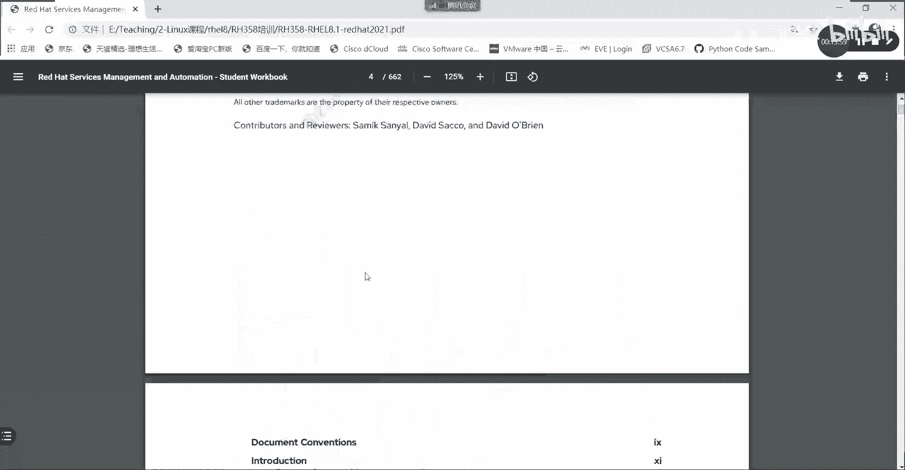

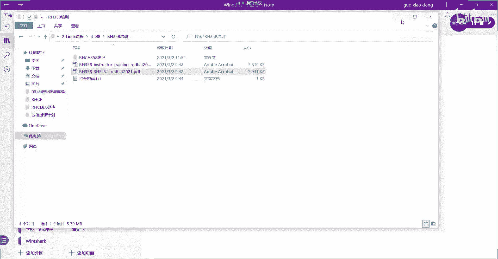

---

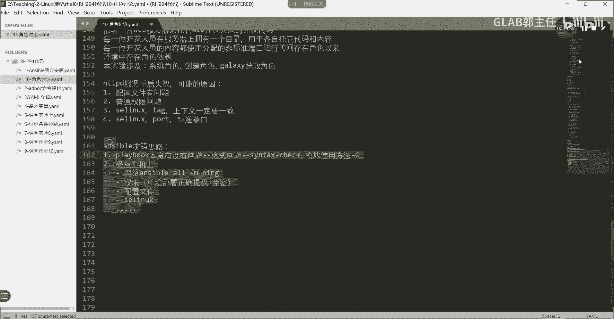

本节课中我们一起学习了 Ansible Playbook 的排错思路。我们首先需要检查 Playbook 本身的格式和模块使用（使用 `--syntax-check` 和 `-C`），然后排查受控主机上的网络、权限以及目标服务本身的问题。记住，Ansible 是强大的自动化工具，但深入理解你要管理的服务和系统，才是写出健壮 Playbook 的关键。