# Ansible入门教程：第39章：Ansible变量 🚀

在本章中，我们将学习Ansible中变量的概念、类型以及如何定义和使用它们。变量是编写复杂、灵活Playbook的关键，能够帮助我们避免硬编码，使自动化脚本更具通用性和可维护性。

## 概述 📋

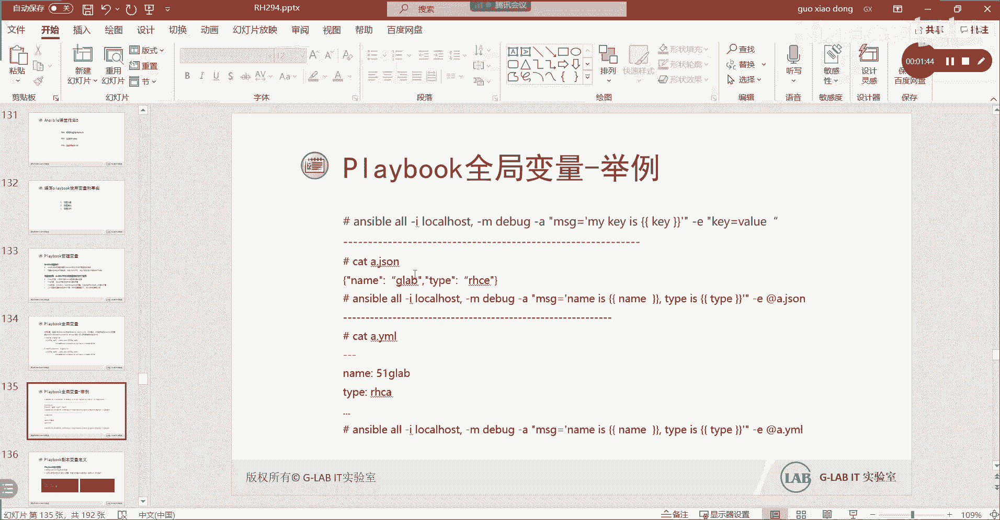

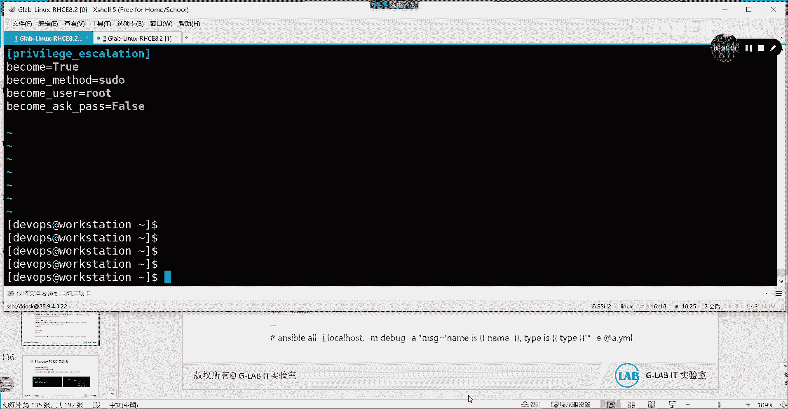

Ansible中的变量主要用于存储和传递数据。它们可以分为两大类：**普通变量**和**事实变量**。普通变量由用户定义，而事实变量是Ansible内置的，用于收集目标主机的系统信息。掌握变量的定义范围、优先级和调用方法是编写高效Playbook的基础。

---

## 变量的类型

Ansible变量主要分为两种类型。

### 普通变量

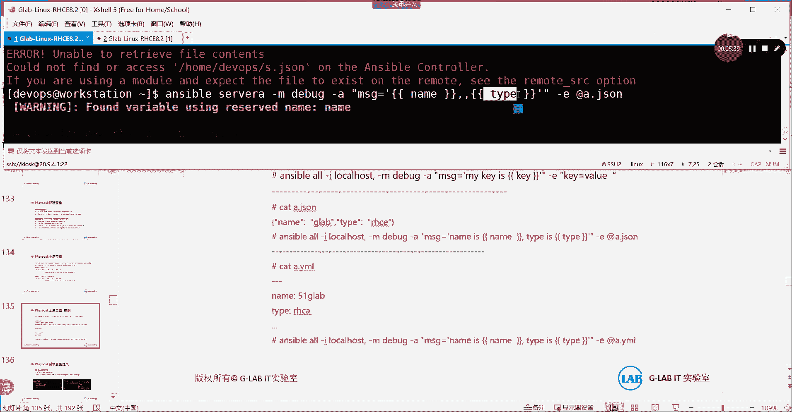

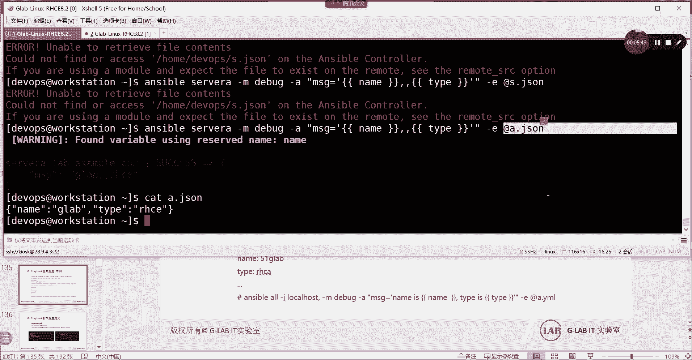

普通变量由用户在Playbook或命令行中显式定义和赋值。它们用于存储自定义的数据。

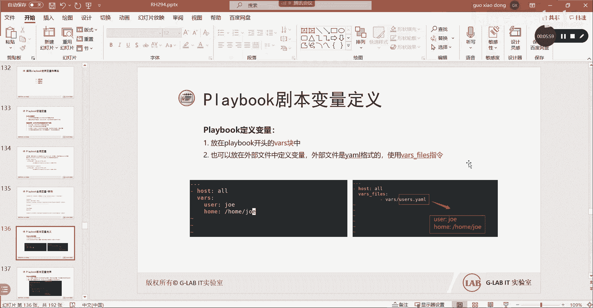

### 事实变量

事实变量是Ansible内置的变量，也称为“事实”。它们在任务执行前由`setup`模块自动从目标主机收集信息（如主机名、IP地址、操作系统等），无需用户声明即可直接使用。

例如，获取主机名的事实变量是：
```
{{ ansible_hostname }}
```

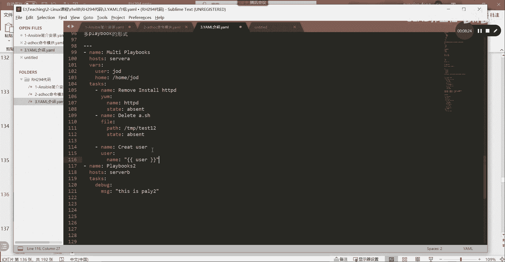

---

## 普通变量的定义范围

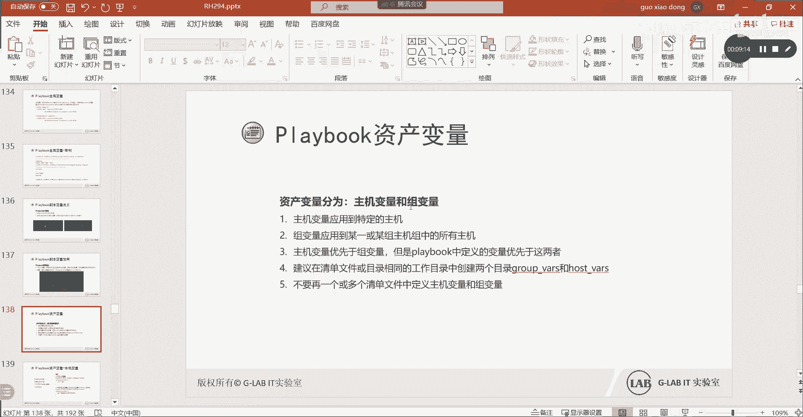

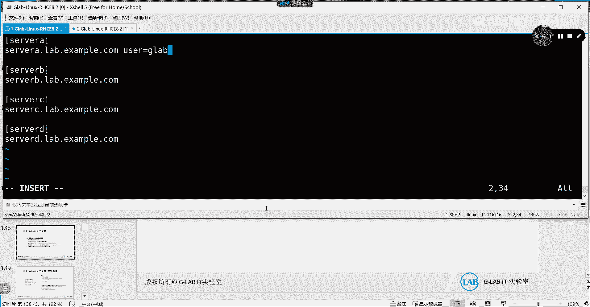

普通变量可以在三个不同的范围内定义，其优先级各不相同。以下是定义变量的三种主要方式。

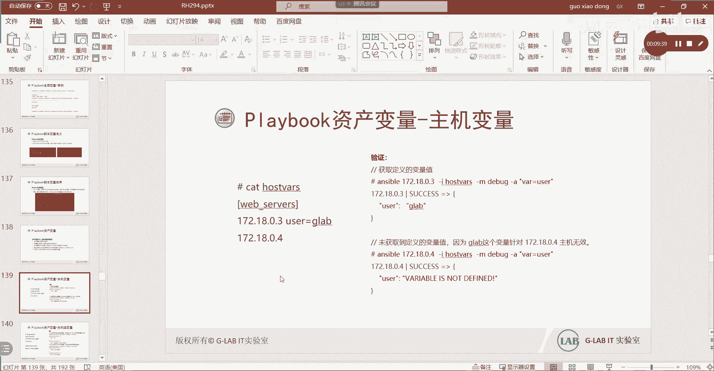

### 1. 全局变量

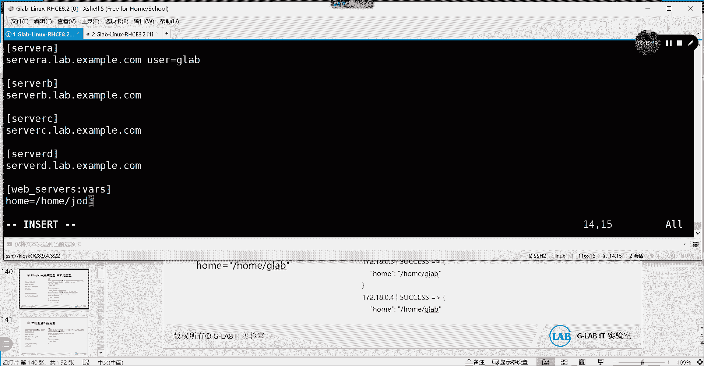

全局变量在运行`ansible`或`ansible-playbook`命令时通过命令行参数定义。

**定义方法**：使用 `-e` 或 `--extra-vars` 选项。
```bash
ansible servera -m debug -a "msg='my key is {{ key }}'" -e "key=value"
```
此命令会输出：`my key is value`。

**通过变量文件定义**：
也可以将变量定义在独立的文件中（JSON或YAML格式），然后通过`-e`选项引入。
- **JSON格式文件** (`vars.json`)：
```json
{
  "name": "GLAB",
  "type": "RHCE"
}
```
调用方式：
```bash
ansible-playbook playbook.yml -e "@vars.json"
```
- **YAML格式文件** (`vars.yml`)：
```yaml
name: GLAB
type: RHCE
```
调用方式：
```bash
ansible-playbook playbook.yml -e "@vars.yml"
```

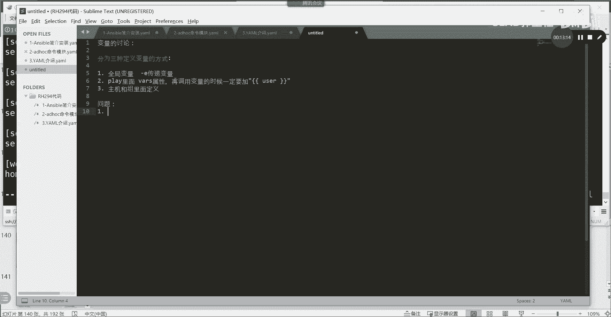

### 2. Play变量

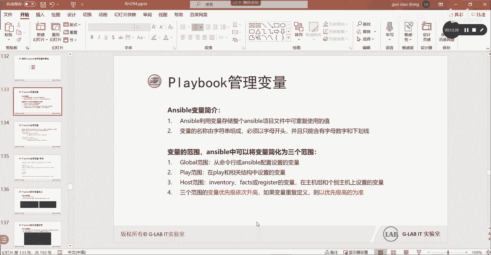

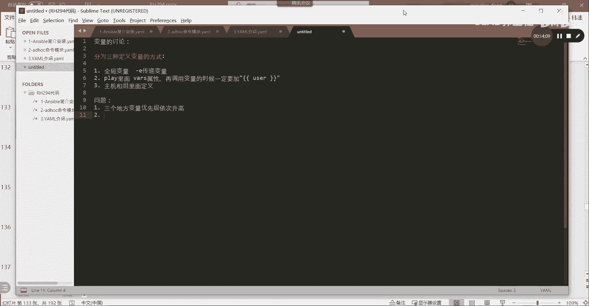

Play变量在Playbook的`vars`属性部分定义，其作用域仅限于该Play。

**定义与调用示例**：
```yaml
- hosts: webservers
  vars:
    user: god
    home: /home/god
  tasks:
    - name: Create user
      user:
        name: "{{ user }}"
        home: "{{ home }}"
```
**注意**：在Playbook的task中调用变量时，**必须使用双引号**将整个值括起来，例如 `"{{ user }}"`。

### 3. 主机与主机组变量

主机变量和主机组变量在清单文件（`inventory`）中定义，作用域针对特定主机或主机组。

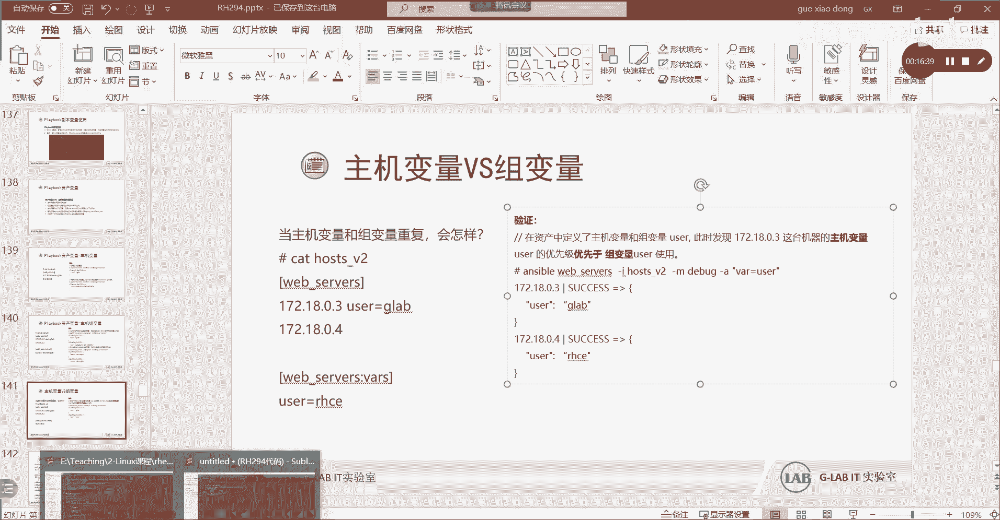

**主机变量**：在主机地址后直接定义。
```
servera.example.com user=glab
```

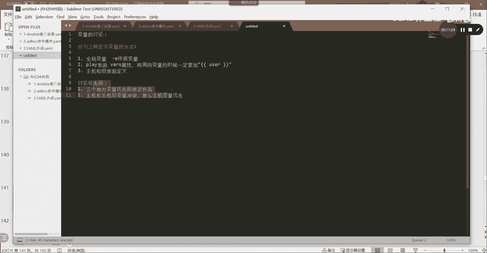

**主机组变量**：在主机组定义下使用 `vars` 关键字。
```
[webservers]
servera.example.com
serverb.example.com
[webservers:vars]
home=/home/glab
```

---

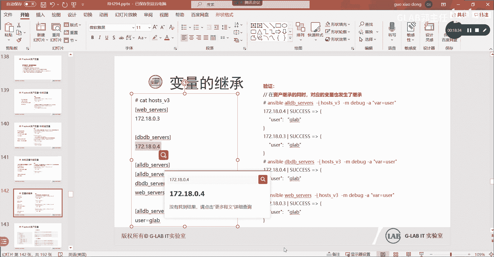

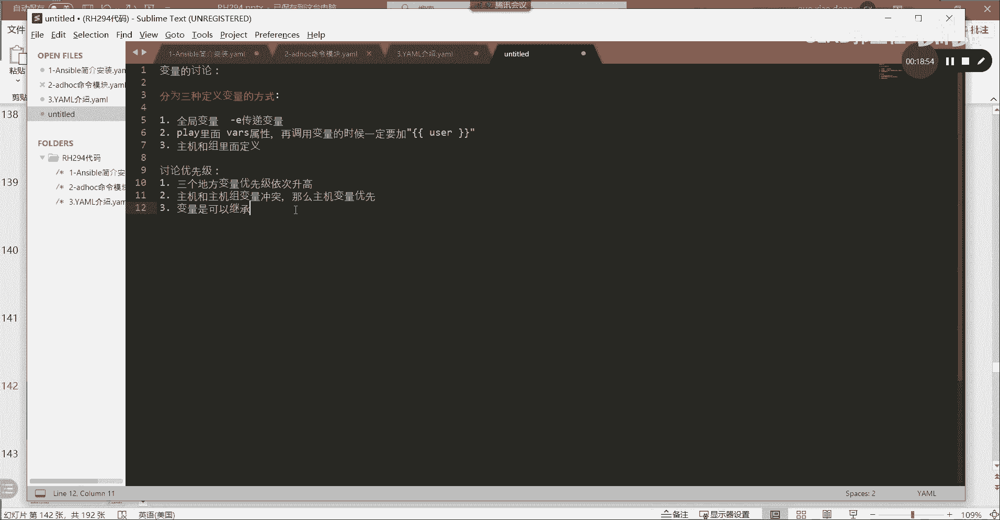

## 变量优先级与冲突解决

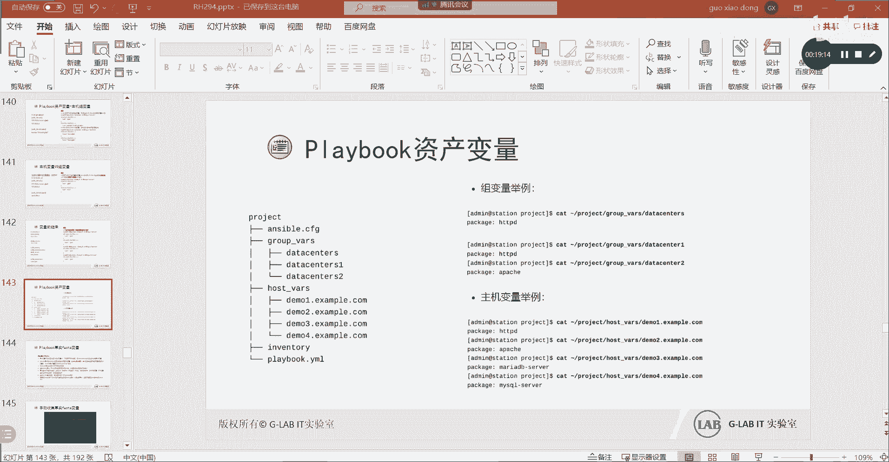

当变量在不同位置被定义时，了解其优先级至关重要。以下是需要讨论的几个核心问题。

### 问题一：三种定义方式的优先级

如果同一个变量在全局、Play和主机变量中都定义了，哪个会生效？
**结论**：变量优先级从低到高依次为：**全局变量 < Play变量 < 主机变量**。主机变量拥有最高优先级。

### 问题二：主机变量与主机组变量的冲突

如果同一个变量既在主机上定义，又在它所属的主机组上定义，但值不同，哪个生效？
**结论**：当主机变量与主机组变量冲突时，**主机变量的优先级更高**。

### 问题三：变量的继承

在嵌套的主机组结构中，父组（大组）定义的变量会被子组（小组）继承。
例如：
```
[app_servers]
host1
host2

[db_servers]
host3

[all_servers:children]
app_servers
db_servers

[all_servers:vars]
package_version=latest
```
此时，`app_servers`和`db_servers`组内的所有主机都会继承变量 `package_version=latest`。

---

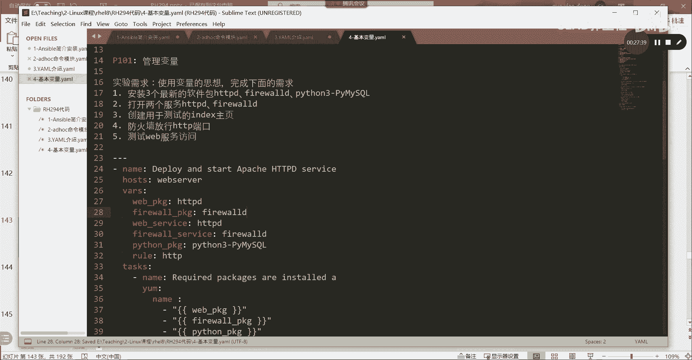

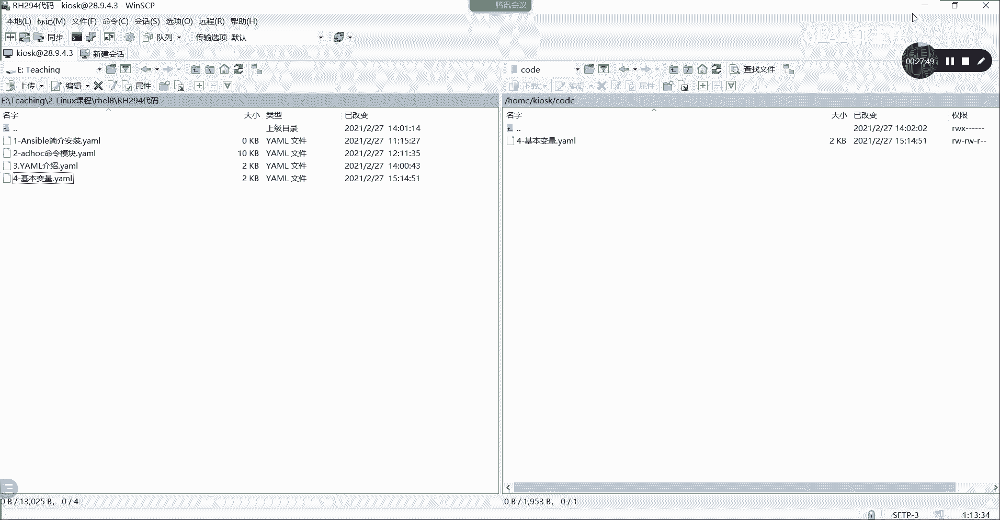

## 实践案例：使用变量部署Web服务

上一节我们介绍了变量的定义和优先级，本节我们通过一个实际案例来巩固学习。以下是使用变量简化Playbook编写的示例。

**需求**：在目标主机上安装最新的`httpd`、`firewalld`、`php`软件包，启动`httpd`和`firewalld`服务，创建测试首页，放行HTTP端口，并最终测试Web服务是否可用。

**Playbook实现**：
```yaml
---
- name: 部署并配置Web服务
  hosts: webservers
  vars:
    packages:
      - httpd
      - firewalld
      - php
    services:
      - httpd
      - firewalld
    web_port: 80

  tasks:
    # 安装软件包
    - name: Install required packages
      yum:
        name: "{{ packages }}"
        state: latest

    # 启动firewalld服务
    - name: Start firewalld service
      service:
        name: "{{ services[1] }}"
        state: started
        enabled: yes

    # 启动httpd服务
    - name: Start httpd service
      service:
        name: "{{ services[0] }}"
        state: started
        enabled: yes

    # 创建测试首页
    - name: Create index.html
      copy:
        content: "<h1>Example Web Content</h1>"
        dest: /var/www/html/index.html

    # 放行HTTP端口
    - name: Open HTTP port
      firewalld:
        port: "{{ web_port }}/tcp"
        permanent: yes
        state: enabled
      notify: reload firewalld

  handlers:
    - name: reload firewalld
      service:
        name: firewalld
        state: reloaded

- name: 测试Web服务
  hosts: localhost
  tasks:
    - name: Test web server connection
      uri:
        url: http://servera.example.com
        status_code: 200
```
**关键点分析**：
1.  **使用列表变量**：将多个软件包和服务定义为列表变量，使task结构更清晰。
2.  **变量调用**：在模块参数中通过 `"{{ variable_name }}"` 格式调用变量。
3.  **多个Play**：第一个Play在目标主机部署服务，第二个Play在控制机测试服务，逻辑分离明确。
4.  **使用`uri`模块测试**：该模块模拟HTTP请求，通过检查返回状态码是否为200来验证服务可用性。

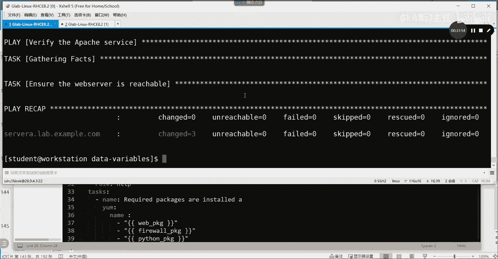

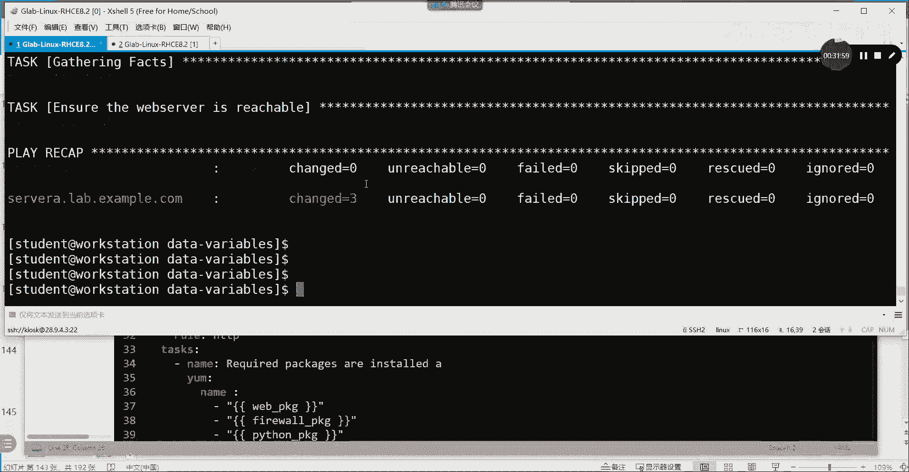

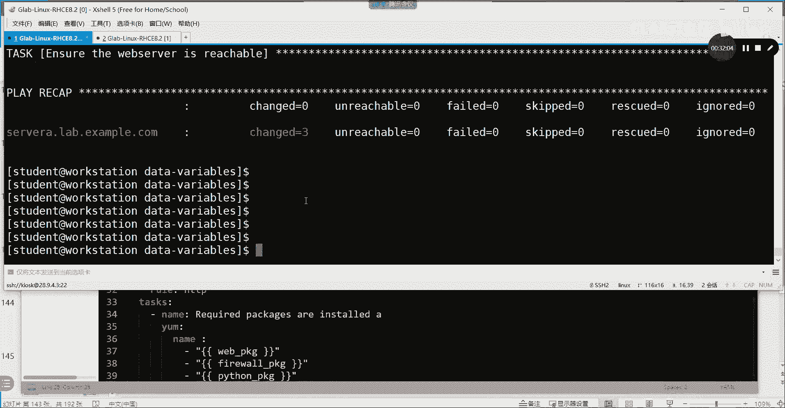

执行Playbook后，可使用`curl`命令验证：
```bash
curl http://servera.example.com
```
应能输出 `<h1>Example Web Content</h1>`。

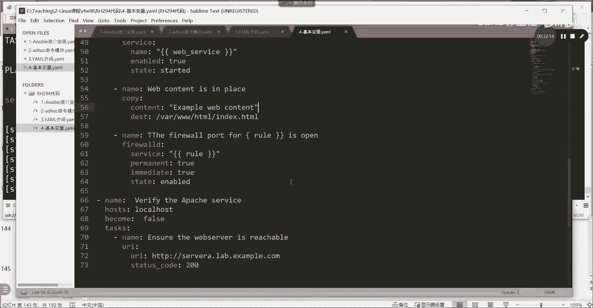

---

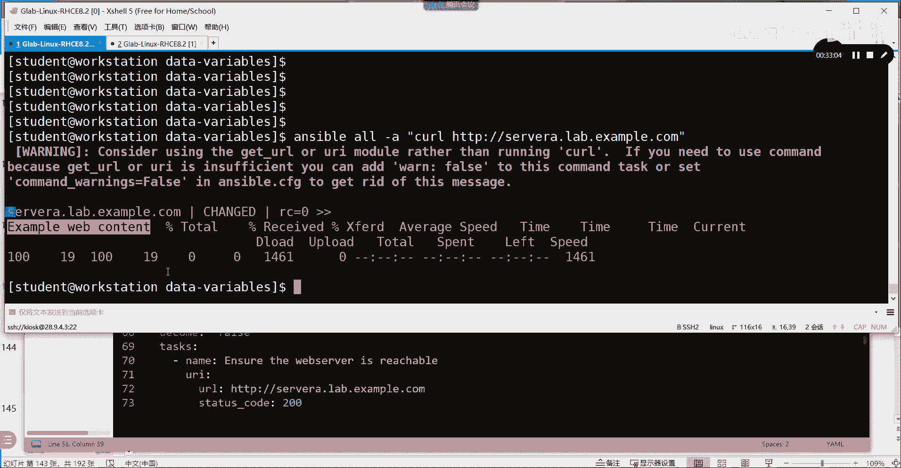

## 总结 🎯

本节课中我们一起学习了Ansible变量的核心知识：
1.  **变量类型**：区分了用户定义的**普通变量**和Ansible内置的**事实变量**。
2.  **定义范围**：掌握了在**全局**、**Play**内以及**清单文件**中定义变量的方法。
3.  **优先级规则**：理解了当变量定义冲突时，优先级顺序为：主机变量 > Play变量 > 全局变量；主机变量 > 主机组变量。
4.  **继承特性**：知道了父主机组定义的变量可以被子组继承。
5.  **实践应用**：通过一个部署Web服务的完整案例，学会了如何利用变量编写简洁、可维护的Playbook。

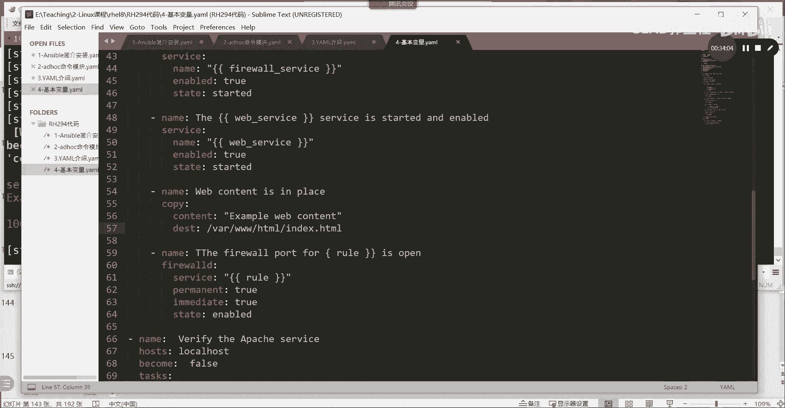


合理使用变量是提升Ansible Playbook灵活性、避免代码重复的关键。请务必通过实验熟练掌握变量的定义和调用方式。