# Ansible自动化运维：53：Ansible计划任务与文件管理模块详解 🕒

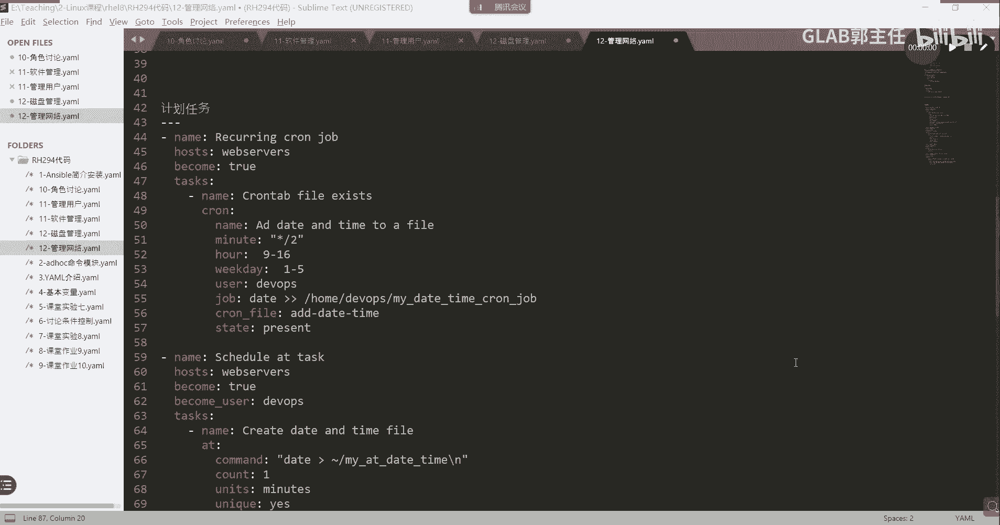

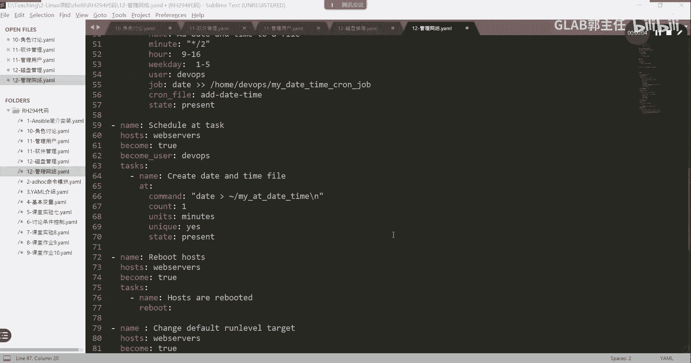

在本节课中，我们将学习Ansible中用于管理计划任务、延迟任务以及文件系统的几个核心模块。这些模块是自动化运维中实现定时任务和文件操作的基础。

上一节我们介绍了Ansible的基础模块，本节中我们来看看如何用Ansible管理计划任务。

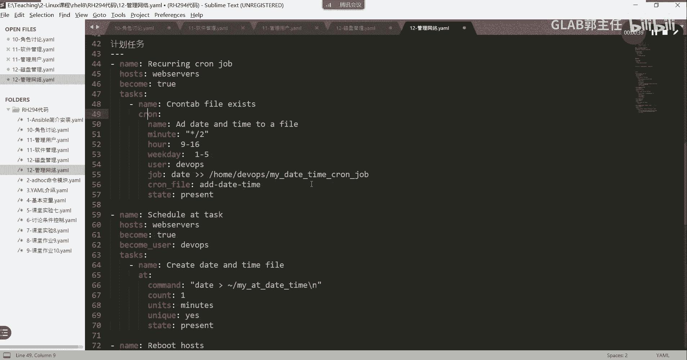

## Cron模块：管理周期性计划任务

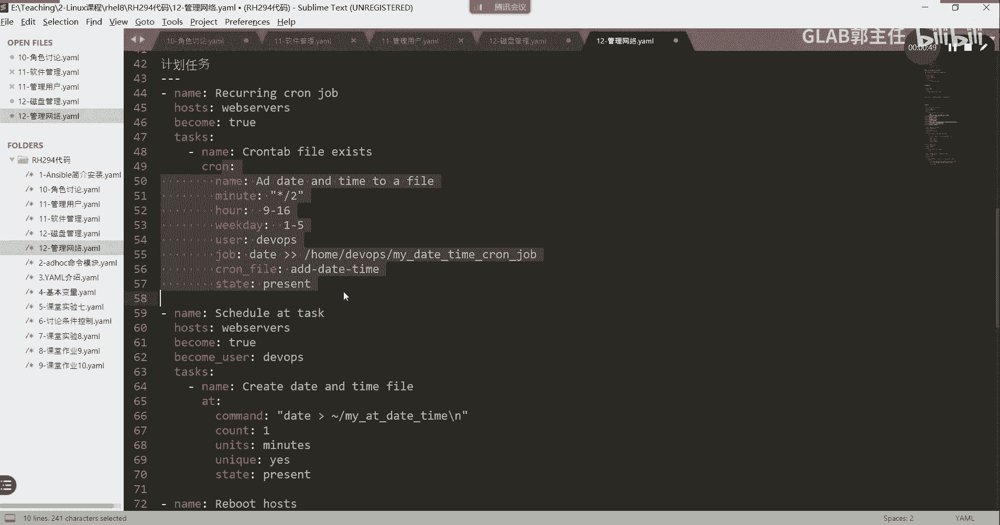

Cron模块用于在远程主机上创建、修改或删除cron计划任务。其功能类似于直接在Linux系统中使用`crontab`命令。

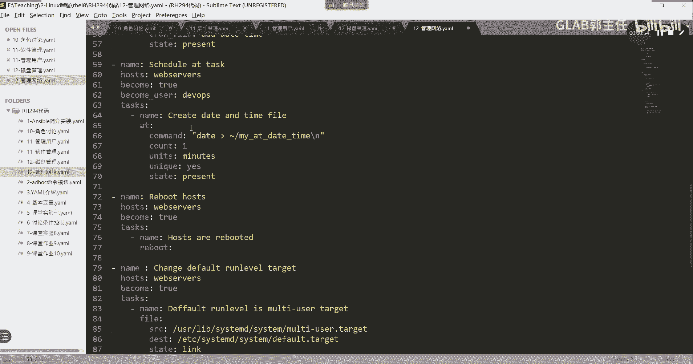

以下是Cron模块的核心参数：
*   **name**：为计划任务起一个描述性的名称。
*   **minute/hour/day/month/weekday**：分别对应计划任务执行时间的分、时、日、月、星期。使用星号`*`表示任意时间。
*   **user**：指定执行该计划任务的用户。
*   **job**：定义要执行的具体命令或脚本。
*   **state**：定义任务状态，`present`表示创建或更新，`absent`表示删除。

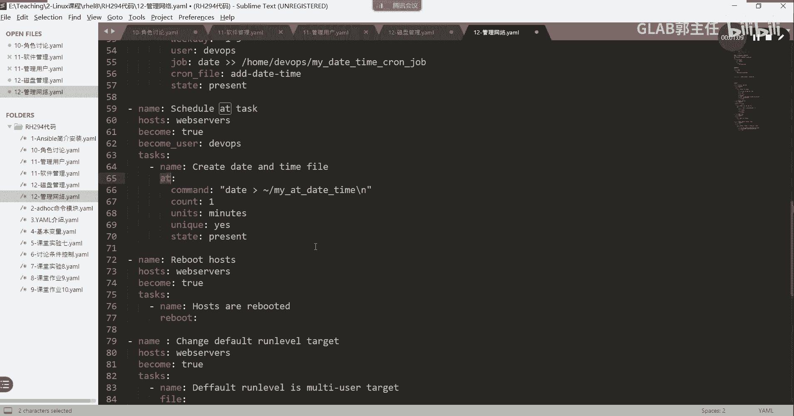

其基本使用格式如下：
```yaml
- name: 创建一个计划任务
  cron:
    name: "备份数据库"
    minute: "0"
    hour: "2"
    job: "/opt/scripts/backup.sh"
    user: "root"
    state: present
```

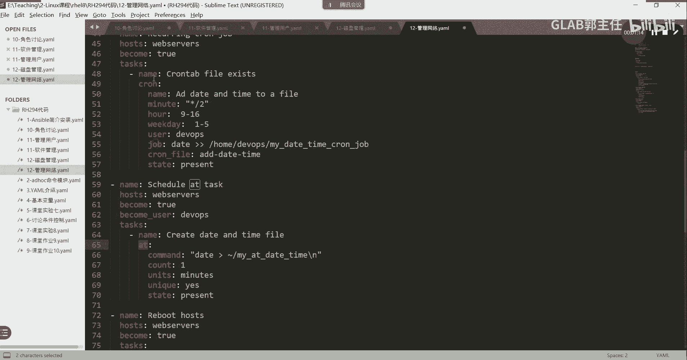

如果对模块参数不熟悉，可以使用`ansible-doc cron`命令查看官方文档和示例。

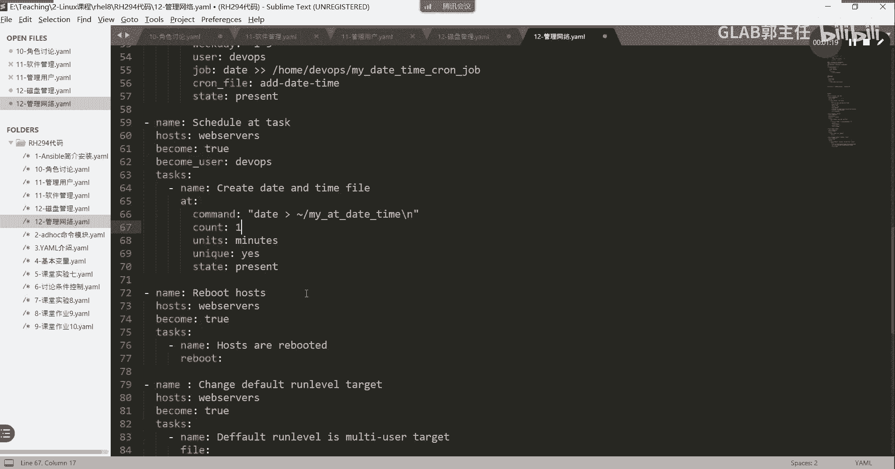

## At模块：管理一次性延迟任务

除了周期性任务，有时我们需要在未来的某个特定时间点执行一次性的任务，这就是延迟任务。At模块用于管理这类任务，功能类似于Linux的`at`命令。

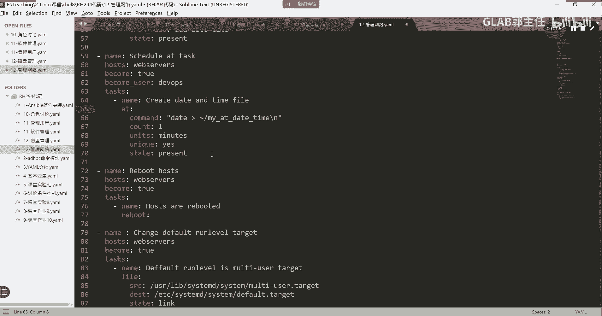

以下是At模块的核心参数：
*   **command**：指定在设定时间要执行的命令。
*   **units**：指定时间单位，例如`minutes`（分钟）或`hours`（小时）。
*   **count**：与`units`结合，指定具体的时间数量。
*   **unique**：如果设置为`yes`，当相同的命令已在队列中时，则不再添加，防止任务冲突。
*   **state**：`present`表示创建任务。

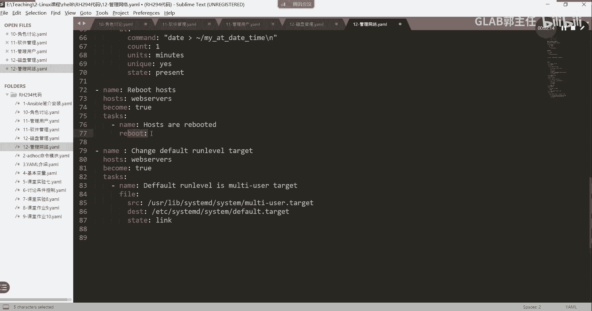

例如，以下任务表示在一分钟后执行`/tmp/hello.sh`脚本：
```yaml
- name: 设置一个延迟任务
  at:
    command: "/tmp/hello.sh"
    count: 1
    units: minutes
    unique: yes
    state: present
```

## Reboot与File模块

**Reboot模块**用于重启远程主机。这在完成某些系统配置（如修改SELinux策略）后非常有用。其用法简单直接：
```yaml
- name: 重启服务器
  reboot:
```

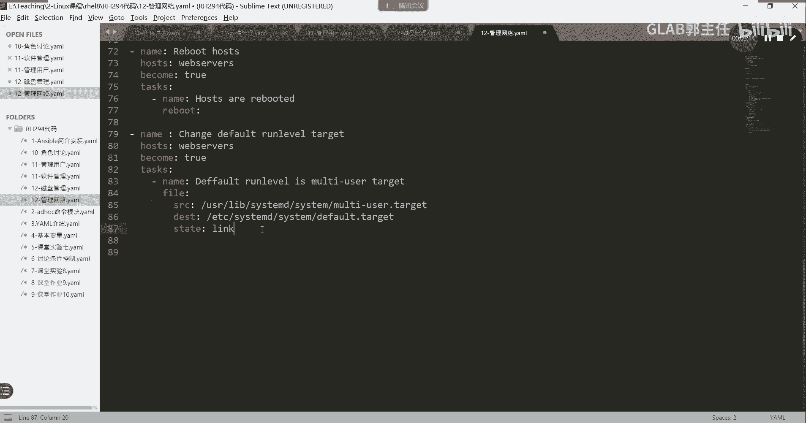

**File模块**是一个功能强大的模块，用于管理文件和目录的属性。我们在之前的课程中已经详细介绍过，它主要实现以下功能：
*   **创建/删除目录**：通过`state: directory`或`state: absent`实现。
*   **创建软链接或硬链接**：通过`state: link`创建软链接，`state: hard`创建硬链接。
*   **修改文件属性**：如所有者（owner）、所属组（group）和权限（mode）。
*   **删除文件或目录**：通过`state: absent`实现。


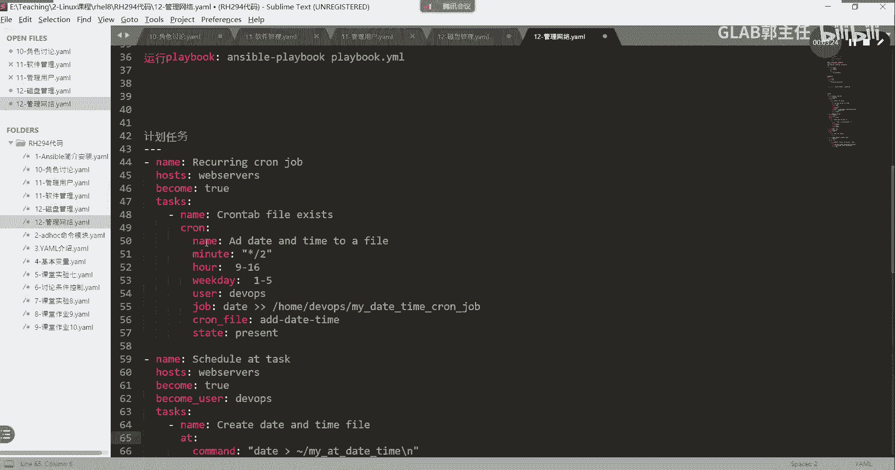

其`state`参数是关键，决定了模块的具体行为。

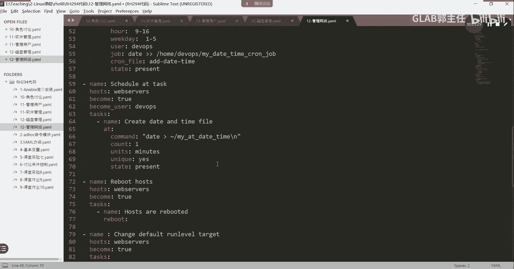

本节课中我们一起学习了Ansible的Cron、At、Reboot模块以及File模块的回顾。Cron和At模块分别用于管理周期性的计划任务和一次性的延迟任务，是自动化定时作业的核心。Reboot模块用于控制系统重启，而File模块则是进行各类文件操作的基础。掌握这些模块，能够极大地扩展Ansible在系统运维中的自动化能力。