# Linux运维与红帽认证：52：Ansible网络配置 🖧


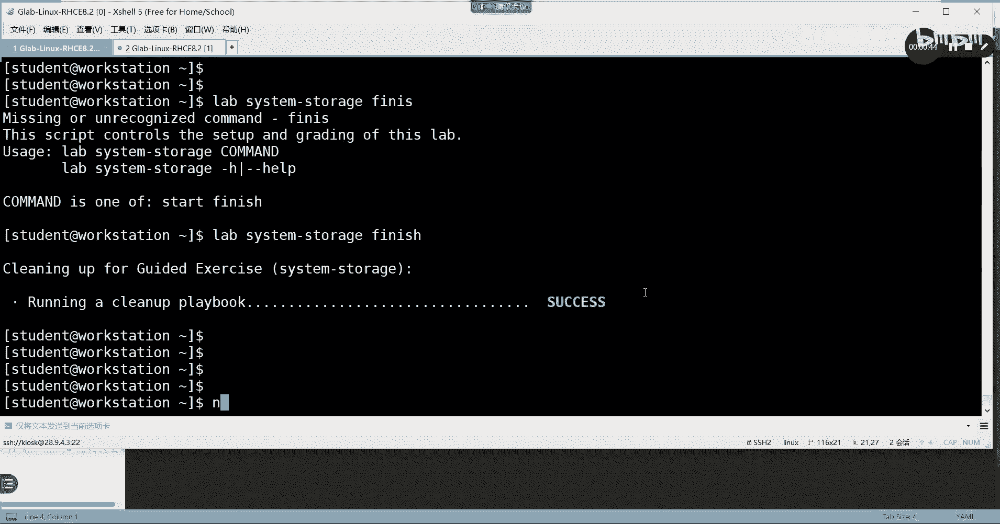

在本节课中，我们将学习如何使用Ansible的系统角色来配置网络。这是RHCE认证考试中的一个重要知识点，掌握它可以帮助你高效、批量地管理服务器网络设置。

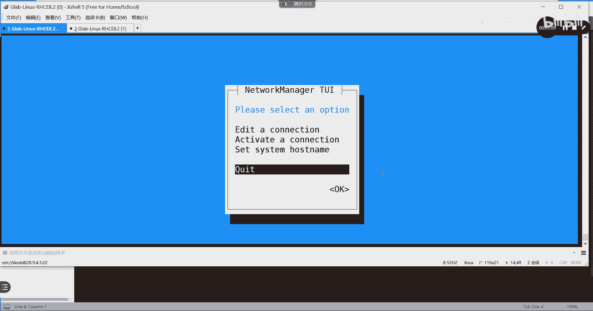

---

## 网络配置方法回顾

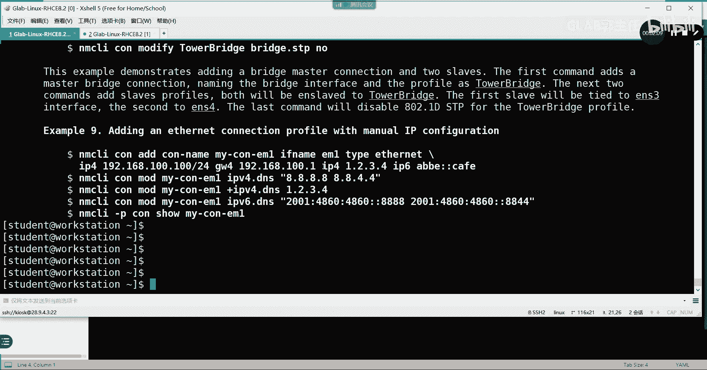

上一节我们介绍了Ansible的基础知识，本节中我们来看看如何配置网络。在Linux系统中，手动配置网络通常有两种方法。

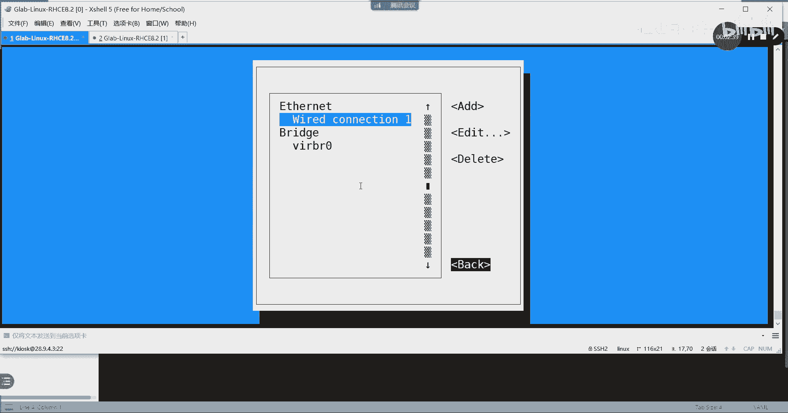

以下是两种常见的网络配置命令：

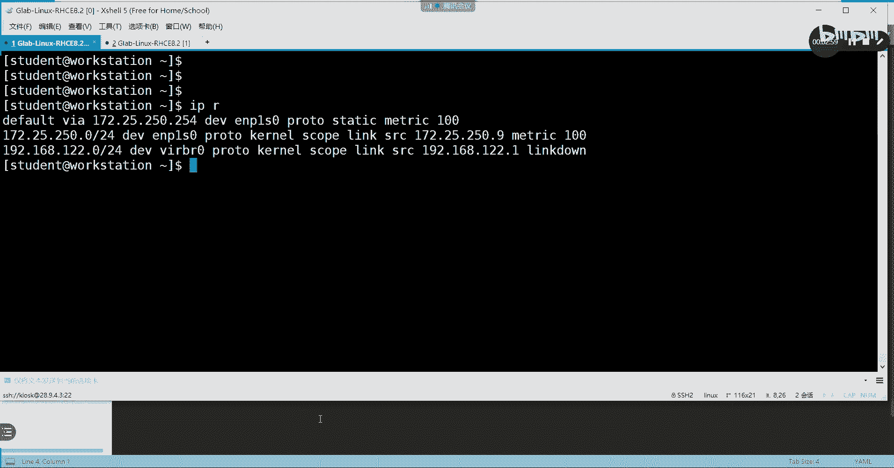

*   **`nmtui`**：这是一个基于文本的图形化界面工具，在任何环境下都能使用，不需要额外的图形化软件支持。考试时建议使用此方法，操作直观且不易出错。
*   **`nmcli`**：这是一个完整的命令行工具。如果你记不住具体命令，可以使用 `man nmcli-examples` 查看示例。但对于初学者和考试环境，建议优先使用 `nmtui` 以求稳妥。


使用 `nmtui` 时，进入编辑界面，填写IP地址、子网掩码、网关和DNS等信息即可。配置完成后，使用 `ip addr` 命令可以查看配置是否生效。

---

## 使用Ansible系统角色配置网络

手动配置适用于单台服务器，而使用Ansible的Playbook脚本可以批量管理。这里我们将使用Ansible的**系统角色**来配置网络。

系统角色是Ansible官方提供的一组预定义、可重用的任务集合，能极大简化复杂配置。

### 1. 准备变量文件

首先，我们需要创建一个变量文件来定义要配置的网络参数。这个文件需要放在特定的目录下。

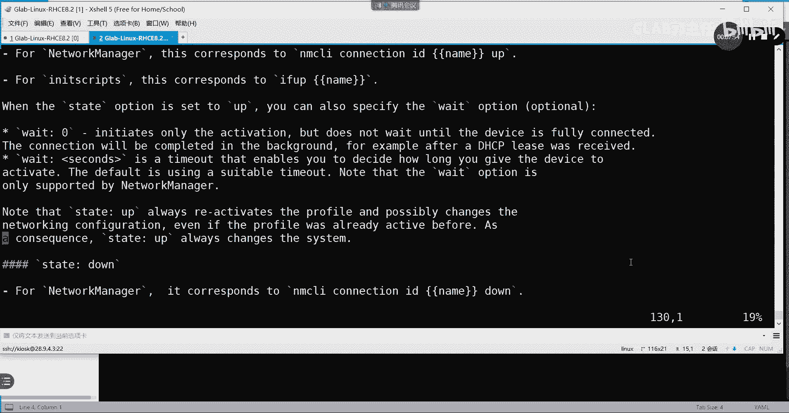

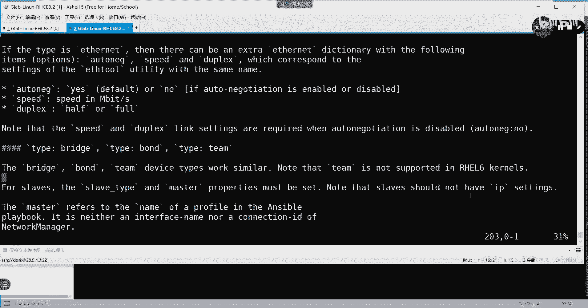

以下是创建和定义变量文件的步骤：

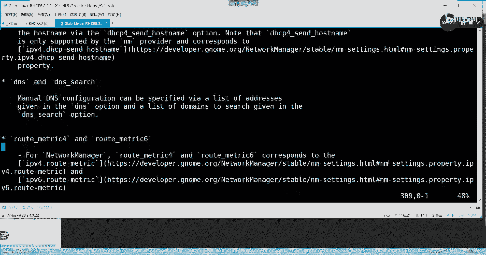

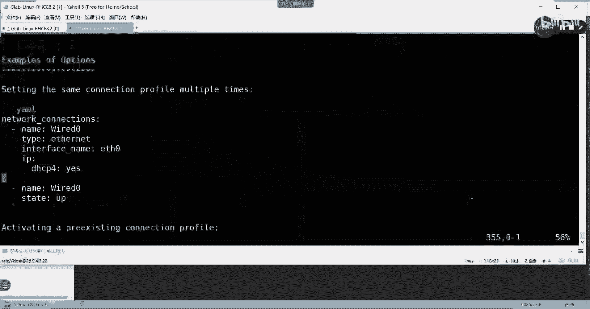

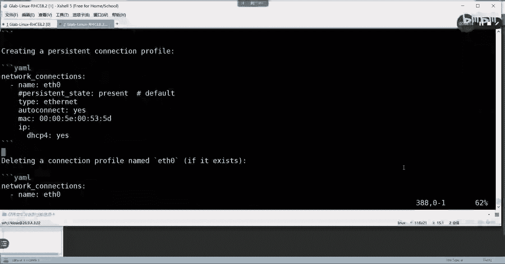

1.  在Ansible控制节点上，为你的主机组（例如 `webservers`）创建变量目录：`group_vars/webservers/`。
2.  在该目录下创建一个YAML文件，例如 `network.yml`。
3.  在这个文件中，我们需要参考系统角色的文档来编写正确的变量结构。

### 2. 查找系统角色文档

系统角色安装后，其使用说明和变量示例位于一个固定的路径。

你可以通过以下路径查看 `rhel-system-roles.network` 角色的帮助文档：
```bash
/usr/share/ansible/roles/rhel-system-roles.network/README.md
```
打开这个 `README.md` 文件，找到 **“Example of variables”** 或 **“Setting the IP configuration”** 部分。里面会有一个YAML格式的配置示例，我们将其作为模板。

### 3. 编写网络配置变量

根据文档中的示例模板，我们编写 `group_vars/webservers/network.yml` 文件。

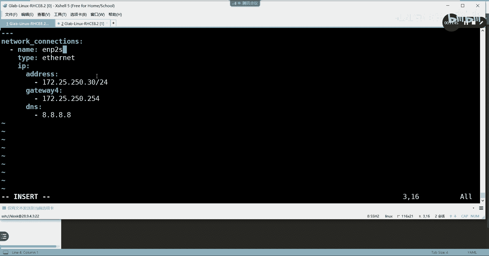


以下是一个配置静态IP地址的变量文件示例：
```yaml
---
network_connections:
  - name: enp2s0
    type: ethernet
    ip:
      address:
        - 172.25.250.30/24
      gateway4: 172.25.250.254
      dns:
        - 8.8.8.8
    state: up
```
**核心概念解析**：
*   `name`：必须填写受控节点上真实的网络接口名称，可通过 `ip link` 命令查看。
*   `ip.address`：定义IP地址和子网掩码。
*   `gateway4`：定义IPv4网关。
*   `dns`：定义DNS服务器。

你只需根据模板，修改其中的名称、IP地址等值即可。

### 4. 编写并执行Playbook

变量文件定义好后，我们需要编写一个Playbook来调用系统角色。

创建一个Playbook文件，例如 `configure_network.yml`：
```yaml
---
- name: Configure Network Settings
  hosts: webservers
  roles:
    - role: rhel-system-roles.network
```
这个Playbook非常简单，它指定了对 `webservers` 主机组执行 `rhel-system-roles.network` 这个系统角色。Ansible会自动读取我们之前定义的 `group_vars` 变量并应用配置。

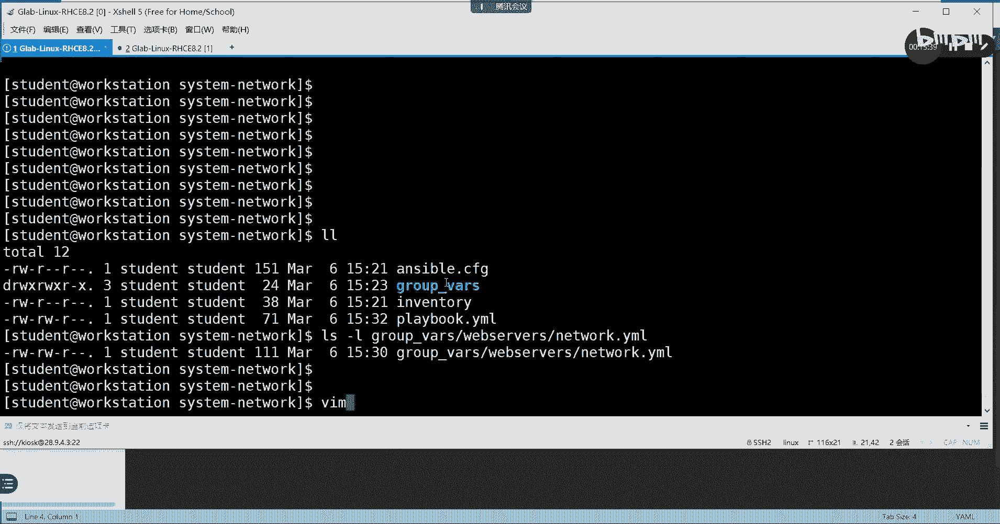

最后，执行这个Playbook：
```bash
ansible-playbook configure_network.yml
```
执行成功后，可以到受控节点上使用 `ip addr show enp2s0` 命令验证IP地址是否已变更为 `172.25.250.30`。

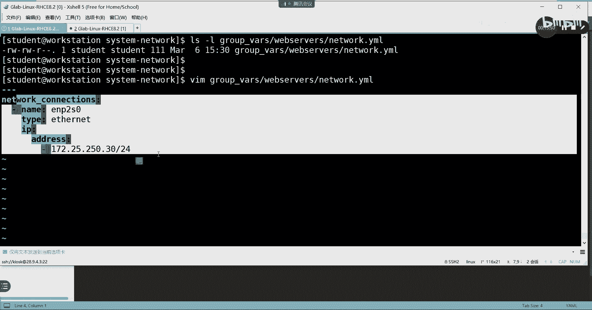

---

## 总结与拓展

本节课中我们一起学习了如何使用Ansible系统角色配置网络。其核心步骤是：**查找角色文档 -> 根据模板编写变量文件 -> 在Playbook中调用角色**。

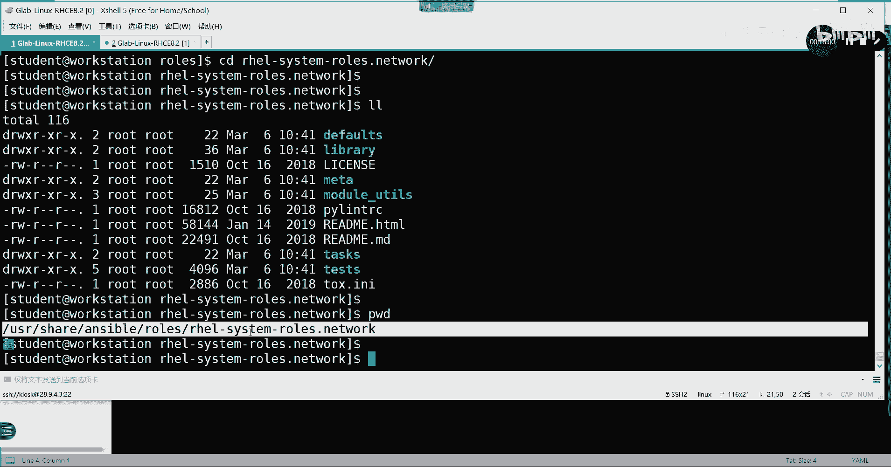

这种方法不仅适用于网络配置，也适用于其他如时间同步（`rhel-system-roles.timesync`）等系统服务的管理。在RHCE考试中，你可能会遇到类似的任务，其解决思路都是相通的：利用现有的系统角色，通过修改变量来实现批量、自动化的配置。记住系统角色文档的位置和查阅方法，是高效使用它们的关键。