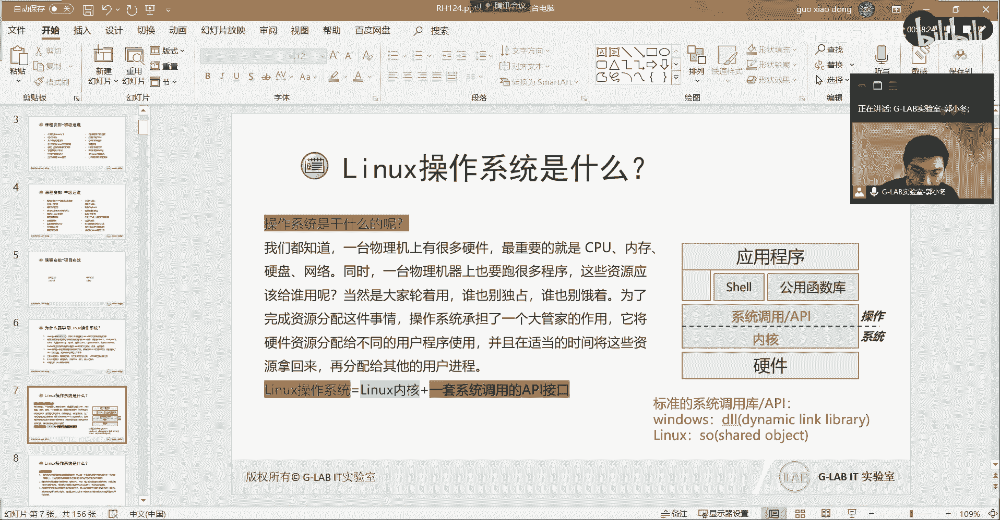
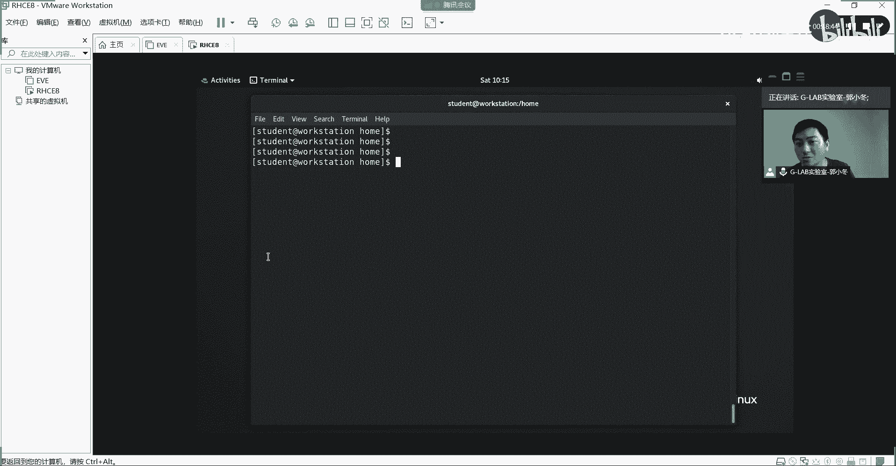
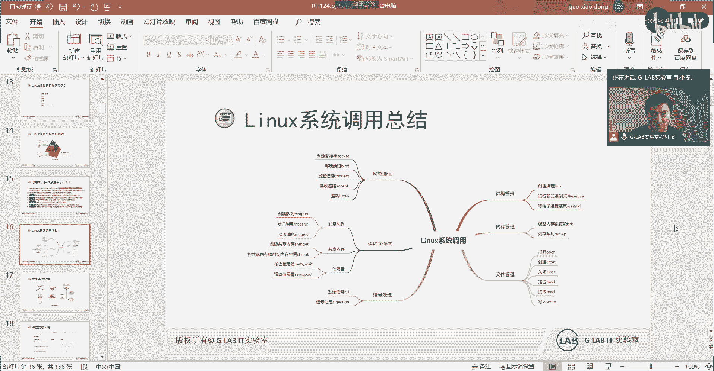

# Linux操作系统入门：1：Linux操作系统是什么？ 🐧

在本节课中，我们将要学习Linux操作系统的核心概念。我们将探讨什么是操作系统、它解决了什么问题，以及Linux系统的独特之处和其发行版的多样性。通过理解这些基础理论，您将为后续的实践学习打下坚实的基础。

## 为什么要学习Linux？ 🎯

学习Linux操作系统有多种原因。

以下是几个关键点：
*   **开源生态**：Linux是开源的，任何人都可以使用、修改和分发。这促进了全球开发者的协作，使得新技术和性能优化能够更快地出现和普及。
*   **广泛应用**：许多关键领域和技术都基于Linux，例如MySQL、KVM、Open vSwitch、Kubernetes和Docker。
*   **类UNIX界面**：Linux拥有优秀的类UNIX程序界面，继承了UNIX的许多设计哲学和优势。
*   **企业级环境**：据统计，全球前500台高性能服务器中，超过90%运行Linux操作系统。其覆盖率和占有率非常高。
*   **个人与物联网**：从餐厅的PDA点餐机到智能家居设备，许多底层系统都基于Linux内核。
*   **云计算**：云端服务器广泛采用Linux。总之，Linux的普及面越来越广，应用越来越多。

## 操作系统到底是什么？ ⚙️

上一节我们介绍了学习Linux的原因，本节中我们来看看操作系统的本质。操作系统到底解决了什么问题？

想象一下，计算机有一堆底层硬件（CPU、内存、硬盘等）。我们最终的目标是在上面运行应用程序（如QQ、微信）来提供服务。理论上，应用程序可以直接安装在硬件上运行，但这需要为特定硬件编写极其复杂的代码。

当多个应用程序都需要运行时，问题就出现了：它们都需要调用硬件资源（如CPU、内存），但没有统一的协调者，资源分配就会陷入混乱。

因此，操作系统作为一个“中间层”或“大管家”出现了。它的核心作用是**协调**和**调度**硬件资源。所有应用程序都通过操作系统来申请和使用资源，由操作系统决定在何时、将何种资源分配给哪个程序。

这背后的核心原理是**时间和空间的复用**。例如，电脑内存可能只有8GB，却能处理总和远超8GB的多个程序数据，就是因为操作系统通过极高的调度频率，在时间上错开不同程序对内存和CPU的使用，从而实现高效复用。

## 操作系统核心架构图 🏗️

理解了操作系统的协调作用后，我们通过一张核心架构图来具体看看它的组成。

```
+-----------------------+
|     应用程序 (APP)     | 例如：QQ、浏览器、游戏
+-----------------------+
|    Shell (命令行/GUI)   | 人机交互接口
+-----------------------+
|  系统调用 / API接口     | 统一的应用程序编程接口
+-----------------------+
|        内核 (Kernel)    | 直接管理硬件的核心
+-----------------------+
|       底层硬件          | CPU、内存、硬盘、网卡
+-----------------------+
```





**1. 内核 (Kernel)**
内核是操作系统的核心，直接与硬件交互。它基于特定的硬件架构（如x86、ARM）编写，因此不同平台需要不同的内核。内核负责最基础的硬件驱动、进程调度、内存管理等。

**2. 系统调用 / API接口**
为什么需要在内核之上再封装一层系统调用（API）？主要是为了**安全**和**规范**。
*   **安全**：如果允许应用程序直接调用内核，恶意程序就可能破坏系统或窃取数据。系统调用作为一道“防火墙”，只暴露安全的、统一的接口给应用程序。
*   **规范**：它统一了应用程序开发的标准库。无论哪个开发者，都使用相同的接口来编写程序，这使得程序开发更简单，也保证了程序能在该操作系统上运行。

**3. Shell**
Shell是“壳”，是用户与操作系统内核交互的接口。它主要分为两种：
*   **图形化Shell (GUI)**：如Windows的桌面、Linux的GNOME或KDE。
*   **命令行Shell (CLI)**：如Linux中的Bash、Zsh。
用户通过Shell输入命令或点击操作，这些指令再通过系统调用传达给内核执行。

**4. 应用程序**
这是我们最终使用的软件，如办公软件、开发工具等。它们通过Shell安装和管理，通过系统调用请求资源。

## Linux的发行版 📦

上一节我们剖析了操作系统的层次，本节中我们来看看Linux世界的多样性——发行版。

Linux严格来说指的是**Linux内核**。但普通用户很难独自完成将内核、各种软件和工具编译整合并安装到硬件上的复杂过程。

因此，许多公司或社区承担了这项“打包”工作。他们将Linux内核、必要的系统软件、库文件、桌面环境和应用软件等整合起来，并提供安装程序，制作成一个可用的系统。这样打包好的完整系统就称为 **Linux发行版**。

以下是主要的发行版家族：

**基于RPM包管理 (如Red Hat系列)**
*   **Red Hat Enterprise Linux (RHEL)**：商业版，提供付费支持。
*   **Fedora**：红帽社区版，用于测试新技术。
*   **CentOS**：曾是基于RHEL源码编译的免费社区版，提供与RHEL的高度兼容性。
*   **openSUSE**：另一个知名的发行版，有openSUSE Leap（社区版）和SUSE Linux Enterprise（商业版）。

**基于DPKG包管理 (如Debian系列)**
*   **Debian**：以稳定著称的社区发行版。
*   **Ubuntu**：基于Debian，用户友好，非常流行。
*   **Linux Mint**：基于Ubuntu，更适合初学者。

> **核心提示**：尽管发行版众多，桌面和预装软件可能不同，但它们都使用**相同的Linux内核**，并且遵循类似的文件系统标准（如FHS）。因此，基础命令和操作逻辑大同小异。选择哪个发行版入门，更多取决于你的具体需求（如学习、生产、桌面体验）。

## 如何学习Linux？ 🚀

了解了发行版之后，我们来看看学习路径。作为初学者和运维工程师，我们学习的重点不是编写内核或系统调用。

**初级阶段 (如RHCSA)**
学习重点在于通过Shell（命令行）与系统交互：
*   安装和管理软件包。
*   管理用户和权限。
*   配置网络和存储。
*   监控系统状态和日志。
*   编写简单的自动化脚本。

**中级阶段 (如RHCE)**
开始深入系统内部：
*   实现自动化运维（如使用Ansible）。
*   进行系统性能调优和安全加固（如SELinux）。
*   管理网络服务（如Web服务器、DNS）。

**高级阶段 (如RHCA)**
专注于企业级解决方案和底层原理：
*   高级性能调优与故障排查。
*   深入理解内核机制。
*   掌握云计算相关技术（如Kubernetes容器编排、OpenStack云平台）。

> **学习方法**：**多练习**是唯一途径。就像学习编程一样，必须亲手输入命令、解决问题，才能形成肌肉记忆和深刻理解。

## 核心概念实例：从点击QQ说起 💡

让我们用一个实例串联起几个核心概念。思考一下：在桌面双击QQ图标到打开聊天窗口的过程中，操作系统做了什么？

1.  **驱动程序驱动硬件**：鼠标移动和点击能被系统识别，靠的是**驱动程序**。驱动程序由硬件厂商提供，它让操作系统能够管理特定的外部硬件。
2.  **从程序到进程**：安装好的QQ是一个**程序**（存储在硬盘上的代码文件）。双击它时，操作系统将其加载到内存中，并由CPU执行，此时它就变成了一个**进程**（正在运行的程序）。
3.  **系统调用全程护航**：从QQ进程启动、申请内存、绘制窗口、响应你的键盘输入、到发送网络消息……整个过程中的每一个步骤，都伴随着大量的**系统调用**。操作系统内核负责调度CPU时间片、分配内存、管理网络连接等，确保QQ进程能顺利运行，且不影响其他进程。

这个过程完美体现了操作系统对硬件资源的**协调**与**调度**。

## 总结 📝

本节课中我们一起学习了：
*   **学习Linux的价值**：源于其开源、广泛应用、企业级支持等特性。
*   **操作系统的本质**：作为硬件和应用程序之间的“协调者”，通过**时间和空间的复用**来调度资源。
*   **操作系统的层次**：从下至上包括**硬件**、**内核**、**系统调用/API**、**Shell**和**应用程序**。
*   **Linux发行版**：是内核+软件+工具的打包合集，方便用户安装使用。常见的有RHEL/CentOS/Fedora系和Debian/Ubuntu系。
*   **学习路径**：从基础命令和系统管理入手，逐步深入自动化、调优和架构。
*   **核心概念实例**：通过“打开QQ”的过程，理解了**驱动**、**程序**、**进程**和**系统调用**是如何协同工作的。



理解这些基础原理，比死记硬背命令更为重要。它为你后续探索Linux世界提供了清晰的地图和坚实的基石。