# Linux用户与组管理：12：用户和组补充 🧑‍💻

在本节课中，我们将学习Linux系统中用户和组管理的补充知识，特别是用户切换、权限提升以及一些高级配置技巧。这些内容对于日常系统管理和安全运维至关重要。

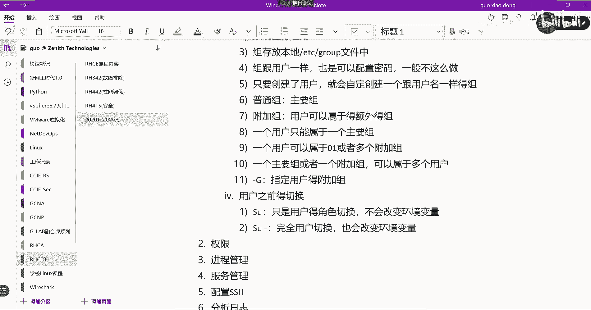

## 用户切换：`su` 与 `su -` 🔄

上一节我们介绍了用户和组的基本操作，本节中我们来看看如何在用户之间进行切换。Linux中切换用户的命令是 `su`，其全称是 **switch user**。

`su` 命令有两种主要用法：`su` 和 `su -`。它们之间存在关键区别。

*   **`su`**：仅切换用户身份，但**不会改变**当前的环境变量。这意味着新用户会话会继承上一个用户的环境设置。
*   **`su -`**：完全切换用户身份，并且**会改变**环境变量。这会加载目标用户的完整登录环境，包括其家目录和环境变量。

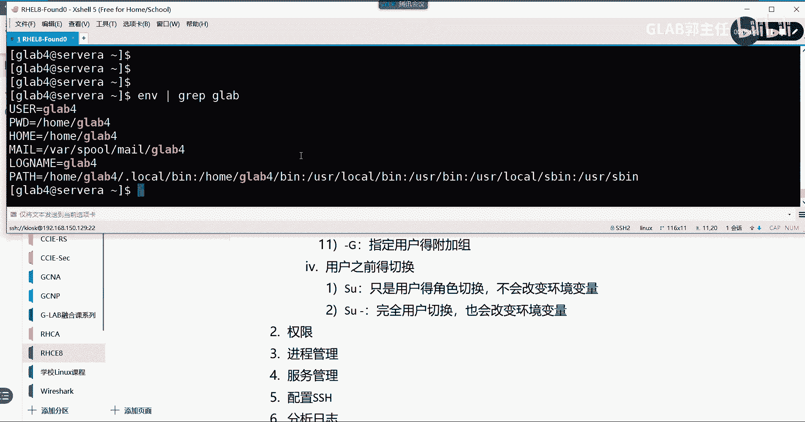

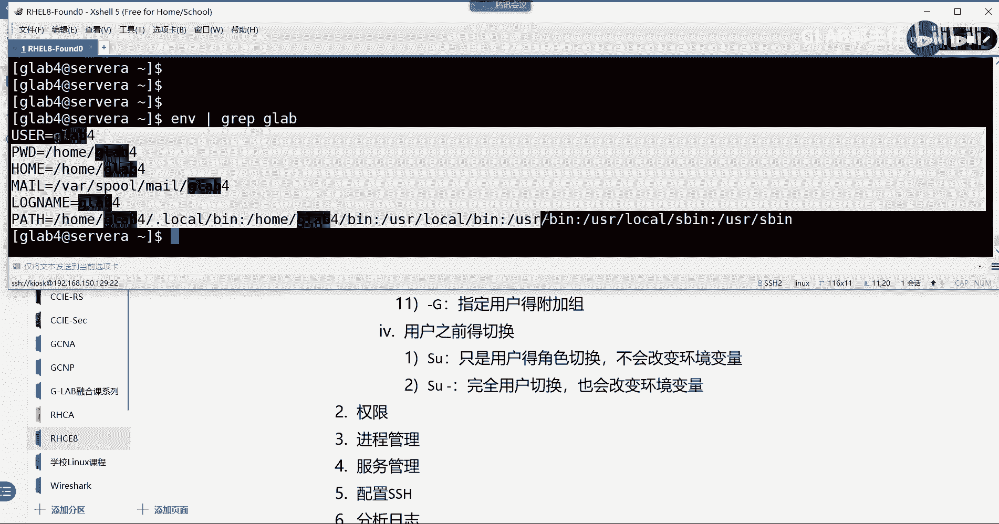

我们来演示一下区别。假设我们有两个用户 `glab3` 和 `glab4`。

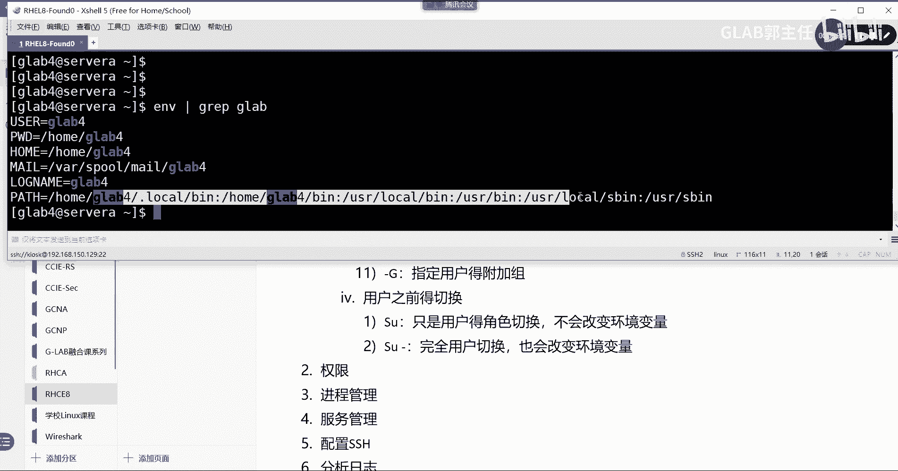

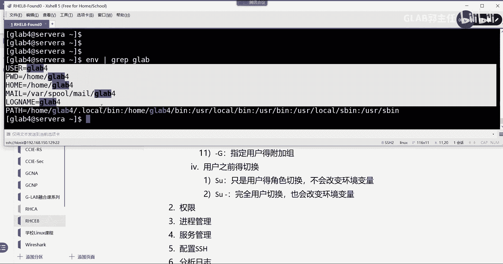

1.  使用 `su glab4` 切换用户（不加 `-`）：
    ```bash
    [glab3@server ~]$ su glab4
    密码：
    [glab3@server glab3]$
    ```
    注意，提示符虽然用户变成了 `glab4`，但路径仍然显示在 `/home/glab3` 目录下。使用 `env | grep glab` 查看环境变量，会发现与 `glab3` 相关的变量依然存在。

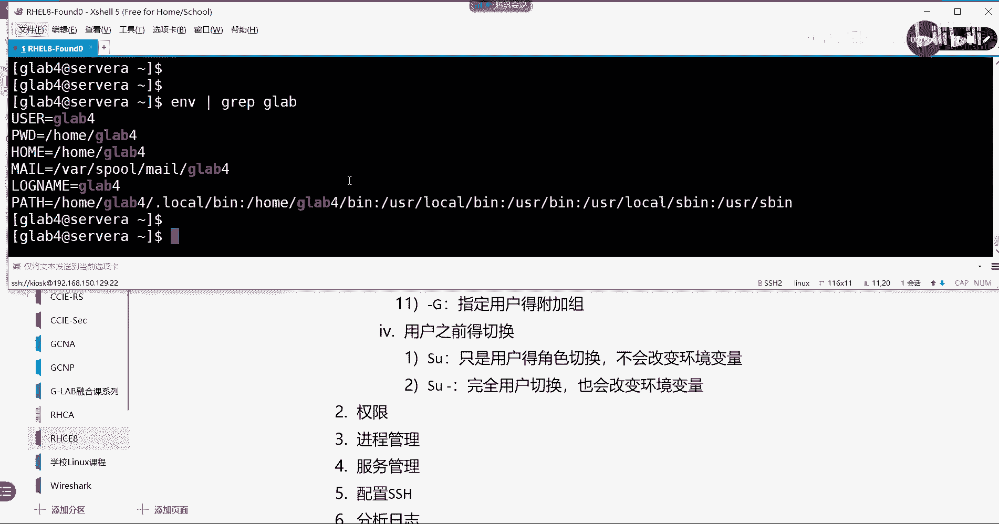

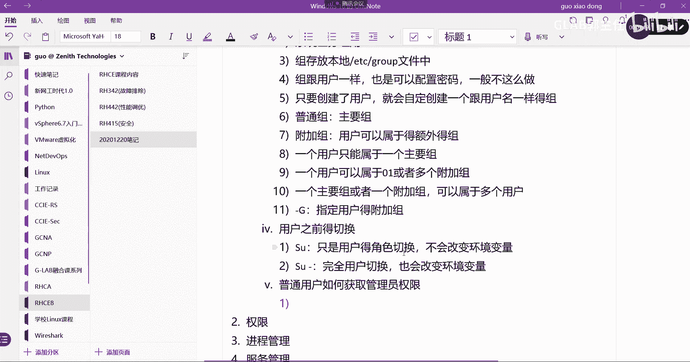

2.  使用 `su - glab4` 切换用户（加 `-`）：
    ```bash
    [glab3@server ~]$ su - glab4
    密码：
    [glab4@server ~]$
    ```
    此时提示符完全变成了 `glab4`，并且当前目录也切换到了 `/home/glab4`。使用 `env | grep glab` 查看，环境变量已全部更新为 `glab4` 的设置。

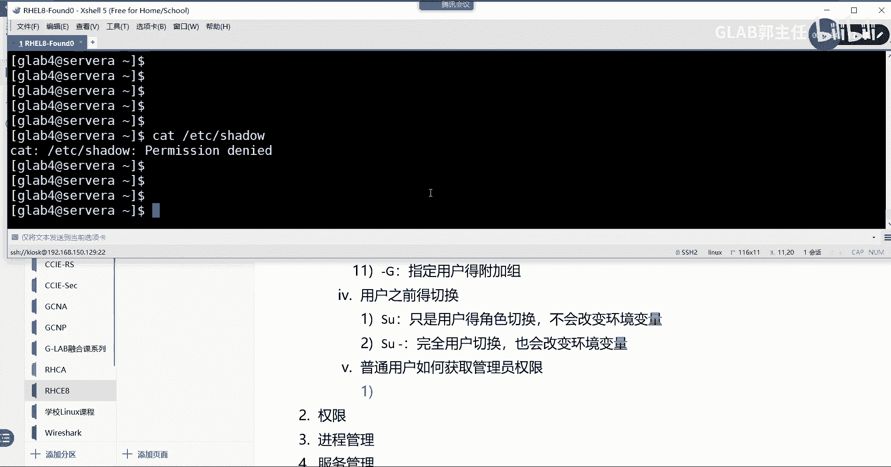

环境变量（如 `PATH`）决定了系统查找命令的位置，因此完全切换用户环境对于正确执行命令非常重要。

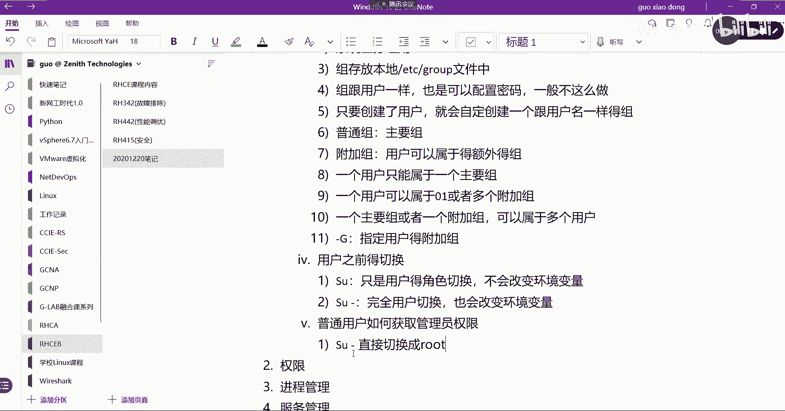

## 普通用户权限提升 🔐

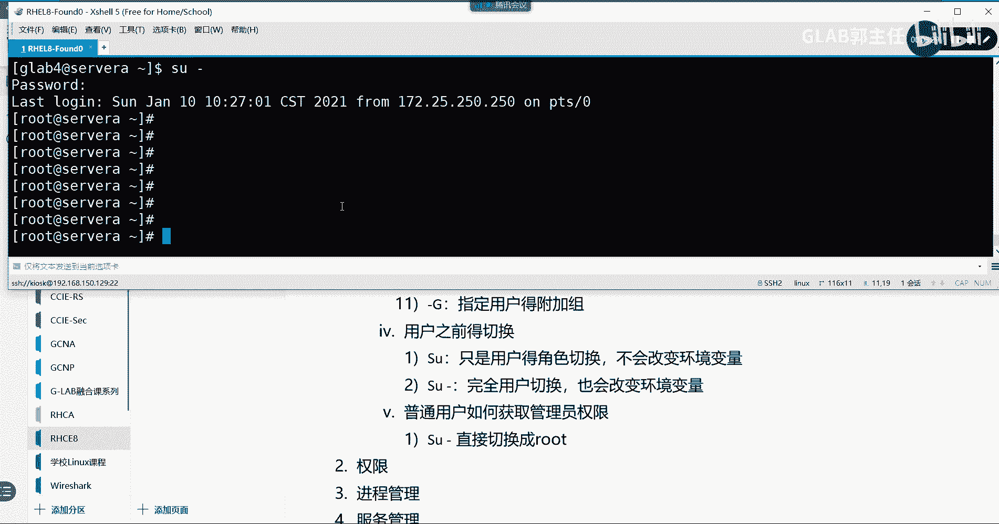

普通用户的权限是有限的。例如，普通用户无法直接查看 `/etc/shadow` 文件。如何让普通用户临时获取管理员权限以执行特定任务呢？主要有两种方法。

### 方法一：使用 `su` 切换为 `root`

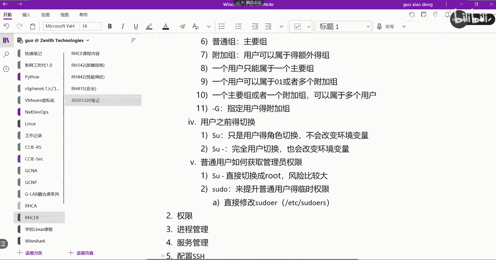

普通用户知道 `root` 密码后，可以通过 `su -` 命令切换为 `root` 用户。
```bash
[glab3@server ~]$ su -
密码：
[root@server ~]#
```
这种方法的风险在于需要将 `root` 密码告知普通用户，安全性较低，不推荐在生产环境中使用。

### 方法二：使用 `sudo` 临时提权

更安全、更推荐的方法是使用 `sudo` 命令。`sudo` 允许被授权的普通用户以 `root`（或其他用户）的身份执行命令，而无需知道 `root` 密码，只需验证自己的密码。

配置 `sudo` 权限有两种主要方式。

#### 方式一：编辑 `/etc/sudoers` 文件

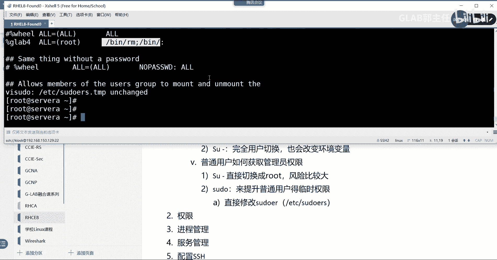

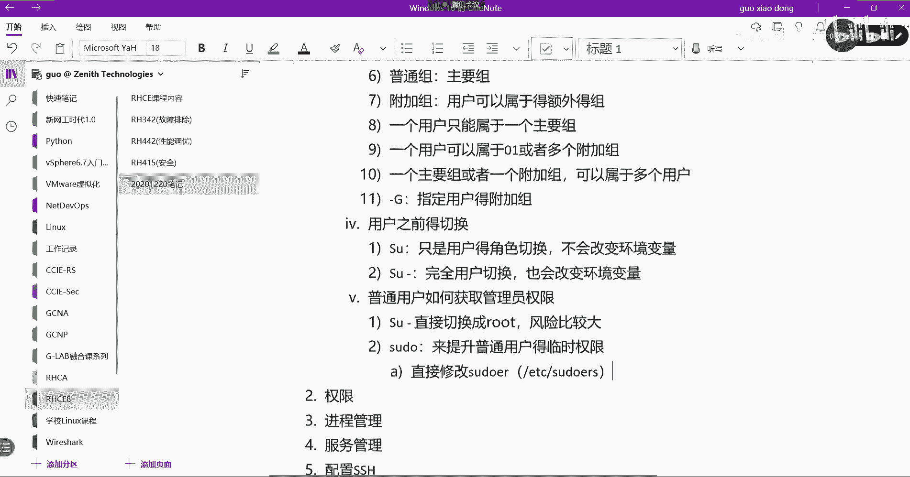

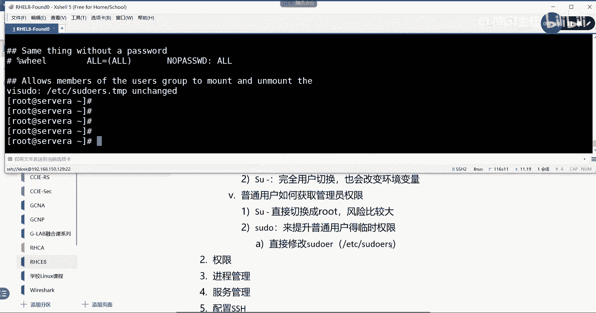

这是传统的配置方式。**强烈建议使用 `visudo` 命令来编辑此文件**，因为它会进行语法检查，防止配置错误导致 `sudo` 不可用。

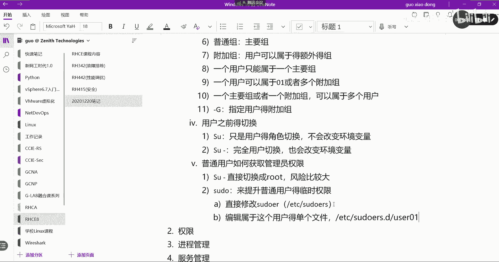

以下是配置步骤：
1.  运行 `visudo` 命令。
2.  在文件中找到类似以下的行：
    ```
    ## Allows people in group wheel to run all commands
    # %wheel        ALL=(ALL)       ALL
    ```
3.  取消注释 `%wheel` 行，或添加新行来授权特定用户或组。例如，授权 `glab4` 用户组的所有成员可以执行任何命令：
    ```
    %glab4        ALL=(ALL)       ALL
    ```
    *   `%glab4`：代表 `glab4` 用户组。
    *   第一个 `ALL`：允许从任何主机执行。
    *   `(ALL)`：允许以任何用户的身份执行命令。
    *   最后一个 `ALL`：允许执行所有命令。

配置完成后，`glab4` 组的成员就可以使用 `sudo` 了：
```bash
[glab4@server ~]$ sudo cat /etc/shadow
[sudo] glab4 的密码： # 此处输入 glab4 自己的密码
...（显示 /etc/shadow 内容）...
```
为了更精细地控制权限，可以在最后指定具体的命令路径，例如 `ALL=/bin/rm,/bin/ls`。

#### 方式二：在 `/etc/sudoers.d/` 目录下创建独立文件

这是更模块化、更清晰的配置方式。系统会自动读取 `/etc/sudoers.d/` 目录下的所有文件。

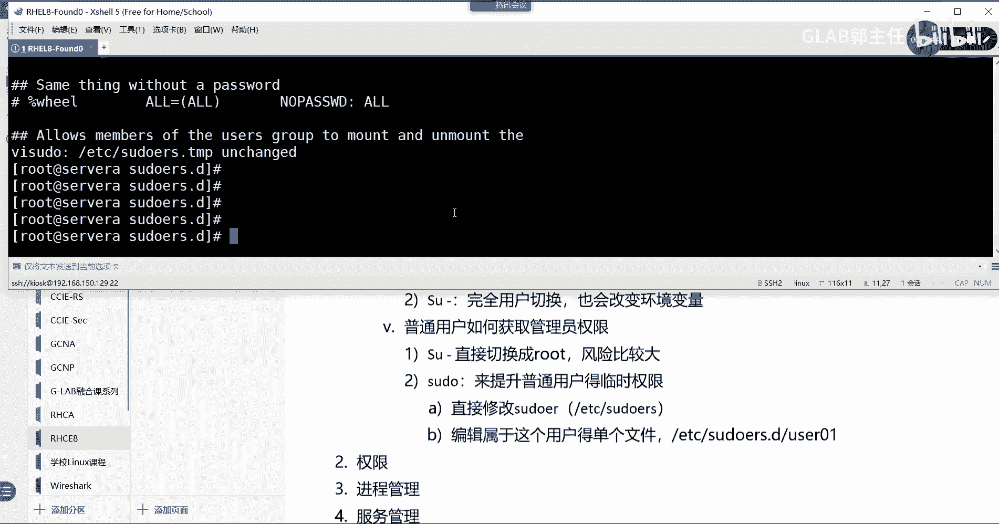

以下是配置步骤：
1.  在 `/etc/sudoers.d/` 目录下为特定用户创建配置文件，例如 `glab3`：
    ```bash
    sudo vim /etc/sudoers.d/glab3
    ```
2.  在文件中写入授权规则，格式与主文件相同：
    ```
    %glab3        ALL=(ALL)       ALL
    ```
3.  保存并退出。

这种方式的好处是每个用户的授权规则独立成文件，便于管理和排查问题。

## 用户与组管理知识补充 📝

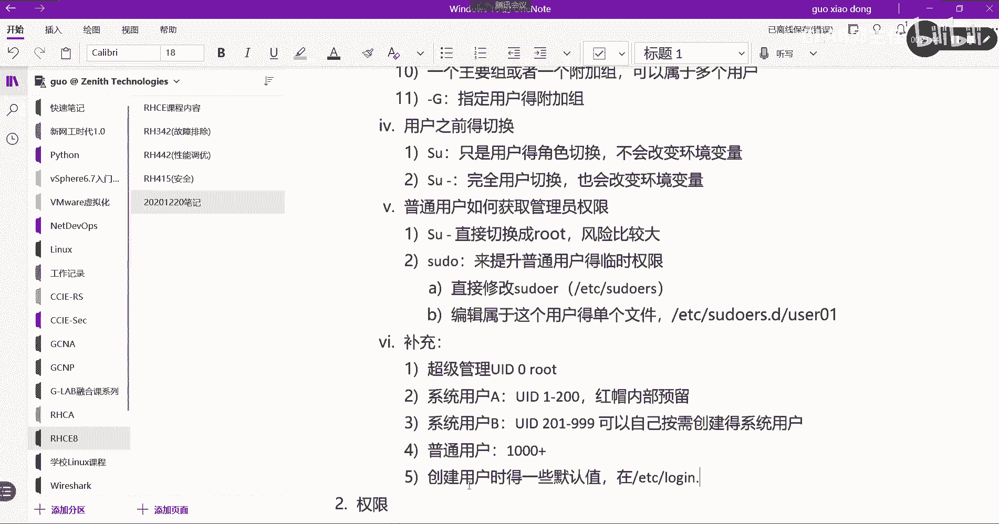

以下是关于用户和组的一些补充知识点。

### 用户ID（UID）分类

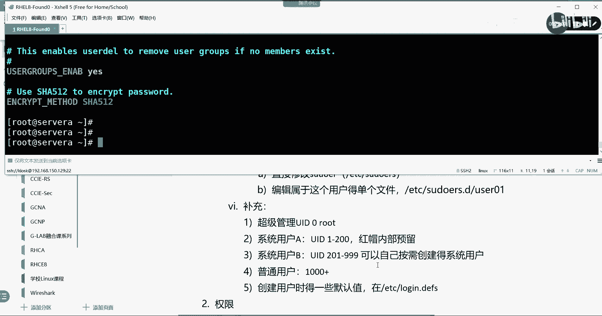

Linux系统中的用户按UID范围可分为三类：
*   **超级管理员（root）**：UID 始终为 **0**。
*   **系统用户**：
    *   **预留系统用户**：UID 范围 **1-200**，由系统静态分配。
    *   **动态系统用户**：UID 范围 **201-999**，通常分配给安装软件时创建的系统账户。
*   **普通用户**：UID 从 **1000** 开始递增。

### 用户创建的默认值

使用 `useradd` 命令创建用户时，其默认参数（如UID起始值、家目录模板、密码过期策略等）定义在 `/etc/login.defs` 和 `/etc/default/useradd` 文件中。修改这些文件可以改变新用户的默认行为。

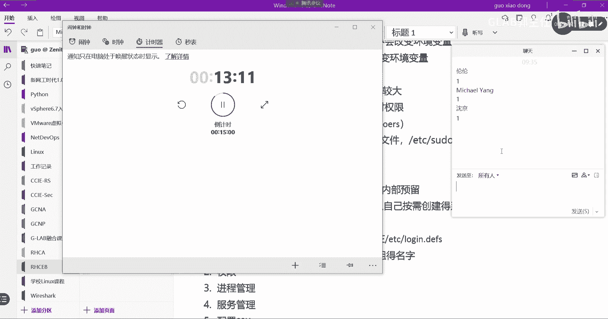

### 修改组名

使用 `groupmod` 命令可以修改已存在的组。`-n` 参数用于修改组名。
```bash
sudo groupmod -n new_group_name old_group_name
```
例如，将组 `glab2` 改名为 `glab22`：
```bash
sudo groupmod -n glab22 glab2
```

## 综合练习 💻

请根据以下要求，在您的Linux系统上完成练习：

1.  创建一个用户 `glab-rhce`，要求：
    *   UID 为 2002。
    *   基本组为 `student`，且该组的 GID 需指定为 3003。
    *   附加组为 `linux`。
    （提示：需先创建 `student` 和 `linux` 组）

2.  创建一个用户 `atom`，要求：
    *   全名（描述）为 “atom guo”。
    *   登录 Shell 指定为 `/bin/bash`。

3.  修改用户 `glab-rhce` 的属性，要求：
    *   将 UID 改为 4004。
    *   将基本组改为 `linux`。
    *   附加组改为 `student` 和 `atom`。

4.  为用户 `atom` 设置密码，并配置密码策略：
    *   密码最短使用期限为 2 天。
    *   密码最长使用期限为 50 天。

5.  将用户 `glab-rhce` 的默认 Shell 改为 `/bin/zsh`（如果系统已安装）。

6.  创建一个系统用户 `hadoop`，要求使用 `-r` 参数创建。

## 总结 📚

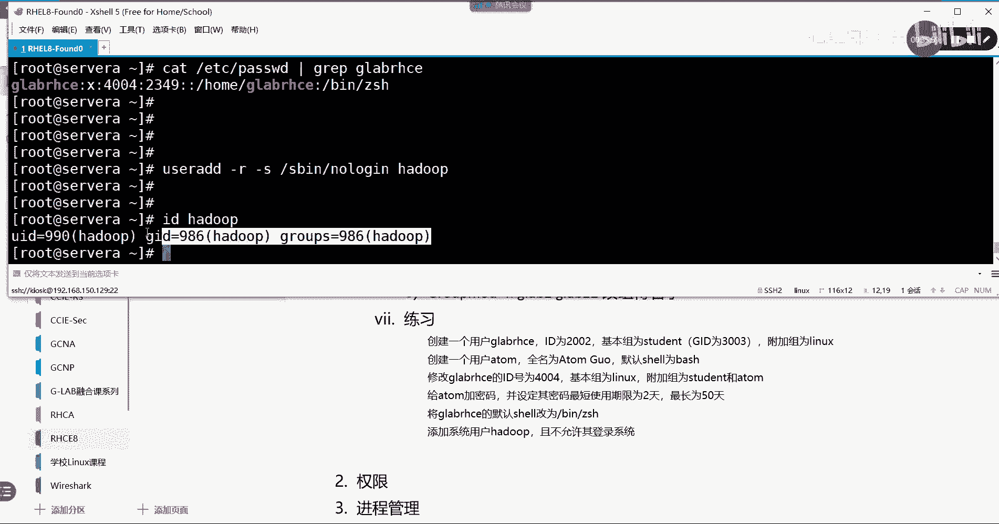

本节课中我们一起学习了Linux用户和组管理的进阶内容。我们掌握了 `su` 与 `su -` 在切换用户时的环境变量区别，理解了使用 `sudo` 安全提升普通用户权限的两种配置方法。此外，我们还补充了UID分类、用户默认值配置以及修改组名等实用知识点。通过课后练习，希望大家能巩固这些操作，为成为高效的Linux系统管理员打下坚实基础。