# Ansible 实验教程：P1：综合实验详解 🚀


在本节课中，我们将学习如何完成一个综合性的 Ansible 实验。这个实验整合了变量、加密文件、多种模块以及任务注册等核心概念，目标是搭建并测试一个配置了 HTTPS 和基本身份验证的 Web 服务。我们将一步步解析实验要求，并理解对应的 Playbook 代码。

## 实验概述与要求 📋

实验位于教材第 128 页，是一个综合性较强的管理实验。它要求我们结合多种变量（普通变量、事实变量）、加密文件以及多个 Ansible 模块来实现一系列任务。

整个实验包含两个 Play。第一个 Play 负责在目标主机上安装和配置 Web 服务及相关组件。第二个 Play 则用于测试配置好的服务是否正常工作。

以下是实验的具体需求列表：

*   **安装并升级软件包**：使用变量定义需要安装的软件包，并将其升级到最新版本。
*   **复制本地文件**：使用 `copy` 模块将控制节点上的特定文件复制到目标主机，并按要求修改文件的所有者和权限。
*   **创建目录**：使用 `file` 模块在目标主机上创建一个目录，该目录将用于存放 Web 服务器基本身份验证所需的密码文件。
*   **复制身份验证文件**：使用 `copy` 模块将另一个用于 HTTPS 身份验证的文件复制到目标主机，同样需要修改其属性。
*   **创建网站首页**：在由变量定义的 Web 根目录下创建 `index.html` 文件，文件内容需要调用 Ansible 事实变量（例如主机的 FQDN 或 IP 地址）。
*   **配置防火墙与服务**：使用 `service` 模块启动防火墙服务，并放行 HTTPS（端口 443）流量。同时，使用 `service` 模块启动 HTTPD 服务。
*   **测试服务**：第二个 Play 中，使用一个指定的普通用户账户，通过 `uri` 模块向配置好的 HTTPS 服务发起请求。测试时需要忽略证书验证（因为是自签名证书），并使用基本身份验证。请求的状态码（应为 200）需要被捕获到注册变量中。
*   **输出测试结果**：最后，使用 `debug` 模块将上一步注册变量中捕获的测试结果打印出来。

## Playbook 代码解析 🛠️

上一节我们明确了实验要求，本节中我们来看看实现这些需求的 Playbook 代码是如何组织的。代码虽然较长，但结构清晰，我们可以分块理解。

### 第一部分：变量定义

Playbook 的开头定义了一系列变量，这些变量对应了实验需求中的各项配置。例如：

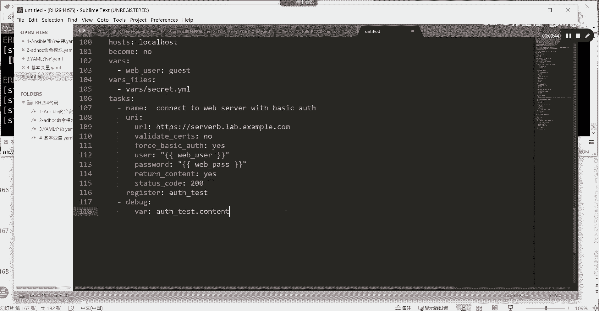

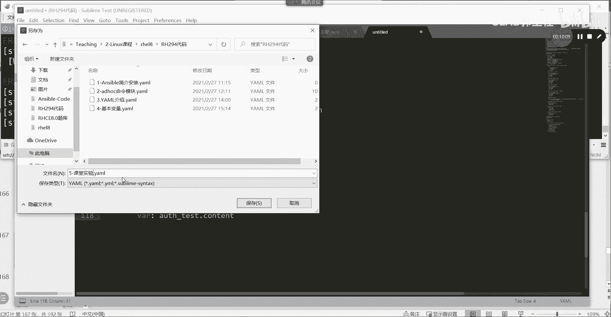

```yaml
vars:
  packages:
    - httpd
    - mod_ssl
    - firewalld
  source_file: “/path/to/local/file”
  dest_file: “/path/to/remote/file”
  web_root: “/var/www/html”
```

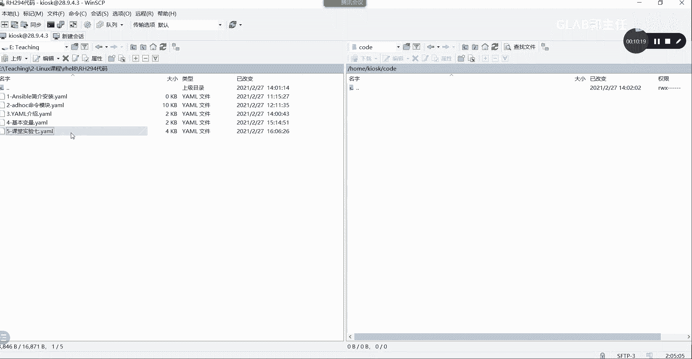

**核心概念解释**：在 Ansible 中，`vars` 用于定义 Playbook 级别的变量。使用变量可以使 Playbook 更灵活、易于维护。

### 第二部分：第一个 Play 的任务（Tasks）

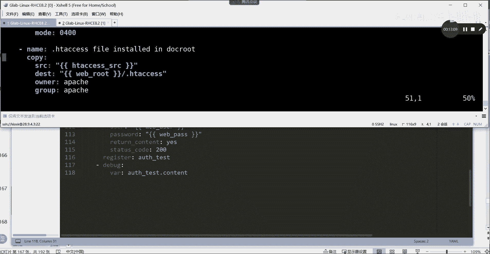

第一个 Play 包含多个任务，每个任务对应一个实验需求。

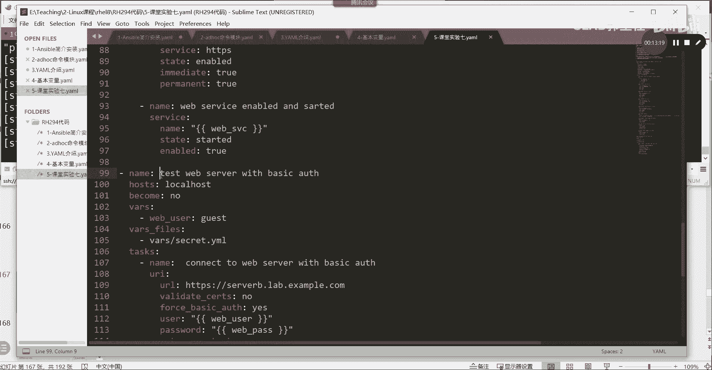

1.  **安装软件包**：使用 `yum` 模块安装 `vars` 中定义的软件包列表。
2.  **复制文件**：使用 `copy` 模块，将 `source_file` 复制到 `dest_file`，并设置 `owner`、`group` 和 `mode`。
    ```yaml
    - name: Copy file with permissions
      copy:
        src: “{{ source_file }}”
        dest: “{{ dest_file }}”
        owner: apache
        group: apache
        mode: ‘0644’
    ```
3.  **创建目录**：使用 `file` 模块创建目录，`state: directory` 表示创建目录而非文件。
4.  **复制 HTTPS 文件**：另一个 `copy` 任务，用于部署 HTTPS 相关的配置文件。
5.  **创建首页文件**：使用 `copy` 模块的 `content` 参数直接生成文件内容。这里调用了事实变量 `{{ ansible_fqdn }}` 和 `{{ ansible_default_ipv4.address }}`。
    **核心概念解释**：事实变量是 Ansible 自动从目标主机收集的系统信息，无需用户定义即可直接使用。
6.  **配置防火墙与服务**：使用 `firewalld` 模块放行 HTTPS 端口，使用 `service` 模块启动 `firewalld` 和 `httpd` 服务。

### 第三部分：第二个 Play 的任务（测试）

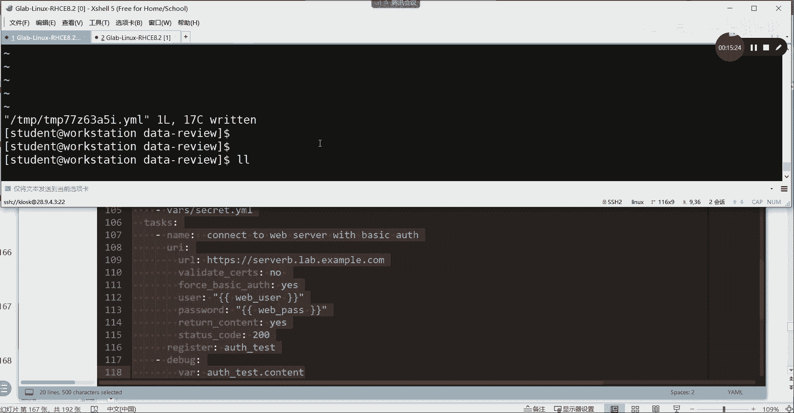

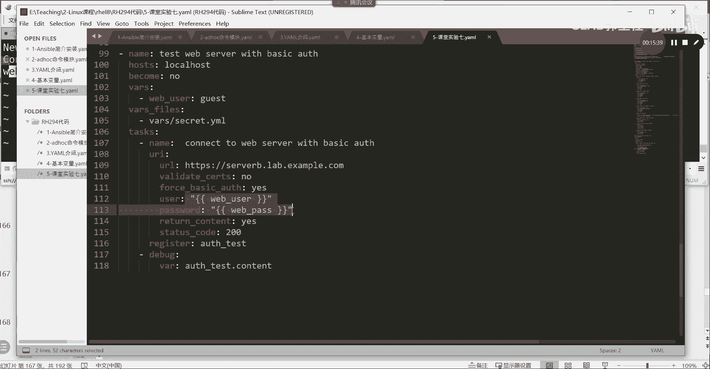

第二个 Play 用于测试服务。

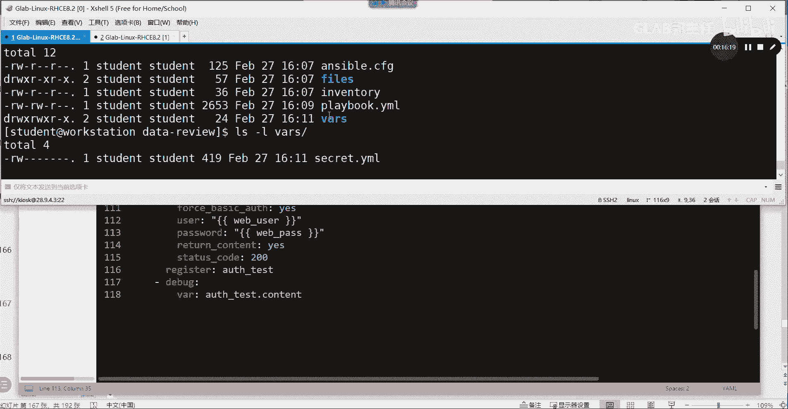

1.  **定义测试用户**：通过变量定义测试时使用的用户名和密码文件路径。
2.  **发起 HTTPS 请求**：使用 `uri` 模块。关键参数包括：
    *   `url`: 测试的 HTTPS 地址。
    *   `validate_certs: no`：忽略自签名证书警告。
    *   `force_basic_auth: yes`：强制使用基本身份验证。
    *   `user` / `password`：身份验证的凭据，其中密码来自加密的变量文件。
    *   `status_code: 200`：期望的返回状态码。
    **核心概念解释**：`register` 关键字将模块的执行结果（包括返回值、状态码等）保存到一个变量中，供后续任务使用。
    ```yaml
    - name: Test HTTPS access
      uri:
        url: “https://{{ ansible_hostname }}/”
        validate_certs: no
        force_basic_auth: yes
        user: “{{ test_user }}”
        password: “{{ web_password }}” # 此变量来自加密文件
        status_code: 200
      register: https_test_result # 注册结果
    ```
3.  **输出测试结果**：使用 `debug` 模块打印出 `https_test_result` 变量的内容，查看详细的测试输出。
    ```yaml
    - name: Display test result
      debug:
        var: https_test_result
    ```

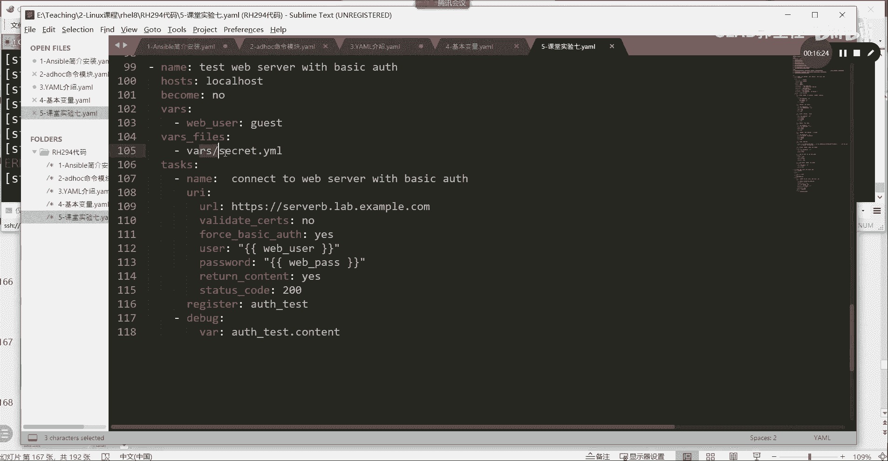

## 加密文件与 Playbook 执行 🔐

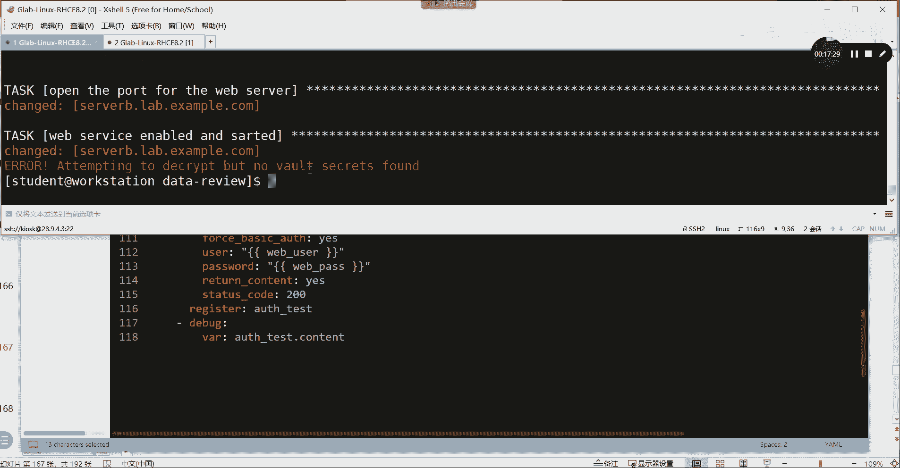

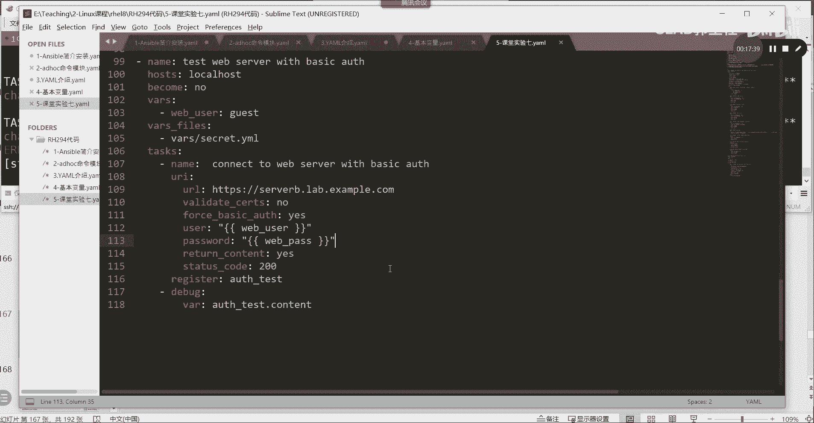

在运行 Playbook 之前，有一个关键步骤是处理加密变量。实验中使用 `ansible-vault` 对包含密码（如 `web_password`）的变量文件进行了加密。

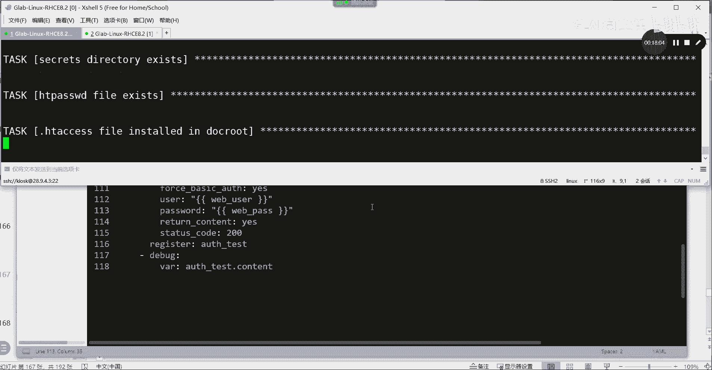

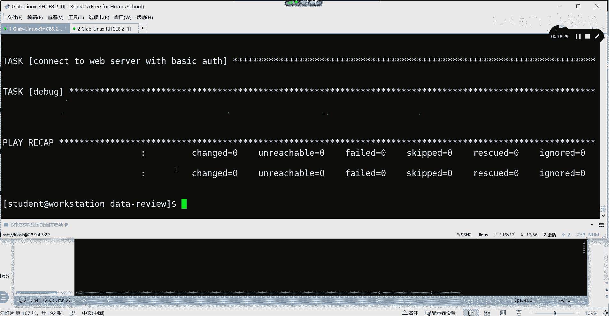

1.  **创建加密变量文件**：使用以下命令创建并编辑一个加密文件。
    ```bash
    ansible-vault create vars/secret.yml
    ```
    文件内容格式为 YAML 字典，例如：
    ```yaml
    web_password: “your_secure_password_here”
    ```
2.  **执行 Playbook**：由于 Playbook 引用了加密文件，执行时必须提供解密密码。
    *   检查语法：`ansible-playbook playbook.yml --syntax-check --ask-vault-pass`
    *   运行 Playbook：`ansible-playbook playbook.yml --ask-vault-pass`
    系统会提示输入加密时设置的密码（例如 `redhat`），输入正确密码后，Playbook 才会正常执行。

## 实验总结与回顾 🎯

本节课中，我们一起完成了一个综合性的 Ansible 实验。通过这个实验，我们实践了以下核心技能：

*   **结构化 Playbook 编写**：学习了如何将复杂的配置需求分解为多个有序的任务（Task），并组织在 Play 中。
*   **变量的综合运用**：熟练使用了普通变量、事实变量以及来自加密文件的变量，使配置更加灵活和安全。
*   **常用模块操作**：巩固了 `yum`（软件包管理）、`copy`（文件复制）、`file`（文件/目录管理）、`service`（服务管理）、`firewalld`（防火墙管理）等模块的使用。
*   **服务测试与调试**：掌握了使用 `uri` 模块测试 Web 服务，并通过 `register` 和 `debug` 模块捕获、输出任务执行结果，这对于自动化运维中的验证环节至关重要。
*   **Ansible Vault 使用**：了解了如何使用 `ansible-vault` 对敏感信息进行加密，确保 Playbook 的安全性。

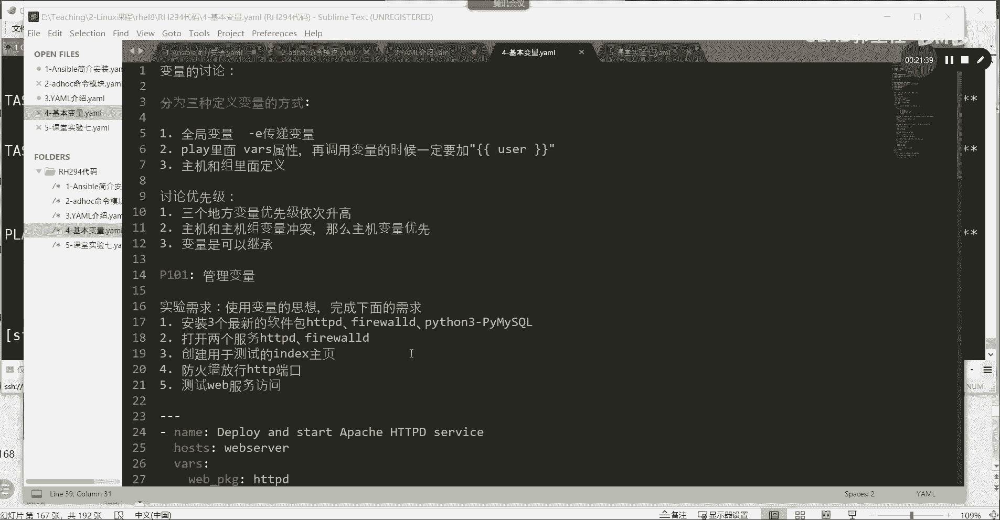

这个实验虽然步骤繁多，但每个步骤都对应着清晰的运维场景。理解并完成它，将为后续更复杂的自动化任务打下坚实的基础。建议初学者务必亲手输入并运行一遍代码，以加深对 Ansible 工作流程和 YAML 格式的理解。