# Linux运维与红帽认证：51：Ansible存储管理 📚

## 概述
在本节课中，我们将学习如何使用Ansible自动化完成复杂的Linux存储管理任务，包括磁盘分区、逻辑卷管理（LVM）以及文件系统挂载。我们将通过一个接近RHCE考试难度的综合案例，理解如何将任务模块化、变量化，从而实现高效、可维护的自动化运维。

---

## 任务需求分析 🔍

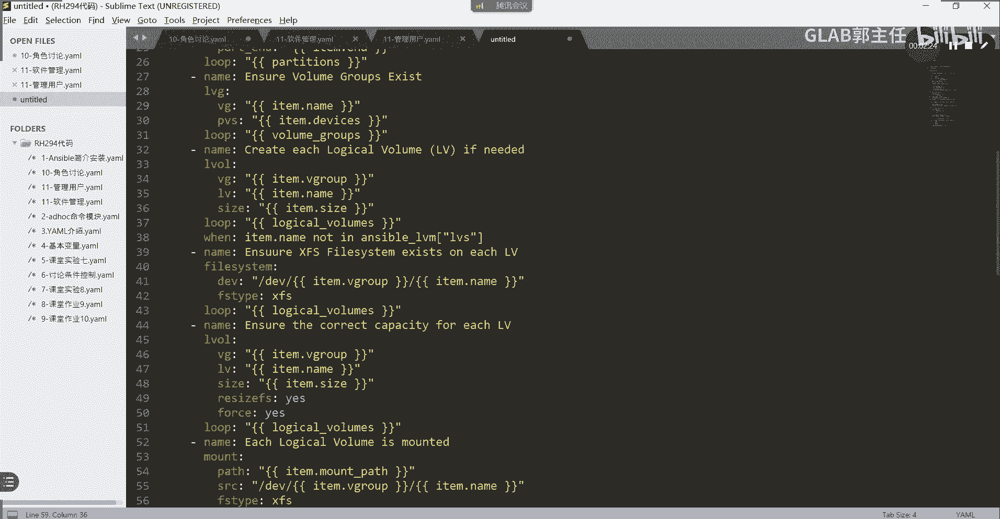

上一节我们介绍了Ansible的基础模块，本节中我们来看看一个综合性的存储管理任务。该任务要求我们完成以下操作：

1.  对指定磁盘设备进行分区。
2.  创建卷组（VG）。
3.  在卷组上创建两个指定大小的逻辑卷（LV）。
4.  将逻辑卷格式化为XFS文件系统。
5.  将格式化后的逻辑卷挂载到指定的目录。

这个任务的复杂程度与RHCE考试要求相近。后续还有一个扩展需求：新增一个分区，将其加入现有卷组，并扩容已有的逻辑卷。

---

## 解决方案架构 🏗️

这个任务的核心是编写一个可复用的Ansible Playbook。其关键在于将配置与执行逻辑分离：所有具体的参数（如分区大小、卷组名、逻辑卷大小等）都定义在一个独立的变量文件中，而Playbook则负责调用这些变量并执行相应的模块。

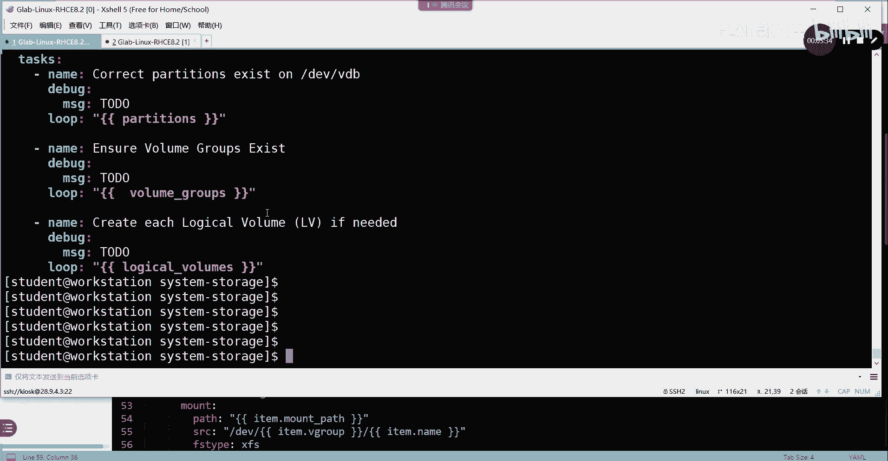

以下是实现此方案的核心文件结构：

```
system_storage/
├── playbook.yml          # 主执行剧本
└── vars/
    └── storage_vars.yml  # 存储配置变量文件
```

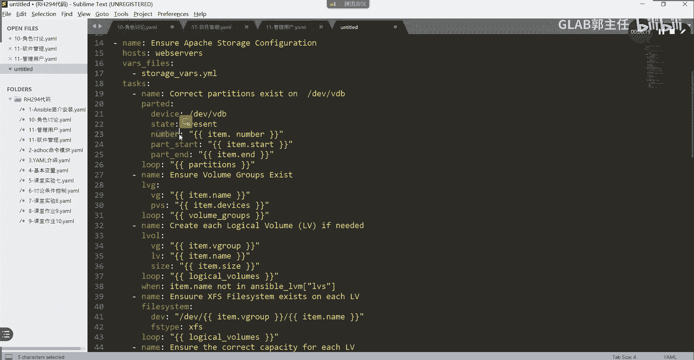

---

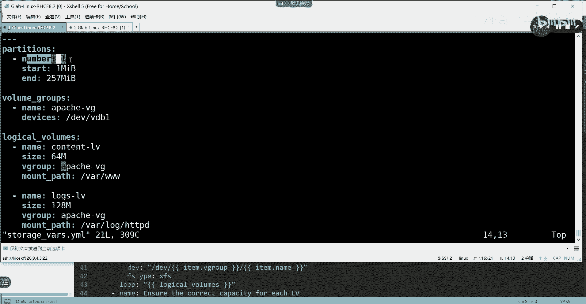

## 详解变量文件 📝

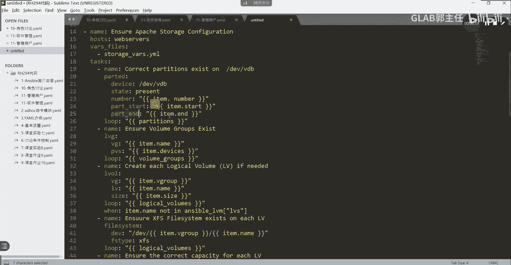

首先，我们来分析存储所有配置参数的变量文件 `storage_vars.yml`。理解这个文件是掌握整个方案的关键。

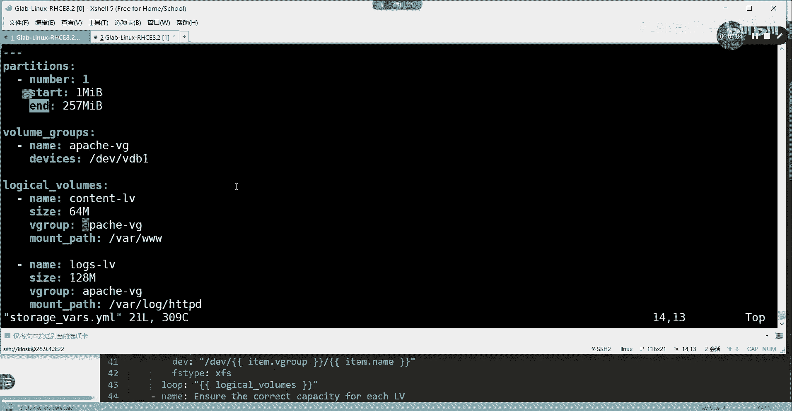

这个文件定义了三个主要部分：

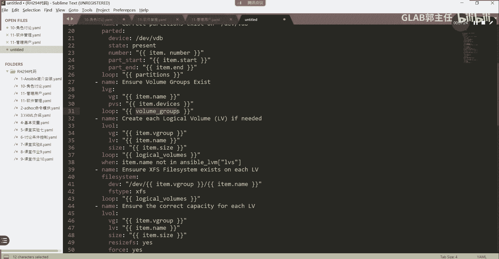

1.  **分区配置 (`partitions`)**: 定义要在哪个磁盘上创建几个分区，以及每个分区的起始和结束位置。
2.  **卷组配置 (`volume_groups`)**: 定义卷组的名称，以及由哪些物理卷（分区）组成。
3.  **逻辑卷配置 (`logical_volumes`)**: 定义逻辑卷的名称、所属卷组、大小以及挂载点。

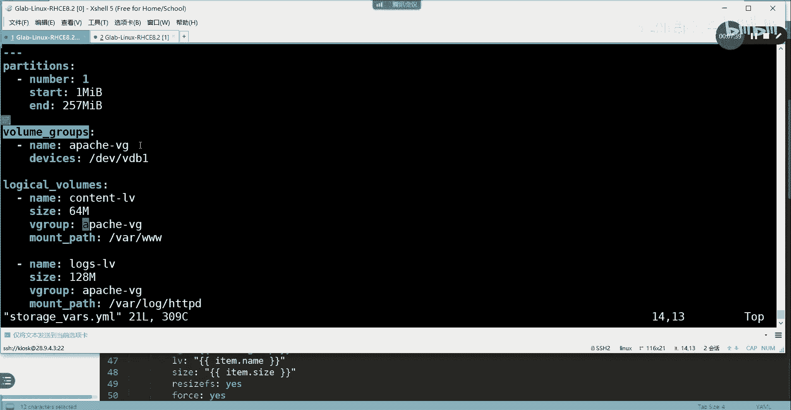

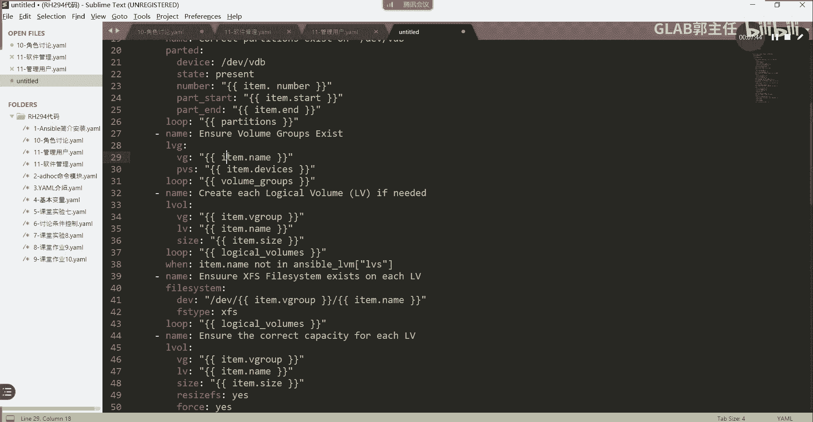

**变量文件示例 (`storage_vars.yml`):**
```yaml
partitions:
  - device: /dev/vdb
    number: 1
    start: 1MiB
    end: 257MiB

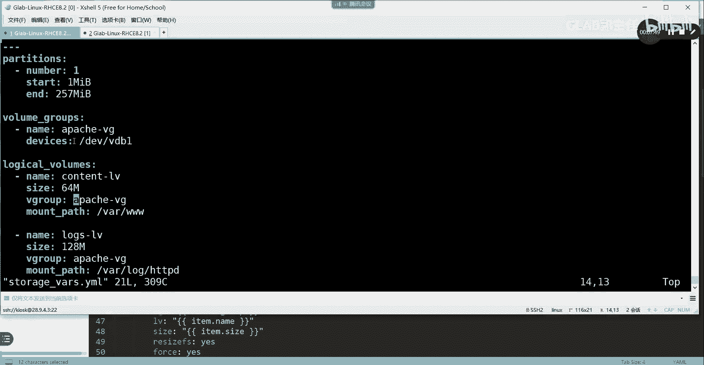

volume_groups:
  - name: my_vg
    pvs:
      - /dev/vdb1

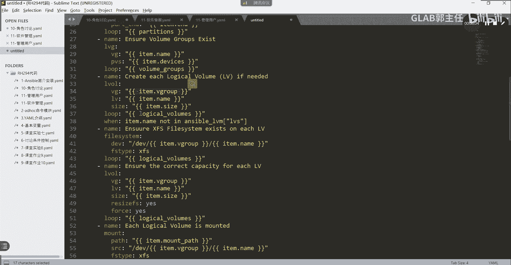

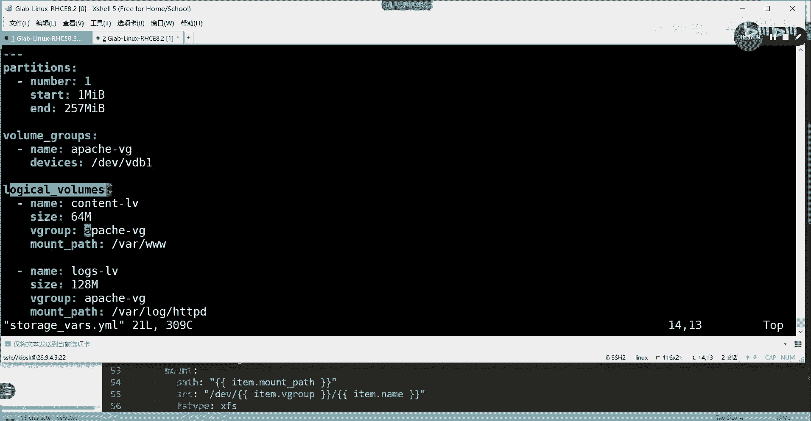

logical_volumes:
  - name: lv1
    vg: my_vg
    size: 64MiB
    mount_point: /mnt/lv1
  - name: lv2
    vg: my_vg
    size: 128MiB
    mount_point: /mnt/lv2
```
**代码解释：**
*   `partitions` 是一个列表，每个元素是一个字典，描述了分区的详细信息。
*   `volume_groups` 定义了名为 `my_vg` 的卷组，它由物理卷 `/dev/vdb1` 构成。
*   `logical_volumes` 定义了两个逻辑卷 `lv1` 和 `lv2`，分别设置了大小和挂载点。

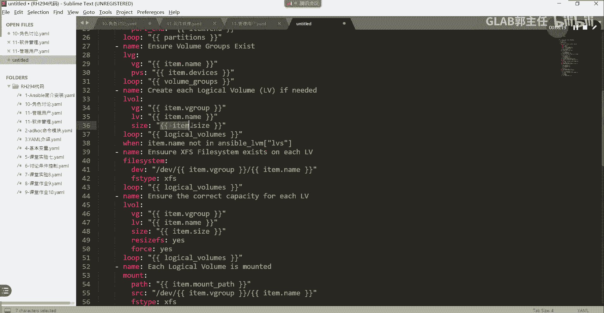

**维护逻辑：** 后期如果需要修改分区方案、扩容逻辑卷或新增挂载点，**只需修改这个变量文件**，无需改动Playbook主逻辑，极大地提升了可维护性。

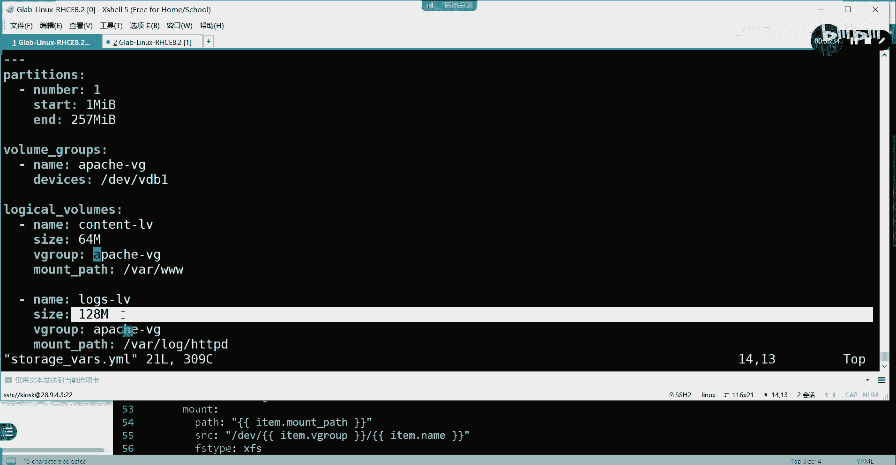

---

## 详解Playbook剧本 🎬

理解了变量文件后，我们来看Playbook如何利用这些变量来执行任务。Playbook中的任务按顺序执行，每个任务调用特定的Ansible模块。

### 任务一：创建分区
使用 `parted` 模块对磁盘进行分区。任务会循环读取 `partitions` 变量列表中的每一项。

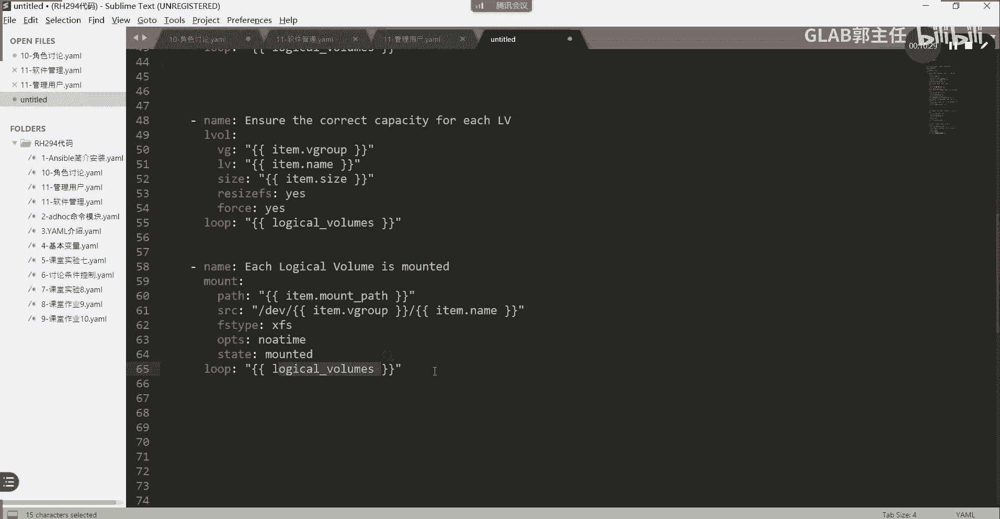

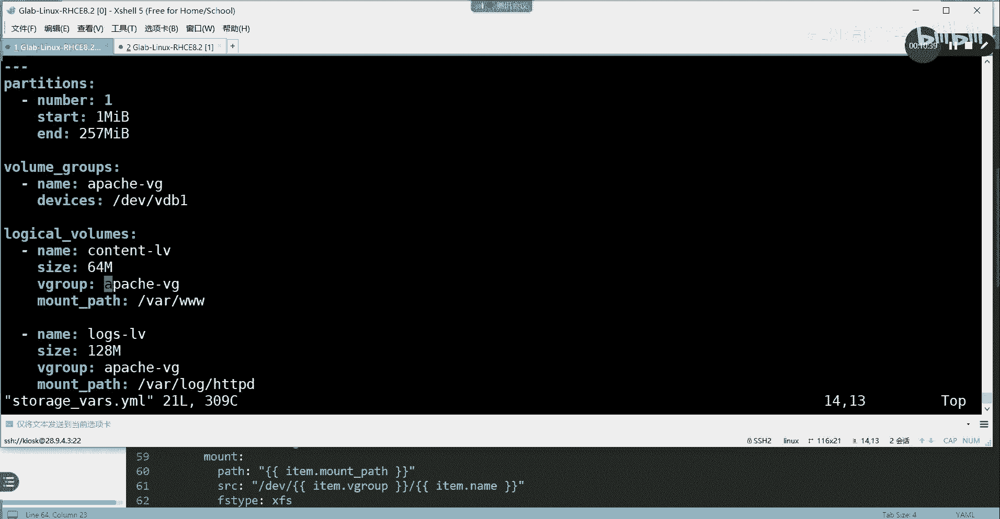

```yaml
- name: Create partitions
  parted:
    device: “{{ item.device }}”
    number: “{{ item.number }}”
    state: present
    part_start: “{{ item.start }}”
    part_end: “{{ item.end }}”
  loop: “{{ partitions }}”
```
**公式/代码解释：**
*   `loop: “{{ partitions }}”`：让任务对 `partitions` 列表进行循环。
*   `“{{ item.device }}”`：在每次循环中，`item` 代表列表中的一个元素，这里引用其 `device` 键的值。

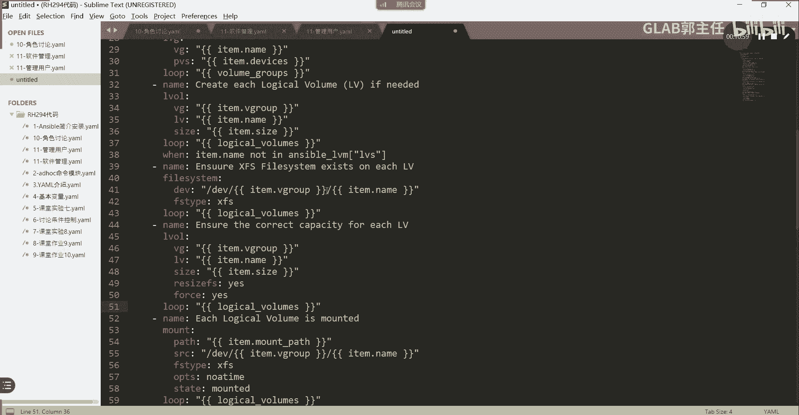

### 任务二：创建卷组
使用 `lvg` 模块创建卷组。任务循环读取 `volume_groups` 变量。

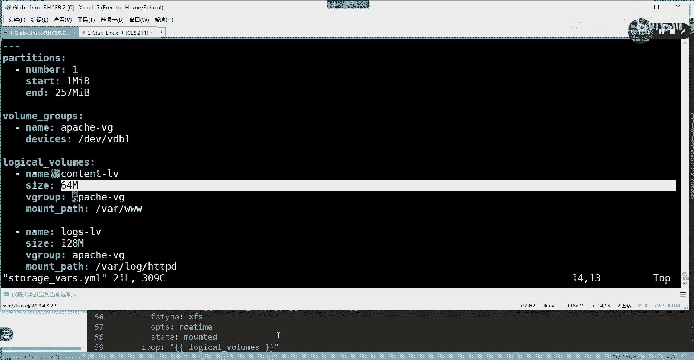

```yaml
- name: Create volume group
  lvg:
    vg: “{{ item.name }}”
    pvs: “{{ item.pvs }}”
  loop: “{{ volume_groups }}”
```

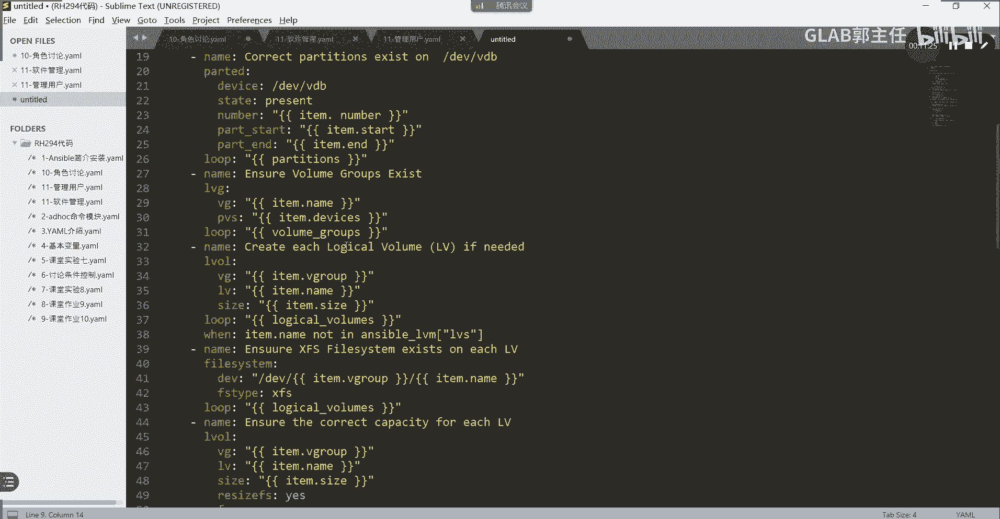

### 任务三：创建逻辑卷
使用 `lvol` 模块创建逻辑卷。任务循环读取 `logical_volumes` 变量，并通过 `when` 条件判断避免重复创建。

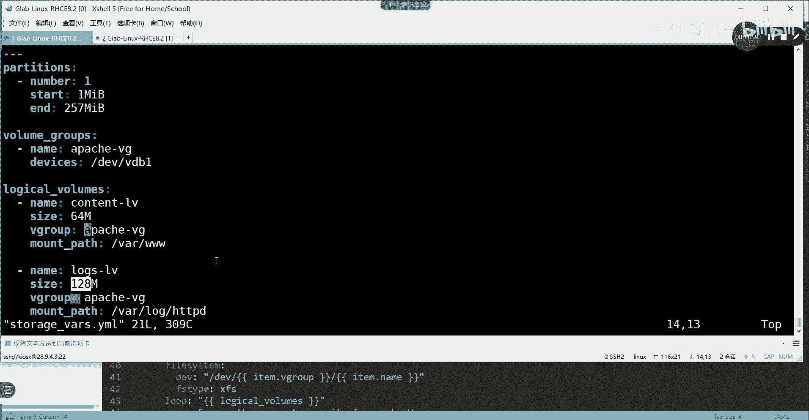

```yaml
- name: Create logical volumes
  lvol:
    vg: “{{ item.vg }}”
    lv: “{{ item.name }}”
    size: “{{ item.size }}”
  loop: “{{ logical_volumes }}”
  when: item.name not in ansible_lvm.lvs
```
**公式/代码解释：**
*   `when: item.name not in ansible_lvm.lvs`：这是一个条件判断。`ansible_lvm.lvs` 是Ansible收集到的目标主机上现有逻辑卷的列表。只有当要创建的逻辑卷名不在这个列表中时，才执行创建操作。

### 任务四：格式化文件系统
使用 `filesystem` 模块将创建好的逻辑卷格式化为XFS文件系统。

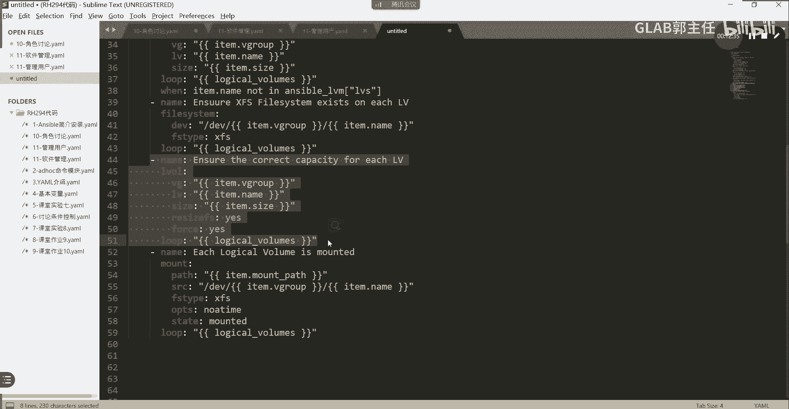

```yaml
- name: Format logical volumes with XFS
  filesystem:
    fstype: xfs
    dev: “/dev/{{ item.vg }}/{{ item.name }}”
  loop: “{{ logical_volumes }}”
```

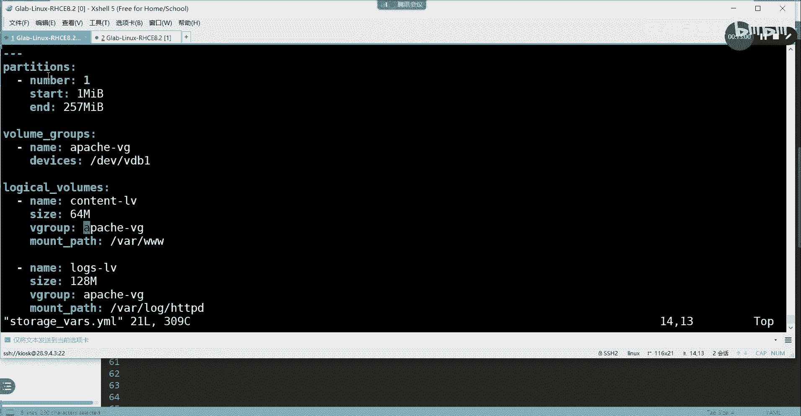

### 任务五：挂载文件系统
使用 `mount` 模块将格式化后的逻辑卷挂载到指定的目录。

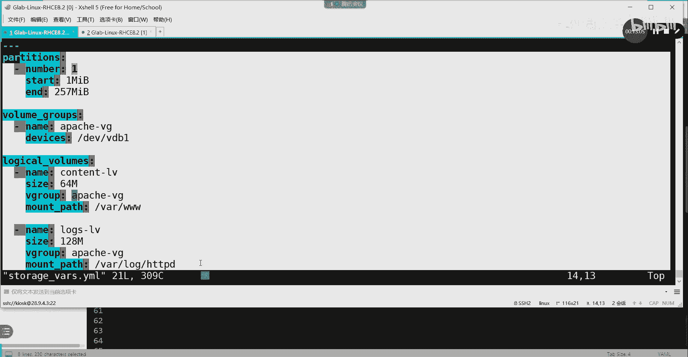

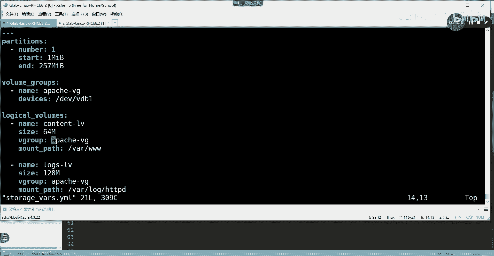

```yaml
- name: Mount logical volumes
  mount:
    path: “{{ item.mount_point }}”
    src: “/dev/{{ item.vg }}/{{ item.name }}”
    fstype: xfs
    state: mounted
  loop: “{{ logical_volumes }}”
```

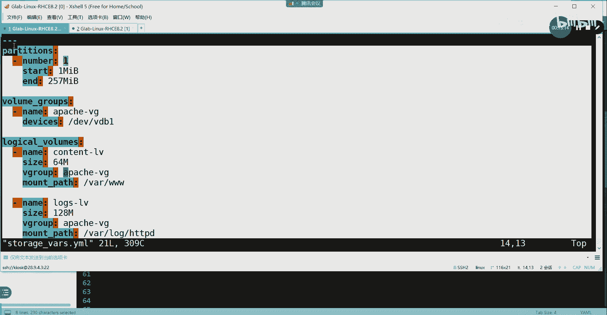

---

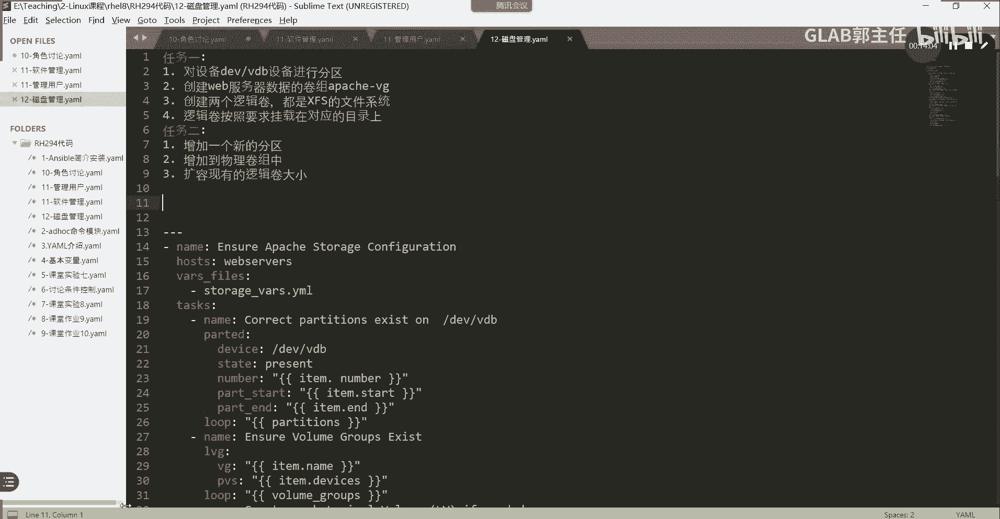

## 处理扩展需求：扩容与新增 📈

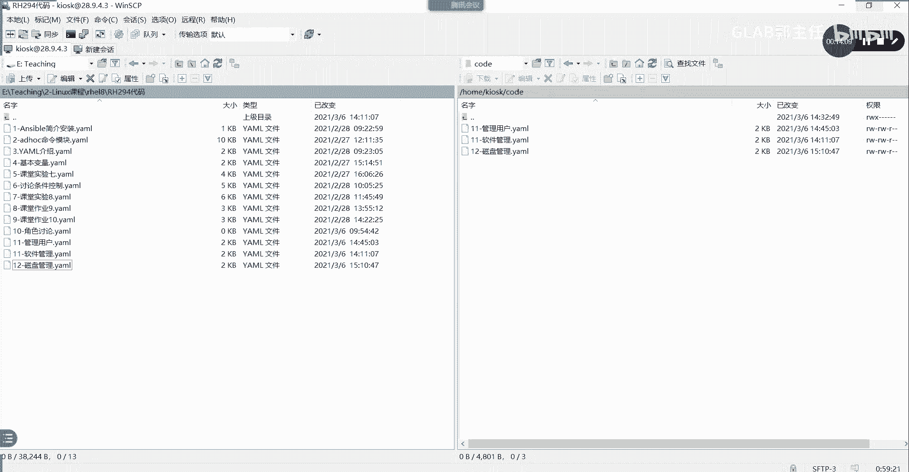

上一节我们完成了基础的存储配置，本节中我们来看看如何应对变化的需求：新增分区并扩容现有逻辑卷。

假设需求变为：
1.  在 `/dev/vdb` 上新增第二个分区 (`/dev/vdb2`)。
2.  将新分区加入现有的 `my_vg` 卷组。
3.  将逻辑卷 `lv1` 从 64MiB 扩容到 128MiB，`lv2` 从 128MiB 扩容到 256MiB。

我们只需要做两步：

**第一步：更新变量文件**
修改 `storage_vars.yml`，添加新分区信息，并更新逻辑卷大小。
```yaml
partitions:
  - device: /dev/vdb
    number: 1
    start: 1MiB
    end: 257MiB
  - device: /dev/vdb # 新增第二个分区
    number: 2
    start: 257MiB
    end: 513MiB

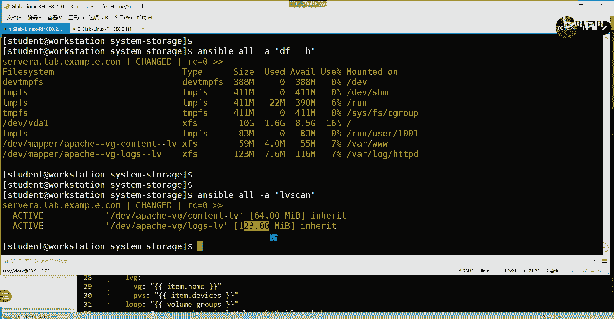

volume_groups:
  - name: my_vg
    pvs: # 将新分区加入PV列表
      - /dev/vdb1
      - /dev/vdb2

logical_volumes:
  - name: lv1
    vg: my_vg
    size: 128MiB # 大小从64改为128
    mount_point: /mnt/lv1
  - name: lv2
    vg: my_vg
    size: 256MiB # 大小从128改为256
    mount_point: /mnt/lv2
```

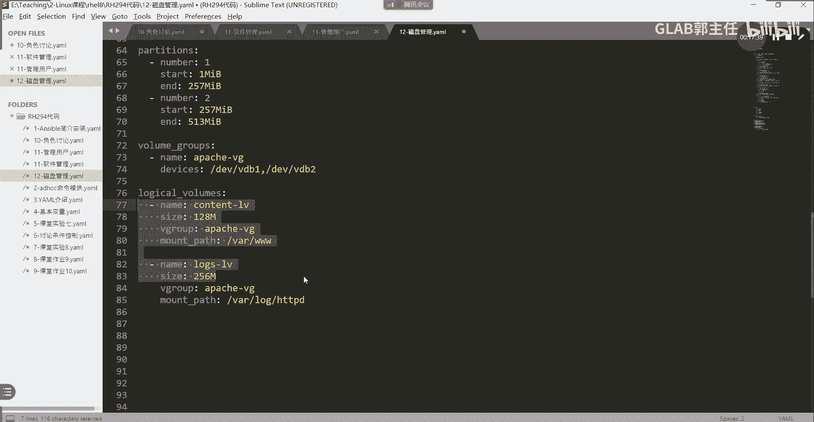

**第二步：在Playbook中添加扩容任务**
在创建逻辑卷的任务后，需要添加一个使用 `lvol` 模块进行扩容的任务，并设置 `resizefs` 参数为 `yes` 以在线调整文件系统大小。
```yaml
- name: Resize logical volumes if needed
  lvol:
    vg: “{{ item.vg }}”
    lv: “{{ item.name }}”
    size: “{{ item.size }}”
    resizefs: yes # 关键参数，自动调整文件系统
  loop: “{{ logical_volumes }}”
```
**代码解释：** `resizefs: yes` 参数使得Ansible在扩容逻辑卷后，自动调用相应的工具（如 `xfs_growfs`）来扩展文件系统，无需手动操作。

完成以上修改后，再次运行Playbook，Ansible将自动识别变化：创建新分区、将其加入卷组、扩容逻辑卷并调整文件系统。

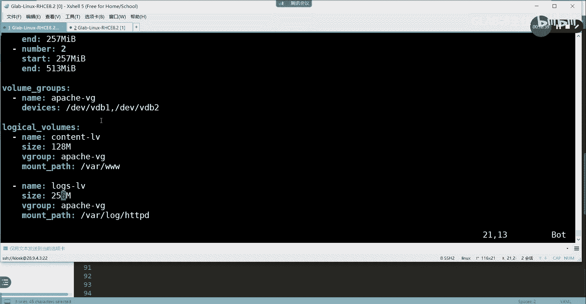

---

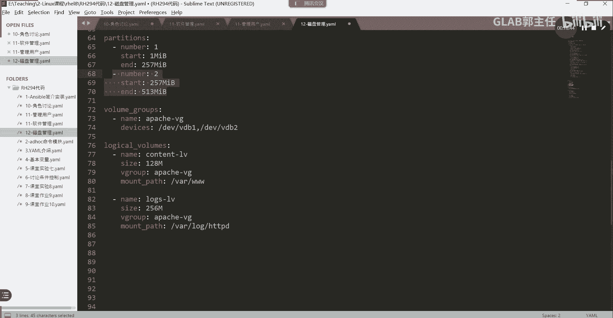

## 总结 🎯

本节课中我们一起学习了如何使用Ansible自动化管理Linux存储。

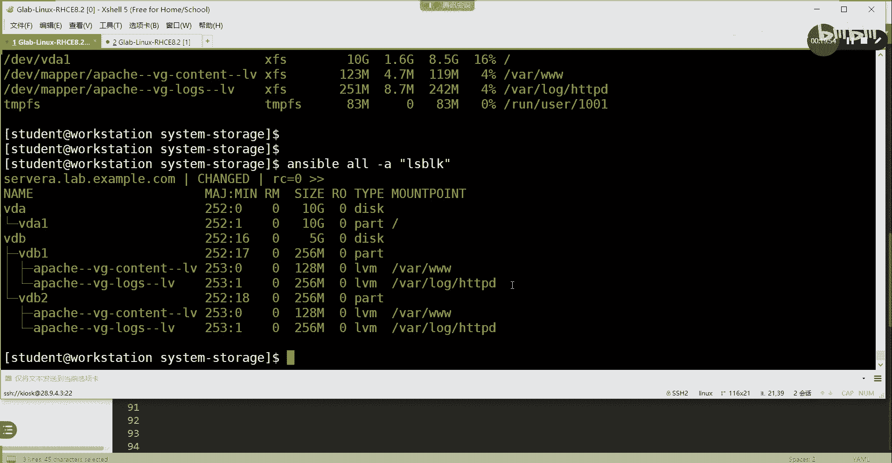

1.  **核心思想**：采用“配置与执行分离”的架构。将易变的参数（分区、大小、挂载点）写入**变量文件**，将固定的执行逻辑写入**Playbook**。
2.  **关键模块**：我们使用了 `parted`（分区）、`lvg`（卷组）、`lvol`（逻辑卷）、`filesystem`（格式化）和 `mount`（挂载）等核心模块。
3.  **维护优势**：这种方式的巨大优势在于**可维护性**。未来任何存储配置的变更，无论是新增磁盘、扩容还是调整结构，运维人员通常只需要修改直观的变量文件，而无需深入理解或修改复杂的Playbook逻辑。
4.  **扩展性**：此方案可以轻松地从管理一台主机扩展到管理上百台主机，实现批量、一致的存储配置，是自动化运维的典型实践。

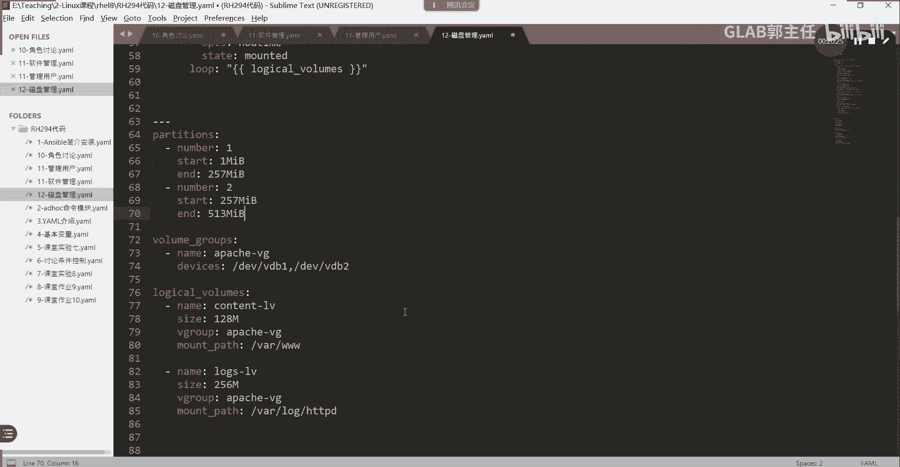

通过掌握这个案例，你不仅能够应对RHCE认证中的相关考题，更能将这种高效的自动化思想应用到实际运维工作中，提升工作效率。