# Linux运维基础：18：归档、压缩与文件传输 📦

在本节课中，我们将要学习Linux系统中三个非常实用的操作：归档、压缩以及在不同系统间安全地传输文件。理解这些概念和掌握相关命令，是进行系统备份、数据迁移和日常文件管理的基础。

## 归档与压缩的概念 🔍

上一节我们介绍了文件系统的基本操作，本节中我们来看看如何高效地管理多个文件或节省存储空间。首先，需要明确两个核心概念：**归档**和**压缩**。

*   **归档**：指将多个文件或目录汇集成为一个单独的**文件**。这个操作本身**不会**减少文件所占用的总存储空间。其核心目的是为了方便管理，例如将分散的项目文件打包成一个整体。
    *   公式表示：`文件1 + 文件2 + ... + 文件N -> 归档文件.tar`
*   **压缩**：指通过特定算法，减小一个或**多个**文件所占用的存储空间。压缩后的文件体积更小，便于存储和网络传输。
    *   公式表示：`大文件 -> 压缩算法 -> 小文件.gz/.bz2/.xz`

在Linux中，归档通常使用 `tar` 命令，而压缩则有 `gzip`、`bzip2`、`xz` 等不同工具和算法。

## tar命令详解与实战 🛠️

理解了基本概念后，我们深入看看最常用的归档命令 `tar`。它功能强大，既可以单独归档，也可以结合压缩选项一步完成归档压缩。

`tar` 命令的常用选项可以分为两类：归档操作和压缩操作。

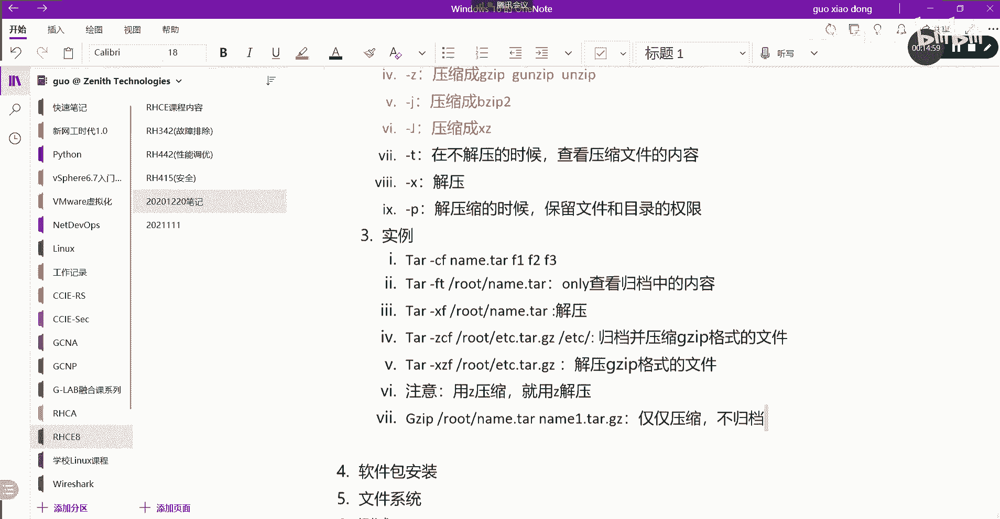

以下是 `tar` 命令的主要选项列表：

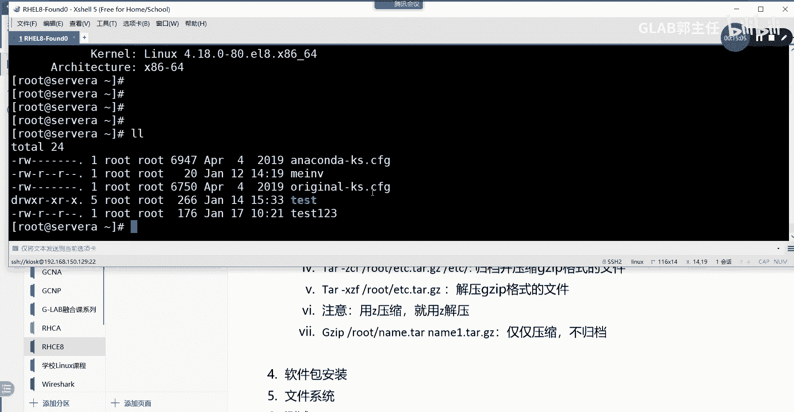

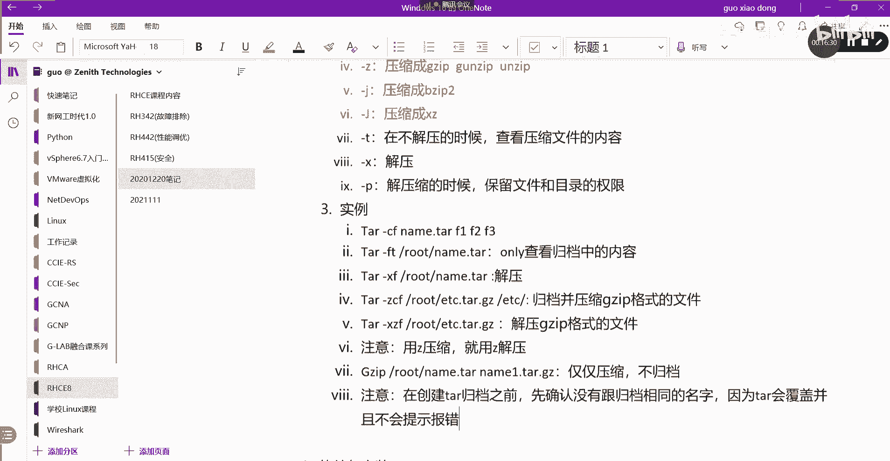

*   **归档相关选项**
    *   `-c`：创建新的归档文件。
    *   `-f`：指定归档文件的名称。
    *   `-v`：显示命令执行的详细过程。
    *   `-t`：列出归档文件中的内容（不解压）。
    *   `-x`：从归档文件中提取文件（解压）。
    *   `-p`：解压时保留文件和目录的原始权限。
*   **压缩相关选项**
    *   `-z`：使用 `gzip` 进行压缩或解压，生成 `.tar.gz` 或 `.tgz` 文件。
    *   `-j`：使用 `bzip2` 进行压缩或解压，生成 `.tar.bz2` 文件。
    *   `-J`：使用 `xz` 进行压缩或解压，生成 `.tar.xz` 文件。

**重要原则**：用什么选项压缩，就必须用对应的选项解压。例如，用 `-z` 压缩，解压时也必须用 `-z`。

现在，让我们通过一些实例来掌握这些选项的用法：

1.  **仅归档，不压缩**
    ```bash
    tar -cf archive.tar file1 file2 file3
    ```
    此命令将 `file1`, `file2`, `file3` 三个文件归档到 `archive.tar` 中，不进行压缩。

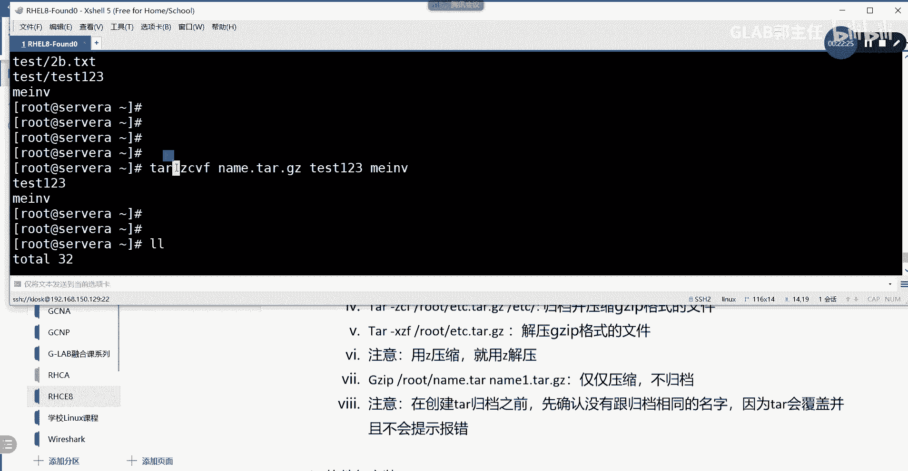

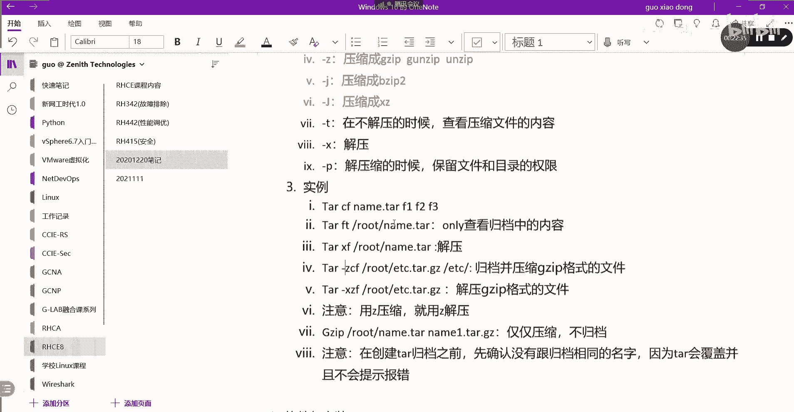

2.  **查看归档内容**
    ```bash
    tar -tf archive.tar
    ```
    此命令列出 `archive.tar` 归档包内的所有文件和目录，无需解压。

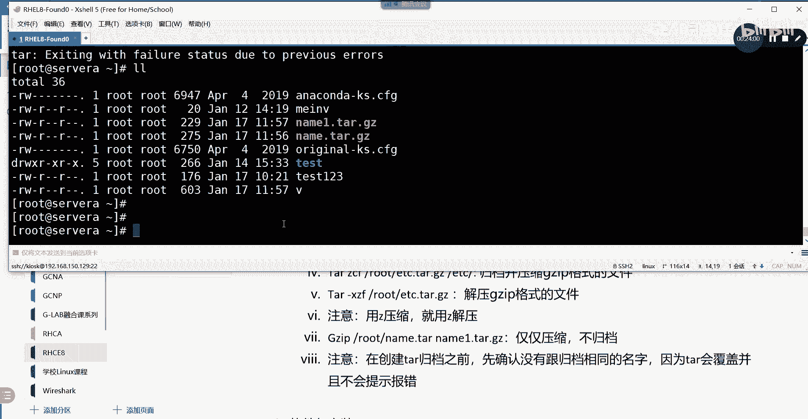

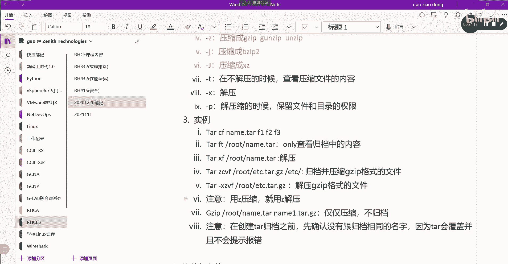

3.  **解压归档文件**
    ```bash
    tar -xf archive.tar
    ```
    此命令将 `archive.tar` 归档包中的内容解压到当前目录。

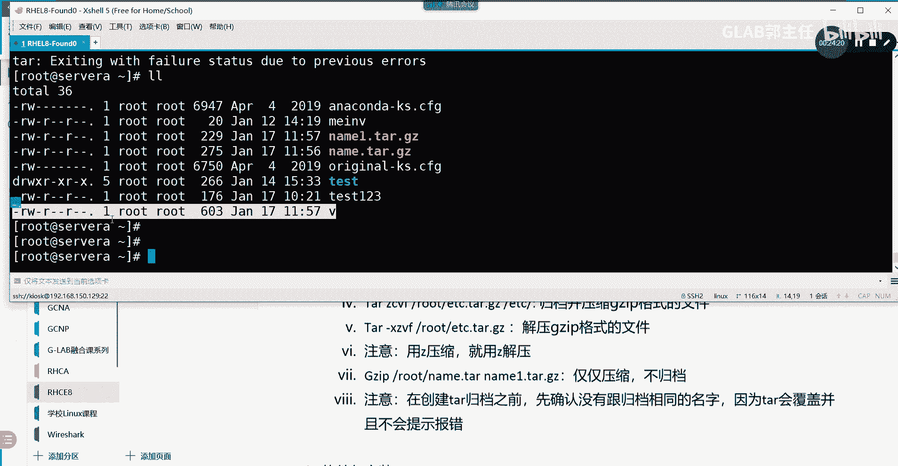

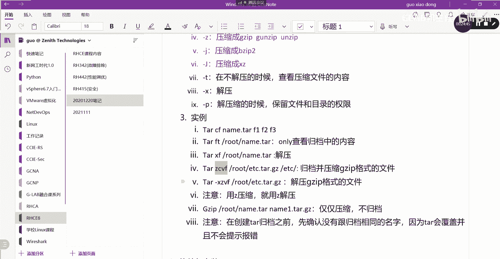

4.  **归档并压缩（使用gzip）**
    ```bash
    tar -zcf backup.tar.gz /etc
    ```
    此命令将 `/etc` 目录归档并采用 `gzip` 压缩，生成 `backup.tar.gz` 文件。

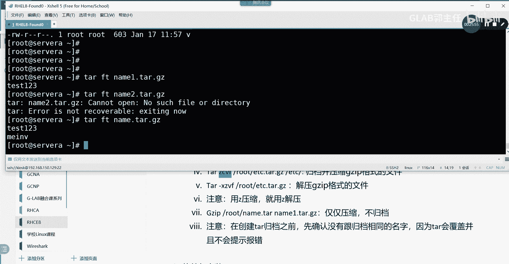

5.  **解压 `.tar.gz` 文件**
    ```bash
    tar -zxf backup.tar.gz
    ```
    此命令解压由 `gzip` 压缩的归档文件 `backup.tar.gz`。

**⚠️ 注意事项**：
*   执行 `tar -cf` 创建归档时，如果目标文件名已存在，`tar` 会**直接覆盖**且不提示，操作前请确认。
*   选项的顺序有时有影响，通常 `-f` 选项应紧随其指定的文件名之前。例如 `tar -zcvf` 是常见写法。

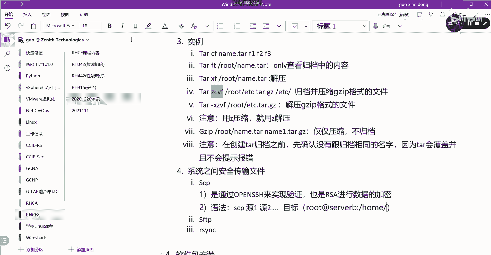

## 系统间安全文件传输 🌐

在日常运维中，我们经常需要在不同服务器之间传输文件。Linux提供了多种基于SSH协议的安全传输方式，它们都通过SSH进行身份验证，并使用RSA密钥对加密数据，保证了传输的安全性。

### 1. scp (Secure Copy)

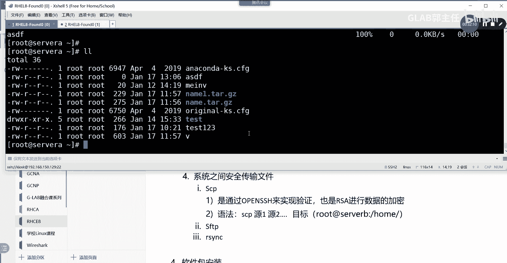

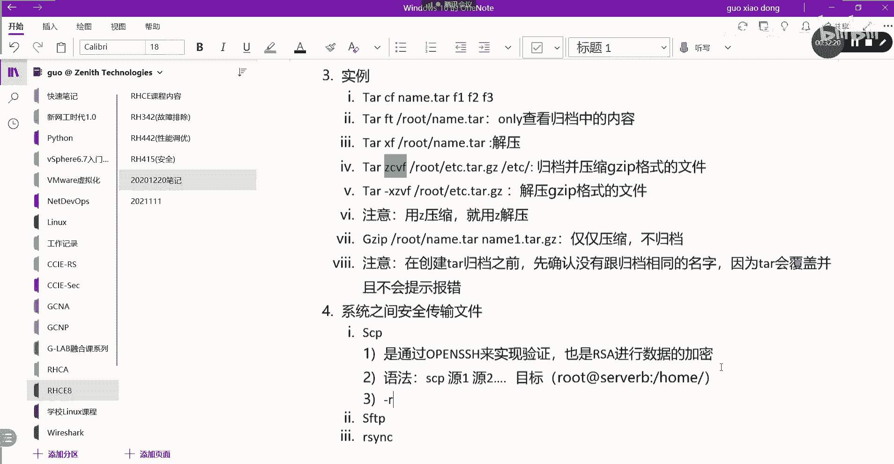

`scp` 命令用于在本地和远程主机之间复制文件，其语法类似于 `cp` 命令，但源或目标可以包含远程主机信息。

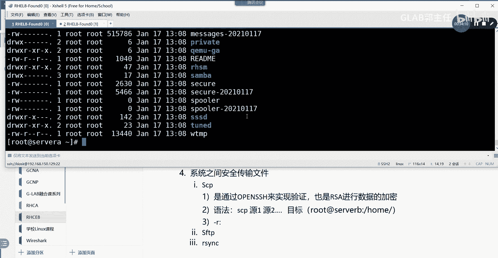

基本语法：
```bash
scp [选项] 源文件 目标路径
```

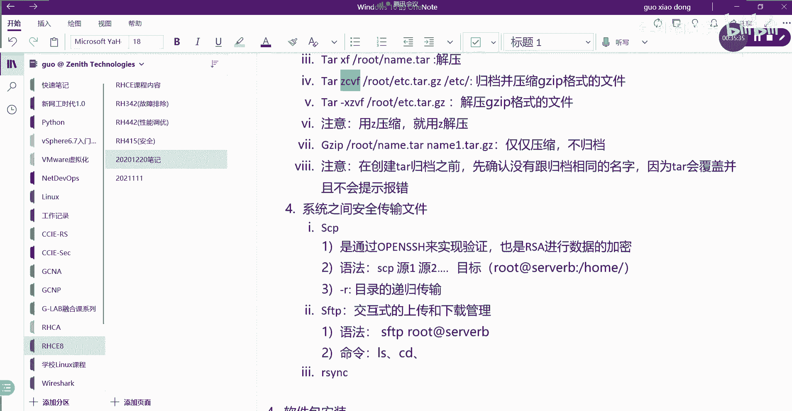

实例演示：
*   **将本地文件推送到远程服务器**：
    ```bash
    scp myfile.tar.gz root@serverb:/home/
    ```
    将本地的 `myfile.tar.gz` 复制到远程服务器 `serverb` 的 `/home/` 目录下。
*   **从远程服务器拉取文件到本地**：
    ```bash
    scp root@serverb:/root/asdf ./
    ```
    将远程服务器 `serverb` 上 `/root/asdf` 文件复制到本地当前目录。
*   **递归复制整个目录**（使用 `-r` 选项）：
    ```bash
    scp -r root@serverb:/var/log ./test/
    ```
    将远程服务器上的整个 `/var/log` 目录复制到本地的 `./test/` 目录下。

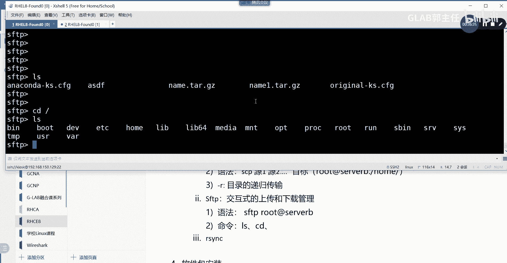

### 2. sftp (Secure File Transfer Protocol)

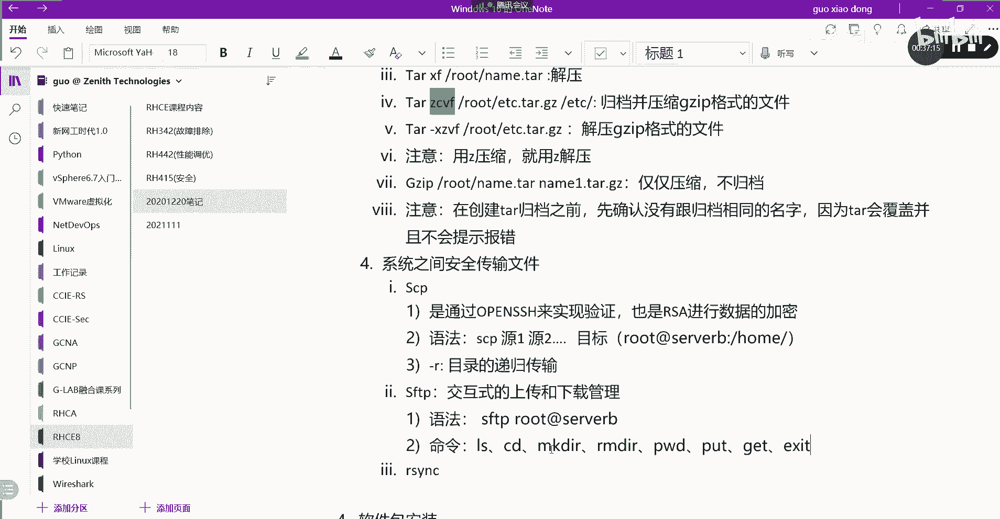

`sftp` 提供了一个交互式的文件传输会话，类似于传统的FTP，但更加安全。它允许你在连接后执行一系列文件管理操作。

连接远程主机：
```bash
sftp root@serverb
```
连接成功后，会进入 `sftp>` 提示符。

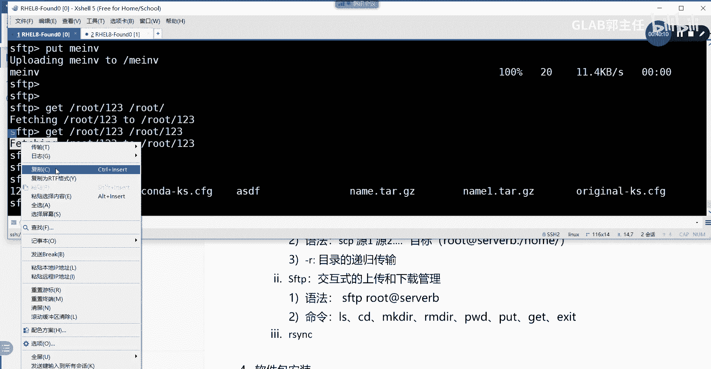

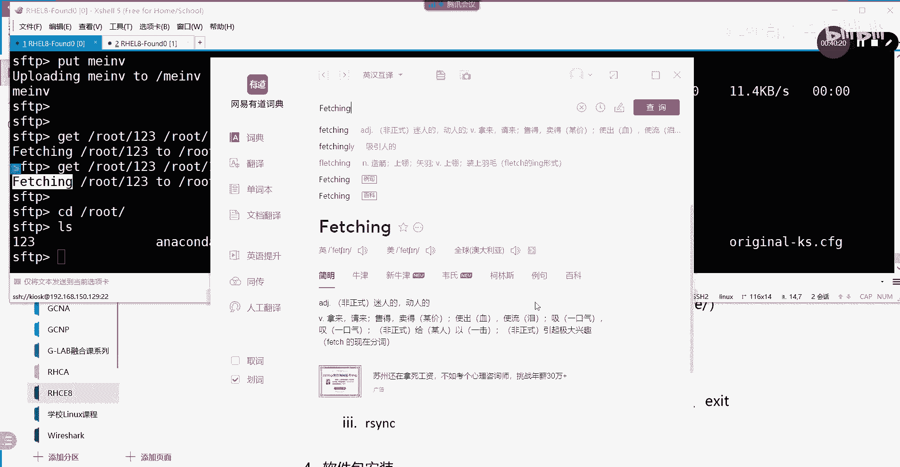

以下是 `sftp` 会话中的常用命令列表：

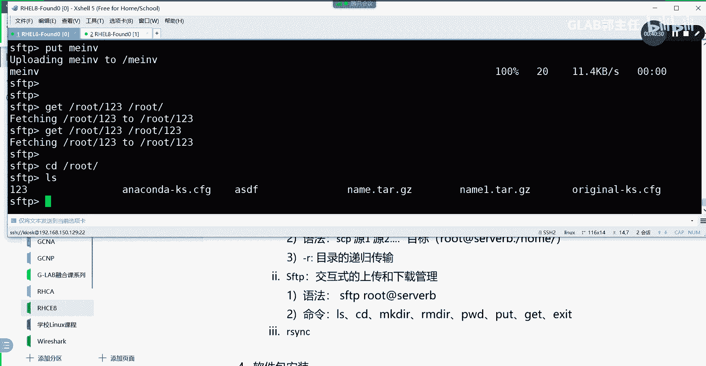

*   `ls`：列出远程主机当前目录的文件。
*   `cd`：切换远程主机上的工作目录。
*   `lls`：列出**本地**当前目录的文件。
*   `lcd`：切换**本地**的工作目录。
*   `put`：将本地文件上传到远程主机。
    ```bash
    sftp> put localfile.txt /remote/path/
    ```
*   `get`：将远程主机文件下载到本地。
    ```bash
    sftp> get /remote/file.txt ./
    ```
*   `mkdir`：在远程主机上创建目录。
*   `rmdir`：删除远程主机上的空目录。
*   `exit`：退出 `sftp` 会话。

### 3. rsync (Remote Synchronization)

`rsync` 是一个强大的文件同步工具，它的最大特点是支持**增量同步**。即只传输发生变化的部分，对于同步大目录或定期备份非常高效。

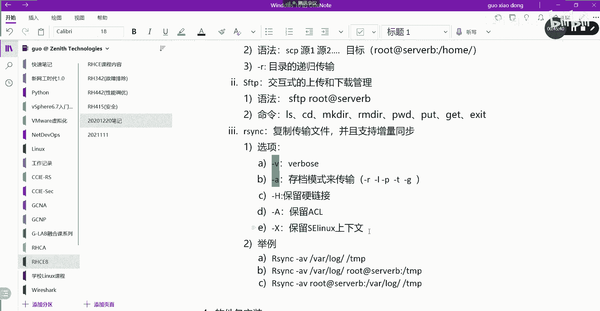

基本语法：
```bash
rsync [选项] 源 目标
```

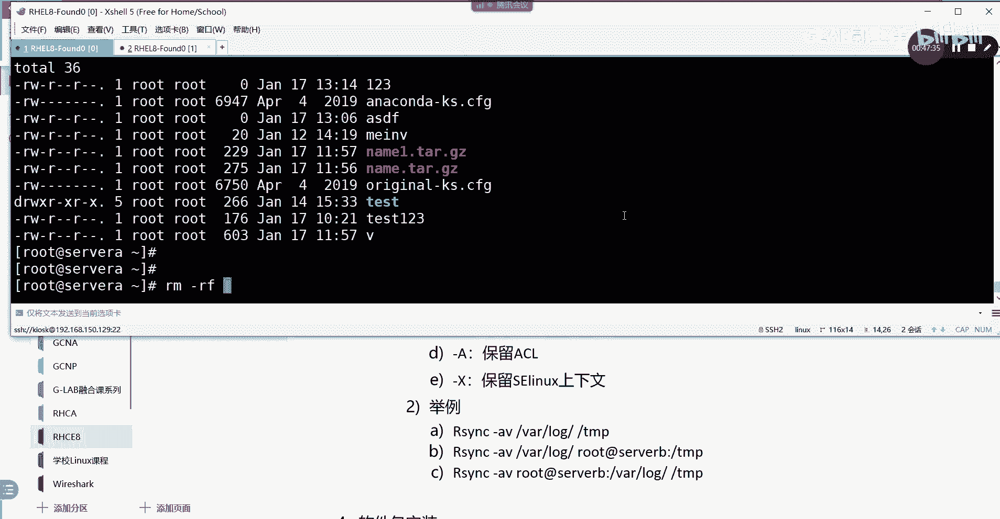

常用选项：
*   `-a`：归档模式，等同于 `-rlptgoD`，保留符号链接、权限、时间戳等所有属性，并递归同步目录。
*   `-v`：详细输出模式，显示同步过程。
*   `-z`：在传输过程中进行压缩，节省带宽。

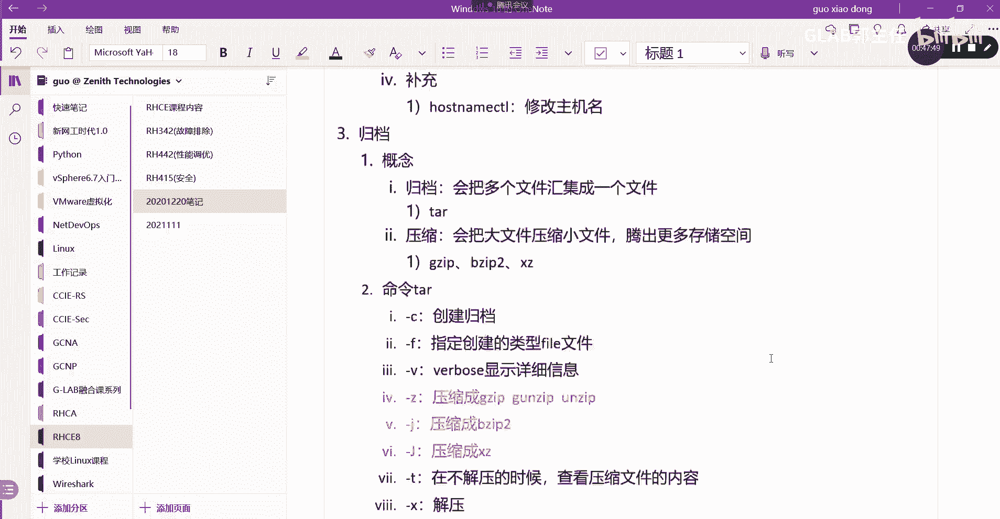

实例演示：
*   **将本地目录同步到远程服务器**：
    ```bash
    rsync -av /var/log/ root@serverb:/tmp/
    ```
    将本机 `/var/log/` 目录下的内容增量同步到远程服务器的 `/tmp/` 目录。
*   **将远程目录同步到本地**：
    ```bash
    rsync -av root@serverb:/var/log/ ./backup/
    ```
    将远程服务器 `/var/log/` 目录增量同步到本地的 `./backup/` 目录。
*   **本地目录间同步**：
    ```bash
    rsync -av /source/folder/ /destination/folder/
    ```
    注意源目录后的 `/` 表示同步目录内的内容，不加 `/` 则表示同步目录本身。

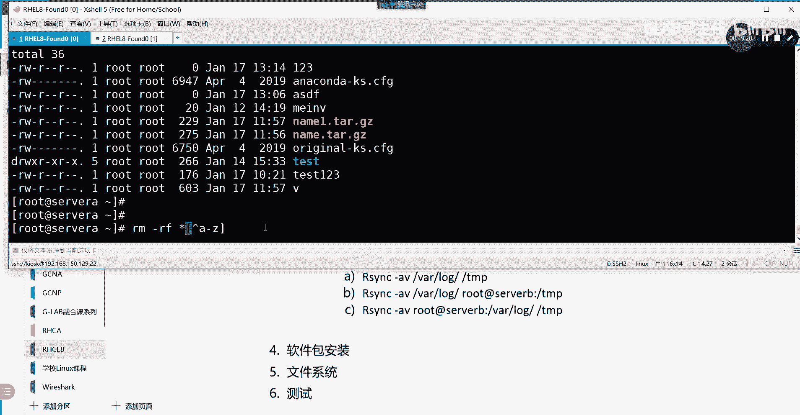

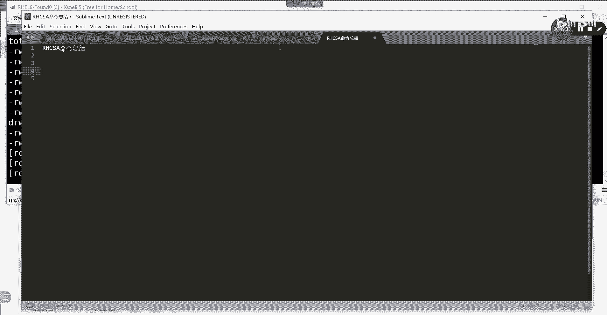

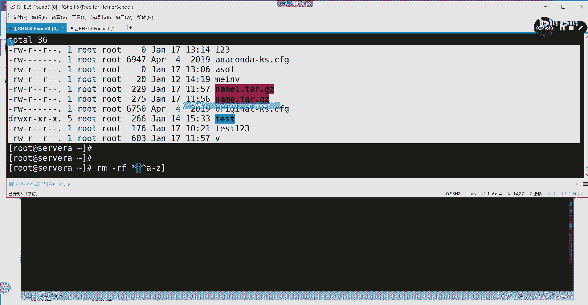

## 总结 📝

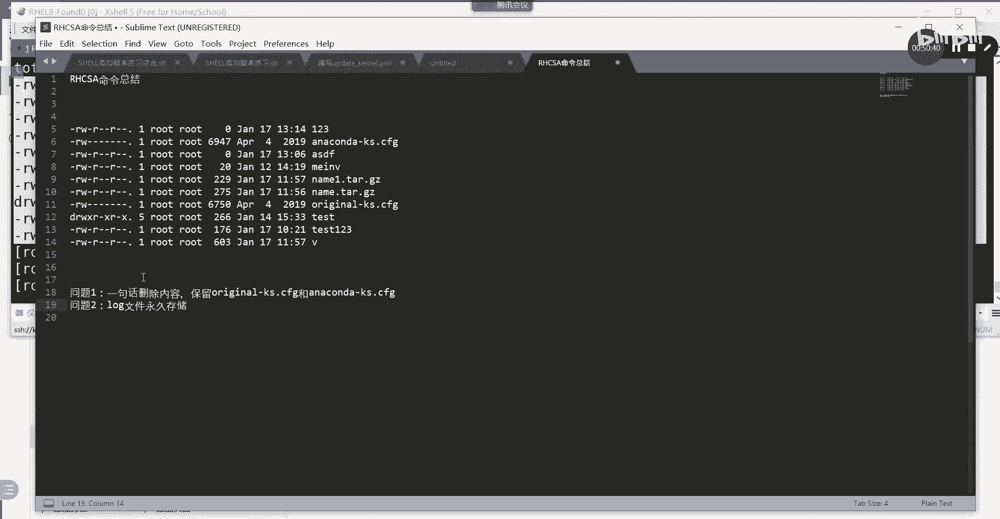

本节课中我们一起学习了Linux中归档、压缩和文件传输的核心技能。

1.  **归档与压缩**：我们区分了归档（打包）和压缩（减小体积）两个概念，并重点掌握了 `tar` 命令结合不同选项（`-z`, `-j`, `-J`）进行归档和压缩的操作。
2.  **文件传输**：我们学习了三种基于SSH的安全文件传输方式：
    *   `scp`：简单直接的复制命令，适合一次性文件传输。
    *   `sftp`：交互式文件传输协议，适合需要浏览和简单管理远程文件的场景。
    *   `rsync`：支持增量同步的强大工具，是进行数据备份和目录同步的首选。

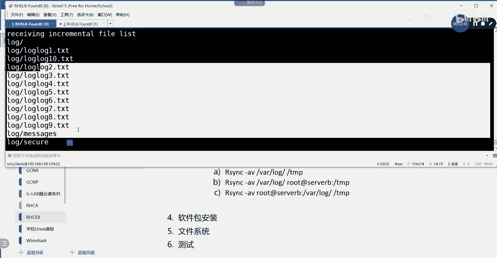

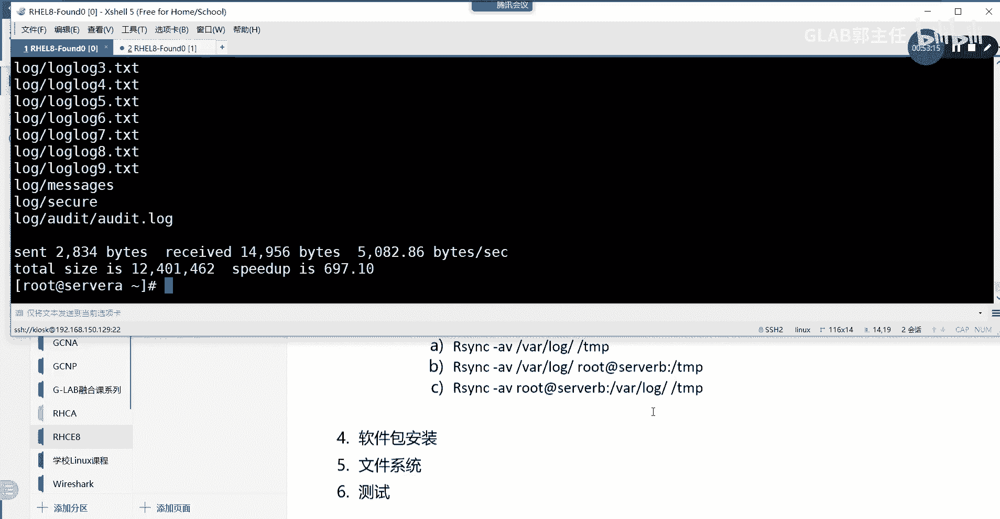

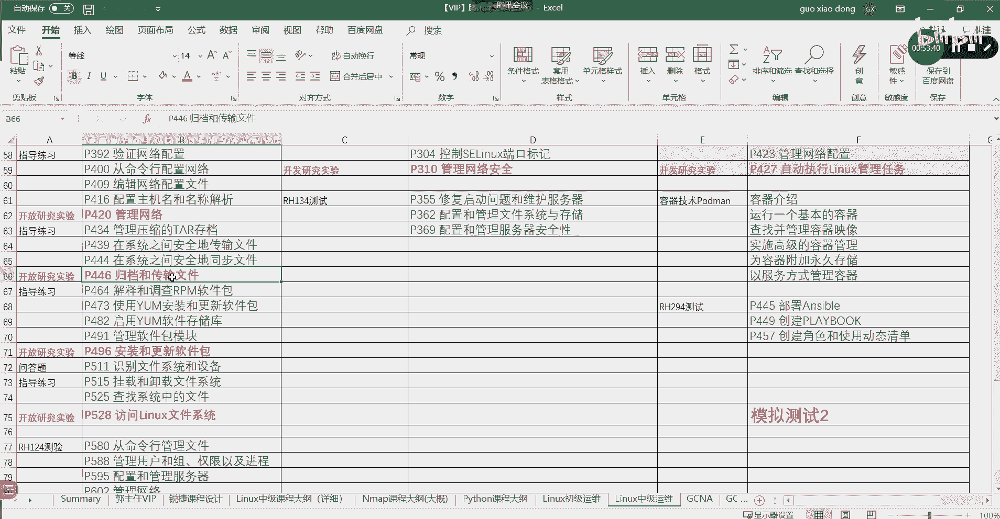

熟练掌握这些命令，将极大提升你在Linux环境下管理、备份和迁移数据的效率。