# Linux运维基础：24：计划任务 📅

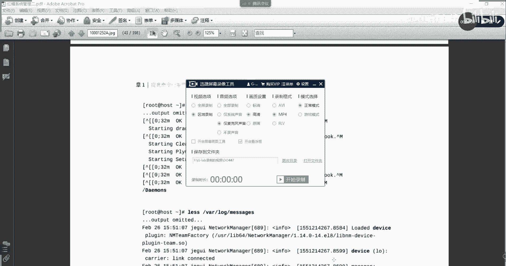

在本节课中，我们将要学习Linux系统中的计划任务。计划任务允许我们安排系统在特定时间自动执行命令或脚本，这对于自动化运维工作（如备份、清理、监控等）至关重要。我们将重点学习两种类型的计划任务：延迟计划任务和周期计划任务。

## 延迟计划任务 ⏰

上一节我们介绍了计划任务的概念，本节中我们来看看延迟计划任务。延迟计划任务指的是在未来的某个特定时间点执行一次性的任务。

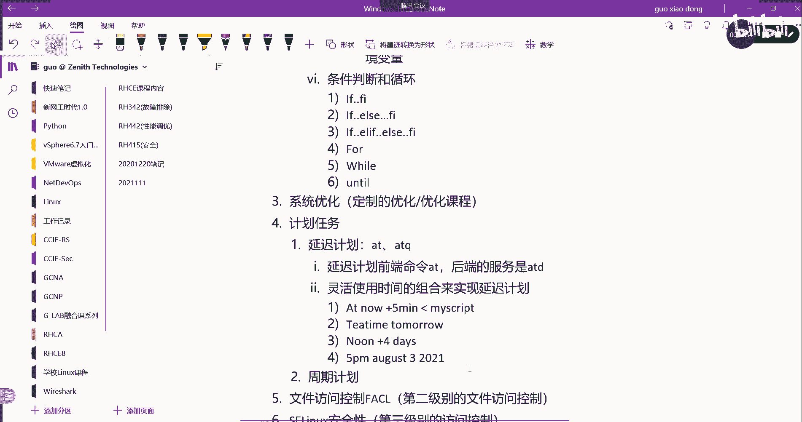

延迟计划任务的前端命令是 `at`，而后端服务是 `atd`。用户可以使用 `at` 命令来安排任务，系统会在指定的时间执行它。

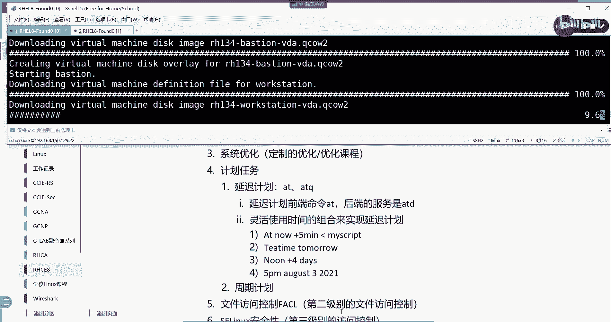

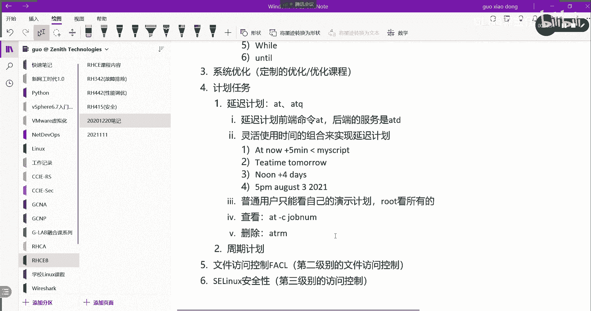

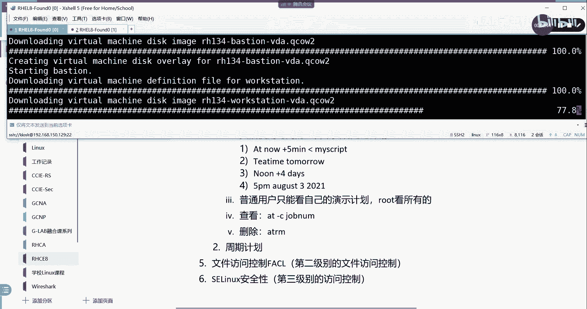

以下是延迟计划任务的核心操作命令：

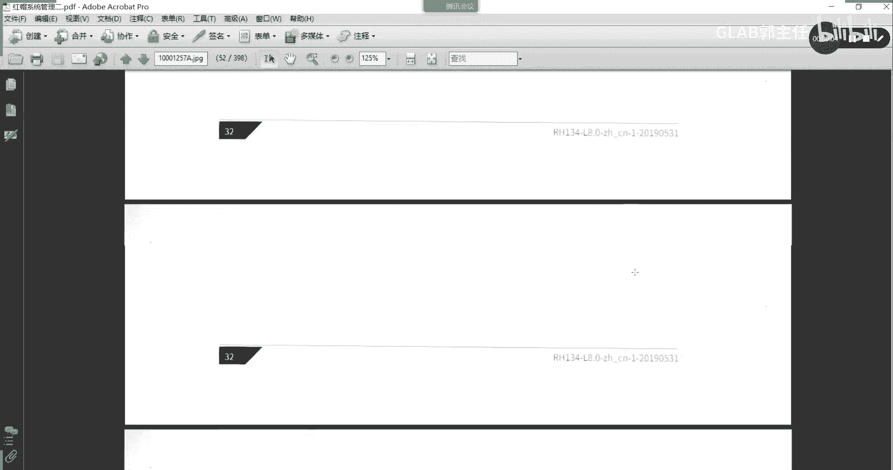


*   **安排任务**：使用 `at [时间]` 命令，然后输入要执行的命令或脚本。
*   **查看队列**：使用 `atq` 命令可以查看当前等待执行的延迟任务列表。
*   **查看任务详情**：使用 `at -c [任务编号]` 可以查看指定任务的详细内容。
*   **删除任务**：使用 `atrm [任务编号]` 可以删除尚未执行的延迟任务。

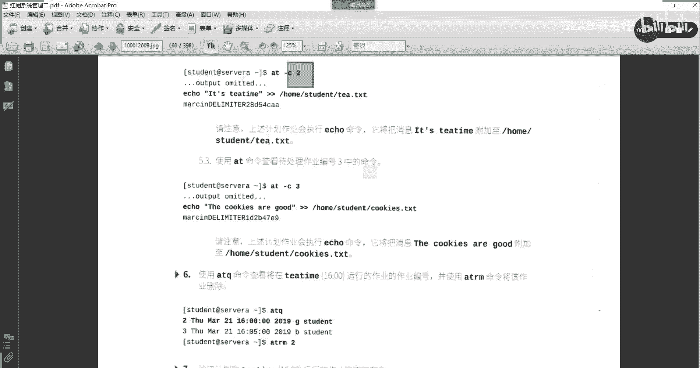

`at` 命令的时间格式非常灵活，以下是一些示例：

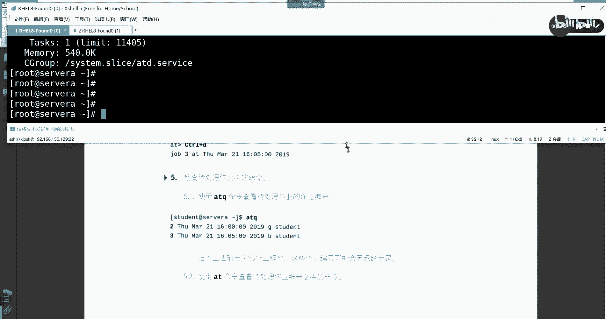

*   `at now + 5 minutes`：5分钟后执行。
*   `at teatime tomorrow`：明天下午茶时间（通常为16:00）执行。
*   `at 5pm August 3 2021`：在2021年8月3日下午5点执行。

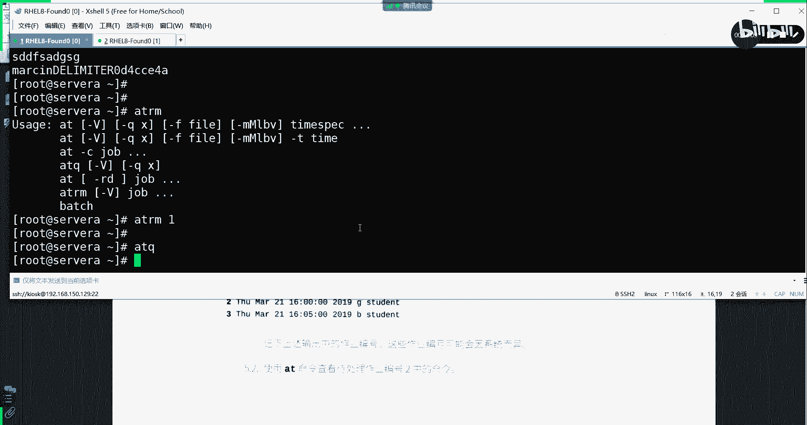

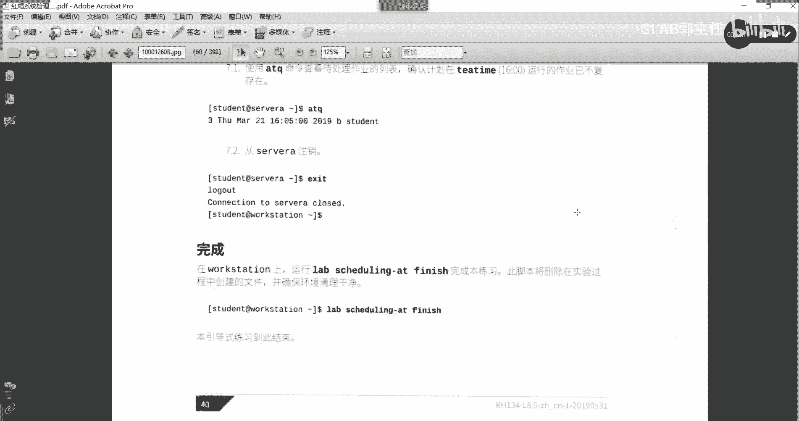

**注意**：普通用户只能查看和管理自己创建的延迟任务，而root用户可以管理所有用户的任务。

## 周期计划任务 🔄

上一节我们学习了如何安排一次性的延迟任务，本节中我们来看看更常用的周期计划任务。周期计划任务可以按照设定的周期（如每分钟、每小时、每天）重复执行任务。

周期计划任务的前端命令是 `crontab`，对应的后端服务是 `crond`。该服务在系统安装后通常默认启动并运行。

`crontab` 任务的配置由六个字段组成，前五个字段用于定义时间，最后一个字段是要执行的命令。

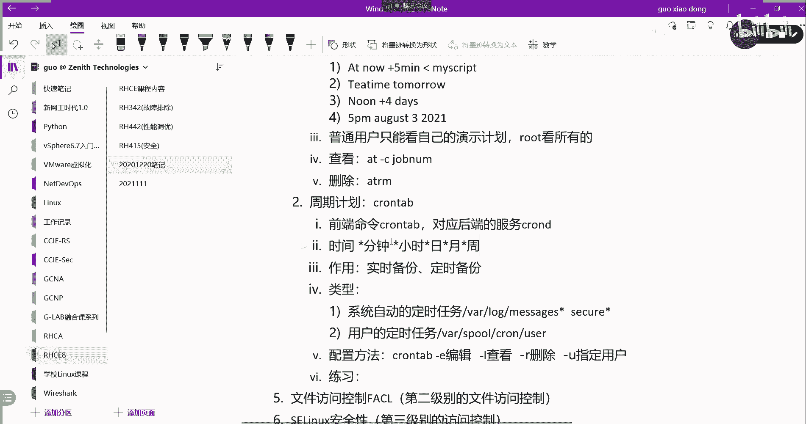

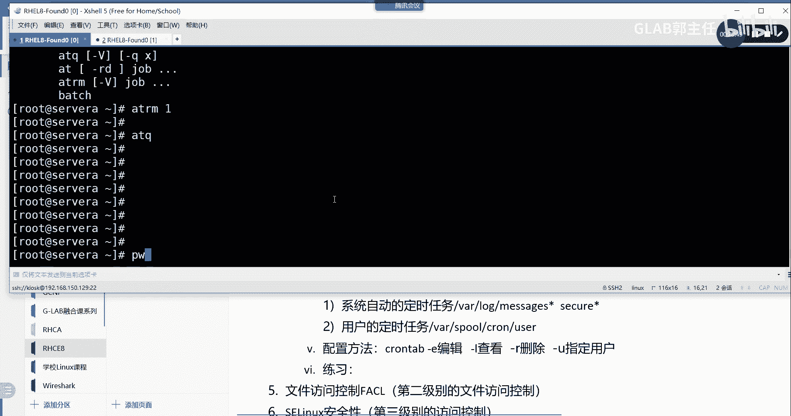

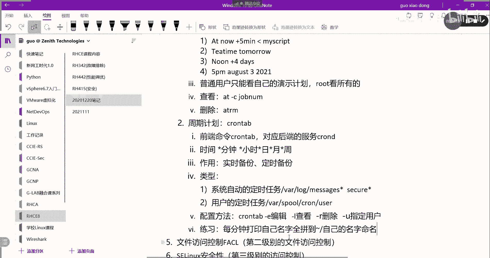

```
* * * * * command_to_execute
│ │ │ │ │
│ │ │ │ └── 星期几 (0 - 6) (0 代表星期日)
│ │ │ └───── 月份 (1 - 12)
│ │ └─────── 日期 (1 - 31)
│ └───────── 小时 (0 - 23)
└─────────── 分钟 (0 - 59)
```

每个字段可以使用以下特殊符号：

*   `*`：代表所有可能的值（例如，在分钟字段的 `*` 表示每分钟）。
*   `,`：指定一个列表（例如，`1,3,5` 在小时字段表示1点、3点和5点）。
*   `-`：指定一个范围（例如，`9-17` 在小时字段表示上午9点到下午5点）。
*   `/`：指定间隔频率（例如，`*/10` 在分钟字段表示每10分钟）。

以下是 `crontab` 的常用命令：

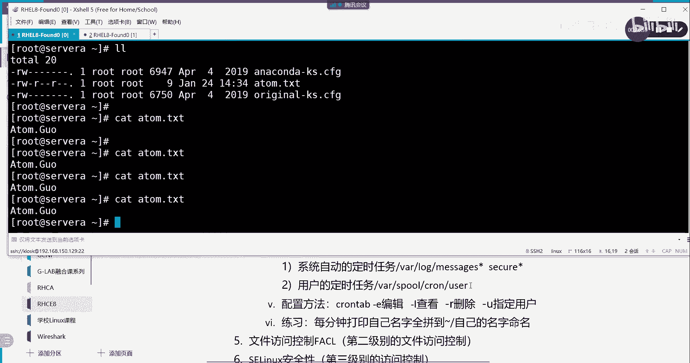

*   **编辑任务**：`crontab -e`
*   **列出任务**：`crontab -l`
*   **删除所有任务**：`crontab -r`
*   **为指定用户编辑任务（仅root）**：`crontab -u username -e`

周期任务分为两类：

1.  **系统任务**：由系统预定义，配置文件通常位于 `/etc/crontab` 和 `/etc/cron.d/` 目录下。例如，定期清理 `/tmp` 目录就是系统任务。
2.  **用户任务**：由用户使用 `crontab -e` 命令创建，每个用户的任务文件存储在 `/var/spool/cron/` 目录下，以用户名命名。

### 时间配置示例

理解时间字段的配置是掌握周期任务的关键。以下是几个示例：

*   `30 * * * *`：每小时的30分执行（即每小时半点）。
*   `0 9 * * 0`：每周日的上午9点整执行。
*   `*/5 * * * *`：每5分钟执行一次。
*   `0 9-18 * * 1-5`：周一至周五的上午9点到下午6点，每小时整点执行。
*   `0 2 * * 6,0`：每周六和周日的凌晨2点执行。
*   `30 8-18/2 * * *`：在上午8点到下午6点之间，每间隔2小时的30分执行（例如8:30， 10:30， 12:30等）。

**重要提示**：`cron` 服务的最小时间粒度是分钟。如果需要精确到秒级执行，需要在执行的命令或脚本内部实现。

## 总结 📝

本节课中我们一起学习了Linux系统中的计划任务管理。

我们首先了解了**延迟计划任务**，它通过 `at` 和 `atd` 服务实现在未来某个特定时间点执行一次性任务，并掌握了 `atq`、`atrm` 等管理命令。

接着，我们深入学习了更强大的**周期计划任务**，它通过 `crontab` 和 `crond` 服务实现任务的周期性自动执行。我们重点剖析了 `crontab` 时间表达式（`* * * * *`）的五个字段含义及特殊符号（`*`， `,`， `-`， `/`）的用法，这是配置周期任务的核心。同时，我们也区分了系统任务和用户任务的不同管理方式。

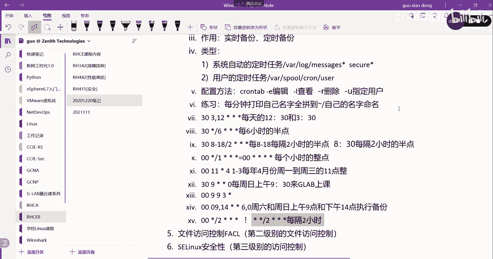

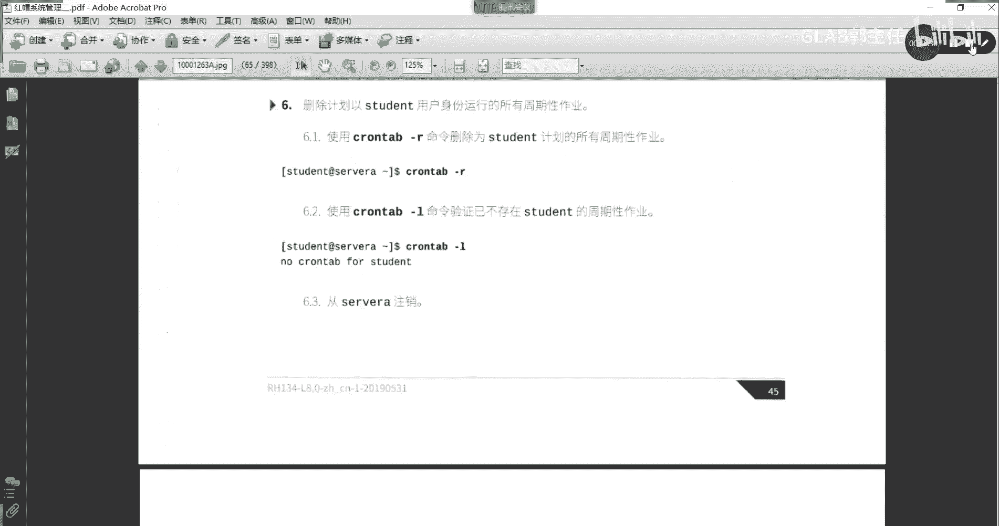

计划任务是Linux运维自动化的重要基石，熟练掌握其配置与管理，能极大提升工作效率和系统可靠性。