# Linux运维与红帽认证：44：Ansible Jinja2模板 🧩

在本节课中，我们将要学习Ansible中一个非常强大的功能——Jinja2模板。通过模板，我们可以动态地为不同的服务器生成定制化的配置文件，极大地提升了配置管理的灵活性和效率。


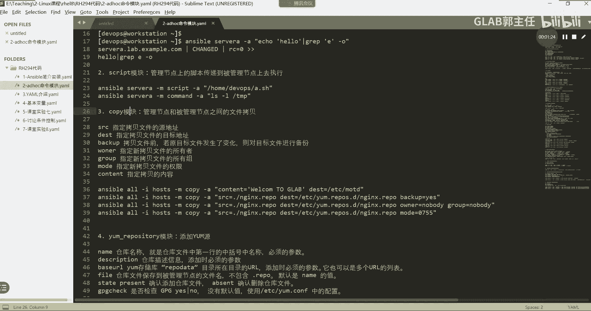

## 概述

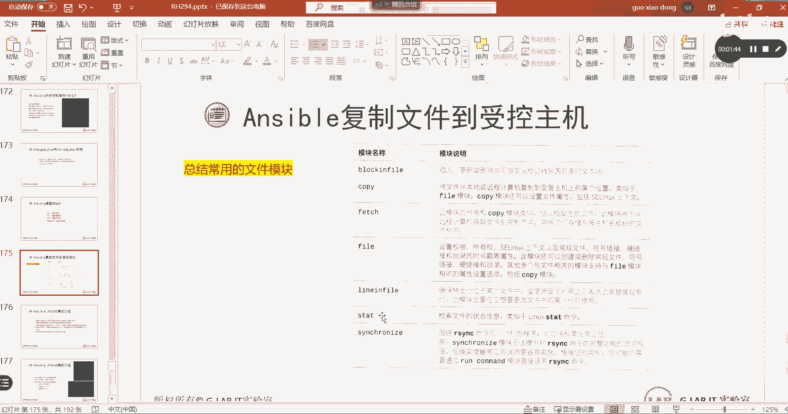

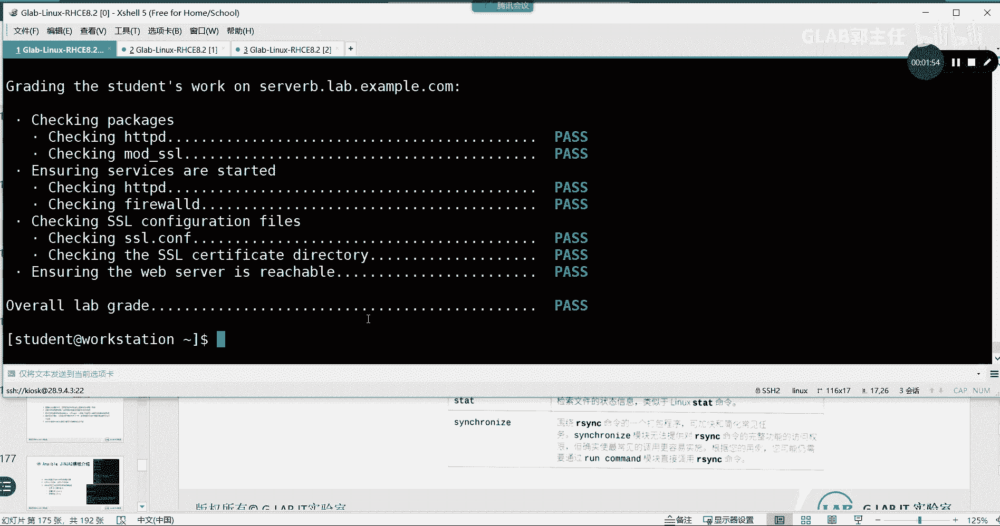

上一节我们介绍了多种处理文件的Ansible模块。本节中我们来看看如何超越静态文件复制，使用Jinja2模板为不同的受管主机动态生成独特的配置文件。

## 文件处理模块回顾

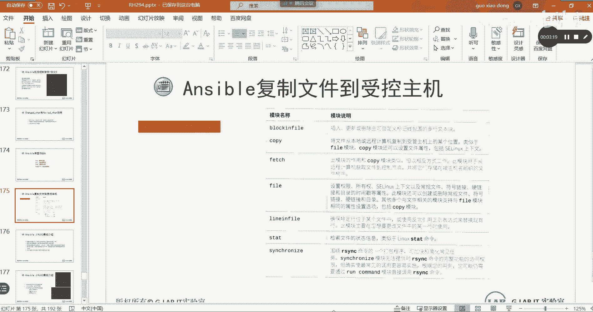

在深入模板之前，我们先简要回顾一下之前学过的文件处理模块，以便理解模板解决的问题。

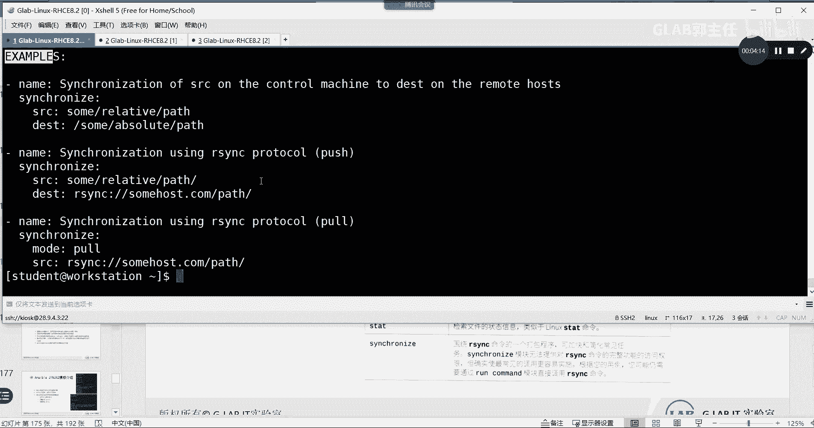

以下是常用的Ansible文件处理模块：

*   **`blockinfile` 与 `lineinfile`**：这两个模块用于修改文件内容。`lineinfile`确保某一行存在或不存在，而`blockinfile`则可以处理多行文本块。
*   **`copy` 模块**：用于将文件从控制节点复制到受管节点。
*   **`file` 模块**：用于设置文件的属性，如权限、所有权、创建软链接或目录等。其功能与`copy`模块在设置属性方面有重叠。
*   **`stat` 模块**：用于检索文件的状态信息（类似于Linux中的`stat`命令），例如判断文件是否存在。
*   **`fetch` 模块**：功能与`copy`相反，用于将文件从受管节点拉取到控制节点。
*   **`synchronize` 模块**：基于`rsync`命令，用于在控制节点和受管节点之间同步文件，支持增量同步。

这些模块处理的都是**静态文件**。无论复制到多少台主机，文件内容都完全相同。

## 为什么需要模板？

现在，我们思考一个更复杂的需求：如果需要根据每台服务器的具体硬件信息（如CPU核心数、内存大小）来生成不同的配置文件，应该怎么办？

如果使用上述静态文件复制的方法，就需要为每一台服务器手动准备一个独特的文件，管理起来极其繁琐。这与我们之前学习循环来批量创建用户的道理一样，我们需要一种更高效的方法。

**Jinja2模板**就是解决这个问题的答案。我们只需要编写一个**模板文件**，Ansible在将其分发到各台主机时，会自动根据每台主机的**事实变量**填充模板中的动态内容，从而生成属于该主机自己的配置文件。这样，我们只需维护一个模板，即可管理成百上千台服务器的差异化配置。

## 认识Jinja2模板

Jinja2是一个基于Python的模板引擎。在Ansible中，它以`.j2`为后缀。它的语法非常简单，核心包括**三种定界符**和**两种逻辑控制**。

### 三种定界符

定界符用于告诉Ansible哪里是模板语法，哪里是普通文本。

1.  **注释**：`{# 这是一行注释 #}`
2.  **变量引用/表达式**：`{{ 变量名或表达式 }}`
3.  **逻辑控制语句**：``


### 两种逻辑控制

以下是Jinja2模板中常用的两种逻辑控制结构。

*   **条件判断 (`if`)**：用于根据条件输出不同内容。
    ```jinja2
    
    系统是 CentOS。
    
    系统是 RedHat。
    
    系统是其他发行版。
    
    ```
*   **循环 (`for`)**：用于遍历列表或字典。
    ```jinja2
    
    服务器主机名：{{ host }}
    
    ```

## 实战：解读一个Jinja2模板例子

让我们通过一个实际的例子来理解模板是如何工作的。

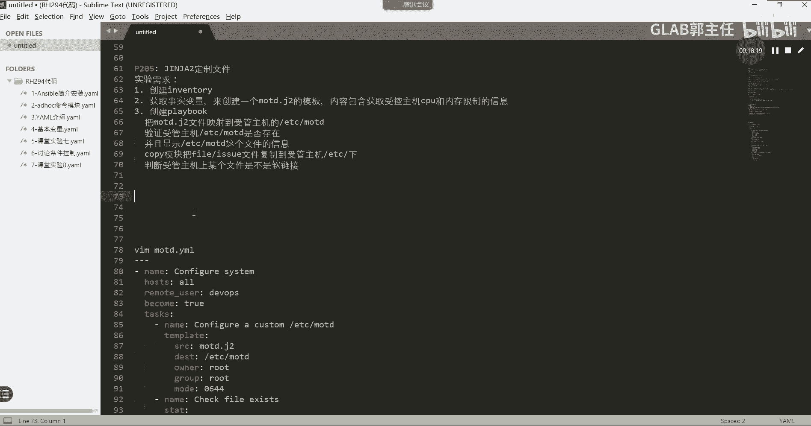

```jinja2
{# 这是一个Jinja2模板示例 #}
Welcome to {{ ansible_facts['hostname'] }}.
OS Family: {{ ansible_facts['os_family'] }}
Today is: {{ ansible_date_time['date'] }}


This system has a multi-core CPU.


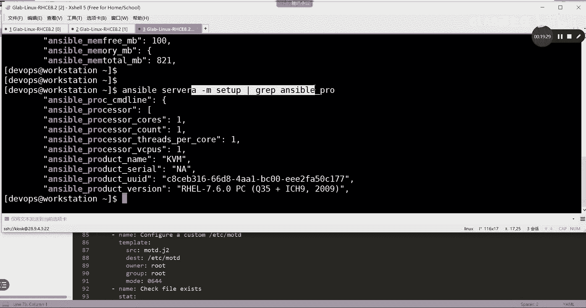

Disk Mounts:


- {{ mount.mount }} Total: {{ mount.size_total }} Available: {{ mount.size_available }}


```

**代码解读：**

1.  第一行是注释。
2.  `{{ ansible_facts[‘hostname’] }}` 引用了主机名事实变量。
3.  使用 `` 判断CPU是否多核。
4.  使用 `` 循环遍历所有挂载点（排除根目录`/`），并输出其路径和空间信息。

当这个模板通过Ansible应用到目标主机时，`{{ }}` 和 `` 中的部分会被替换为该主机的实际信息，生成一个独一无二的最终文件。

## 在Playbook中调用模板：`template` 模块

要将Jinja2模板渲染并发送到受管主机，我们需要使用专门的 `template` 模块，而不是 `copy` 模块。

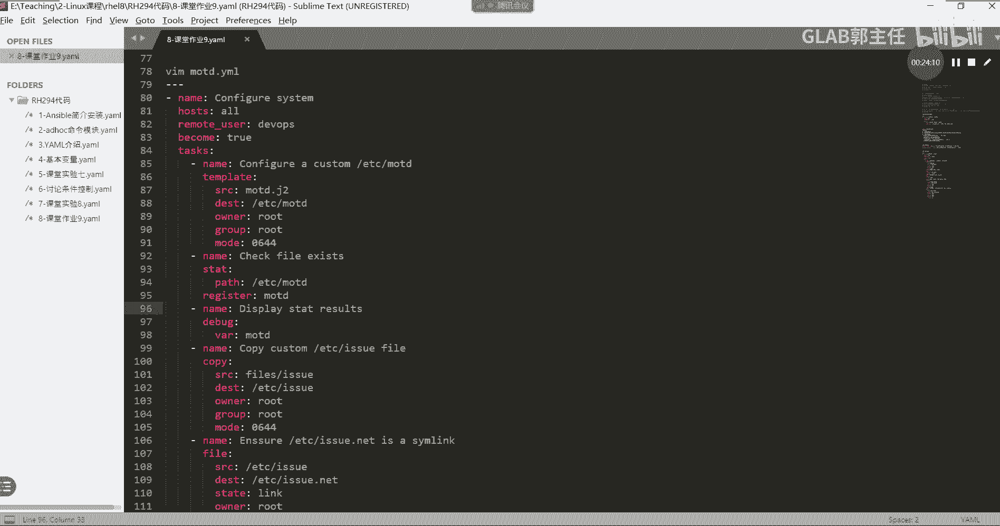

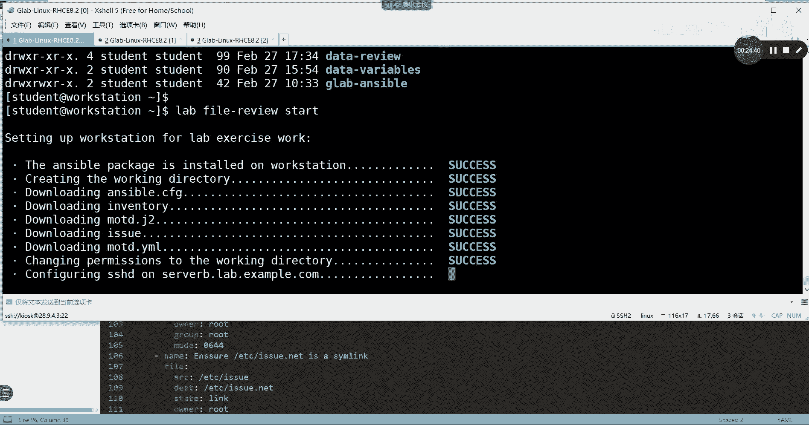

`template` 模块的用法与 `copy` 模块非常相似，但它会先执行Jinja2渲染，再将结果文件复制到目标位置。源模板文件通常保留在控制节点，目标主机上看到的是渲染后的最终文件。

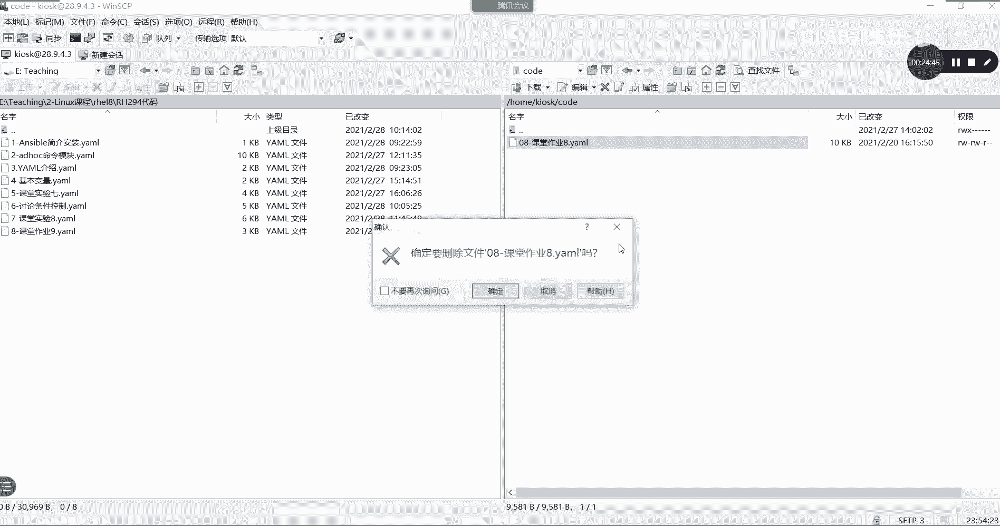

以下是一个简单的Playbook示例，展示了如何使用`template`模块：

```yaml
---
- name: 使用Jinja2模板配置MOTD
  hosts: server_b
  tasks:
    - name: 将MOTD模板部署到目标主机
      ansible.builtin.template:
        src: motd.j2
        dest: /etc/motd
        owner: root
        group: root
        mode: '0644'
```

## 课堂实验：创建动态MOTD

现在，让我们根据课程要求完成一个实验，目标是创建一个Jinja2模板，动态生成显示系统内存和CPU信息的MOTD（Message Of The Day）文件。

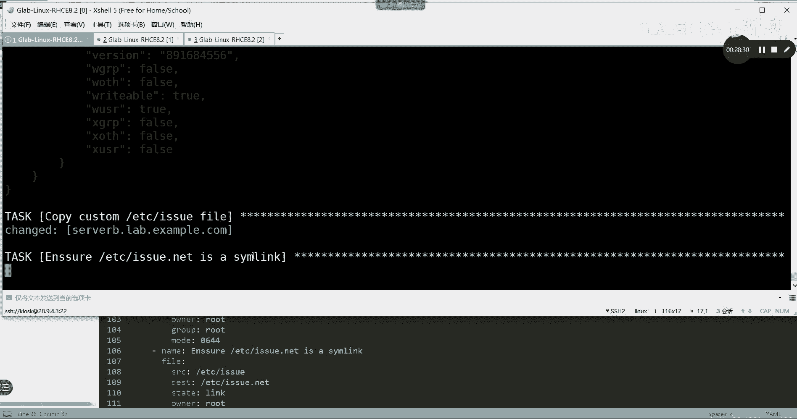

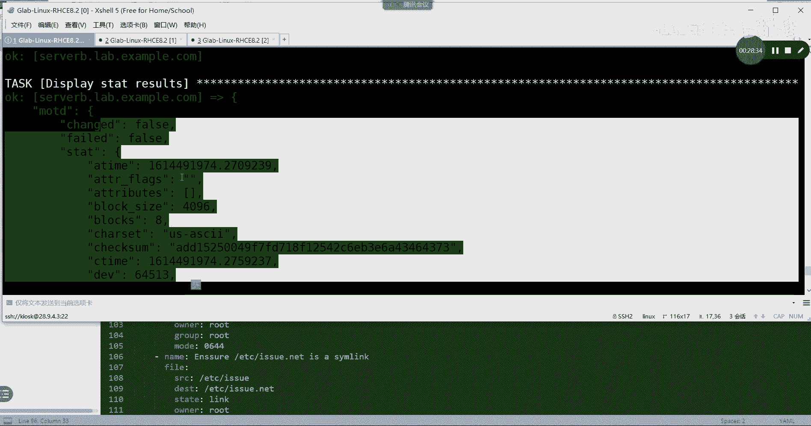

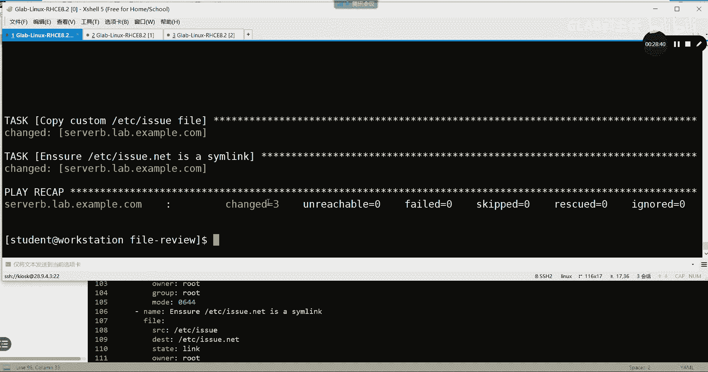

**实验步骤分解：**

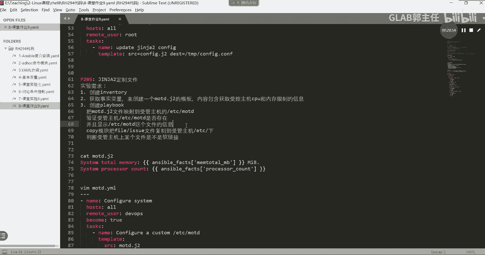

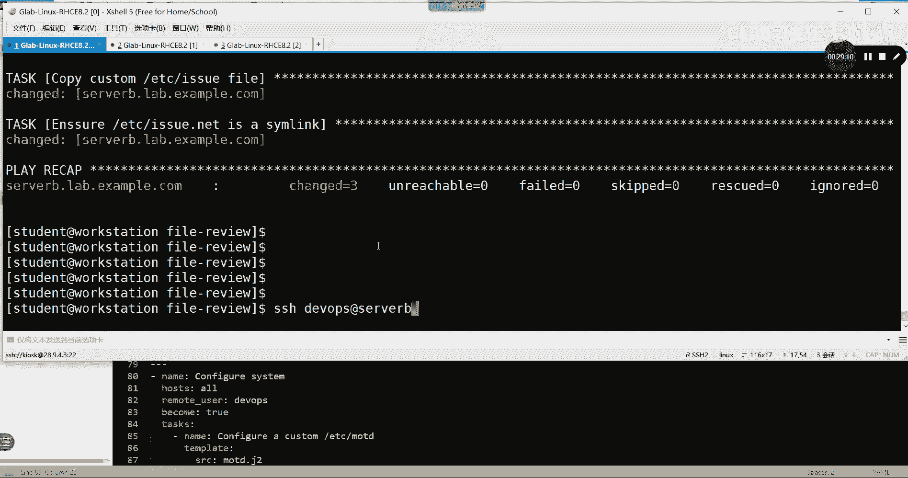

1.  **创建Jinja2模板文件 (`motd.j2`)**：在模板中引用事实变量来获取总内存和CPU核心数。
    *   查找内存变量：`ansible_facts[‘memtotal_mb’]`
    *   查找CPU核心数变量：`ansible_facts[‘processor_vcpus’]` 或 `ansible_facts[‘processor_cores’]`
    ```jinja2
    System Total Memory: {{ ansible_facts['memtotal_mb'] }} MB
    System Processor Count: {{ ansible_facts['processor_vcpus'] }}
    ```
2.  **编写Playbook (`motd.yml`)**：
    *   使用 `template` 模块部署 `motd.j2` 到 `/etc/motd`。
    *   （可选）使用 `stat` 模块检查文件是否创建成功，并用 `debug` 输出结果。
    *   使用 `copy` 模块复制一个静态的 `/etc/issue` 文件。
    *   使用 `file` 模块检查某个路径是否为软链接。
3.  **创建库存文件 (`inventory`)**：定义一个包含 `server_b.lab.example.com` 的组。
4.  **运行Playbook并验证**：通过SSH登录 `server_b`，观察登录前后的提示信息，确认动态MOTD和静态issue文件都已生效。

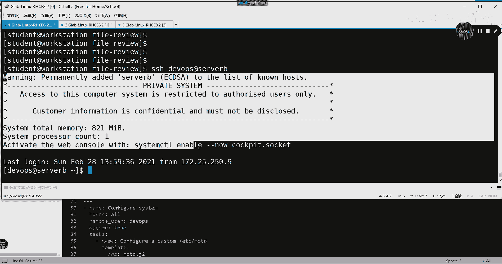

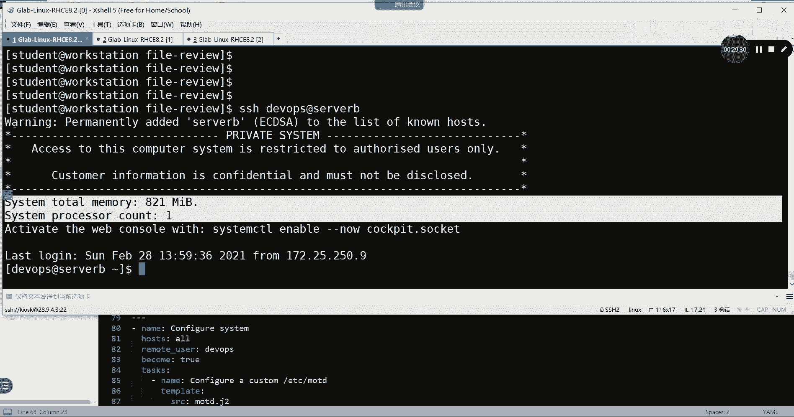

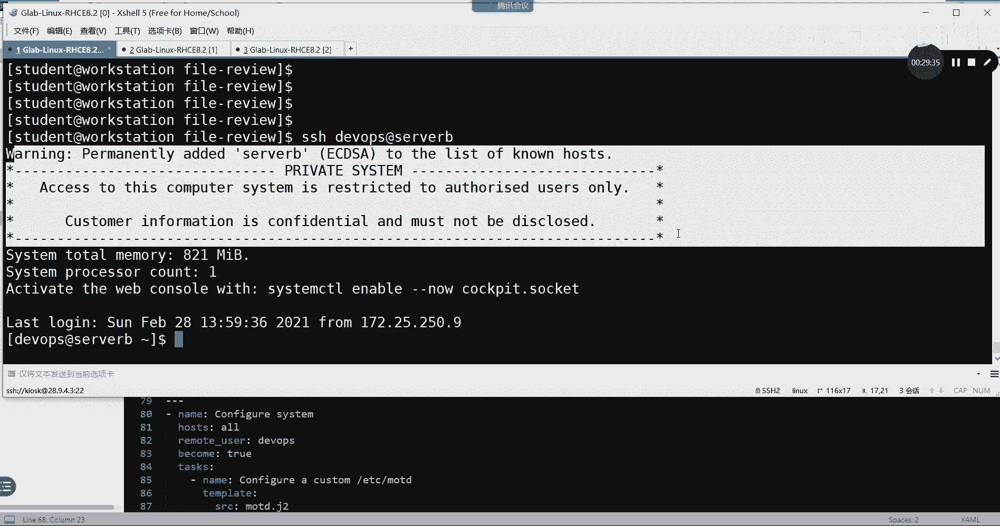

## 总结

本节课中我们一起学习了Ansible的核心功能之一——Jinja2模板。

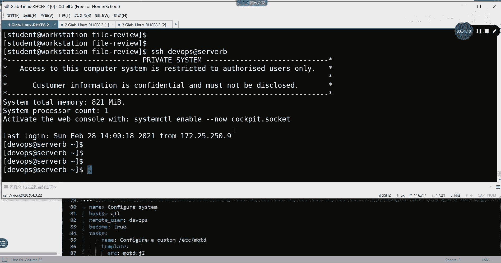

*   我们首先回顾了静态文件处理的局限性，引出了对动态模板的需求。
*   然后，我们学习了Jinja2模板的基本语法，包括三种定界符（`{# #}`, `{{ }}`, ``）和两种逻辑控制（`if`, `for`）。
*   接着，我们剖析了一个实际模板例子，看到它是如何通过引用事实变量（如 `ansible_facts`）来为每台主机生成定制内容的。
*   最后，我们掌握了在Playbook中使用 `template` 模块来部署模板的方法，并通过一个课堂实验综合运用了这些知识。

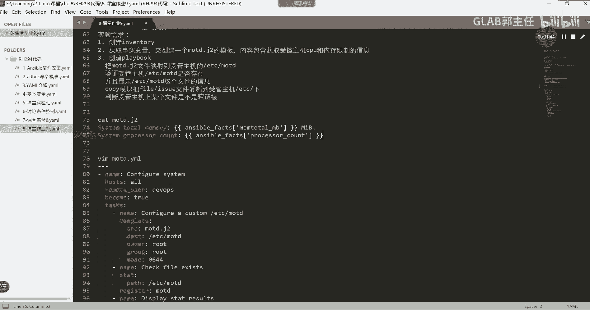

掌握Jinja2模板能让你从简单的文件复制跨越到智能的、基于条件的配置管理，是成为一名高效运维工程师的关键技能。