# Linux文件系统入门：21：文件系统基础概念与挂载管理 📚

在本节课中，我们将要学习Linux文件系统的核心概念，包括数据存储的基本原理、文件系统与目录的关系、以及如何管理磁盘的挂载。这些知识是理解Linux存储管理和后续学习更高级主题的基础。

## 文件系统核心概念 💡

上一节我们介绍了课程概述，本节中我们来看看什么是文件系统。文件系统是操作系统用于明确存储设备（如硬盘）上文件的方法和数据结构。简单来说，它规定了数据如何被存储和访问。

### 数据存储的基础：Inode与Block

系统读取和存放文件，必须通过inode和block的关联来实现。
*   **inode**：是数据在存储设备上的唯一标识，可以理解为一个文件的“身份证号”（ID）。
*   **block**：是实际存储文件数据的地方，即硬盘上存放数据的物理区块。

### 一切皆文件：存储与目录的关联

在Linux系统中，没有Windows那样的C盘、D盘概念。所有的存储空间都是通过“目录”来访问和管理的。系统最顶层的目录是根目录（`/`），其下可以有一级、二级、三级等子目录。

存储设备（如硬盘）需要与某个目录建立关联，这个过程称为“挂载”（Mount）。例如，你可以将一个100G的硬盘挂载到 `/data` 目录。之后，所有存入 `/data` 目录的文件，实际上都存储在那个100G的硬盘上。

### 硬盘使用的三个阶段

一块新的硬盘要被系统使用并存放数据，需要经历三个阶段：
1.  **分区**：将硬盘划分为逻辑上的独立区域。
2.  **格式化**：在分区上创建文件系统，确定数据的组织格式（如EXT4， XFS）。
3.  **挂载**：将创建好文件系统的分区关联（挂载）到一个目录上，这样才能通过该目录访问其中的数据。

既然有挂载，自然也有“卸载”（Unmount）。你可以将一个已挂载的磁盘卸载，然后挂载到另一个目录。磁盘中的数据不会丢失，它会跟随挂载点被访问。

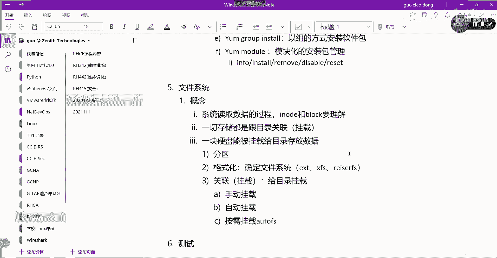

## Linux中的挂载类型 🔧

挂载目录和磁盘关联起来主要有三种方法：
*   **手动挂载**：使用 `mount` 命令临时挂载，重启系统后失效。
*   **自动挂载**：通过编辑 `/etc/fstab` 配置文件实现，系统启动时会自动挂载。
*   **按需挂载**：使用 `autofs` 服务，仅在访问挂载点时自动挂载，访问结束后自动卸载。这是RHCE考试的一个重点。

## 常见的Linux文件系统 📂

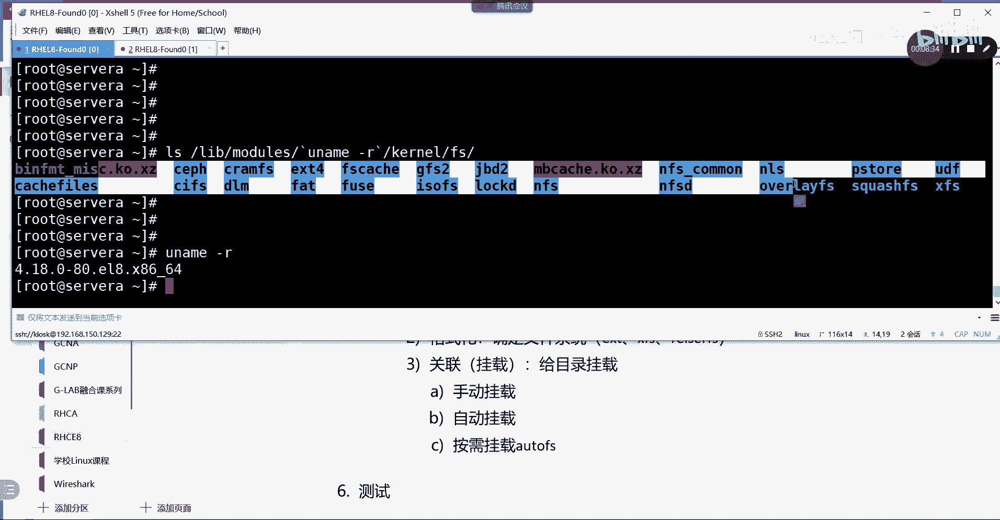

格式化时，需要确定使用哪种文件系统。以下是Linux中常见的几种：
*   **EXT2/EXT3/EXT4**：Linux传统且广泛使用的文件系统。
*   **XFS**：一种高性能的日志文件系统，适用于大文件。
*   **Btrfs**：一种支持高级功能（如快照、池化）的新型文件系统。

你可以使用以下命令查看当前系统内核支持的所有文件系统：
```bash
ls /lib/modules/`uname -r`/kernel/fs
```
这个命令会列出已安装的内核模块所支持的文件系统类型。

## 存储管理常用命令 🛠️

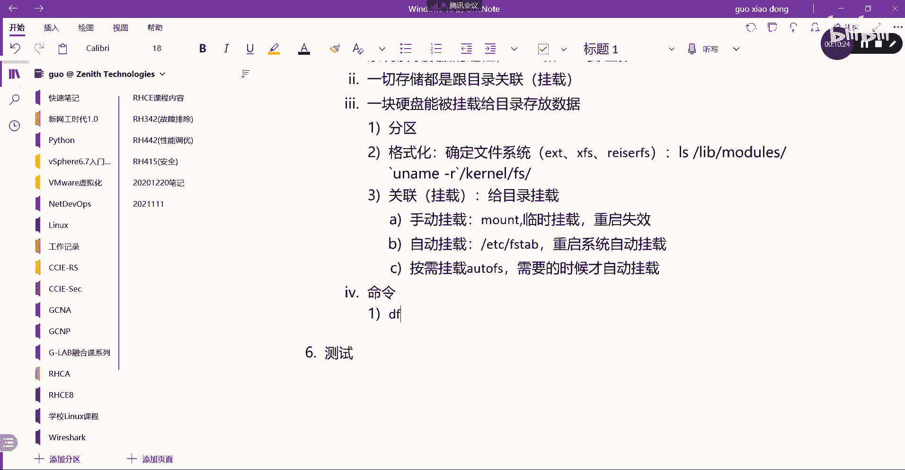

上一节我们介绍了核心概念，本节中我们来看看管理存储的实用命令。

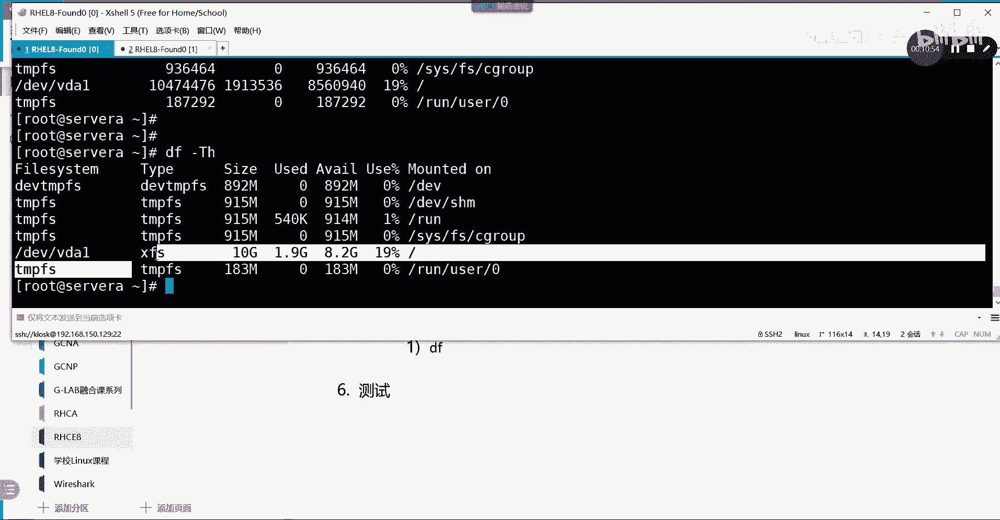

### 查看已挂载的存储：`df`

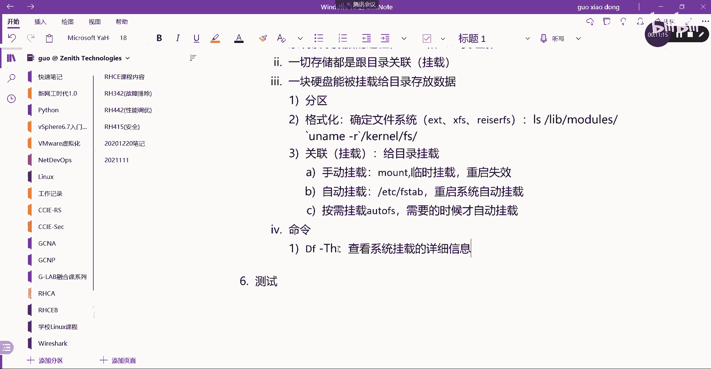

`df` 命令用于查看当前系统中已挂载的存储设备的使用情况。

以下是 `df` 命令的常用参数示例：
```bash
df -Th
```
*   `-h`：以人类易读的格式（如K， M， G）显示容量。
*   `-T`：显示文件系统的类型。

输出结果中，你需要关注的主要是实际的物理或网络存储设备，例如 `/dev/vda1`。像 `tmpfs`、`devtmpfs` 这类是基于内存的临时文件系统，系统重启后数据会消失，通常可以忽略。

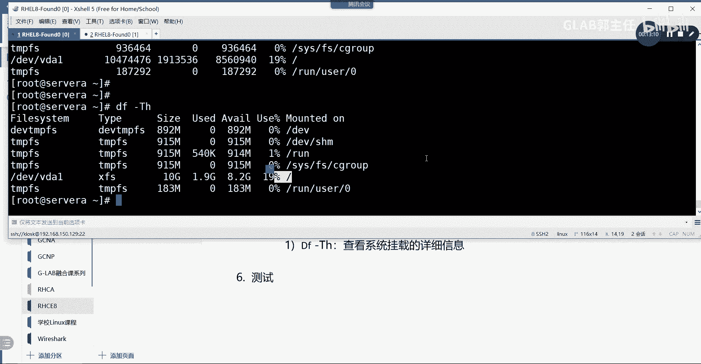

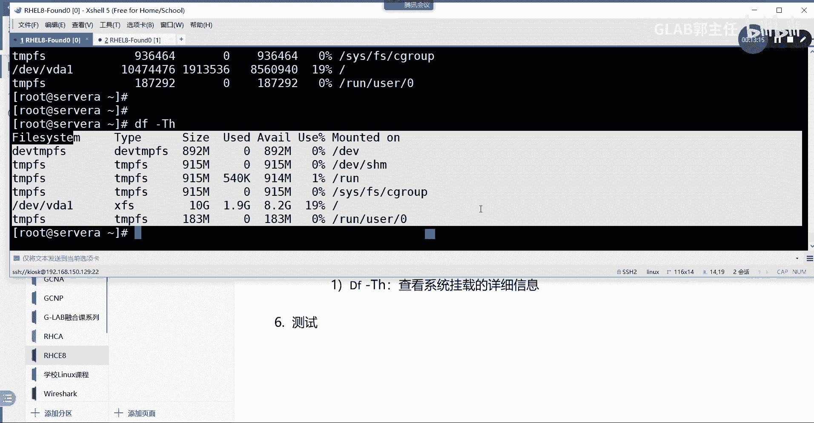

### 查看所有存储设备：`lsblk`

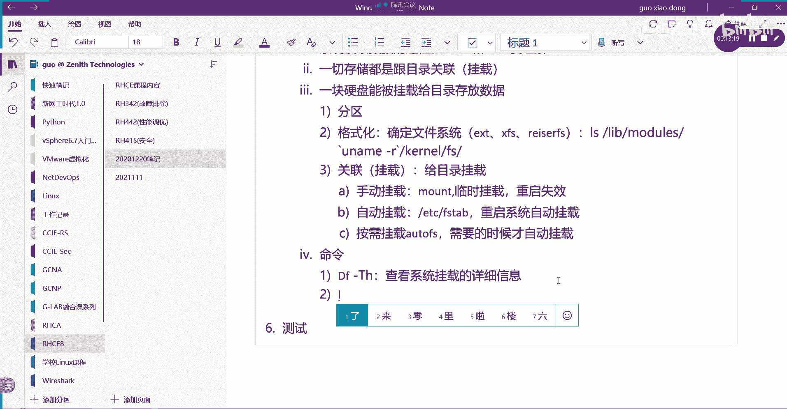

`lsblk` 命令用于列出系统上所有的块设备（如硬盘、分区），无论它们是否已被使用。

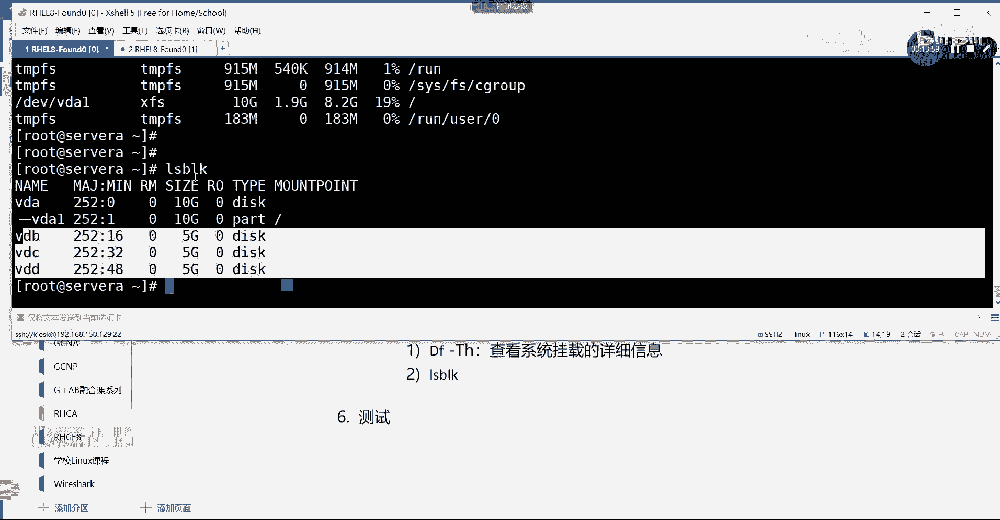

执行 `lsblk` 命令，你可以看到所有磁盘及其分区情况。新插入的硬盘如果未被分区和格式化，也会在这里显示出来，但不会有挂载点。

### 查看文件系统详细信息：`lsblk -f`

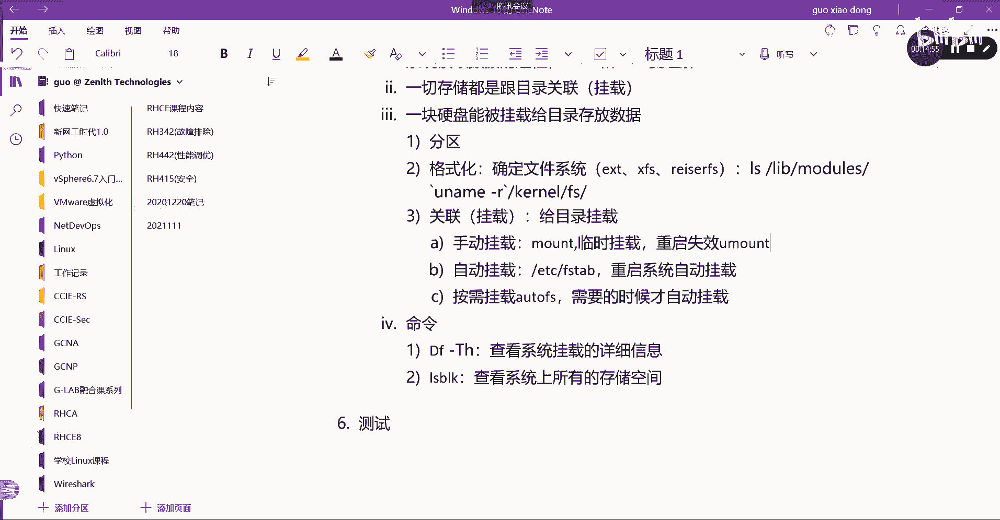

`lsblk -f` 命令可以显示更详细的信息，包括文件系统类型和每个分区的UUID（全局唯一标识符）。

UUID是硬盘分区的唯一标识，类似于网卡的MAC地址。在自动挂载配置文件 `/etc/fstab` 中，推荐使用UUID来指定设备，以避免设备名（如 `/dev/sda1`）可能发生改变而导致挂载错误。

### 自动挂载配置文件：`/etc/fstab`

`/etc/fstab` 文件是系统启动时自动挂载文件系统的核心配置文件。它的每一行定义了一个需要挂载的设备。

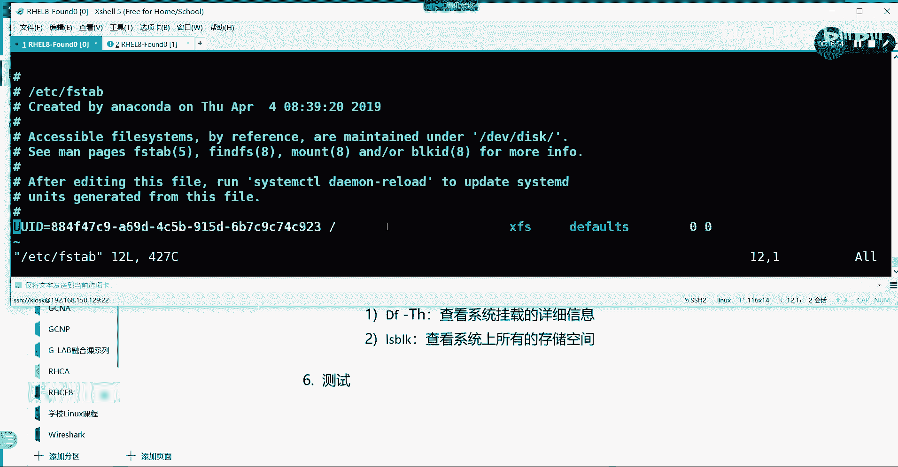

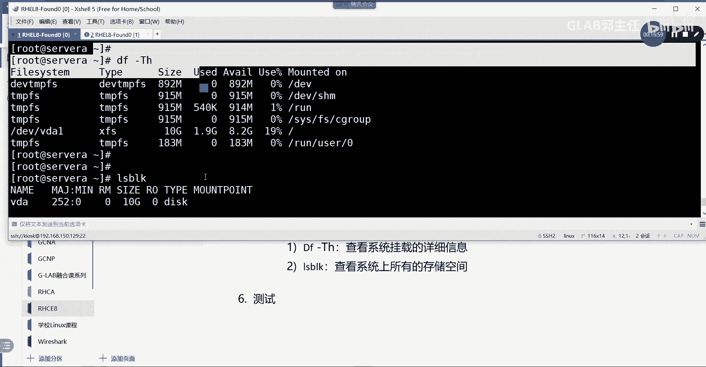

一个典型的 `/etc/fstab` 条目格式如下：
```
UUID=923884f9-... / ext4 defaults 0 0
```
各字段含义依次为：
1.  设备标识（可使用UUID或设备路径）。
2.  挂载点目录。
3.  文件系统类型。
4.  挂载选项（`defaults` 代表常用默认选项）。
5.  备份标志（`0` 表示不备份）。
6.  开机磁盘检查顺序（`0` 表示不检查）。

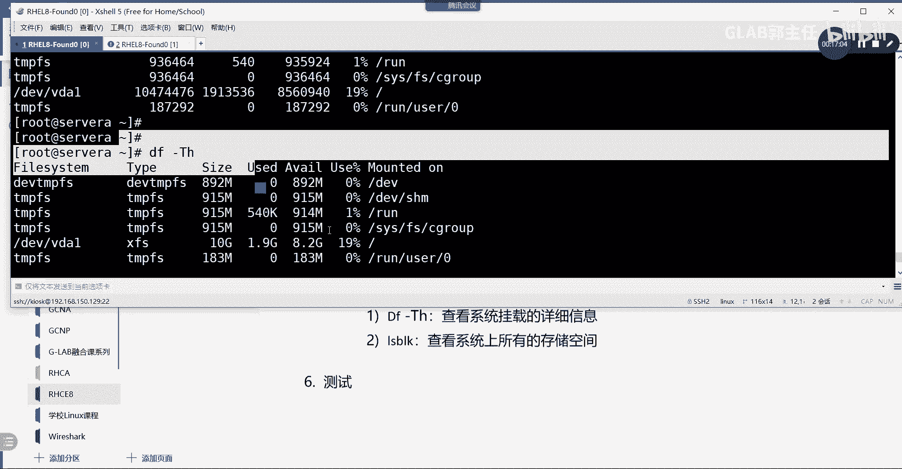

## 总结 📝

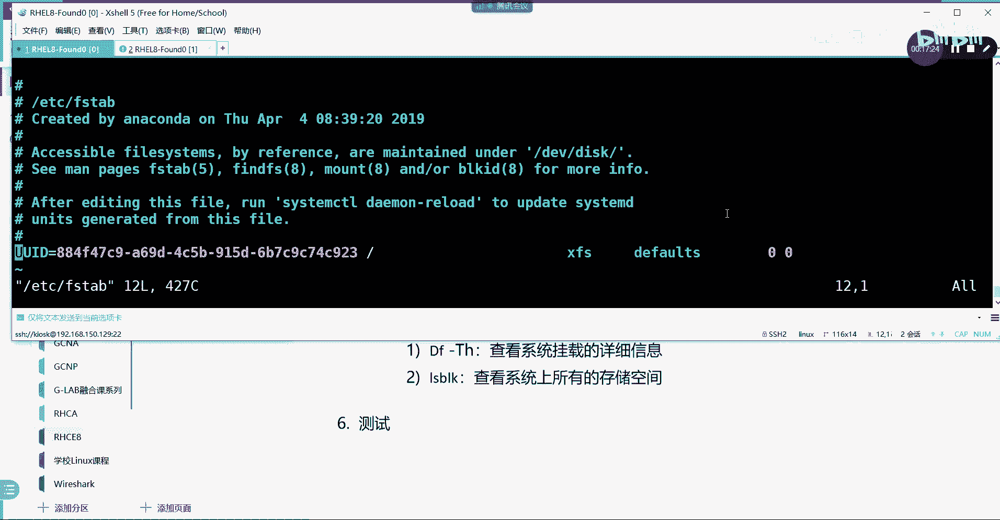

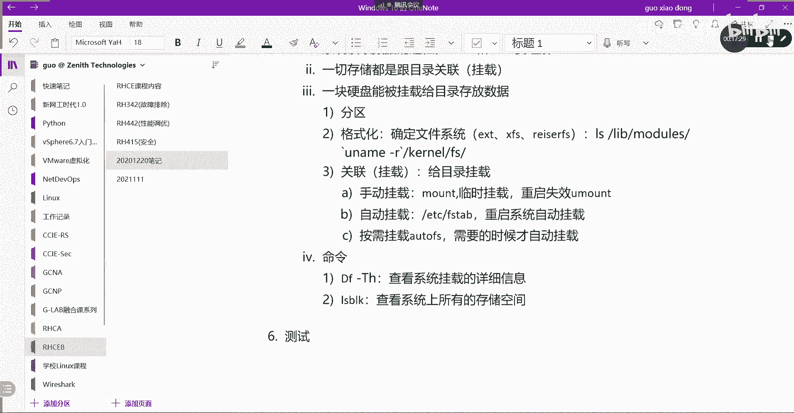

本节课中我们一起学习了Linux文件系统的基础知识。我们理解了数据通过inode和block存储的原理，掌握了Linux中“一切存储皆挂载于目录”的核心思想。我们熟悉了硬盘从分区、格式化到挂载的三个使用阶段，并认识了EXT4、XFS等常见文件系统。最后，我们学会了使用 `df`、`lsblk` 等命令查看存储状态，并了解了通过 `/etc/fstab` 文件实现自动挂载的方法。这些是管理Linux系统存储的基石，为后续深入学习打下了坚实基础。