# Linux运维与红帽认证：29：parted分区工具详解 🖥️

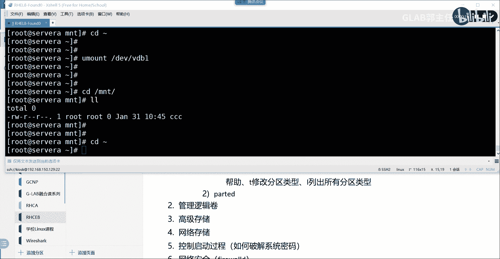

在本节课中，我们将要学习Linux中一个强大的磁盘分区工具——`parted`。我们将探讨它与传统`fdisk`工具的区别，并通过交互式和非交互式两种方式，演示如何使用`parted`创建和管理MBR与GPT分区。

---

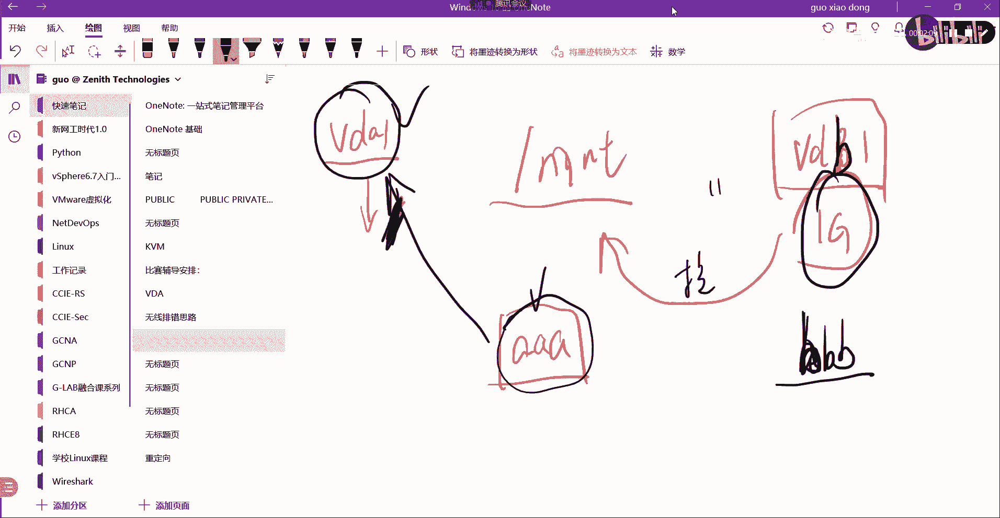

## 目录挂载原理回顾 📂

上一节我们介绍了文件系统挂载的基本概念，本节中我们来看看一个关于挂载点的常见问题：当我们将一个设备挂载到某个目录时，该目录原有的内容会如何变化？

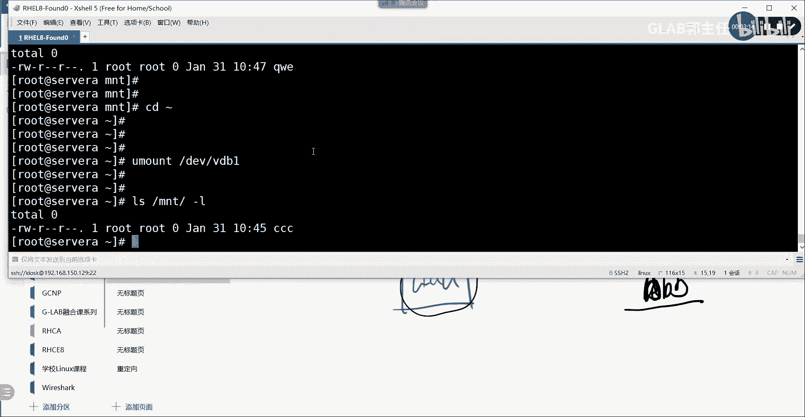

假设有一个目录 `/mnt`。在挂载任何设备之前，`/mnt` 目录下的文件（例如 `AA`）存储在根文件系统（例如 `/dev/vda1`）中。

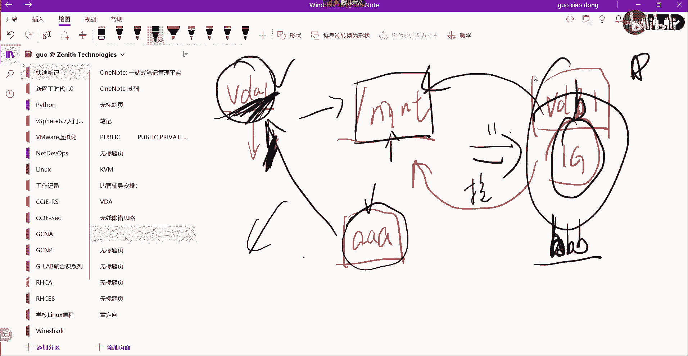

当我们创建一个新的分区 `/dev/vdb1` 并将其挂载到 `/mnt` 时，情况发生变化：
*   挂载后，访问 `/mnt` 将直接指向 `/dev/vdb1` 这个新设备。
*   此时，在 `/mnt` 下创建的新文件（例如 `BB`）将存储在新设备 `/dev/vdb1` 上。
*   而原来在 `/mnt` 下的文件 `AA` 并没有消失，它仍然存储在原来的根文件系统 `/dev/vda1` 中，只是由于挂载点的“覆盖”作用，我们暂时无法通过 `/mnt` 路径直接访问到它。
*   一旦卸载 `/dev/vdb1`，`/mnt` 目录恢复指向其父级文件系统，文件 `AA` 就会重新可见。

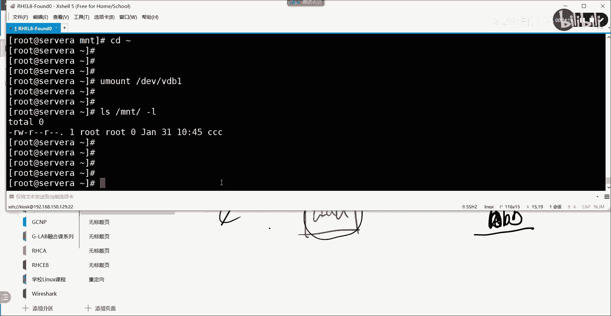

**核心结论**：挂载操作会将一个存储设备“绑定”到目录树的某个节点上。挂载后，对该目录及其所有子目录的访问，都将指向新挂载的设备空间。原目录中的内容会被“隐藏”，但并未删除。

---

## parted与fdisk工具对比 ⚖️

理解了挂载原理后，我们进入今天的主题：磁盘分区。Linux中常用的分区工具有 `fdisk` 和 `parted`，它们的主要区别在于交互方式。

*   **`fdisk`**：纯交互式工具。用户需要进入一个命令行界面，逐步输入指令（如 `n` 创建新分区，`t` 更改类型）来完成操作。
*   **`parted`**：**同时支持交互式和非交互式操作**。这意味着除了像 `fdisk` 一样逐步操作，还可以将一系列分区命令写成一行脚本直接执行。

这种区别在实际工作中意义重大。例如，如果需要为上百块磁盘执行相同的复杂分区方案，使用 `fdisk` 就需要人工交互上百次，效率低下且容易出错。而使用 `parted` 的非交互模式，可以将分区命令写入脚本，一键批量执行，这正是红帽官方教程推荐使用 `parted` 的原因之一。当然，对于简单的单次分区任务，`fdisk` 同样方便。

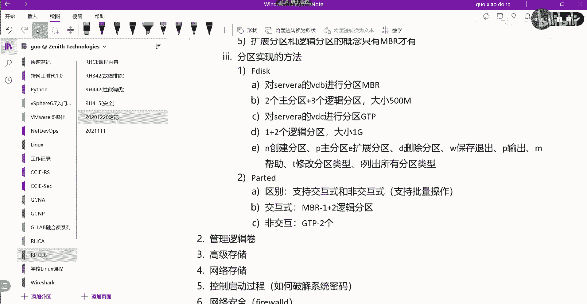

---

## 使用parted进行交互式分区（MBR）🔧

接下来，我们通过实际操作来学习 `parted`。首先，我们使用交互式方式创建一个MBR分区表，并划分一个主分区。

以下是操作步骤：

1.  **启动parted并指定磁盘**：`parted /dev/vdb`
2.  **创建MBR分区表**：`mklabel msdos`
3.  **创建主分区**：
    *   输入命令：`mkpart`
    *   分区类型：`primary`
    *   文件系统类型：`xfs`
    *   起始点：`2048s` （表示从第2048个扇区开始，这是常见起始位置）
    *   结束点：`500MB` （表示分区大小为500MB）
4.  **退出parted**：`quit`
5.  **刷新系统分区表**：`udevadm settle` （此命令在考试或某些场景下可能需要执行，以确保系统识别新分区）
6.  **格式化分区**：`mkfs.xfs -f /dev/vdb1`
7.  **挂载分区**：`mount /dev/vdb1 /mnt`
8.  **验证挂载**：在 `/mnt` 目录下创建测试文件，并使用 `df -Th` 命令查看挂载情况。

若要删除分区，可以在 `parted /dev/vdb` 交互界面中使用 `rm` 命令，后跟分区编号（例如 `rm 1`），然后退出并刷新系统即可。

---

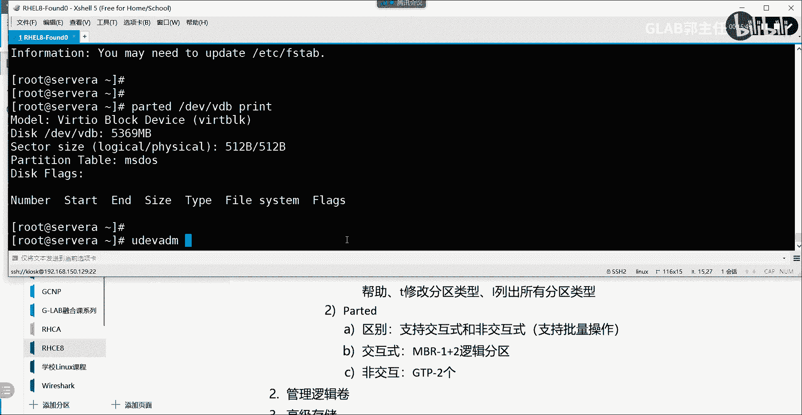

## 使用parted进行非交互式分区（GPT）🚀

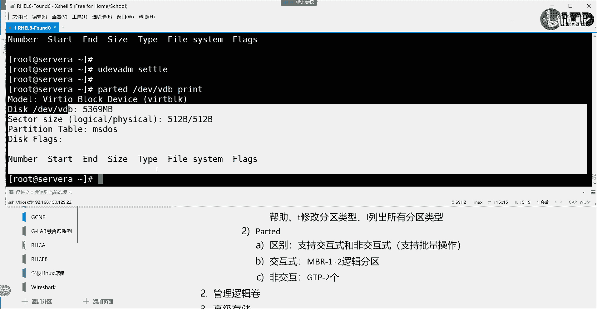

现在，我们来看看 `parted` 更强大的非交互式用法。我们将通过一行命令创建GPT分区表并划分分区。

**非交互式命令的核心格式**是：`parted /dev/设备名 命令1 命令2 ...`

例如，创建GPT分区表并划分一个约1GB的XFS分区：
```bash
parted /dev/vdb mklabel gpt yes mkpart xfs 2048s 1001MB
```
命令分解：
*   `parted /dev/vdb`：对 `/dev/vdb` 磁盘操作。
*   `mklabel gpt yes`：创建GPT分区表，`yes` 表示自动确认。
*   `mkpart xfs 2048s 1001MB`：创建一个文件系统类型为xfs的分区，从2048扇区开始，到1001MB结束。

执行后，使用 `parted /dev/vdb print` 查看分区信息，然后同样进行格式化、挂载等后续操作。

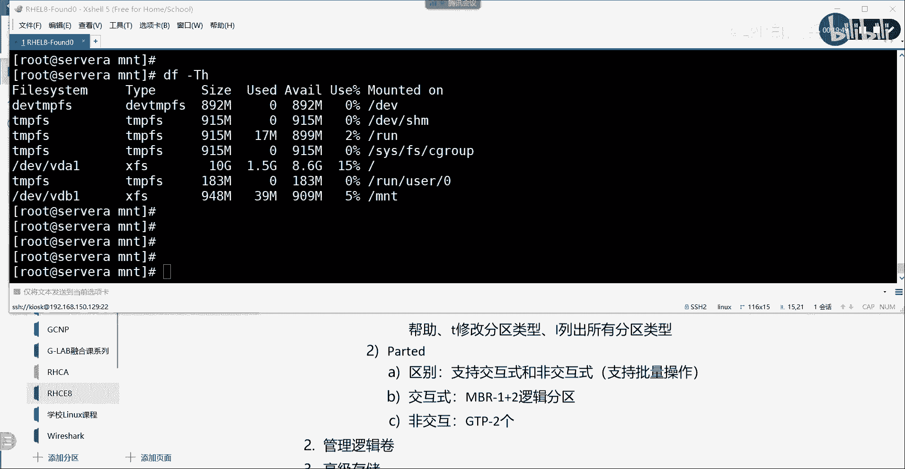

**非交互式的优势**在于可编写脚本。假设需求是：创建GPT分区表，划分一个100MB的ext4分区、一个199MB的swap分区和一个1GB的xfs分区。我们可以将以下命令写入脚本：
```bash
#!/bin/bash
# 创建GPT分区表
parted /dev/vdb mklabel gpt yes
# 创建第一个分区 (ext4, 100MB)
parted /dev/vdb mkpart ext4 2048s 100MB
# 创建第二个分区 (swap, 199MB)，起始点为上一个分区的结束点
parted /dev/vdb mkpart linux-swap 100MB 299MB
# 创建第三个分区 (xfs, 1GB)
parted /dev/vdb mkpart xfs 299MB 1300MB
# 刷新系统
udevadm settle
# 格式化各分区
mkfs.ext4 /dev/vdb1
mkswap /dev/vdb2
mkfs.xfs -f /dev/vdb3
# 挂载分区 (示例)
mount /dev/vdb1 /mnt/data
swapon /dev/vdb2
mount /dev/vdb3 /mnt/backup
```
运行此脚本即可自动完成所有分区任务，高效且准确。

---

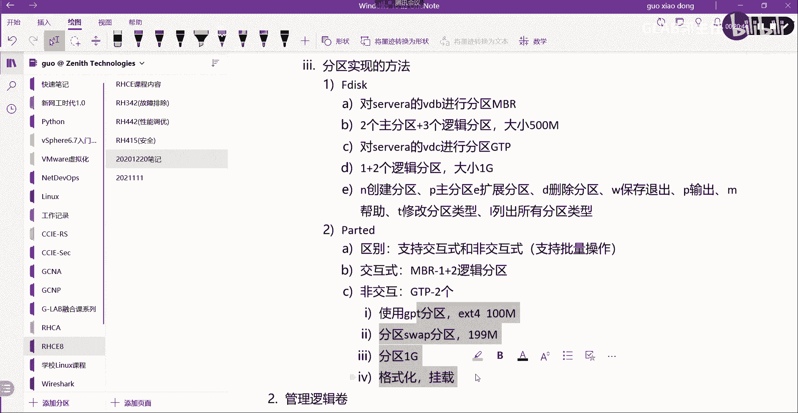

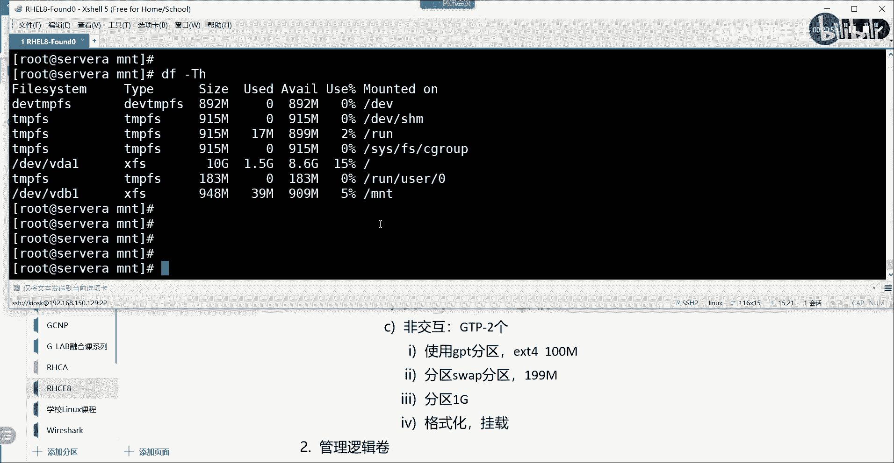

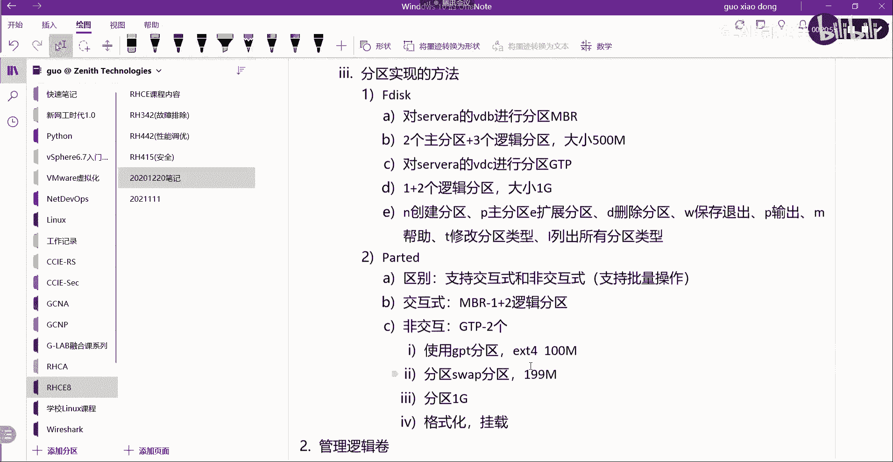

## 课程总结 📝

本节课中我们一起学习了 `parted` 磁盘分区工具。

*   我们首先回顾了目录挂载的原理，理解了设备挂载如何“覆盖”目录的原始访问路径。
*   接着，我们对比了 `parted` 与 `fdisk` 工具，明确了 `parted` 支持**非交互式操作**的核心优势，使其适合自动化与批量部署。
*   然后，我们通过实战演示了如何使用 `parted` 的**交互式模式**创建MBR分区。
*   最后，我们重点掌握了 `parted` 的**非交互式命令语法**，并展示了如何通过编写单行命令或Shell脚本，快速创建GPT分区表及多个分区，极大提升了运维工作的效率。

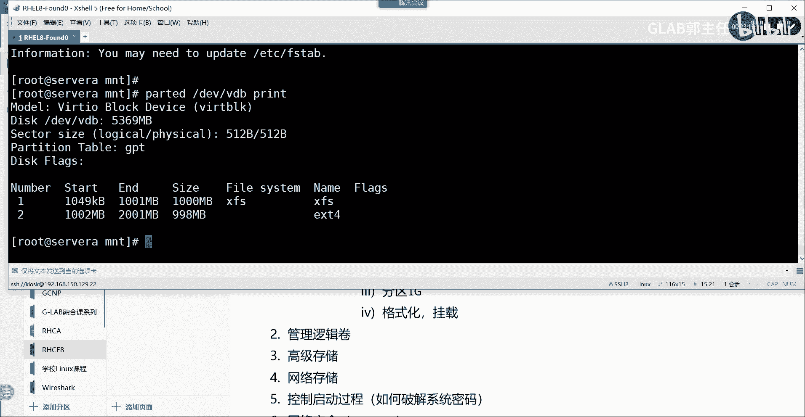

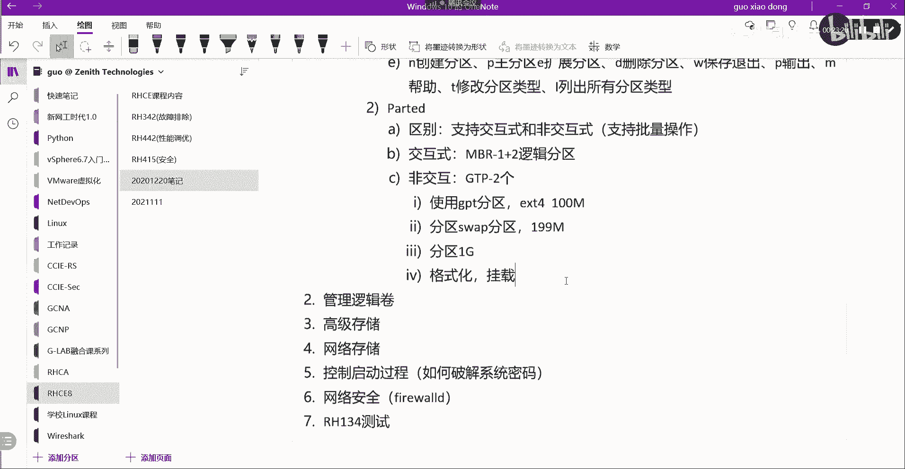

掌握 `parted` 的这两种使用方式，是成为一名高效Linux系统管理员的重要技能。