# Ansible大项目管理：45：管理大项目 🚀

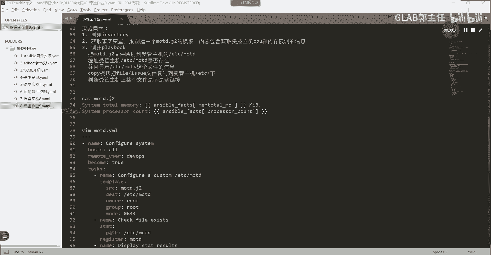

在本节课中，我们将学习如何优化和管理大型的Ansible项目。就像开发大型软件项目一样，将Ansible Playbook模块化是提高效率、清晰度和可维护性的关键。我们将重点介绍两个核心优化思路：使用动态清单和将Playbook拆分为模块化的任务文件。

## 概述 📋


上一节我们介绍了Ansible Playbook的基础编写。本节中我们来看看当项目规模变大时，如何通过模块化设计和动态清单等技术来优化我们的自动化脚本。主要内容包括将功能拆分为独立文件、实现任务并发执行以及使用动态生成的清单。

---

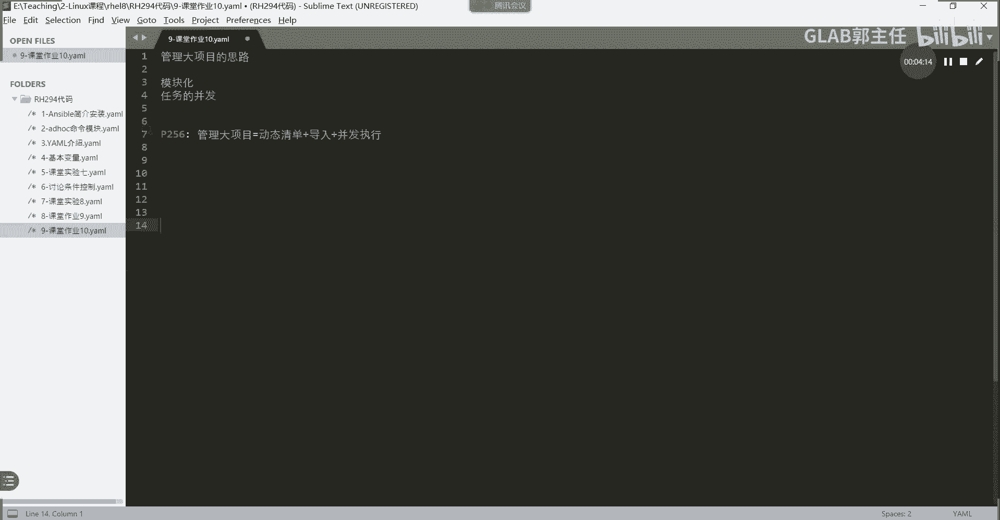

## 管理大项目的核心思路 💡

处理大项目时，主要有两个优化方向：

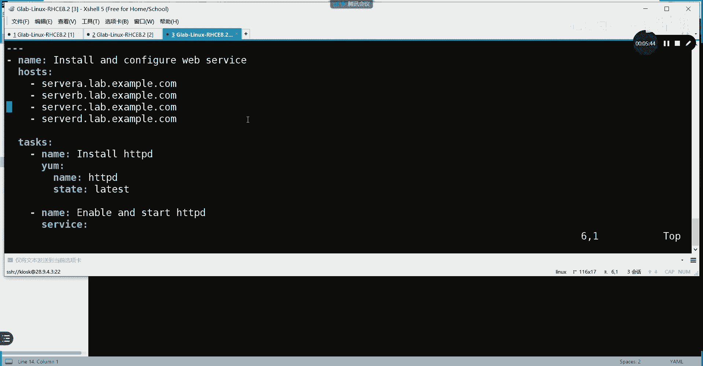

1.  **模块化**：避免将所有代码写在一个文件中。应该根据不同的功能（例如：Web服务配置、防火墙配置）拆分成独立的模块，最后再组装起来。这使代码更清晰，便于团队协作和后续维护。
2.  **任务并发**：默认情况下，Ansible按顺序执行任务。我们可以通过调整参数，让Ansible同时处理多个任务，从而提高执行效率。这在底层是通过多进程实现的。

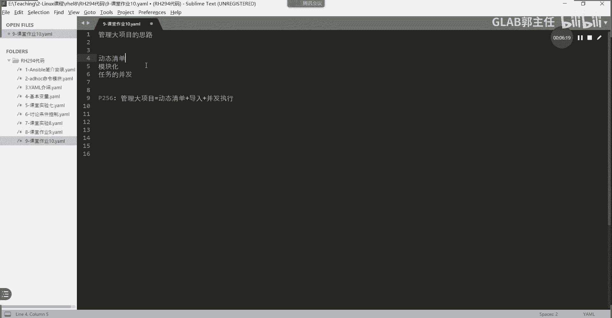

---

## 实验：优化现有Playbook ⚙️

本次实验的目标是优化一个已编写好的Playbook。我们将按照上述思路，将其重构为模块化的形式。

### 第一步：使用动态清单

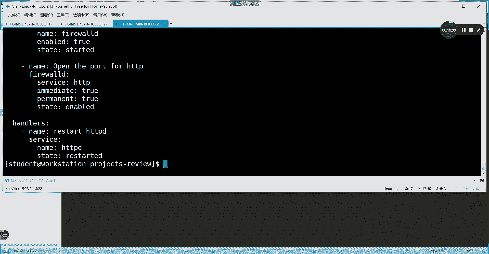

在大项目中，通常不使用静态的、写死的主机清单文件，而是使用**动态清单**。动态清单通过脚本（如Python脚本）实时生成主机列表，能够反映基础设施的当前状态。

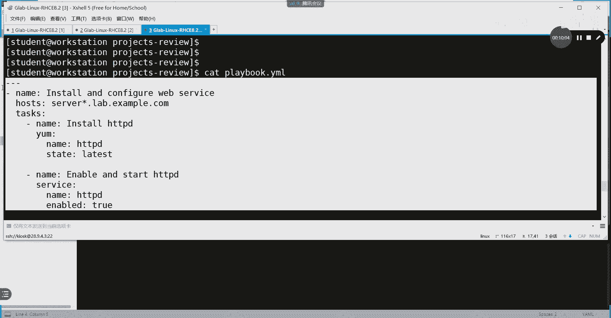

以下是配置动态清单的步骤：

1.  实验环境已提供了一个动态清单脚本，路径为：`inventory/inventory.py`。
2.  为该脚本添加执行权限：
    ```bash
    chmod 755 inventory/inventory.py
    ```
3.  执行此脚本可以列出当前检测到的主机：
    ```bash
    ./inventory/inventory.py --list
    ```
4.  我们可以在Playbook中，将静态的主机模式（如 `servera.lab.example`）替换为能匹配动态清单结果的模式。例如，使用 `server*.lab.example` 来匹配所有以 `server` 开头的主机。

这样，Playbook的主机列表就不再是固定的，而是由动态清单实时提供的。

### 第二步：创建模块化的任务文件

原始的Playbook将安装软件、启动服务、配置文件等多个步骤都写在一个文件中。我们将按功能将其拆解。

首先，我们创建一个基础功能模块，用于**安装软件包并启用对应的服务**。

**文件：`install_enable.yml`**
```yaml
---
- name: Install package and enable service
  yum:
    name: "{{ package }}"
    state: present

- name: Enable service
  service:
    name: "{{ service }}"
    enabled: true
    state: started
```
这个模块定义了两个任务，但使用了变量 `{{ package }}` 和 `{{ service }}`。这意味着它不是一个完整的Playbook，而是一个可复用的“任务块”。

接下来，我们创建具体的功能模块。例如，配置Web服务的任务模块。

**文件：`tasks/web_tasks.yml`**
```yaml
---
- name: Import common installation tasks
  import_tasks: ../install_enable.yml
  vars:
    package: httpd
    service: httpd

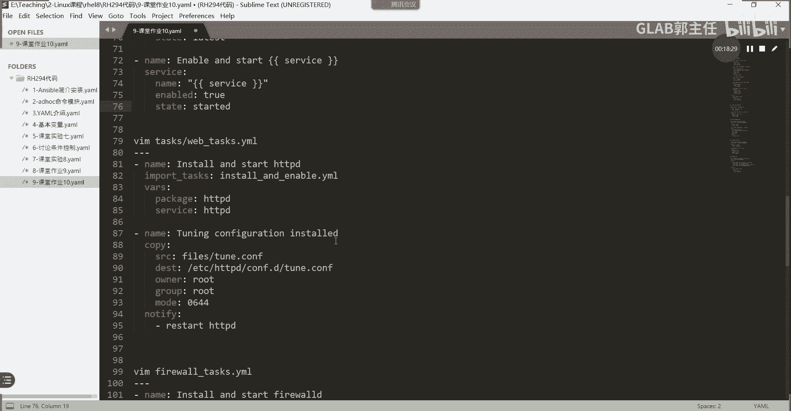

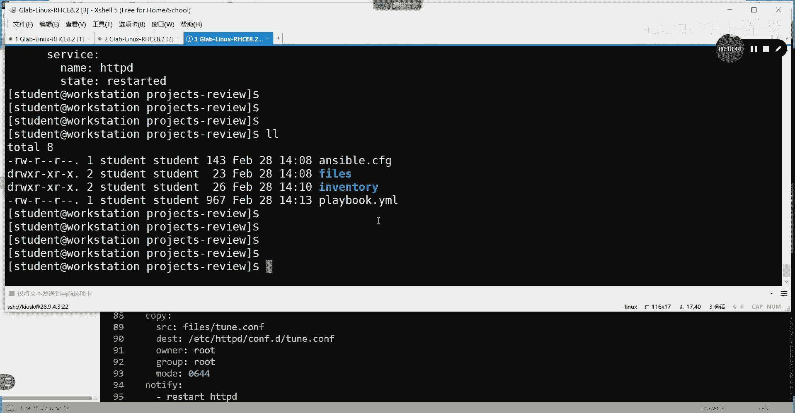


- name: Copy web content
  copy:
    src: web_content.html
    dest: /etc/httpd/htdocs/index.html
  notify: restart httpd
```
在这个文件中，我们使用 `import_tasks` 关键字导入了基础模块 `install_enable.yml`，并通过 `vars` 传入了具体的软件包名（`httpd`）和服务名（`httpd`）。这样，就完成了HTTPD的安装和启用。之后，再执行其特有的任务（如复制网页文件）。


同理，我们可以创建配置防火墙的任务模块。

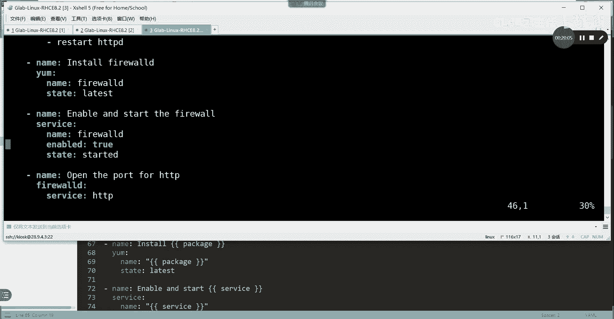

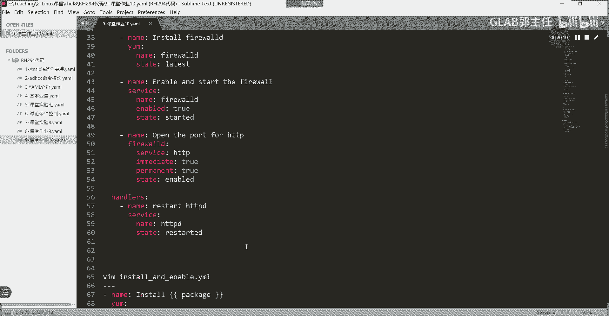

**文件：`tasks/firewall_tasks.yml`**
```yaml
---
- name: Import common installation tasks
  import_tasks: ../install_enable.yml
  vars:
    package: firewalld
    service: firewalld

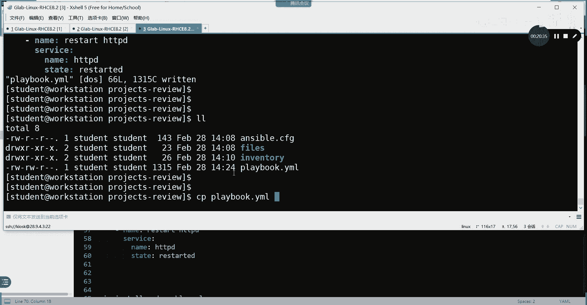

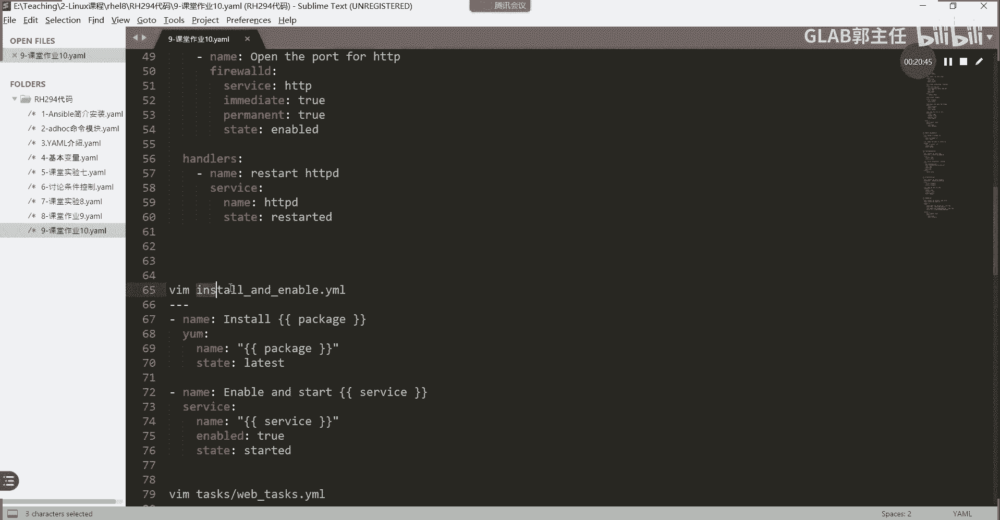

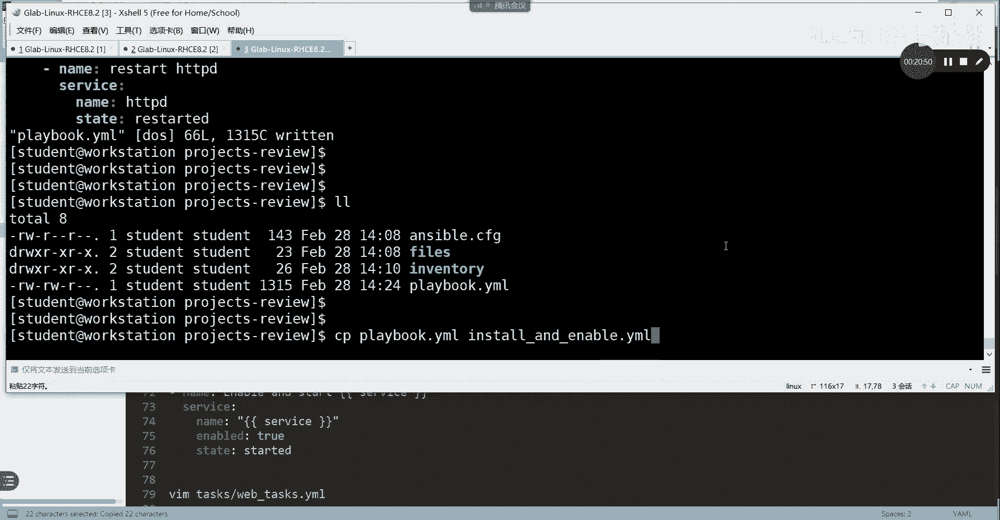

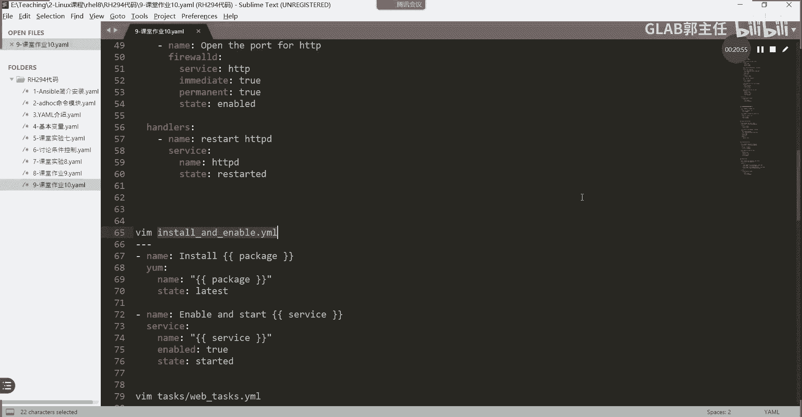

- name: Open firewall port for http
  firewalld:
    service: http
    permanent: true
    immediate: true
    state: enabled
```
最后，我们创建一个主Playbook文件，来组装所有模块并设置全局参数。

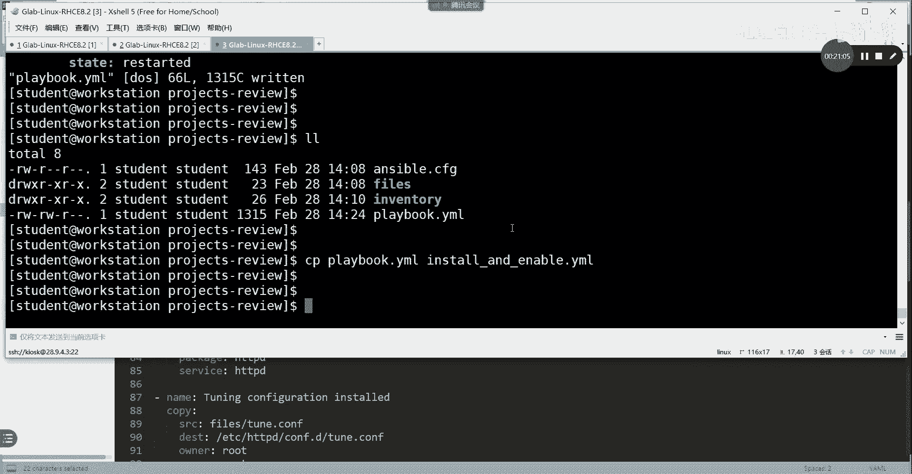


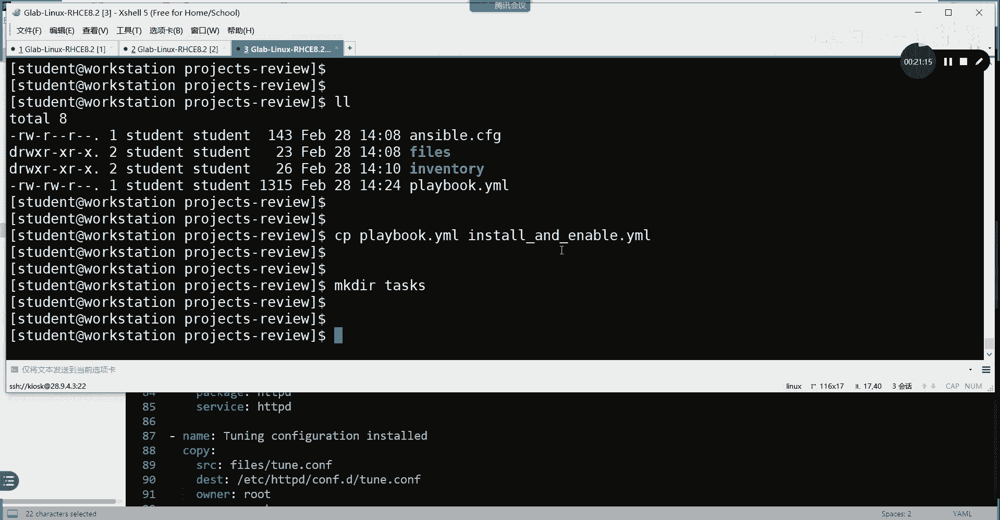

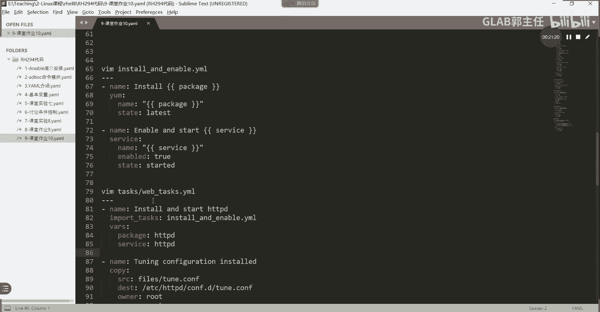

**文件：`playbook.yml`**
```yaml
---
- name: Configure web and firewall
  hosts: server*.lab.example
  serial: 2
  tasks:
    - name: Include web tasks
      import_tasks: tasks/web_tasks.yml

    - name: Include firewall tasks
      import_tasks: tasks/firewall_tasks.yml

  handlers:
    - name: restart httpd
      service:
        name: httpd
        state: restarted
```
在这个主文件中：
*   `hosts: server*.lab.example` 使用了动态清单的匹配模式。
*   `serial: 2` 是关键参数，它设置了**任务并发数**为2。这意味着Ansible会同时在两台主机上执行任务，而不是一台接一台地执行。
*   在 `tasks` 部分，我们使用 `import_tasks` 导入了具体的功能模块（`web_tasks.yml` 和 `firewall_tasks.yml`）。
*   `handlers` 部分定义的通知处理程序保持不变。

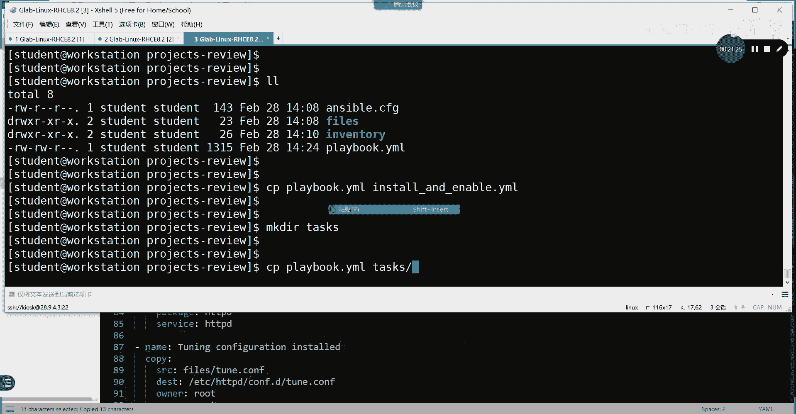

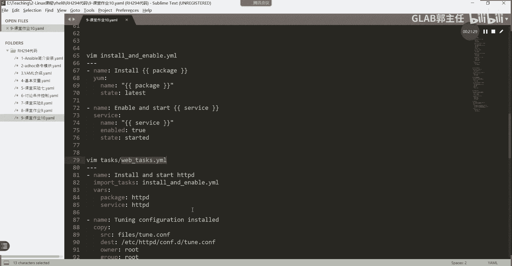

### 模块化带来的好处

通过以上重构，我们得到了一个清晰的项目结构：
```
playbook.yml
install_enable.yml
tasks/
├── web_tasks.yml
└── firewall_tasks.yml
```
这样做的好处非常明显：
1.  **逻辑清晰**：每个文件职责单一，易于理解和维护。
2.  **易于协作**：不同工程师可以负责不同的功能模块（如Web、防火墙），互不干扰。
3.  **代码复用**：公共操作（如安装并启用服务）被提取成基础模块，避免了重复代码。需要添加新服务时，只需编写新的任务文件并调用基础模块即可。
4.  **提升效率**：通过设置 `serial` 参数实现并发执行，可以显著缩短在多台主机上运行Playbook的总时间。

---

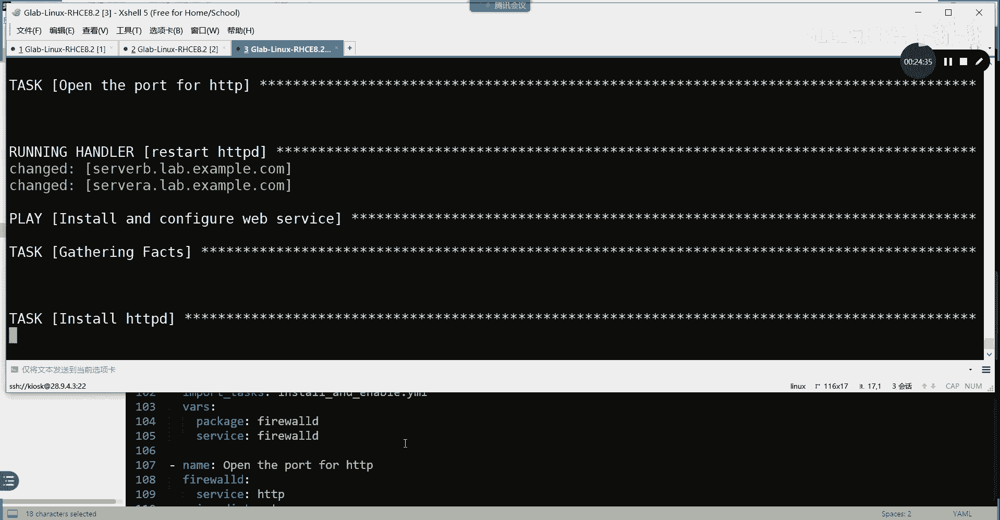

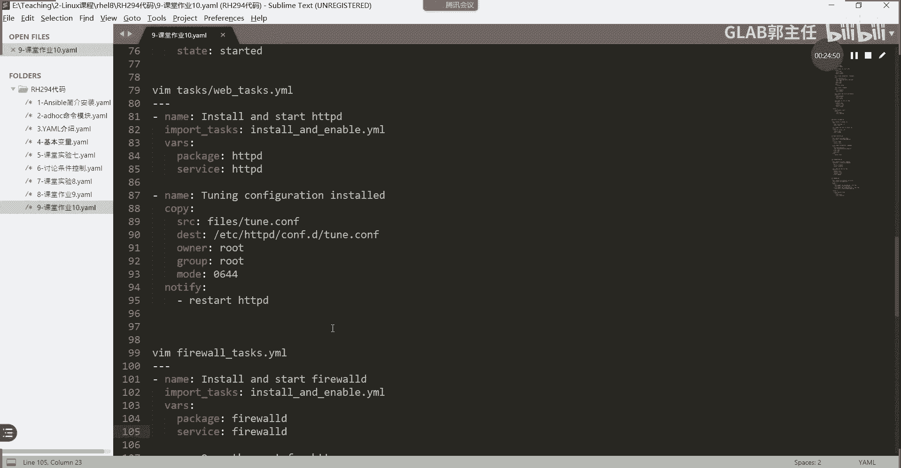

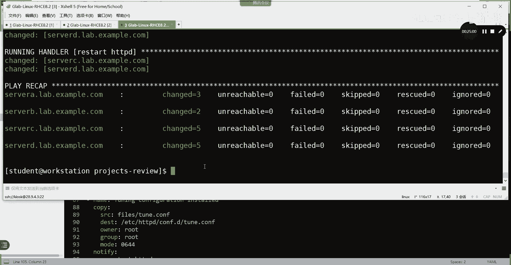

## 总结 🎯

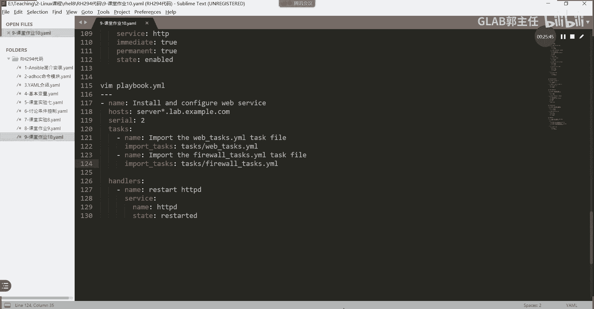

本节课中我们一起学习了如何管理大型Ansible项目。核心在于采用**模块化**的设计思想，将庞大的Playbook拆分为基础功能模块和具体业务模块，并通过 `import_tasks` 进行组装。同时，我们介绍了使用**动态清单**来灵活管理主机，以及通过 `serial` 参数控制**任务并发**数以提升执行效率。这些技巧能帮助你在面对复杂运维场景时，写出更优雅、更高效、更易于维护的自动化代码。