# Linux高级存储管理：第32章：Stratis与VDO存储技术

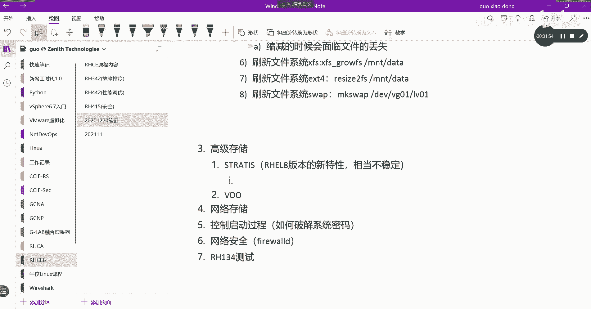

在本章中，我们将学习Linux系统中的两种高级存储管理技术：Stratis和VDO。Stratis是红帽8版本引入的新特性，而VDO则是成熟且必考的核心技术。我们将分别了解它们的基本概念、工作原理和配置方法。

## Stratis存储管理 🆕

上一节我们介绍了高级存储的概览，本节中我们来看看第一种技术——Stratis。Stratis是红帽8版本后推出的新特性，它以存储池服务的形式，透明地为用户创建和管理逻辑卷。需要注意的是，该技术在初期可能不太稳定，红帽官方也不建议在生产环境中使用，但作为新特性，了解其基本操作仍有必要。

Stratis可以管理物理存储设备池，并能够灵活调整逻辑卷的大小。它的配置方式与传统的LVM不同，将底层细节抽象化，直接基于文件系统提供服务。

以下是配置Stratis的基本步骤：

1.  **安装软件包**：首先需要安装`stratisd`和`stratis-cli`软件包。
    ```bash
    yum install stratisd stratis-cli
    ```

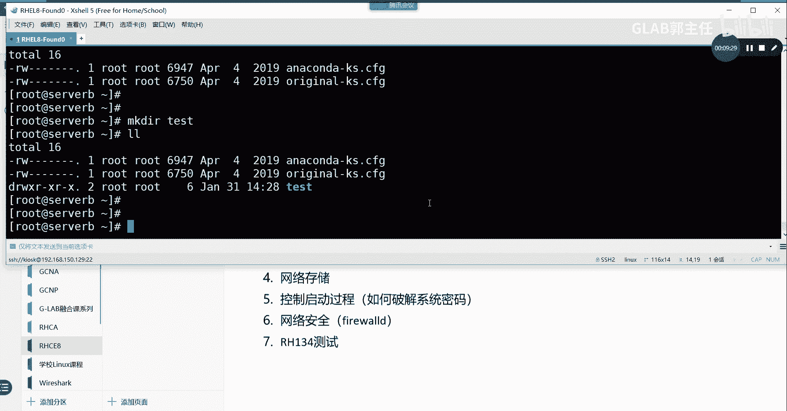

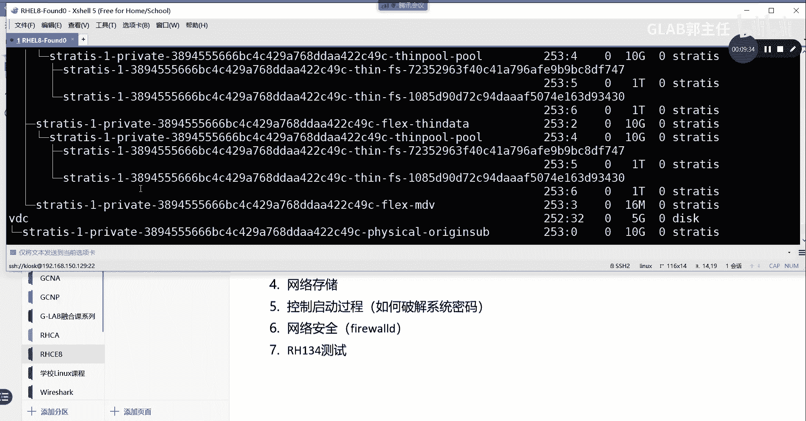

2.  **启用服务**：启动并设置`stratisd`服务开机自启。
    ```bash
    systemctl enable --now stratisd
    ```

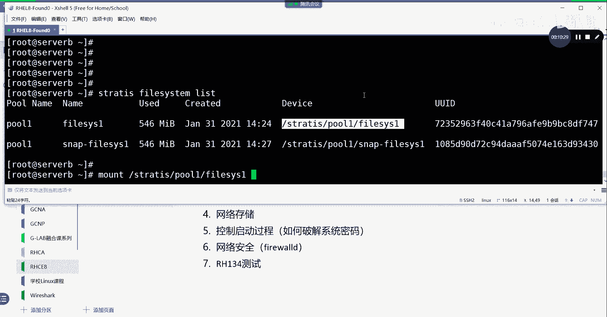

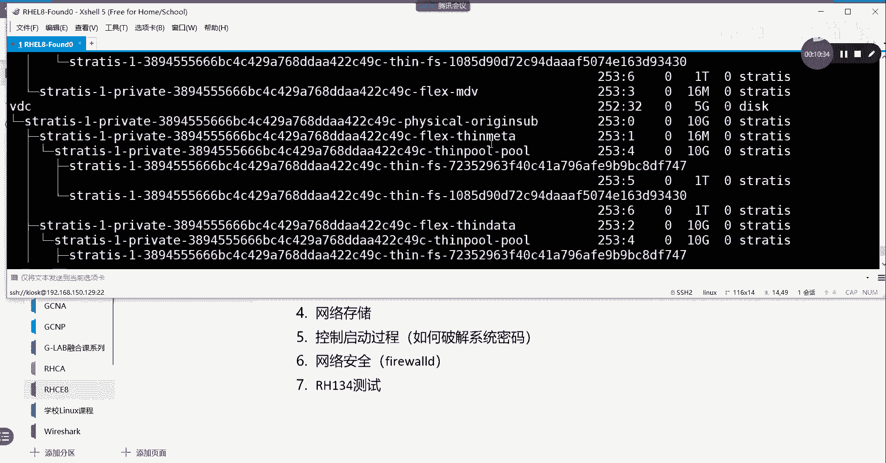

3.  **创建存储池**：使用`stratis pool create`命令创建一个存储池（例如`pool1`），并将物理磁盘（如`/dev/vdb`）加入其中。
    ```bash
    stratis pool create pool1 /dev/vdb
    ```

4.  **查看与扩展存储池**：可以列出存储池，并向其中添加更多磁盘。
    ```bash
    stratis pool list
    stratis pool add-data pool1 /dev/vdc
    ```

5.  **创建文件系统**：在存储池中创建文件系统，无需指定大小，系统会采用精简配置方式按需分配空间。
    ```bash
    stratis filesystem create pool1 filesys1
    ```

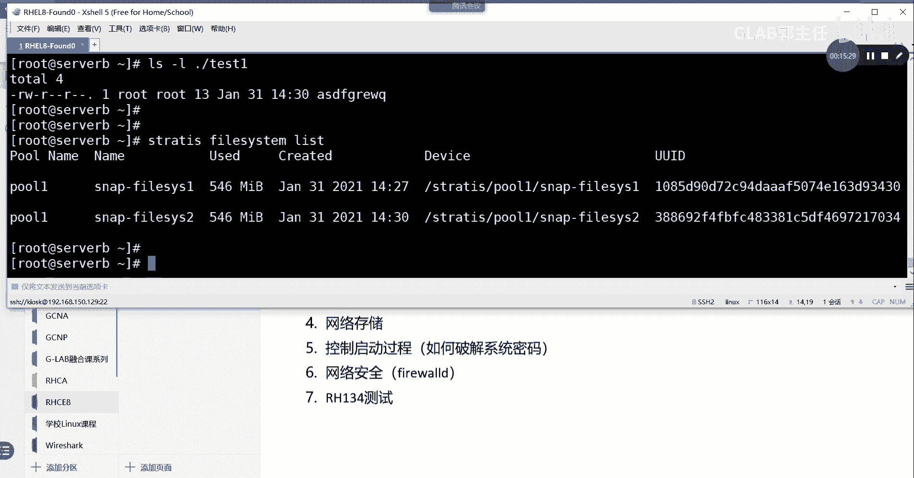

6.  **创建快照**：可以为文件系统创建快照，用于数据备份或保护。
    ```bash
    stratis filesystem snapshot pool1 filesys1 snap1
    ```

7.  **挂载使用**：创建挂载点，并将创建的文件系统或快照挂载上去即可使用。
    ```bash
    mkdir /test
    mount /stratis/pool1/filesys1 /test
    ```

Stratis的主要特点包括：将底层存储硬件和文件格式透明化；文件系统采用精简配置，按需分配空间；支持创建海量文件系统（最多2^24个）；并且可以直接基于文件系统创建快照。

## VDO虚拟数据优化器 💾

上一节我们介绍了Stratis，本节中我们来看看更成熟且重要的VDO技术。VDO（Virtual Data Optimizer）是虚拟数据优化器，主要用于数据压缩和去重，以优化存储空间利用率。

VDO位于块存储设备之上，可以理解为一种上层软件。它能创建逻辑设备（称为VDO卷），该卷可以像普通分区一样被格式化和挂载，甚至可以作为LVM的物理卷使用，从而使逻辑卷也具备压缩和去重功能。

VDO的核心优化在于两个方面：
*   **去重**：存储内容相同的文件时，只在磁盘上保留一份数据副本。
*   **压缩**：使用算法减少数据占用的物理空间。

因此，VDO卷的**逻辑大小可以超过其底层物理设备的大小**。

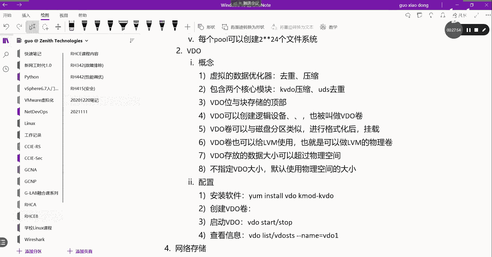

以下是配置VDO的基本步骤：

1.  **安装软件包**：需要安装`vdo`和`kmod-kvdo`软件包。
    ```bash
    yum install vdo kmod-kvdo
    ```

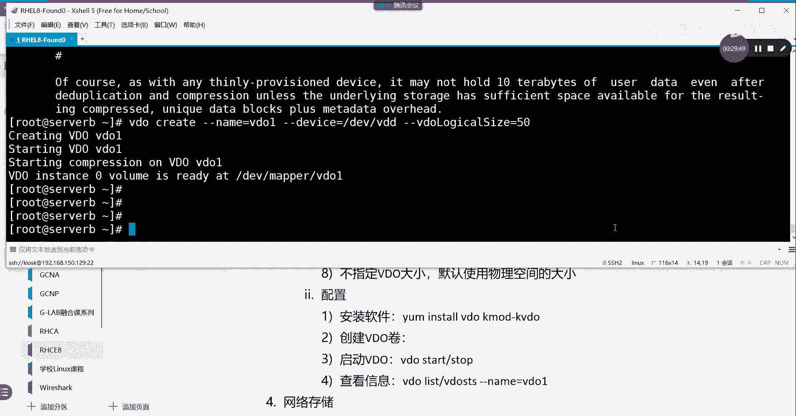

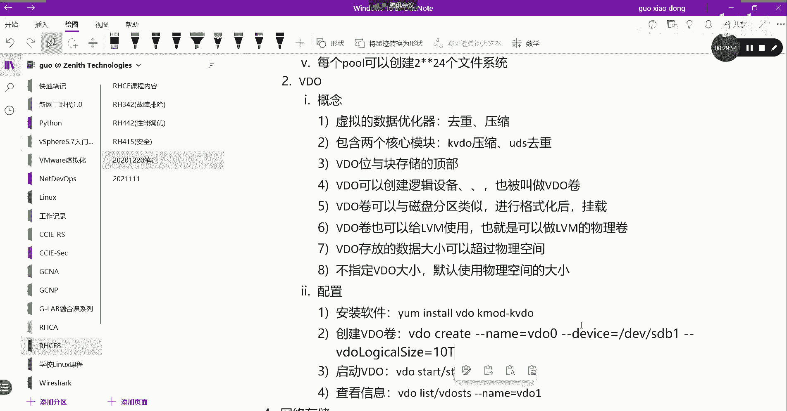

2.  **创建VDO卷**：使用`vdo create`命令创建卷。例如，在`/dev/vdd`设备上创建名为`vdo1`、逻辑大小为50G的卷。
    ```bash
    vdo create --name=vdo1 --device=/dev/vdd --vdoLogicalSize=50G
    ```

3.  **管理VDO卷**：可以启动、停止VDO卷，并查看其状态。
    ```bash
    vdo start --name=vdo1
    vdo status --name=vdo1
    vdo list
    ```

4.  **格式化与挂载**：创建VDO卷后，需要将其格式化为文件系统（如XFS）并挂载使用。
    ```bash
    mkfs.xfs /dev/mapper/vdo1
    mkdir /vdo_test
    mount /dev/mapper/vdo1 /vdo_test
    ```

5.  **验证效果**：向挂载点存入大量重复或可压缩的数据后，可以使用`vdostats`命令查看节省的空间比例。
    ```bash
    vdostats --human-readable
    ```

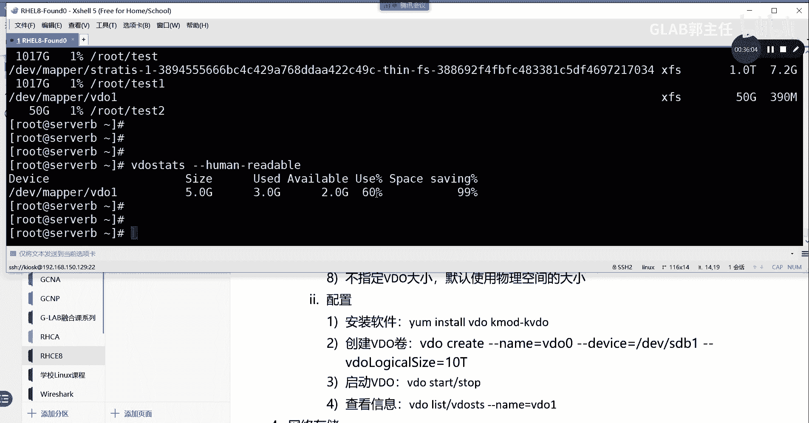

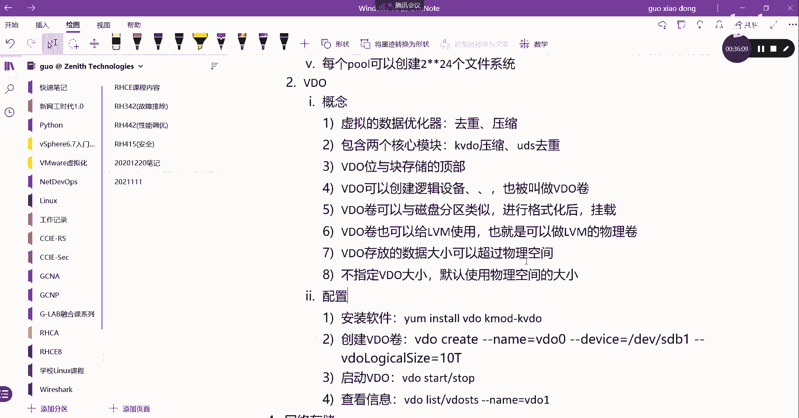

6.  **与LVM结合**：VDO卷可以直接作为物理卷（PV）加入LVM管理，从而让逻辑卷具备优化功能。
    ```bash
    pvcreate /dev/mapper/vdo1
    ```

## 总结 📝

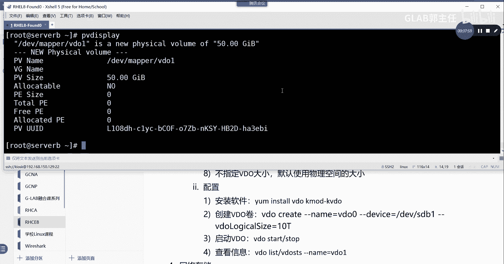

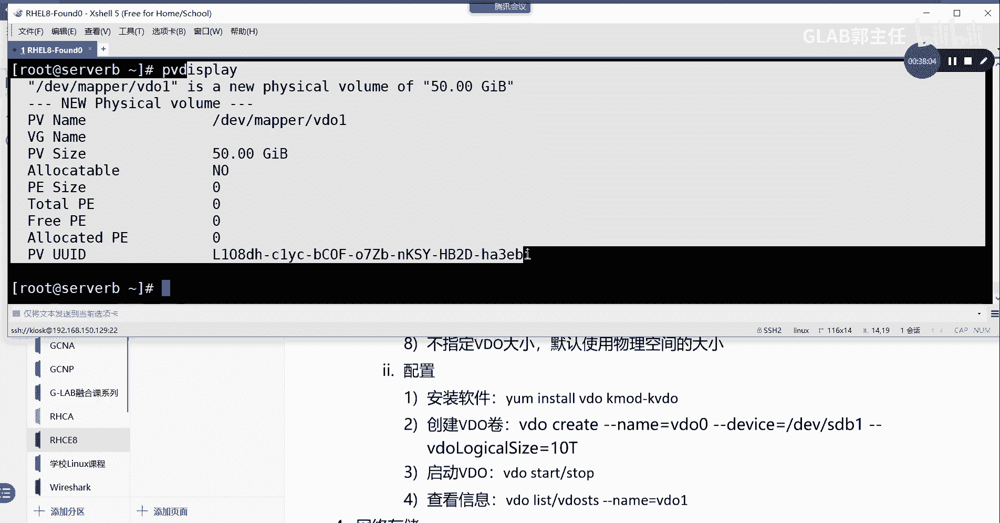

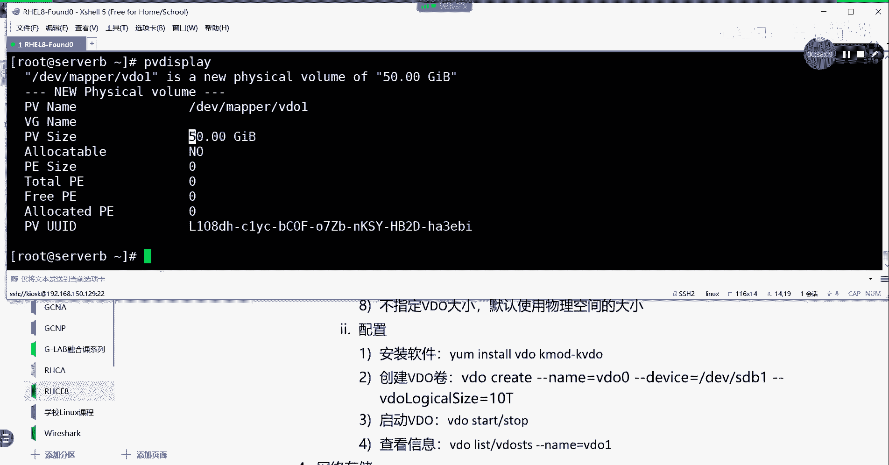

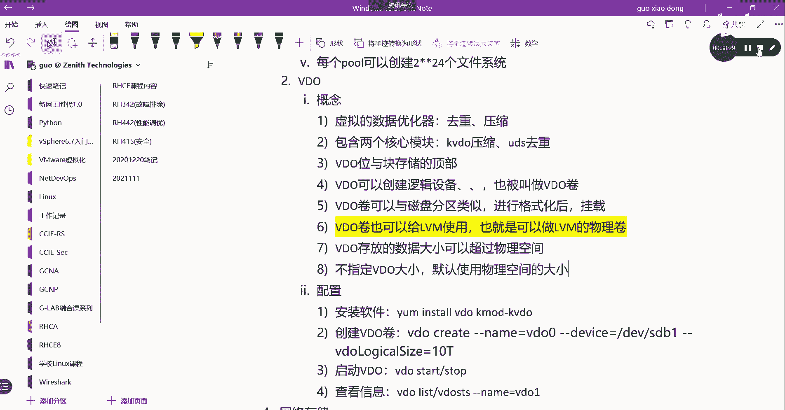

本节课中我们一起学习了两种Linux高级存储技术。我们首先了解了Stratis，它是一种新的存储池管理服务，能够透明化底层细节并提供精简配置的文件系统。接着，我们深入探讨了VDO虚拟数据优化器，掌握了其通过去重和压缩来高效利用存储空间的原理与配置方法。VDO不仅可以独立使用，还能与LVM结合，是实际工作中提升存储效率的重要工具。