Linux入门与红帽认证：10：环境变量详解 🐧

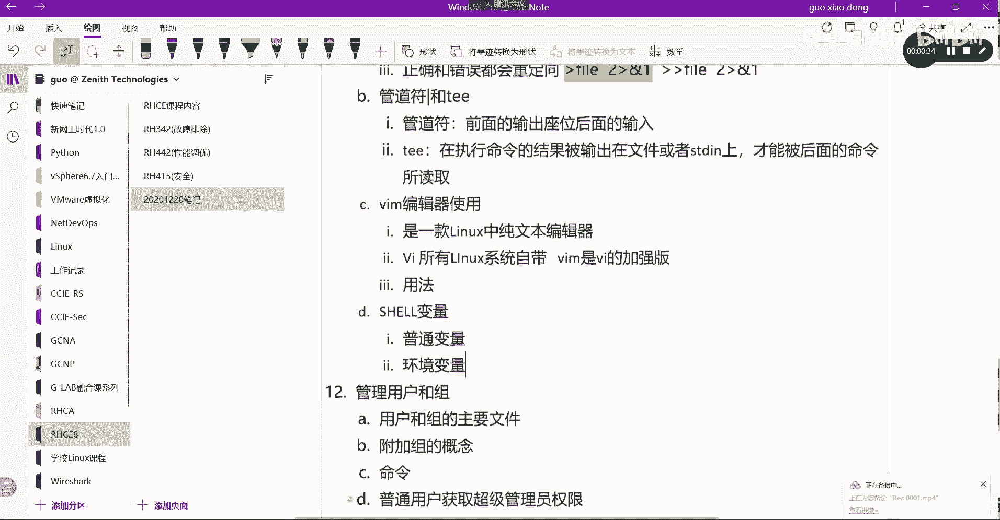

在本节课中，我们将要学习Linux Shell中的变量，特别是环境变量。我们将了解变量的类型、如何查看和修改环境变量，以及环境变量相关的系统文件。最后，我们会通过一个练习来巩固所学知识。

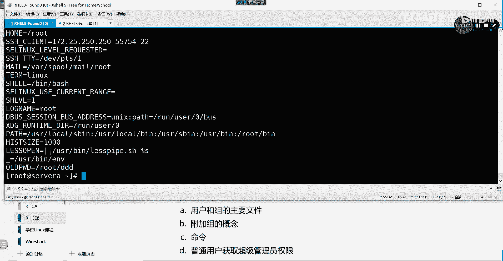

---

在Linux Shell中，变量主要分为两种类型：普通变量和环境变量。

普通变量是用户自定义的变量。例如，在Shell中执行 `A=GLAB`，就定义了一个名为`A`的普通变量。可以通过 `echo $A` 来查看它的值。

环境变量则是由系统或Shell预定义的变量，它们通常使用大写字母命名。环境变量定义了Shell的工作环境，例如命令的搜索路径。查看所有环境变量可以使用 `env` 命令。

---

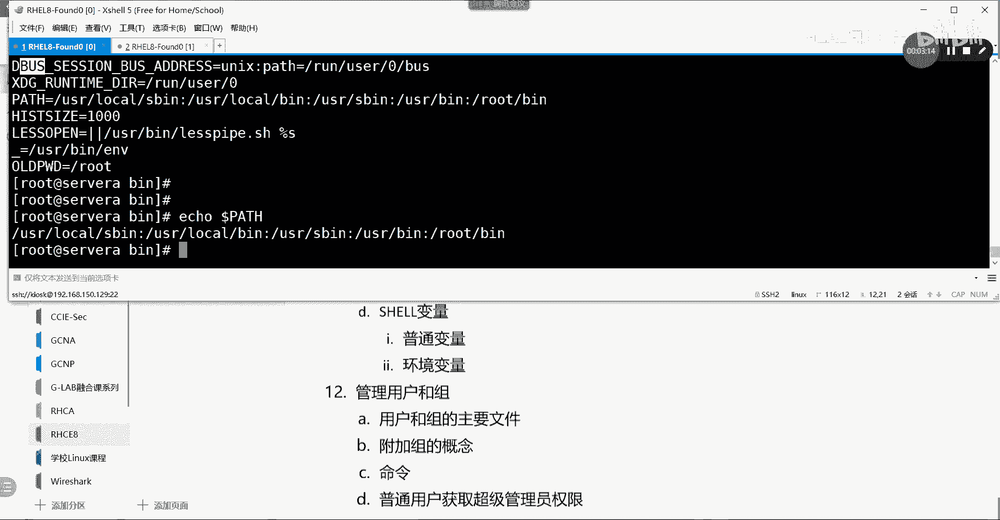

### 环境变量的核心：PATH

一个至关重要的环境变量是 `PATH`。它定义了当用户输入一个命令时，系统去哪些目录中查找该命令的可执行文件。

我们可以通过 `echo $PATH` 来查看其内容，输出通常是由冒号分隔的多个目录路径，例如 `/usr/bin:/bin`。

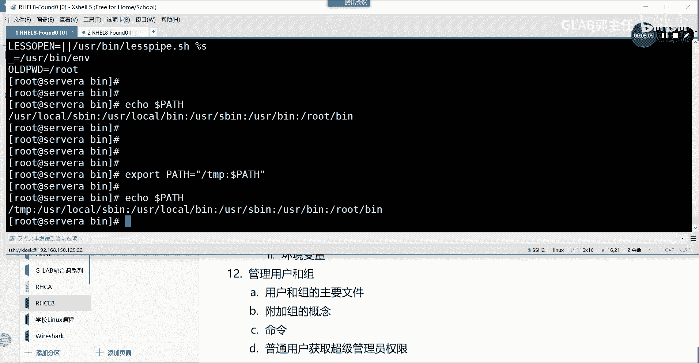

**为什么命令需要放在特定目录？**
因为系统只会到 `PATH` 变量所列出的目录中去寻找可执行文件。如果你想让自己编写的脚本像系统命令一样直接运行，有两种方法：一是将脚本文件放到 `PATH` 已有的目录中（如 `/usr/local/bin`）；二是将脚本所在目录的路径添加到 `PATH` 变量中。

---

### 如何修改环境变量

我们可以使用 `export` 命令来临时修改环境变量。这种修改仅在当前Shell会话中有效，退出后就会失效。

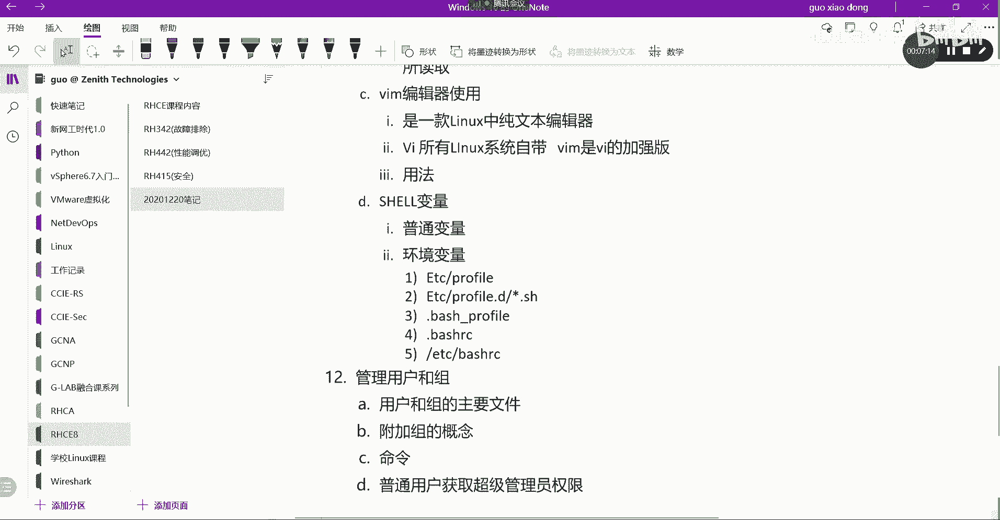

例如，要在 `PATH` 变量最前面添加 `/tmp` 目录：
```bash
export PATH="/tmp:$PATH"
```
这条命令的含义是：将原来的 `$PATH` 值前面加上 `/tmp:`，形成新的值，并重新赋值给 `PATH` 变量。这里必须使用双引号，以确保变量 `$PATH` 能够被正确解析。

修改后，再次执行 `echo $PATH`，会发现 `/tmp` 已经出现在路径列表的开头。

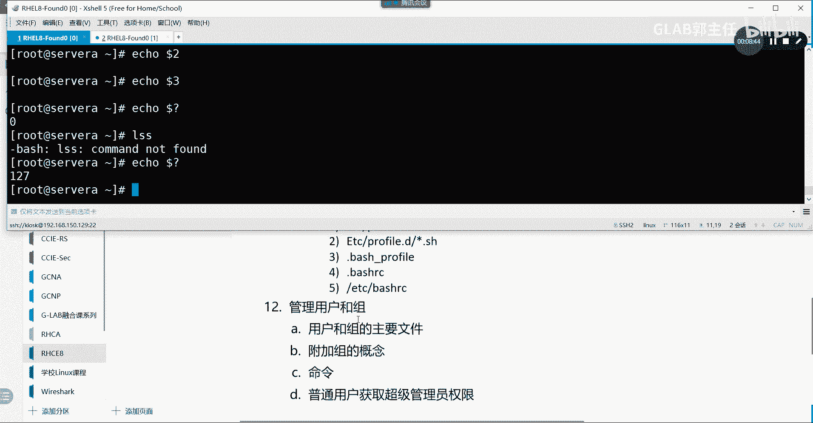

---

### 环境变量的配置文件

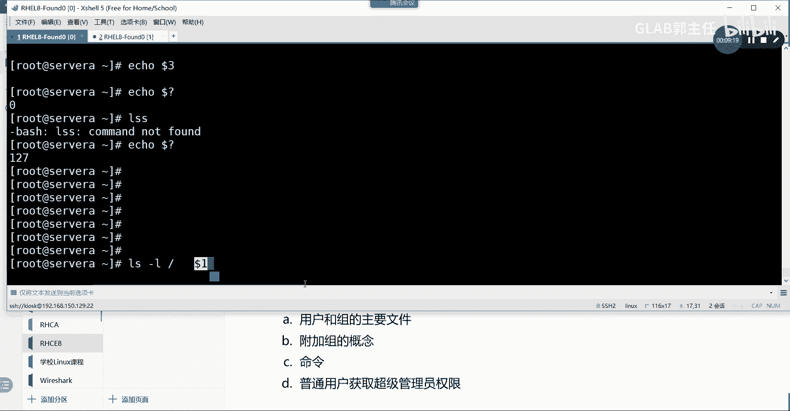

为了使环境变量的修改永久生效，我们需要修改相应的配置文件。与环境和变量相关的主要配置文件有以下几个：

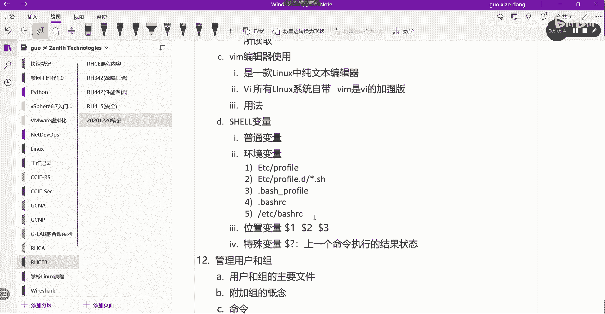

*   **`/etc/profile`**：系统全局配置文件，对所有用户生效。
*   **`/etc/profile.d/*.sh`**：该目录下的所有 `.sh` 文件会被 `/etc/profile` 调用，方便模块化管理。
*   **`~/.bash_profile`** 或 **`~/.profile`**：用户个人的环境变量配置文件。
*   **`~/.bashrc`**：用户个人的Shell配置文件，主要用于定义别名、函数和本地变量。

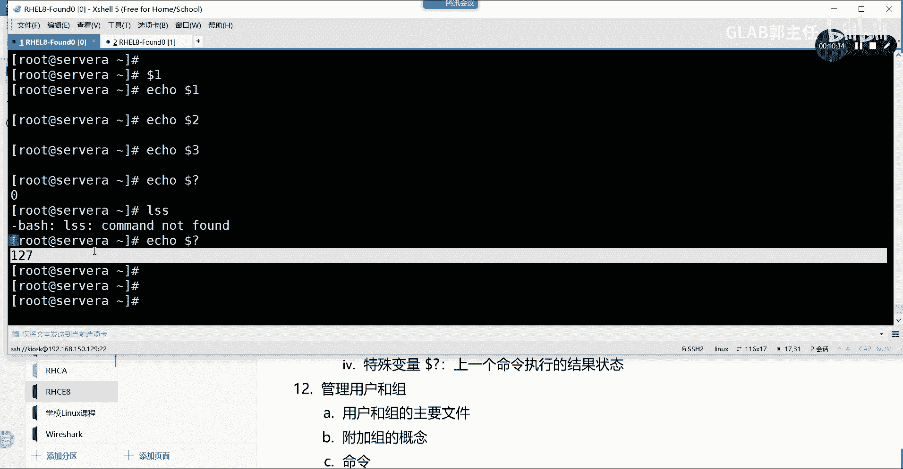

**简单区分：**
*   `profile` 类文件通常用于设置**环境变量**和登录时需要运行的脚本。
*   `bashrc` 类文件通常用于设置**Shell选项、别名和本地变量**。

---

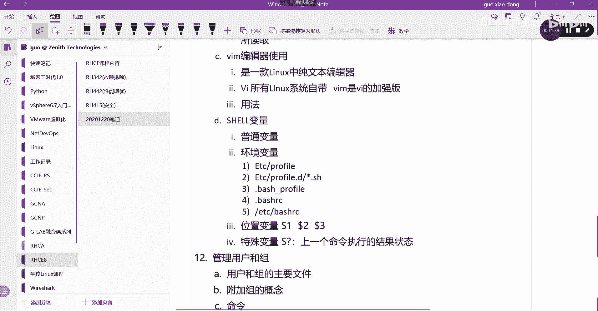

### 其他特殊变量

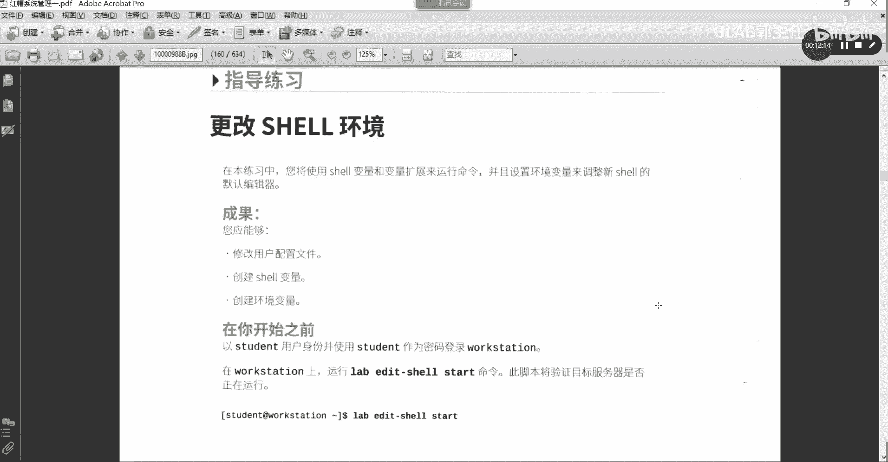

除了环境变量，Shell中还有一些特殊的变量。

**位置变量**
在编写Shell脚本时，我们可以通过位置变量来获取传递给脚本的参数。
*   `$1` 代表第一个参数。
*   `$2` 代表第二个参数。
*   以此类推，`$0` 代表脚本或命令本身的名称。

**特殊变量 `$?`**
变量 `$?` 用于获取**上一个命令执行后的状态（退出状态码）**，而不是命令的输出结果。
*   **`0`** 表示命令**成功执行**。
*   **非 `0`** 的值（通常是1-255）表示命令**执行失败**，不同的数值可以代表不同的错误类型。

例如，执行 `ls` 成功后，`echo $?` 会输出 `0`。如果执行一个不存在的命令 `abcdefg`，再执行 `echo $?`，可能会输出 `127`，这表示“命令未找到”。

---

### 实战练习

现在，让我们通过一个练习来应用以上知识。请按照以下步骤操作：

1.  **修改Shell提示符**
    编辑用户家目录下的 `~/.bashrc` 文件，在文件末尾添加一行：
    ```bash
    PS1='[\u@\h \t \W]\$ '
    ```
    保存退出后，注销并重新登录。你会发现Shell提示符变成了 `[用户名@主机名 时间 当前目录]$` 的格式。其中 `\u` 代表用户名，`\h` 代表主机名，`\t` 代表时间，`\W` 代表当前目录名。

2.  **创建与使用本地变量**
    创建一个本地变量并验证：
    ```bash
    file=/tmp/zdk038083
    echo $file
    ls -l $file
    ```
    然后删除这个临时文件：
    ```bash
    rm $file
    ls -l $file
    ```

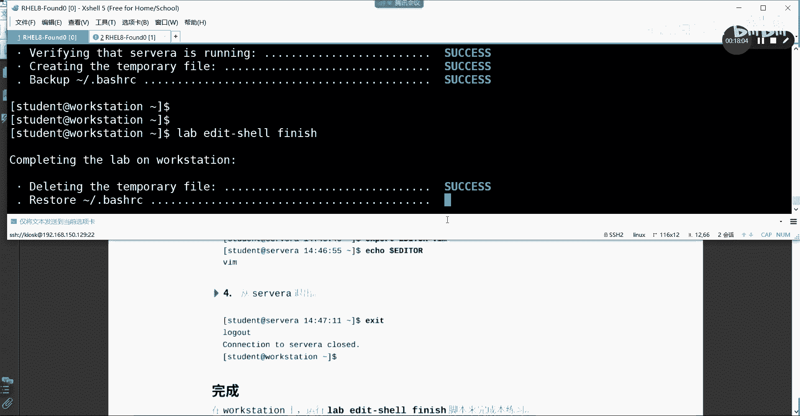

3.  **临时修改环境变量**
    临时修改默认的文本编辑器环境变量：
    ```bash
    export EDITOR=vim
    echo $EDITOR
    ```
    使用 `env | grep EDITOR` 命令可以确认修改已生效。请注意，这个修改是临时的。

---

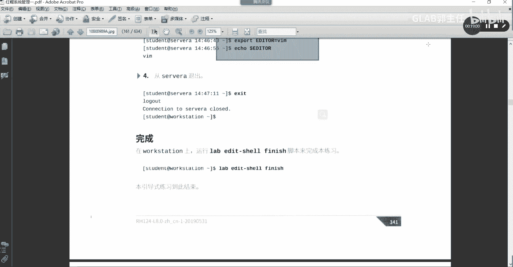

本节课中我们一起学习了Linux Shell中变量的核心概念。我们区分了普通变量与环境变量，重点掌握了 `PATH` 环境变量的作用与修改方法。我们还了解了使环境变量永久生效的配置文件，并认识了位置变量 `$1`、`$2` 和用于获取命令执行状态的特殊变量 `$?`。通过动手练习，我们实践了修改用户配置、定义本地变量和临时设置环境变量的操作。理解这些内容是成为高效Linux用户和后续学习Shell脚本编程的重要基础。