# Linux运维与红帽认证：27：SELinux安全机制详解 🔐

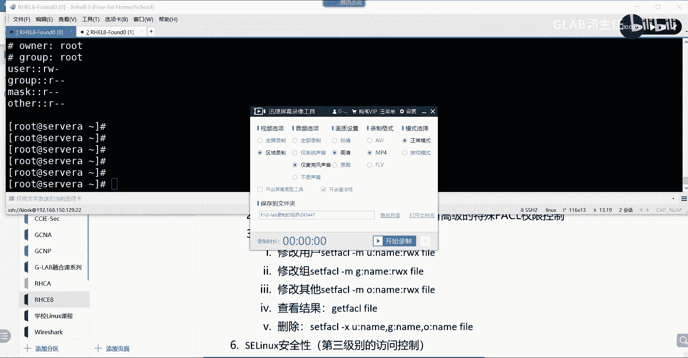

在本节课中，我们将学习SELinux的核心概念、工作原理及其在Linux系统中的重要作用。SELinux是红帽认证考试中的一个重要考点，它通过更精细的访问控制机制来增强系统安全。

---

## SELinux的作用与概念

上一节我们介绍了Linux的基础权限管理。本节中，我们来看看SELinux如何提供更高级别的安全控制。

SELinux在Linux系统中的用途非常广泛。它可以允许或拒绝访问文件及其他资源。与传统的用户/组/权限控制不同，SELinux的控制精确度大幅提高。

SELinux主要专注于应用层的安全策略定义。它通过为系统中的程序、文件和网络端口预定义安全标签（上下文）来对资源进行保护。这是一种基于上下文的强制访问控制（MAC）系统。

一个核心概念是：**SELinux通过比较进程（主体）和文件/资源（客体）的安全上下文标签来决定是否允许访问**。如果标签不匹配，即使传统的Linux权限允许，访问也会被拒绝。

---

## SELinux上下文标签详解

理解了SELinux的基本作用后，本节我们来深入看看它的核心机制——安全上下文标签。

系统中的每个进程和文件都被赋予了一个SELinux安全上下文。这个上下文通常由以下几部分组成（以冒号分隔）：
`user:role:type:level`

对于大多数日常管理任务，我们最关心的是 **`type`** 部分（也称为域）。例如，一个Web服务器进程（如`httpd`）的上下文可能是 `system_u:system_r:httpd_t:s0`，而一个Web内容文件的上下文可能是 `system_u:object_r:httpd_sys_content_t:s0`。

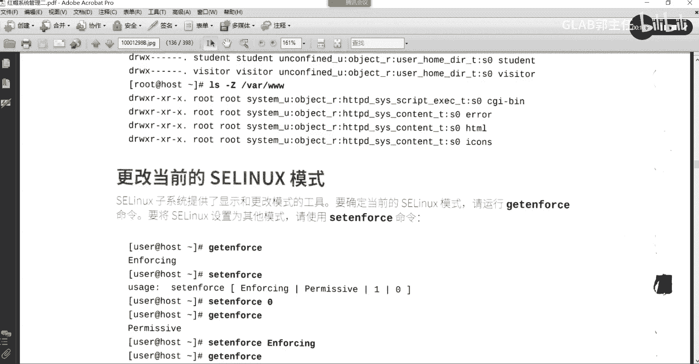

**访问控制规则**：SELinux策略包含大量规则，规定某个`type`的进程（如`httpd_t`）可以访问哪些`type`的文件（如`httpd_sys_content_t`）。这种机制将应用程序“沙盒化”，即使一个服务被攻破，攻击者也难以访问其他服务或系统关键文件。

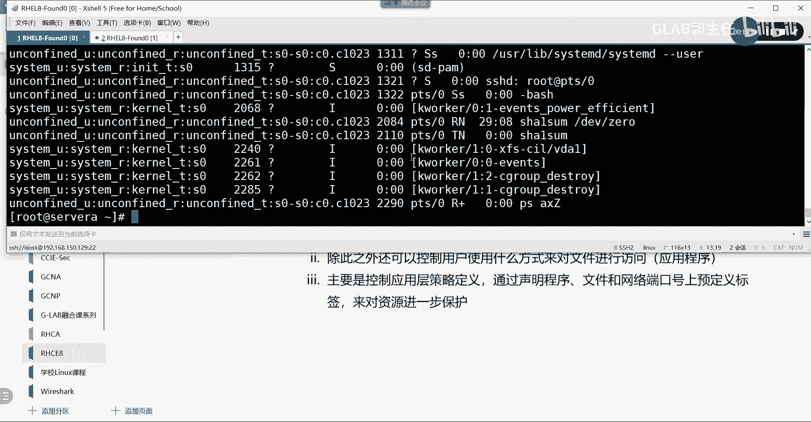

---

## 查看SELinux上下文

现在我们已经知道了上下文标签的重要性，接下来学习如何查看它们。

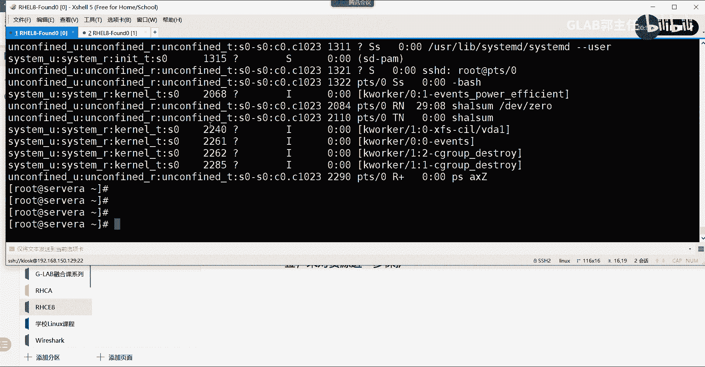

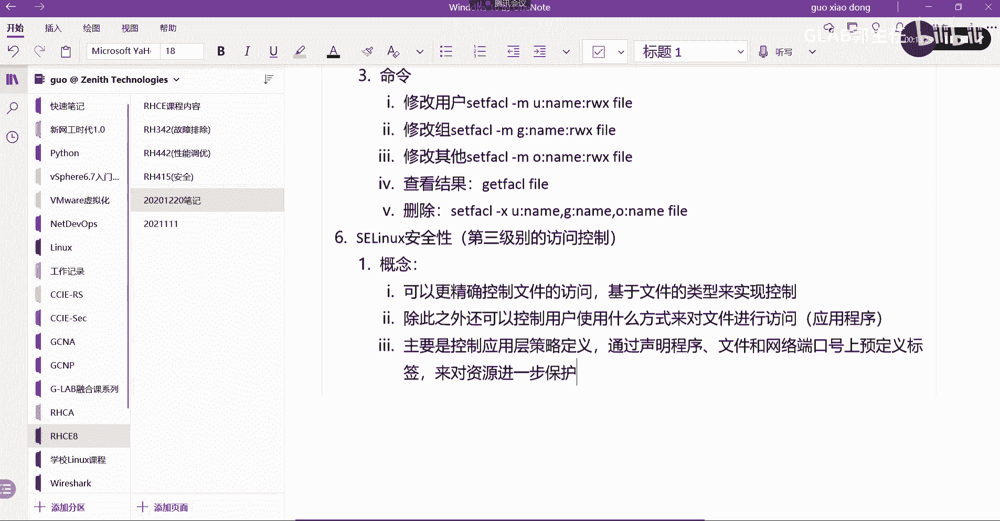

以下是查看SELinux上下文的常用命令：

*   **查看进程的SELinux上下文**：
    ```bash
    ps axZ
    ```
    使用 `-Z` 选项可以查看指定进程的上下文。

*   **查看文件的SELinux上下文**：
    ```bash
    ls -lZ
    ```
    同样，`-Z` 选项可以显示文件和目录的上下文信息。

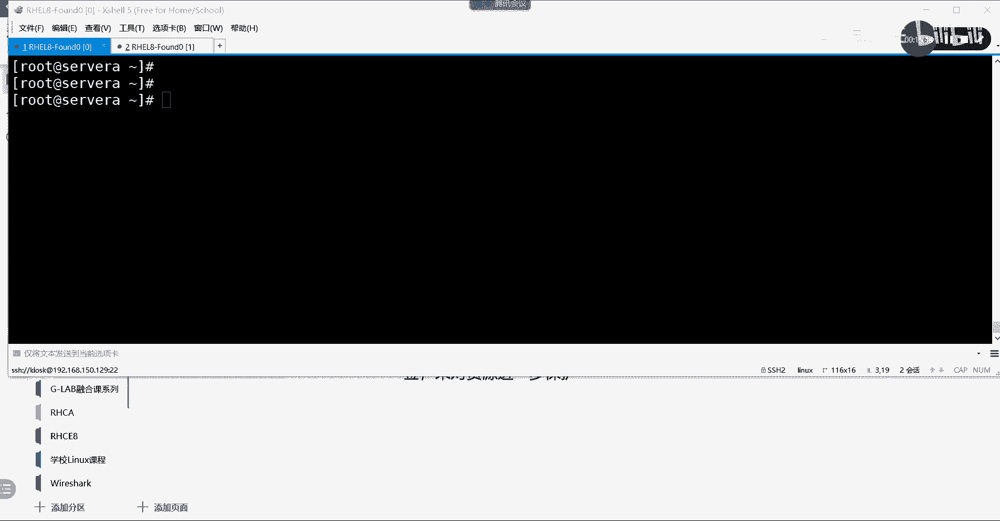

*   **查看SELinux当前运行模式**：
    ```bash
    getenforce
    ```
    此命令会返回 `Enforcing`（强制模式）、`Permissive`（宽容模式）或 `Disabled`（禁用）。

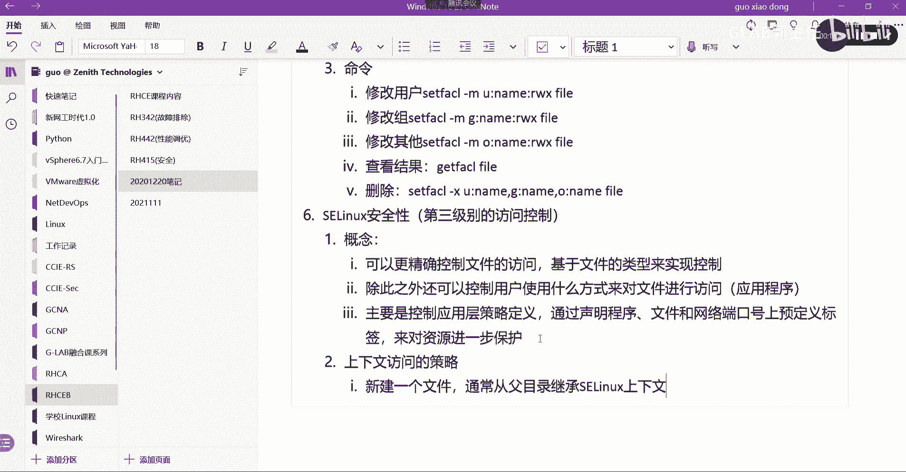

SELinux的主要配置文件是 `/etc/selinux/config`，可以在其中修改默认的运行模式。

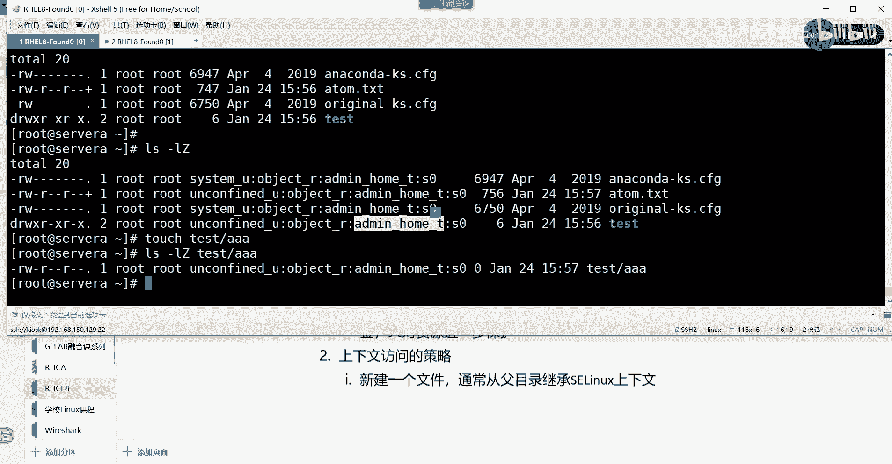

---

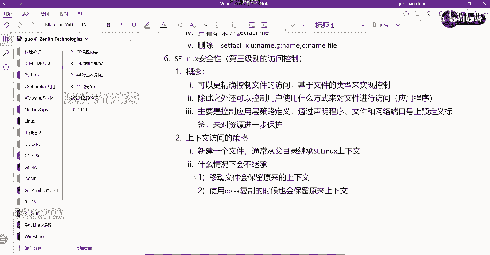

## 文件上下文的继承与修改

在管理文件时，理解上下文的继承规则至关重要，否则可能导致服务无法正常访问资源。

新创建的文件或目录，其SELinux上下文通常**从父目录继承**。例如，在用户家目录下创建的文件，其`type`标签通常是 `user_home_t`。

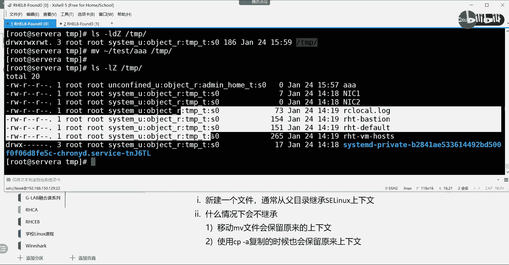

然而，有两种操作会**破坏这种继承**，保留文件原有的上下文：
1.  **移动文件**：使用 `mv` 命令。
2.  **复制文件并保留所有属性**：使用 `cp -a` 命令。

这种不一致是导致服务（如Web服务器）无法访问被移动或复制的配置文件、网页内容等资源的常见原因。

当需要修复或更改文件的安全上下文时，可以使用 `semanage fcontext` 和 `restorecon` 命令。

以下是修改文件上下文标签的基本步骤：
1.  使用 `semanage fcontext` 为特定路径添加一条默认的上下文规则。
    ```bash
    # 示例：将 /my/web/content(/.*)? 路径下的所有内容默认标签设置为 httpd_sys_content_t
    sudo semanage fcontext -a -t httpd_sys_content_t “/my/web/content(/.*)?”
    ```
    *   `-a`: 添加规则。
    *   `-t`: 指定 `type` 部分。

2.  使用 `restorecon` 命令将新规则应用到实际文件上。
    ```bash
    sudo restorecon -Rv /my/web/content/
    ```
    *   `-R`: 递归处理。
    *   `-v`: 显示详细过程。

---

## 实践练习与总结

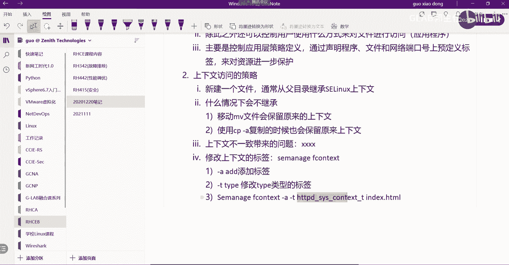

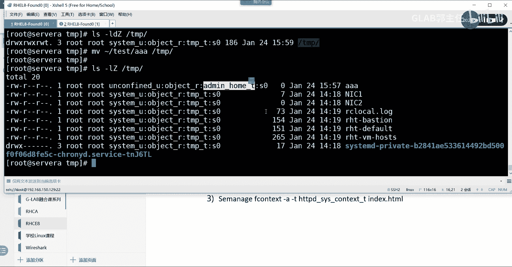

在本节中，我们将通过一个典型场景来巩固对SELinux上下文管理的理解。

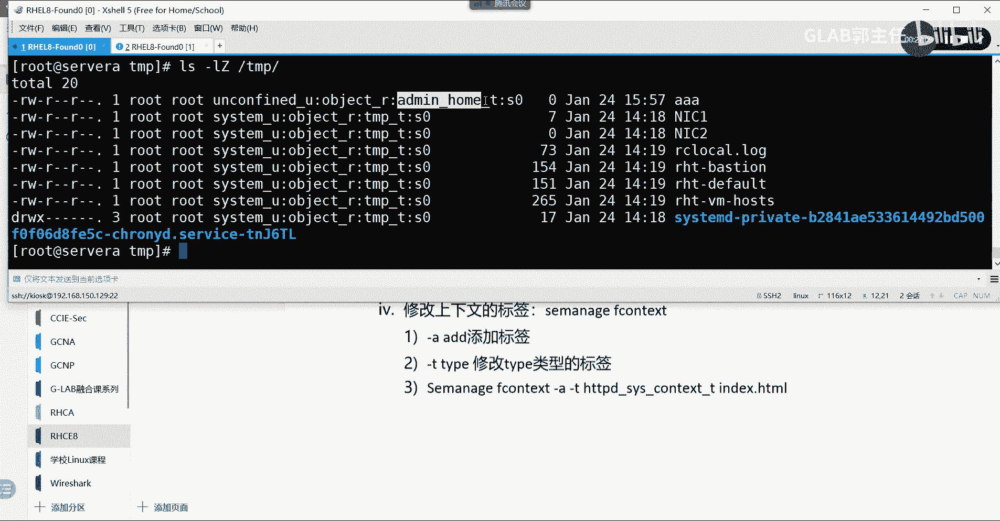

**场景**：将一个Web首页文件（如 `index.html`）从默认的 `/var/www/html/` 目录移动到自定义目录（如 `/web/`）后，Apache服务无法访问该文件。

**问题分析**：文件移动后保留了原来的上下文（`httpd_sys_content_t`），但新目录 `/web/` 及其父目录可能具有不同的上下文（如 `default_t`），导致Apache进程（`httpd_t`）的访问被SELinux策略拒绝。

**解决方案**：
1.  为自定义目录路径添加正确的SELinux文件上下文规则。
2.  使用 `restorecon` 命令恢复该目录下文件的正确上下文。
3.  确保SELinux处于 `Enforcing` 模式以验证修复是否成功。

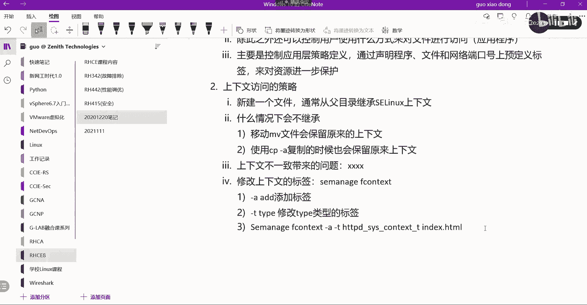

通过本章的学习，我们掌握了SELinux的核心概念、上下文标签的查看与修改方法，以及解决因上下文不一致导致的常见访问问题。SELinux是Linux系统一道重要的安全防线，理解其工作原理对于系统管理员和运维工程师至关重要。