# Linux运维与红帽认证：40：Ansible事实变量与变量管理


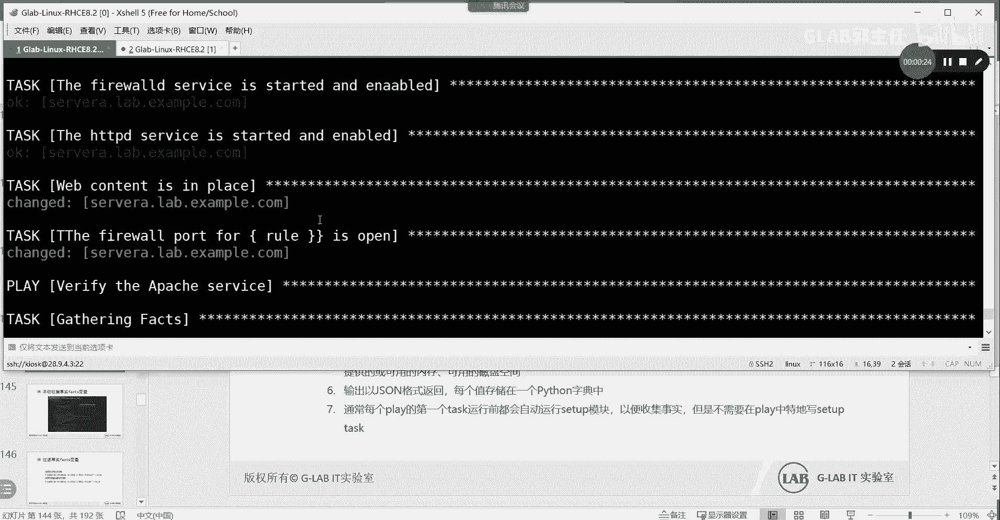

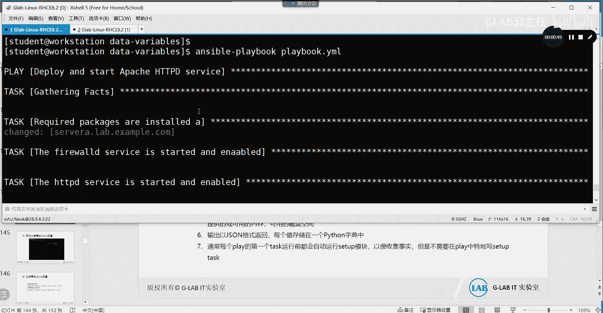

在本节课中，我们将要学习Ansible中的事实变量、注册变量以及如何管理Playbook的机密。这些是自动化运维中非常实用的概念，能帮助我们更灵活地获取系统信息和保护敏感配置。

## 概述

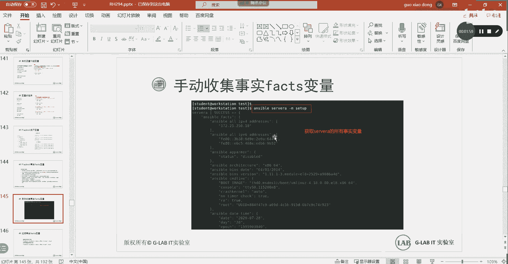

上一节我们介绍了Ansible的基础变量。本节中我们来看看两种特殊的变量：事实变量和注册变量。事实变量是Ansible自动收集的受管主机信息，而注册变量则用于捕获任务执行过程中的输出。此外，我们还将学习如何为Playbook添加密码保护。

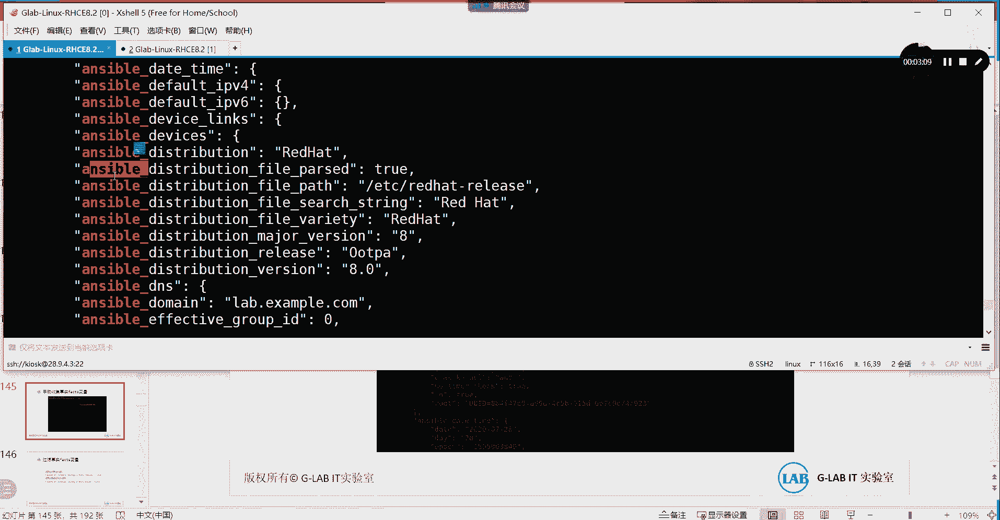

## 事实变量

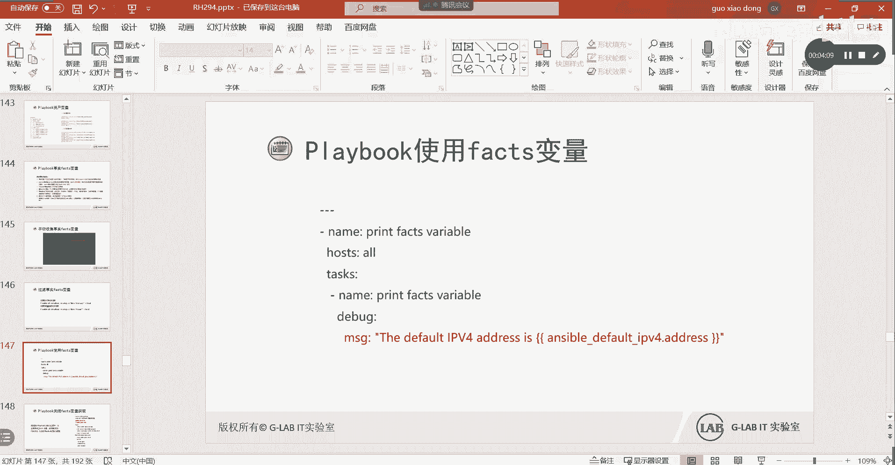

事实变量是Ansible内置的变量，无需事先声明和赋值。每次执行Playbook时，Ansible默认会首先自动收集目标主机的各种信息，如IP地址、内存、CPU等，这些信息就存储在事实变量中。

我们可以通过`ansible`命令的`setup`模块手动获取这些事实。

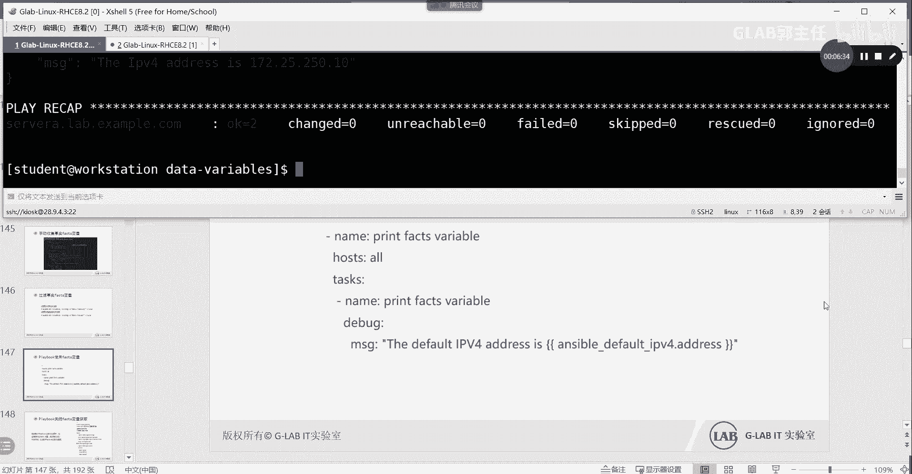

```bash
ansible servera -m setup
```

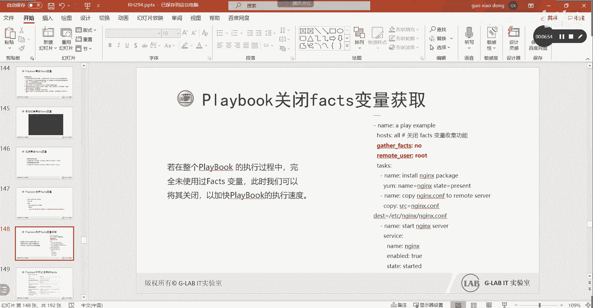

该命令会输出大量JSON格式的信息。为了查看特定信息，我们可以进行过滤。

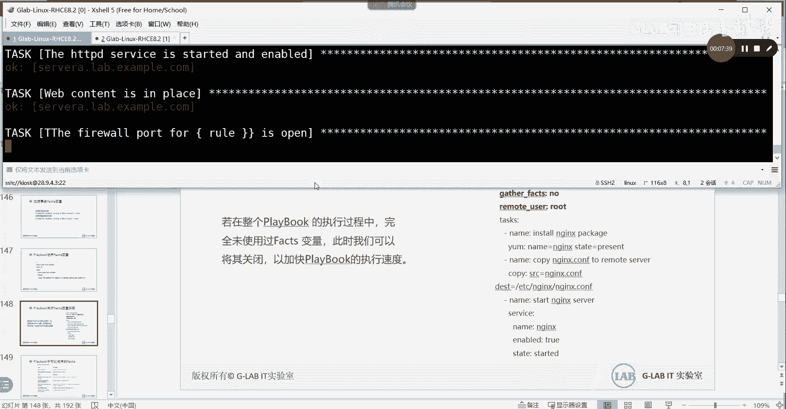

以下是部分常用的事实变量类别：
*   **`ansible_default_ipv4`**： 主机的默认IPv4地址信息。
*   **`ansible_memory_mb`****： 主机的内存信息。
*   **`ansible_distribution`**： 主机的操作系统发行版。

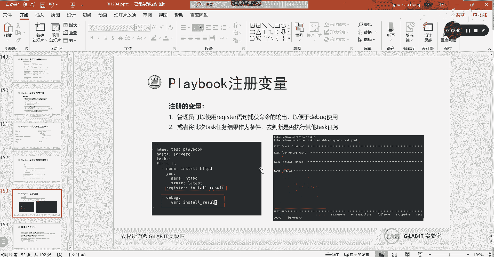

在Playbook中，可以直接通过`{{ ansible_facts.<fact_name> }}`的形式调用事实变量。

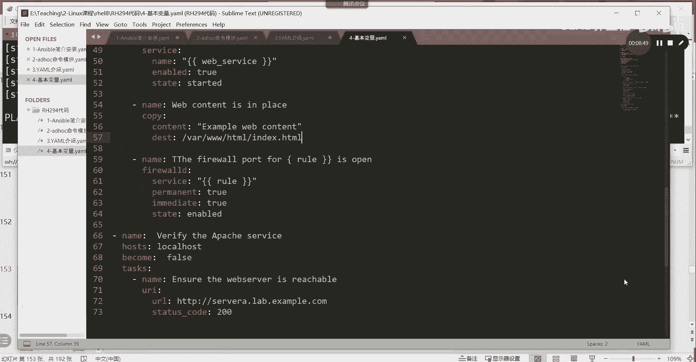

```yaml
- name: 打印主机IP地址
  hosts: all
  tasks:
    - name: 输出IP
      debug:
        msg: "The IPV4 address is {{ ansible_default_ipv4.address }}"
```

执行此Playbook，将会输出主机的IPv4地址。

默认情况下，Playbook会自动收集事实。如果希望关闭此功能以提升执行速度，可以在Playbook中设置`gather_facts: no`。


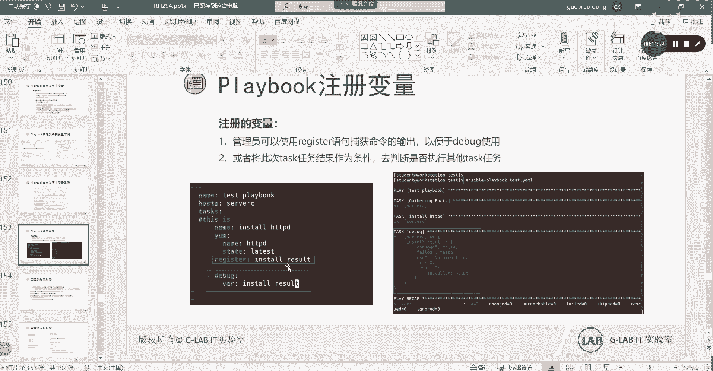

```yaml
- name: 示例Playbook
  hosts: all
  gather_facts: no
  tasks:
    - name: 一个任务
      debug:
        msg: "事实收集已关闭"
```

## 注册变量

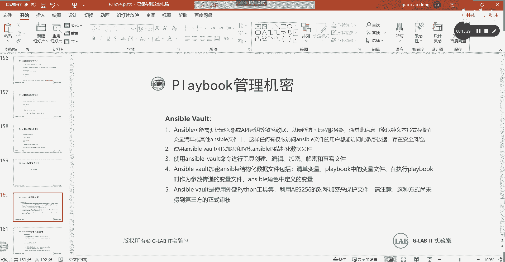

注册变量用于捕获一个任务模块的执行结果。管理员使用`register`关键字将任务输出保存到一个变量中，然后可以通过`debug`模块打印出来。这在调试和获取任务执行详情时非常有用。

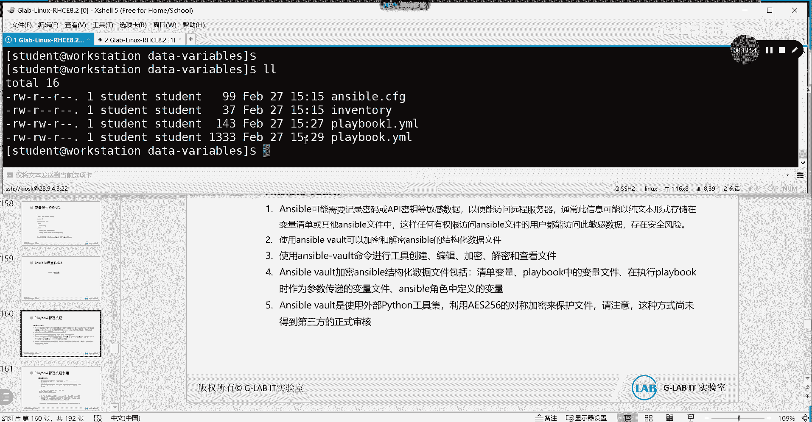

以下是注册变量的使用步骤：
1.  在一个任务后使用`register`关键字定义一个变量来接收输出。
2.  在后续任务中，通过`debug`模块打印这个变量。

```yaml
- name: 安装软件包并查看输出
  hosts: all
  tasks:
    - name: 安装httpd软件包
      yum:
        name: httpd
        state: latest
      register: install_result  # 将安装过程的输出注册到变量install_result

    - name: 显示安装结果
      debug:
        var: install_result  # 打印install_result变量的内容
```

执行上述Playbook，你不仅能看到安装过程，还能在`debug`任务中看到`yum`模块执行后返回的详细结果信息。

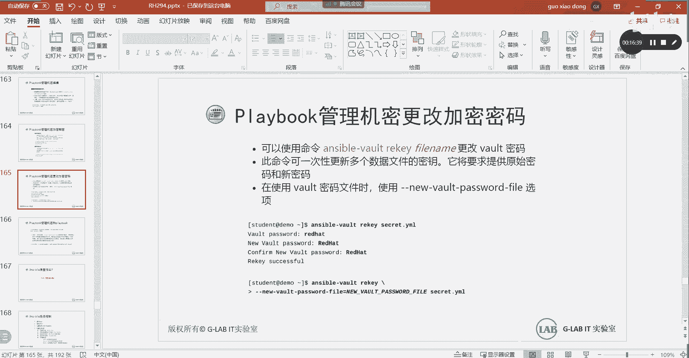

## 变量优先级与机密管理

我们已经学习了多种变量：全局变量、Play变量、主机/主机组变量、事实变量和注册变量。其中，事实变量无需声明，注册变量需要在任务中声明。在变量优先级讨论中，通常只涉及需要人为声明和赋值的前三种变量。

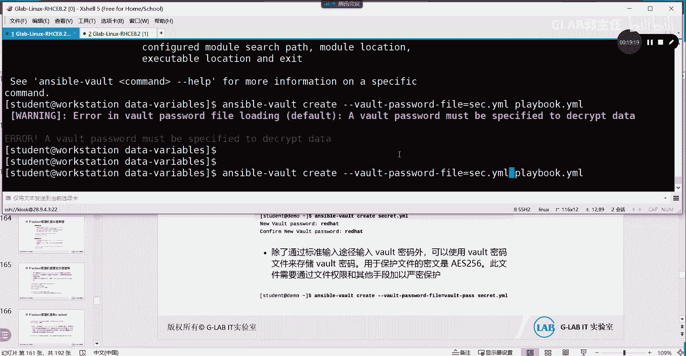

接下来，我们看看如何管理Playbook的机密。Ansible Vault可以对包含敏感信息（如密码、密钥）的Playbook或变量文件进行加密。

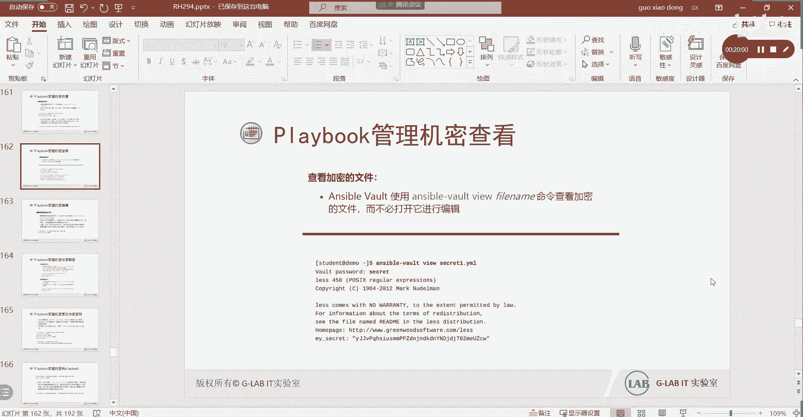

以下是使用Ansible Vault的基本操作：

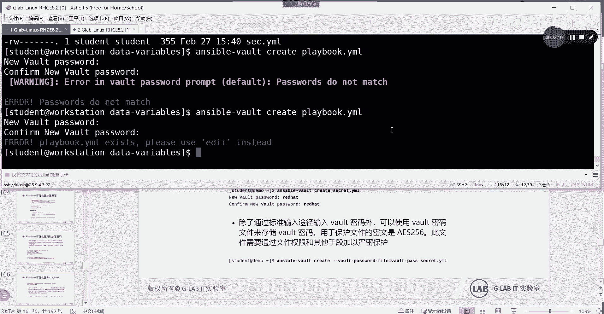

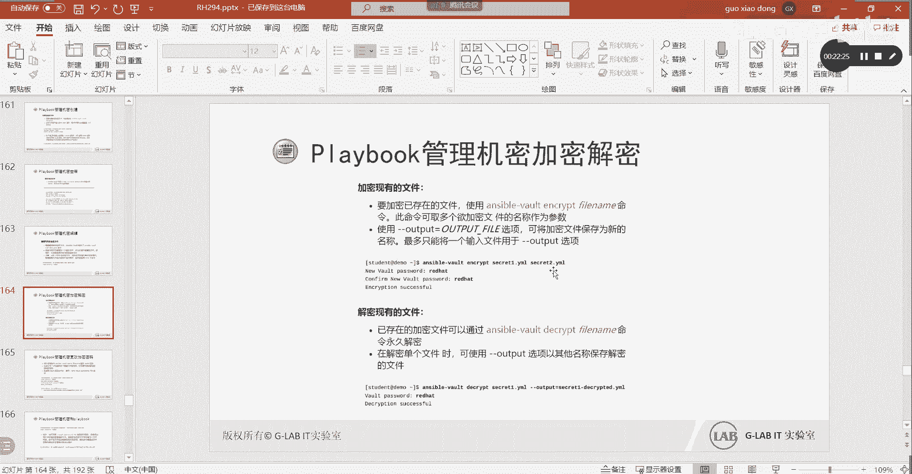

**1. 使用密码加密文件**
```bash
# 加密一个已存在的文件，会提示输入密码
ansible-vault encrypt playbook.yml
```

**2. 查看加密文件内容**
```bash
# 查看加密文件，需要输入加密时设置的密码
ansible-vault view playbook.yml
```

**3. 编辑加密文件**
```bash
# 编辑加密文件，需要输入密码
ansible-vault edit playbook.yml
```

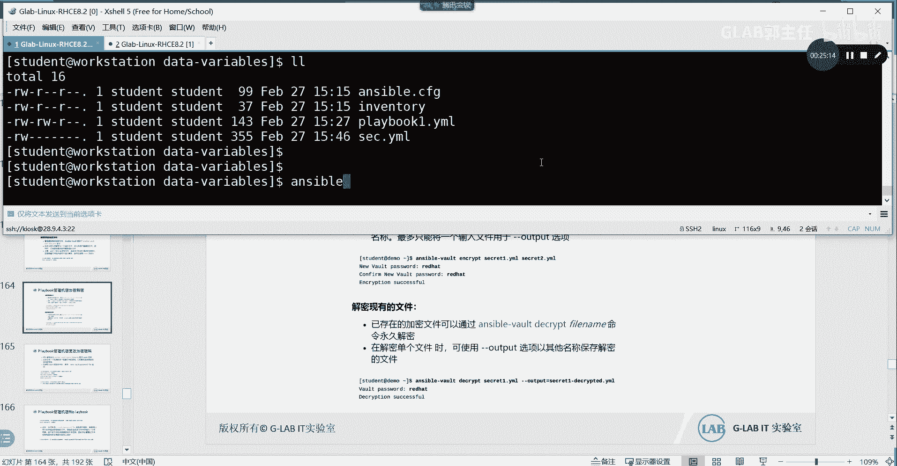

**4. 解密文件**
```bash
# 永久解密文件，需要输入密码
ansible-vault decrypt playbook.yml
```

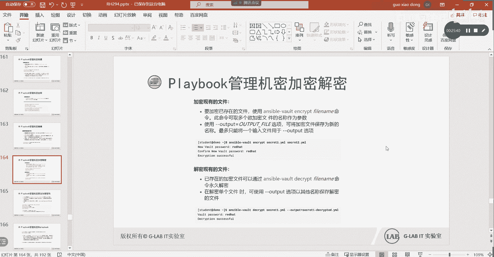

**5. 使用密码文件进行加密**
首先，创建一个包含密码的普通文件（如`password.txt`），然后使用该文件进行加密。
```bash
# 使用密码文件加密
ansible-vault encrypt --vault-password-file=password.txt playbook.yml
```

**6. 执行加密的Playbook**
执行加密的Playbook时，需要提供密码。
```bash
# 执行时输入密码
ansible-playbook playbook.yml --ask-vault-pass

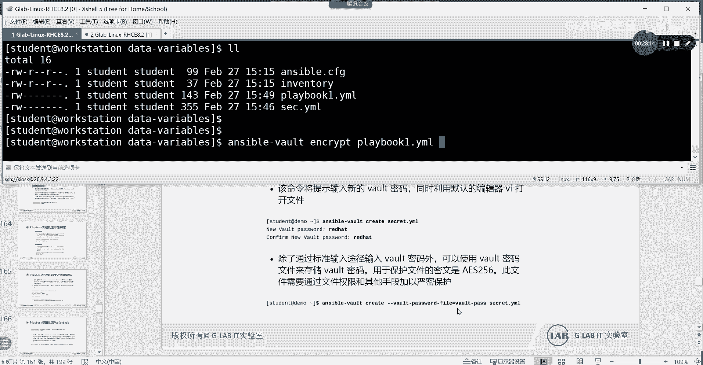

# 使用密码文件执行
ansible-playbook playbook.yml --vault-password-file=password.txt
```

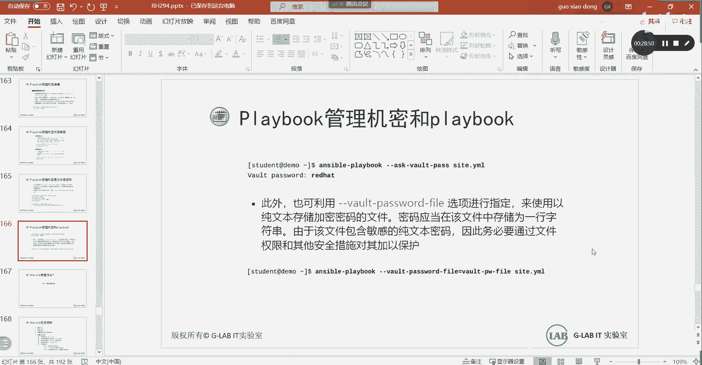

通过Ansible Vault，我们可以安全地将敏感信息存储在版本控制系统中，并在执行时动态解密，从而兼顾了安全性与自动化流程。

## 总结

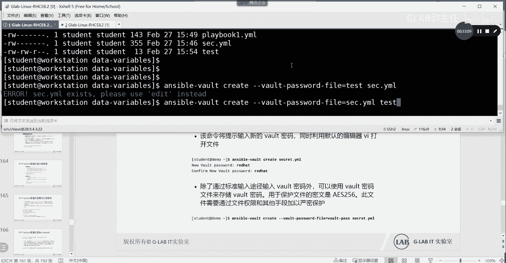

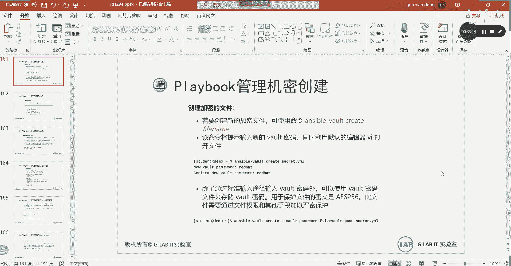

本节课中我们一起学习了Ansible中两个重要的变量类型：事实变量和注册变量。事实变量让我们能轻松获取受管主机的系统信息，注册变量则帮助我们捕获和调试任务执行细节。最后，我们掌握了使用Ansible Vault对敏感Playbook进行加密和管理的方法，这能有效提升自动化脚本的安全性。掌握这些技能，将使你的Ansible运维工作更加高效和安全。