# Ansible角色实验：47：部署多用户Web服务器

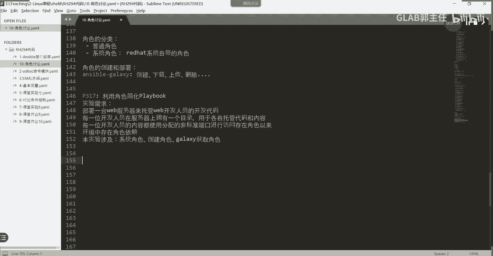

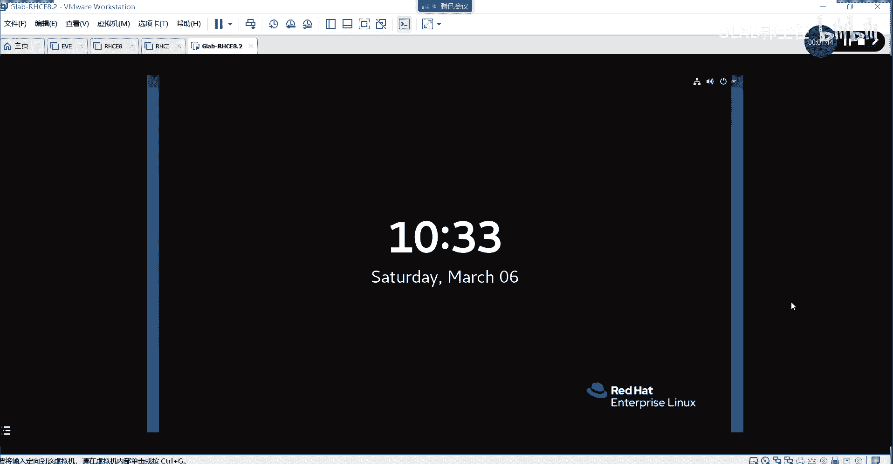

在本教程中，我们将学习如何使用Ansible角色来部署一个复杂的多用户Web服务器环境。我们将创建一个角色，该角色依赖于一个远程获取的Apache角色，并为每位开发人员配置独立的目录和非标准访问端口。同时，我们还会处理SELinux相关的配置问题。

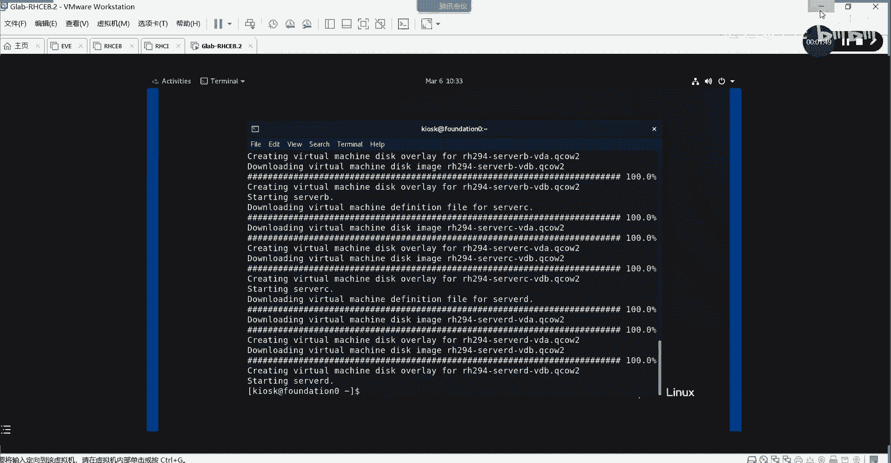

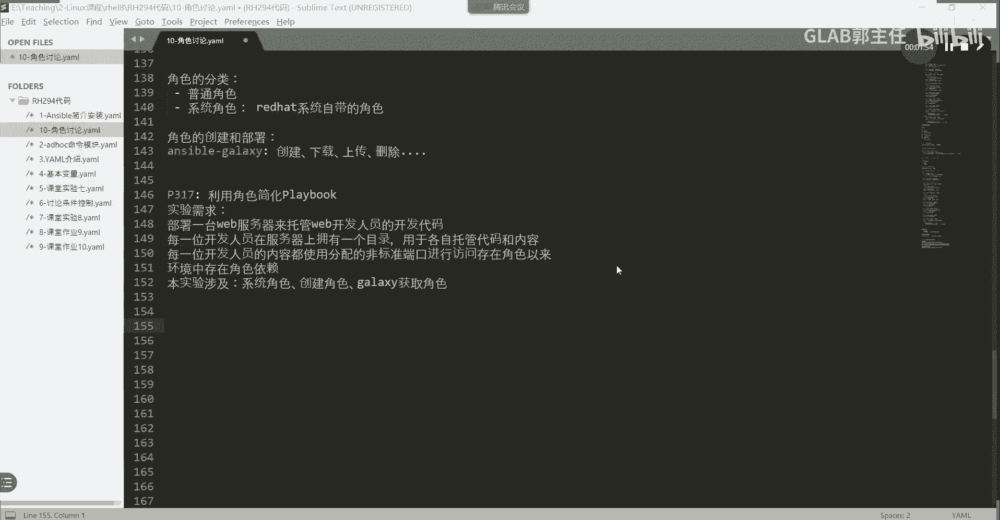

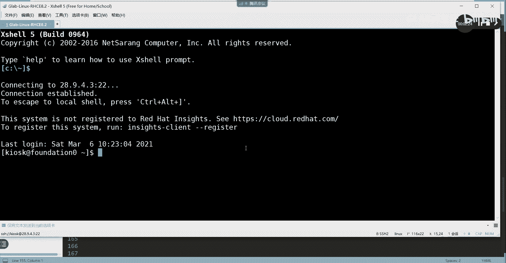

## 概述

本实验的目标是部署一台Web服务器，用于托管开发人员的代码。具体要求如下：
*   每位开发人员在服务器上拥有一个独立的目录存放代码。
*   每位开发人员的内容需通过分配的非标准端口进行访问。
*   使用Ansible角色来组织所有任务，并建立角色间的依赖关系。

我们将通过创建自定义角色、从远程仓库获取角色、处理角色依赖以及配置SELinux策略来完成此任务。

## 实验步骤

### 第一步：获取远程Apache角色

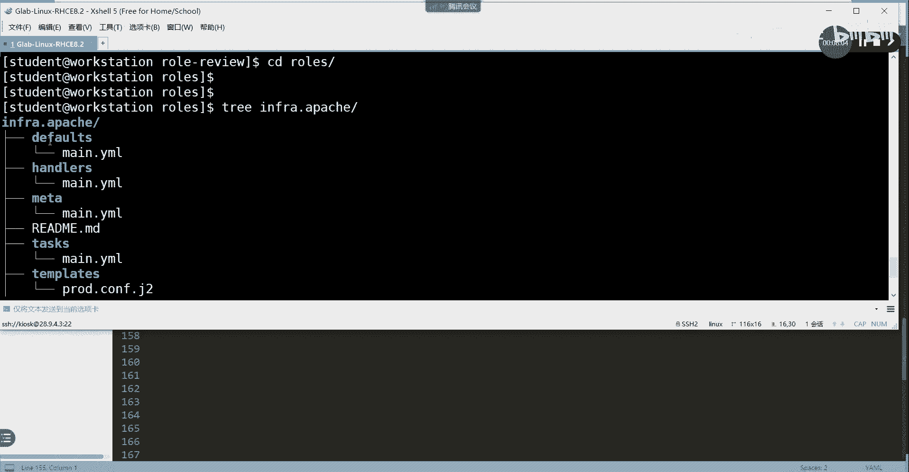

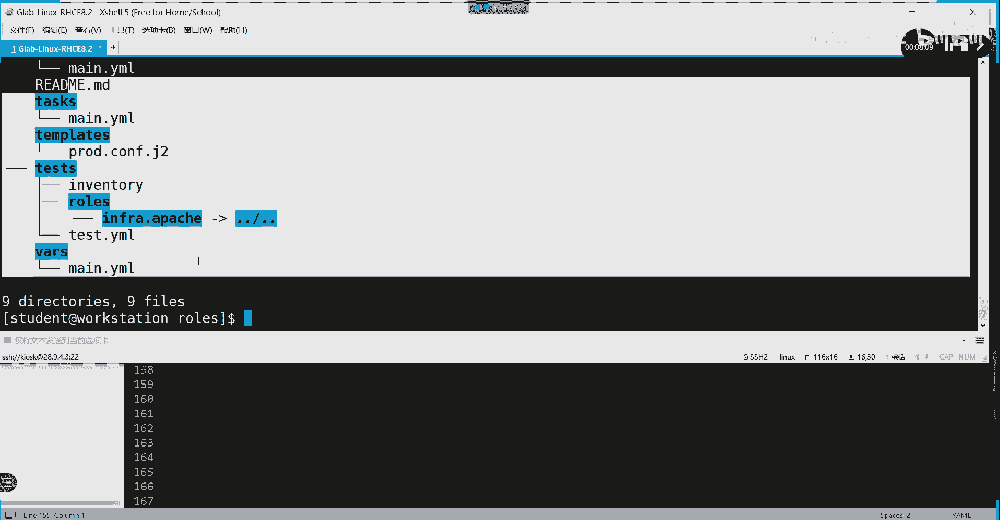

首先，我们需要从远程Git仓库获取一个预先制作好的Apache角色。为此，我们创建一个`requirements.yml`文件来定义如何获取该角色。

以下是创建和配置`requirements.yml`文件的步骤：

1.  进入项目目录并创建`roles`文件夹。
    ```bash
    mkdir roles
    cd roles
    ```
2.  创建`requirements.yml`文件。
    ```bash
    vim requirements.yml
    ```
3.  在文件中写入以下内容，指定角色的名称、来源、获取方式和版本。
    ```yaml
    ---
    - name: RHEL Apache
      src: git@workstation.lab.example.com:/home/student/ansible/apache
      scm: git
      version: v1.4
    ```
4.  返回上级目录，使用`ansible-galaxy`命令根据`requirements.yml`文件安装角色到`roles`目录。
    ```bash
    cd ..
    ansible-galaxy install -r roles/requirements.yml -p roles
    ```
5.  安装成功后，可以在`roles`目录下看到名为`rhel-apache`的角色。

### 第二步：安装系统角色

接下来，我们需要安装Ansible系统角色，以便后续配置SELinux。系统角色提供了配置系统级服务（如网络、SELinux、时间同步等）的标准方法。

使用YUM包管理器安装系统角色：
```bash
sudo yum install rhel-system-roles
```
安装完成后，系统角色默认位于`/usr/share/ansible/roles/`目录下。

### 第三步：初始化自定义角色

现在，我们将创建一个自定义角色，它将整合远程获取的Apache角色并添加我们特定的配置。使用`ansible-galaxy init`命令来初始化一个角色骨架。

在`roles`目录下，初始化一个名为`apache_devel_config`的新角色：
```bash
ansible-galaxy init apache_devel_config
```
此命令会在`roles`目录下创建`apache_devel_config`文件夹，其中包含角色所需的标准目录结构（如`tasks`， `handlers`， `templates`等），但内容为空。

### 第四步：配置角色依赖关系

我们的自定义角色`apache_devel_config`需要依赖于第一步获取的`rhel-apache`角色。这种依赖关系在角色的元数据文件中定义。

编辑自定义角色的元数据文件：
```bash
vim roles/apache_devel_config/meta/main.yml
```
在`dependencies:`部分下，添加对`rhel-apache`角色的依赖，其定义与`requirements.yml`中类似。
```yaml
dependencies:
  - name: RHEL Apache
    src: git@workstation.lab.example.com:/home/student/ansible/apache
    scm: git
    version: v1.4
```

### 第五步：填充角色内容

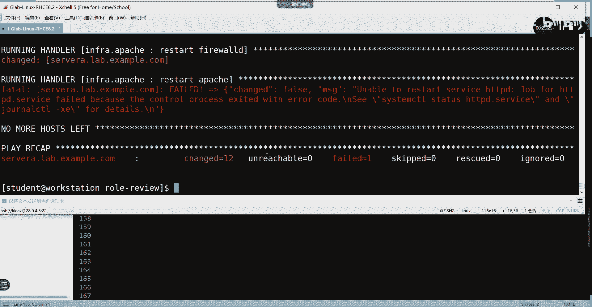

我们将实验提供的任务文件、模板文件和变量文件移动到自定义角色的相应目录中。

1.  将任务文件移动到`tasks`目录。
    ```bash
    mv developer_tasks.yml roles/apache_devel_config/tasks/main.yml
    ```
2.  将Jinja2模板文件移动到`templates`目录。
    ```bash
    mv developer.j2 roles/apache_devel_config/templates/
    ```
3.  在项目根目录创建用于存放组变量的目录，并将变量文件移入。
    ```bash
    mkdir -p group_vars
    mv webdev.yml group_vars/
    ```
    **说明**：将变量文件（如`webdev.yml`）放在项目根目录的`group_vars/`或`host_vars/`目录下是一种良好实践。这样做可以使角色本身更通用，便于分享和复用，因为角色使用者只需在外部提供自己的变量文件即可，无需修改角色内部。

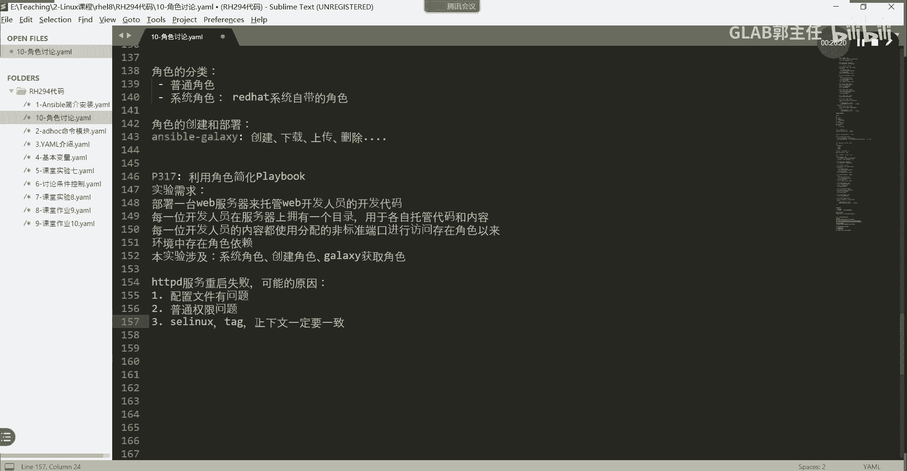

### 第六步：编写主Playbook并首次执行

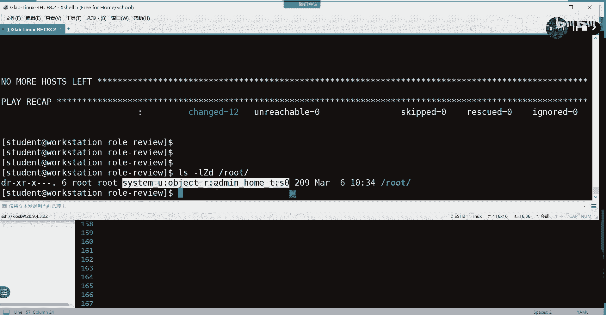

创建一个主Playbook文件来调用我们创建的自定义角色。

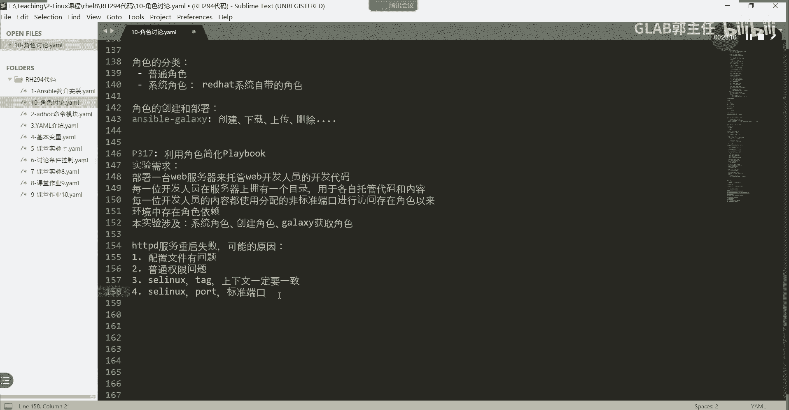

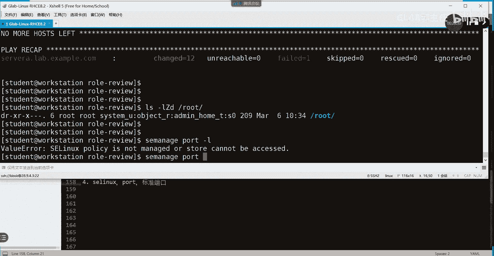

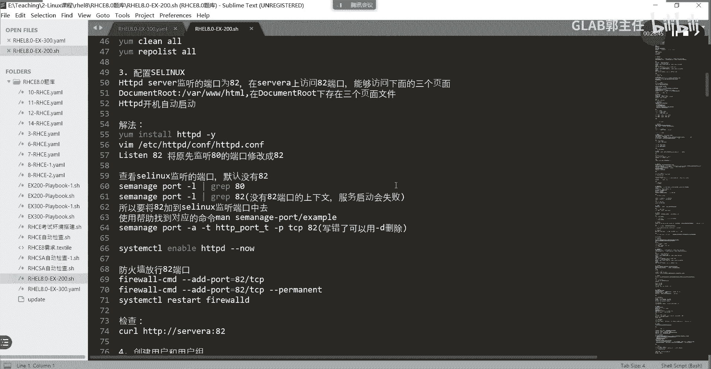

在项目根目录创建`web_dev_server.yml`：
```bash
vim web_dev_server.yml
```
写入以下内容：
```yaml
---
- name: Configure Devel Web Server
  hosts: web_dev
  force_handlers: yes
  roles:
    - apache_devel_config
```
其中，`force_handlers: yes`表示无论任务是否被`notify`触发，都会强制执行所有`handlers`。

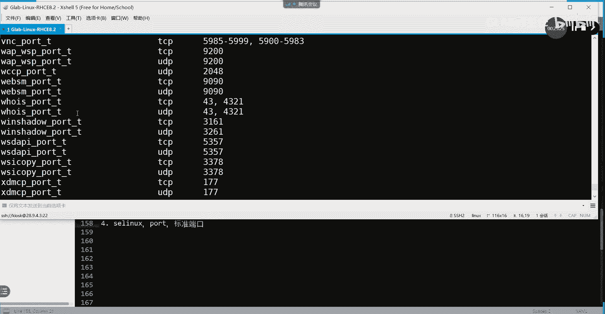

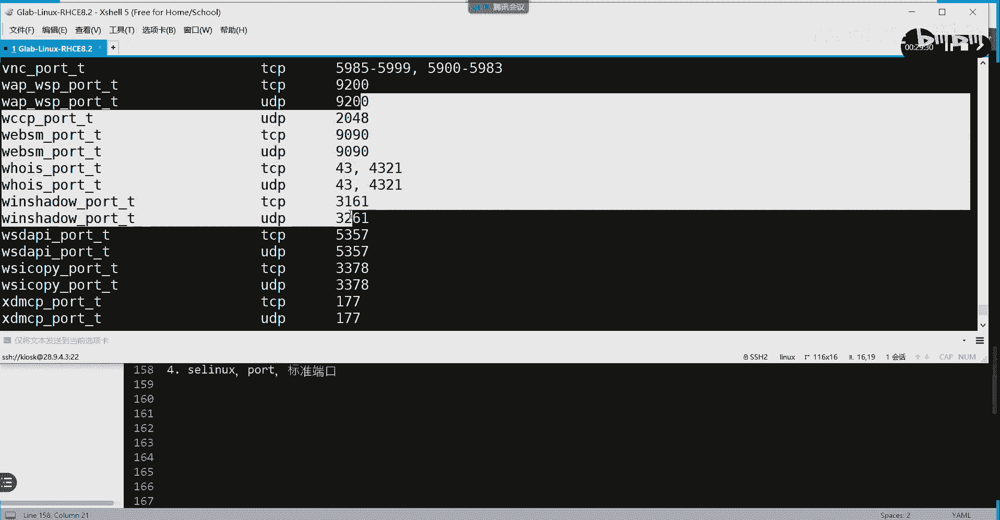

执行Playbook进行测试：
```bash
ansible-playbook web_dev_server.yml
```
执行后可能会发现Apache服务重启失败，错误信息提示“control process exited with error code”。这通常意味着配置有问题。

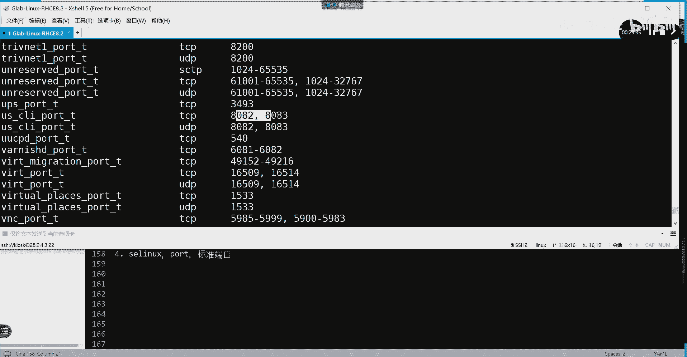

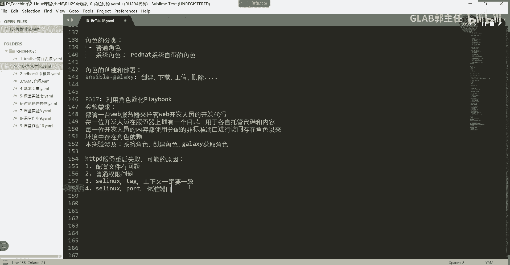

### 第七步：问题分析与SELinux配置

上一节我们执行Playbook时遇到了服务重启失败的问题。本节中我们来分析并解决这个问题。HTTPD服务重启失败可能由多种原因导致：

1.  **配置文件语法错误**：Apache的配置文件（如`httpd.conf`或`vhost`文件）存在语法错误。
2.  **SELinux上下文不一致**：Web内容目录或文件的SELinux安全上下文（`tag`）与HTTPD进程不匹配，导致进程无法访问文件。可通过`ls -lZ`命令查看上下文。
3.  **SELinux端口限制**：HTTPD默认只被允许监听标准端口（如80、443）。我们的需求是使用非标准端口（如9081， 9082），这些端口需要显式地添加到SELinux策略中。

根据错误日志和需求判断，最可能的原因是**非标准端口未被SELinux放行**。我们需要修改SELinux策略，允许`httpd_t`服务类型绑定到这些端口。

### 第八步：完善Playbook以配置SELinux

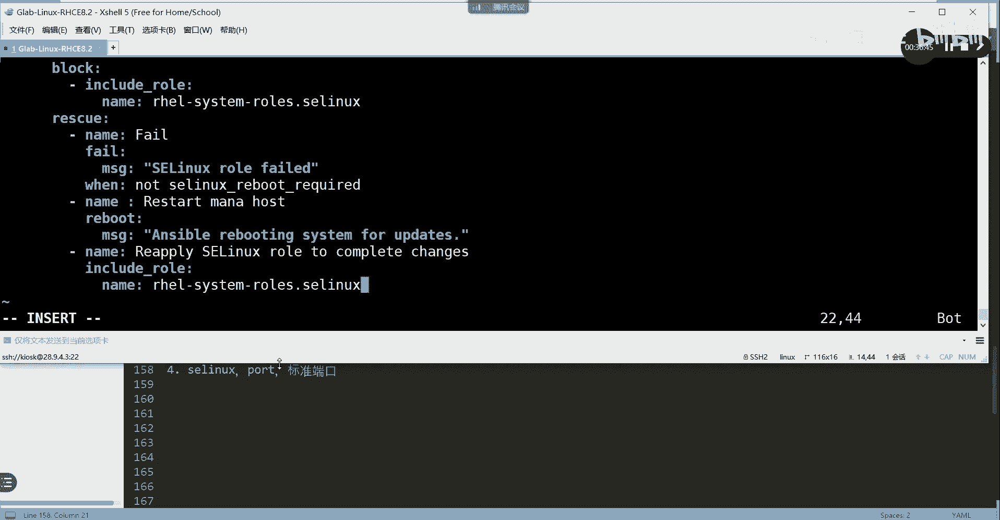

为了解决SELinux端口问题，我们需要在主Playbook中增加任务，使用系统角色来配置SELinux。我们将使用`pre_tasks`在主要角色执行前完成这个配置。

编辑`web_dev_server.yml`文件，在`roles`部分之前添加`pre_tasks`：
```yaml
---
- name: Configure Devel Web Server
  hosts: web_dev
  force_handlers: yes

  pre_tasks:
    - name: Check SELinux Configuration
      block:
        - name: Include SELinux role
          include_role:
            name: redhat.rhel_system_roles.selinux
      rescue:
        - name: Fail if SELinux role not found
          fail:
            msg: "SELinux role failed"
          when: “‘selinux’ not in ansible_failed_result”

        - name: Reboot system for update
          reboot:
            msg: "Reboot system for update"
          when: “‘selinux’ not in ansible_failed_result”

  roles:
    - apache_devel_config
```
**代码解释**：
*   `pre_tasks`：这些任务会在`roles`部分执行之前运行。
*   `block`：尝试导入`selinux`系统角色。
*   `rescue`：如果`block`中的任务执行失败（例如，找不到系统角色），则执行`rescue`块中的任务。
    *   第一个任务使用`fail`模块报告错误。
    *   第二个任务使用`reboot`模块重启系统（此例中是一种处理方式，实际可能根据情况选择安装角色）。
*   `when`条件：确保仅在特定失败情况下执行`rescue`中的任务。

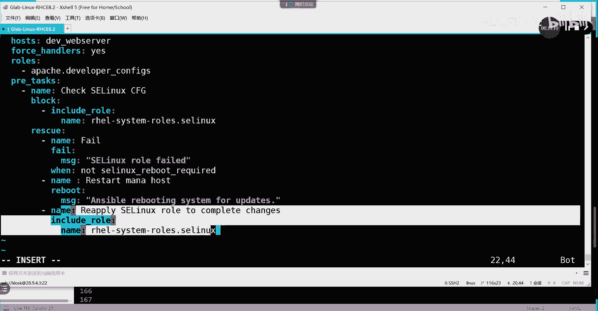

此外，我们需要提供SELinux的具体配置参数。将提供的`selinux.yml`变量文件移动到`group_vars`目录：
```bash
mv selinux.yml group_vars/
```
这个YAML文件里应包含类似以下的内容，定义了要允许的端口：
```yaml
selinux_policy: targeted
selinux_state: enforcing
selinux_ports:
  - ports: ‘9081’
    setype: ‘http_port_t’
    proto: tcp
    state: present
  - ports: ‘9082’
    setype: ‘http_port_t’
    proto: tcp
    state: present
```

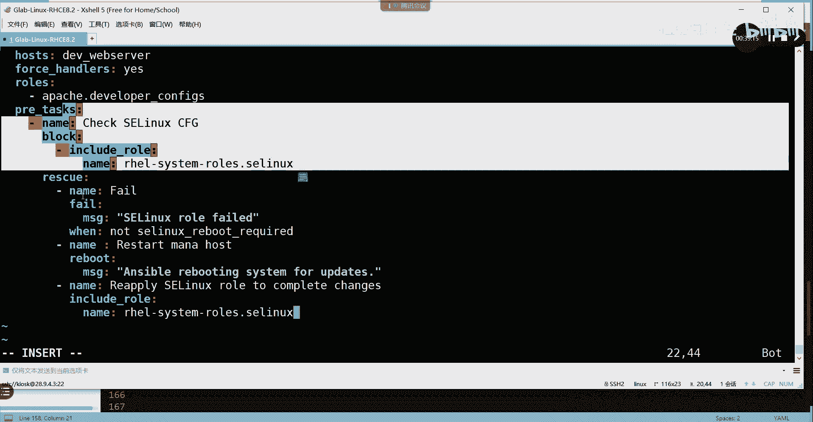

### 第九步：最终测试

现在，所有组件已就绪。再次执行Playbook：
```bash
ansible-playbook web_dev_server.yml
```
这次执行应该会成功。Playbook会先通过系统角色配置SELinux，允许非标准端口，然后执行自定义角色`apache_devel_config`，该角色会依赖远程Apache角色完成用户创建、目录配置、虚拟主机设置等所有任务，并最终成功重启Apache服务。

## 总结

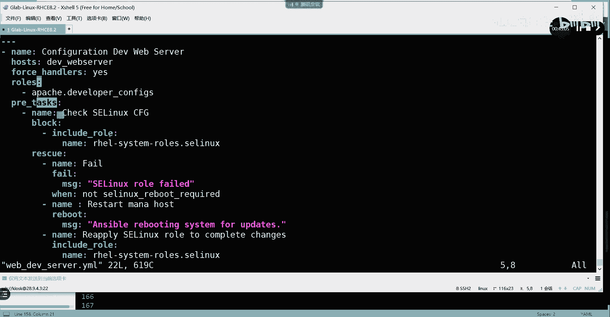

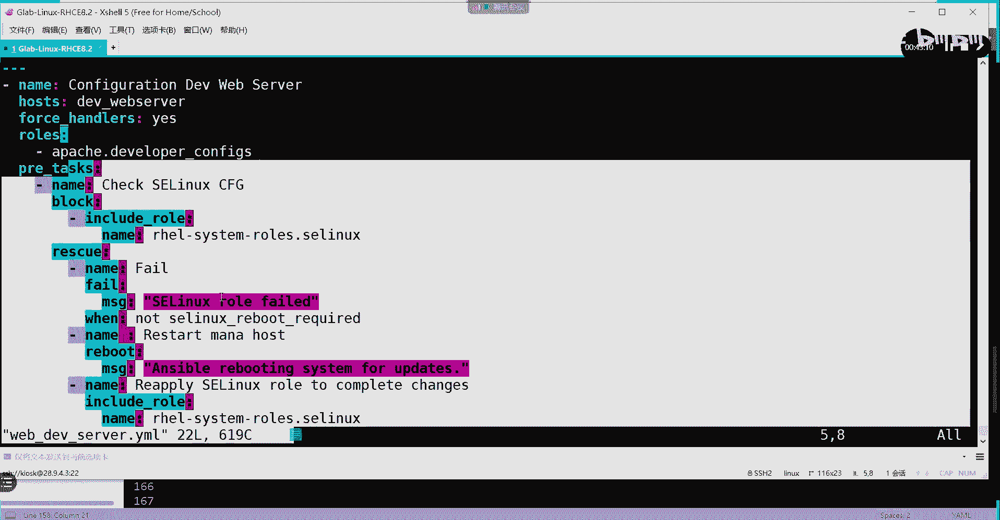

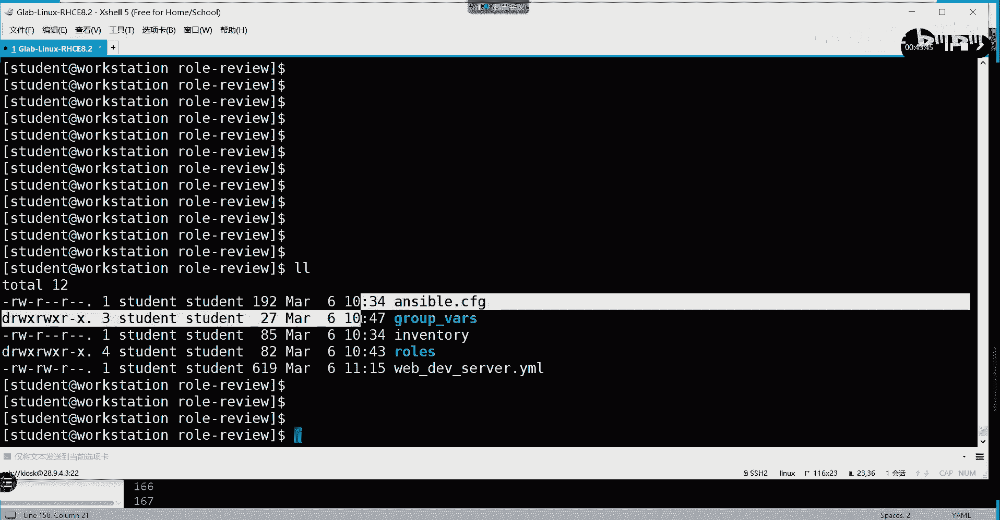

在本节课中，我们一起学习了如何利用Ansible角色部署一个支持多开发者的Web服务器环境。我们实践了从远程获取角色、初始化自定义角色、定义角色依赖关系、组织变量文件以及编写主Playbook的完整流程。最关键的是，我们遇到了典型的SELinux端口限制问题，并通过集成`rhel-system-roles`中的SELinux角色，在Playbook中优雅地解决了此问题。这个实验涵盖了角色使用的核心概念，是应对复杂自动化场景的重要模式。