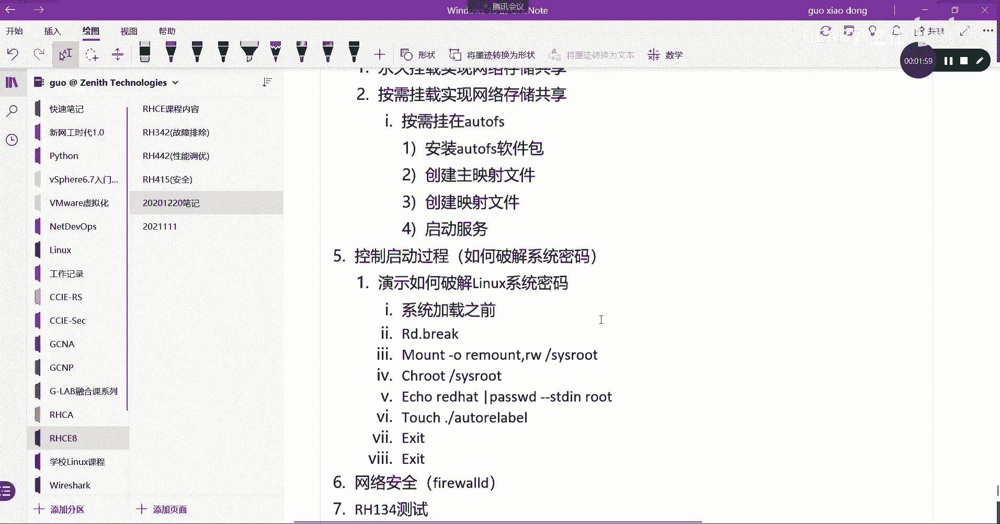
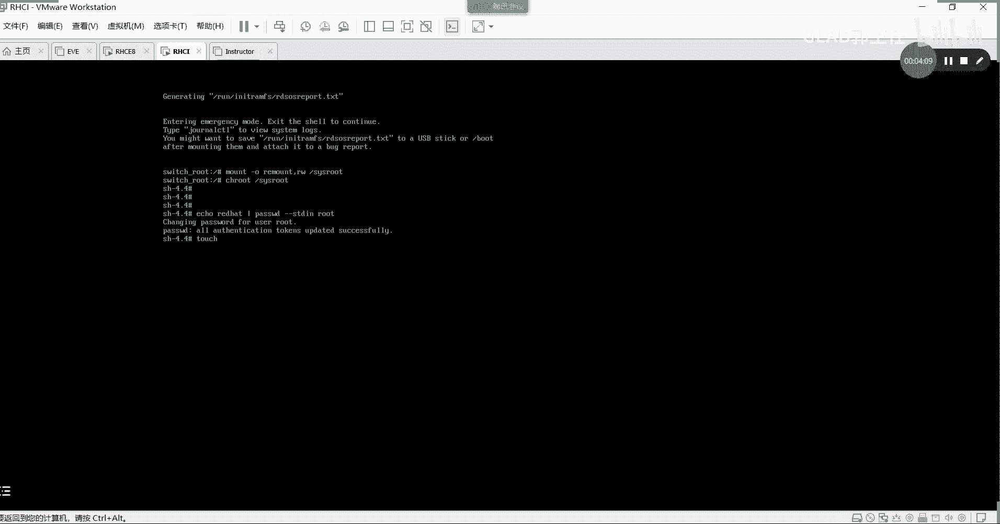
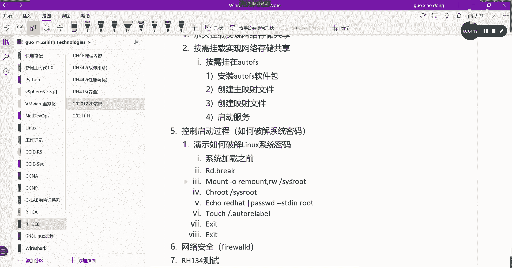
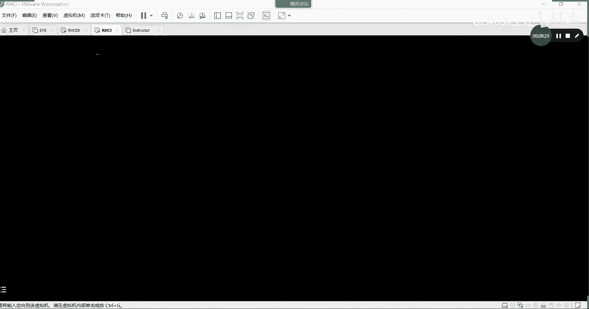
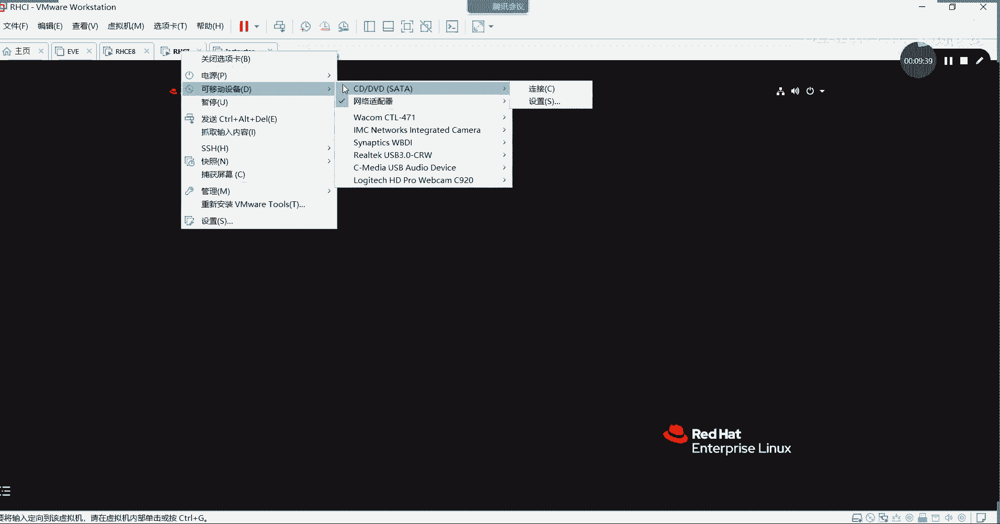

# Linux运维实战：第34章：破解Linux系统密码 🔓

在本教程中，我们将学习如何破解忘记的Linux系统root用户密码。这是系统管理员和运维工程师必须掌握的一项关键恢复技能，尤其在RHCSA/RHCE认证考试中，这是必须完成的基础任务。

## 概述

当忘记Linux系统的root密码时，我们无法正常登录系统执行管理任务。本教程将分步演示如何通过中断系统启动流程，进入一个特殊的救援环境，从而重置root用户的密码。整个过程发生在系统完全加载之前，因此不需要原密码。



上一节我们介绍了密码恢复的必要性，本节中我们来看看具体的操作步骤和命令。

## 破解密码详细步骤

以下是破解Linux系统root密码的核心步骤流程。

1.  **中断启动流程**
    在系统开机引导时，迅速按下键盘的上下方向键，将光标停留在第一个启动项上，然后按 `e` 键进入编辑模式。

2.  **修改内核参数**
    在出现的编辑界面中，找到以 `linux` 开头的一行。将光标移动到此行的末尾（通常在 `quiet` 参数之后），输入一个空格，然后添加参数 `rd.break`。

    ```
    ... quiet rd.break
    ```

    修改完成后，按 `Ctrl+X` 组合键启动系统。此时系统不会正常加载，而是进入一个临时的、最小的救援Shell环境。

3.  **重新挂载根文件系统**
    进入救援Shell后，系统根分区处于只读状态。我们需要以读写权限重新挂载它，以便修改密码文件。

    ```
    mount -o remount,rw /sysroot
    ```





4.  **切换根环境**
    使用 `chroot` 命令将当前的工作根目录切换到我们真实的系统根目录 `/sysroot` 下。

    ```
    chroot /sysroot
    ```

5.  **修改root用户密码**
    现在，我们可以使用 `passwd` 命令来修改root用户的密码了。这里使用一个非交互式的方法，直接将新密码“redhat”传递给命令。

    ```
    echo “redhat” | passwd --stdin root
    ```

    此命令的含义是：将root用户的密码设置为“redhat”。

6.  **更新SELinux安全上下文**
    如果系统启用了SELinux，修改系统文件后必须更新文件的安全上下文标签，否则重启后可能因标签错误导致系统无法启动。通过 `touch` 命令创建或更新特定文件即可。

    ```
    touch /.autorelabel
    ```
    **注意**：文件路径是 `/.autorelabel`（斜杠点），而不是 `./autorelabel`（点斜杠），这是初学者常犯的错误。

7.  **退出并重启**
    依次执行以下命令退出chroot环境，并重启系统。

    ```
    exit
    exit
    ```

    系统将自动重启。在重启过程中，你会看到左下角有百分比进度，表示系统正在根据 `/.autorelabel` 文件的指示重新标记所有文件的安全上下文。这个过程可能需要一些时间，这是修改成功的标志。如果没有这个过程，则很可能之前的步骤有误。

## 登录验证



系统重启完成后，在登录界面使用 **root** 用户和刚才设置的新密码 **redhat** 进行登录。
**重要提示**：我们修改的是root用户的密码，请确保使用root用户登录，而不是其他普通用户。

## 总结



本节课中我们一起学习了在忘记密码时如何破解Linux系统的root用户密码。我们掌握了关键步骤：通过 `rd.break` 参数中断启动、以读写模式挂载根文件系统、使用 `chroot` 切换环境、用 `passwd` 命令修改密码，以及最后通过 `touch /.autorelabel` 确保SELinux环境的一致性。这项技能对于系统恢复和通过相关认证考试至关重要。