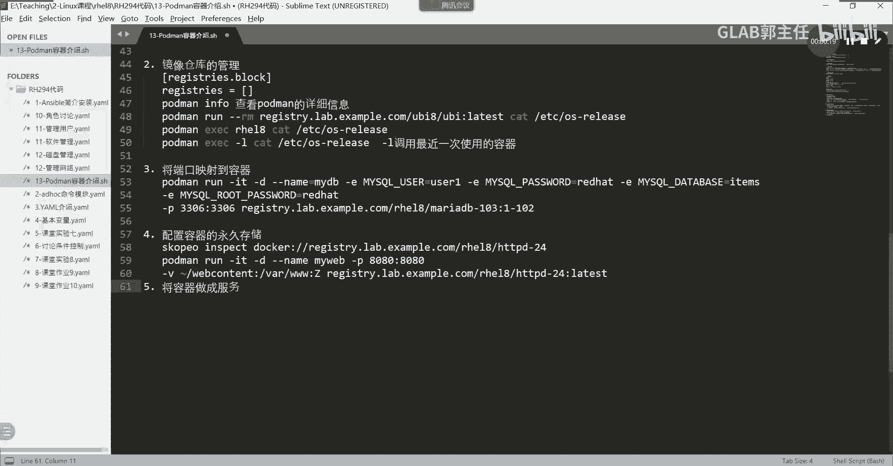
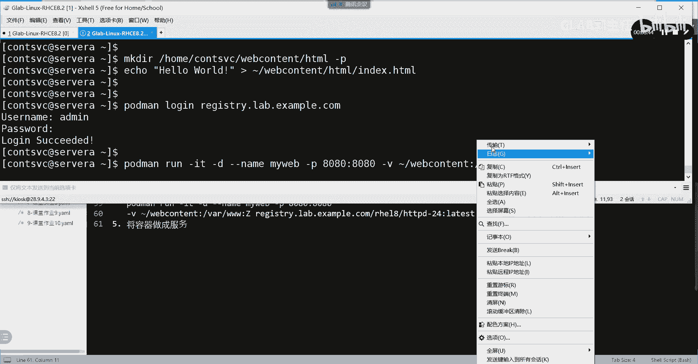
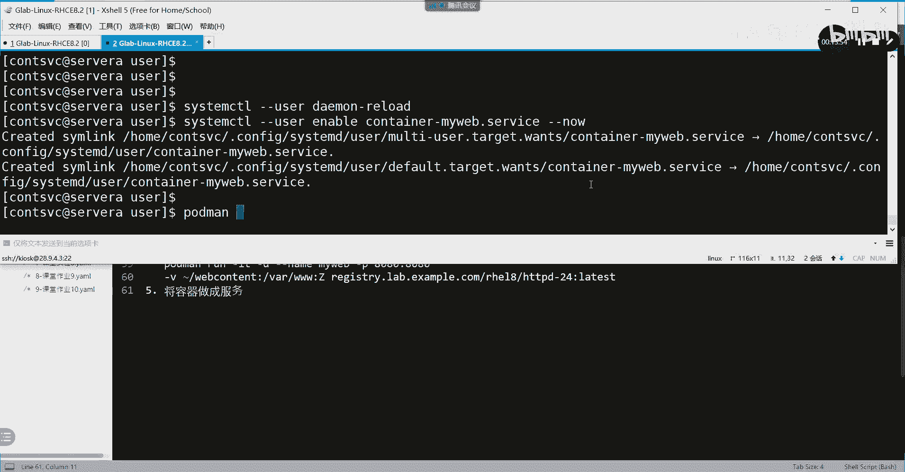
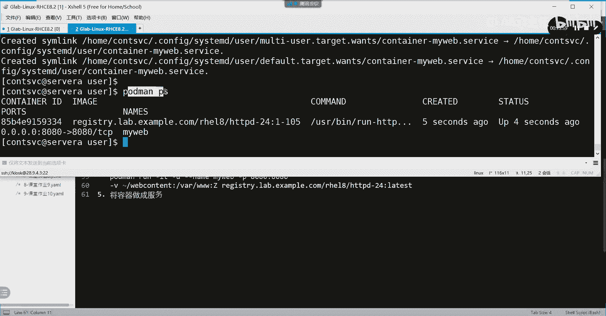
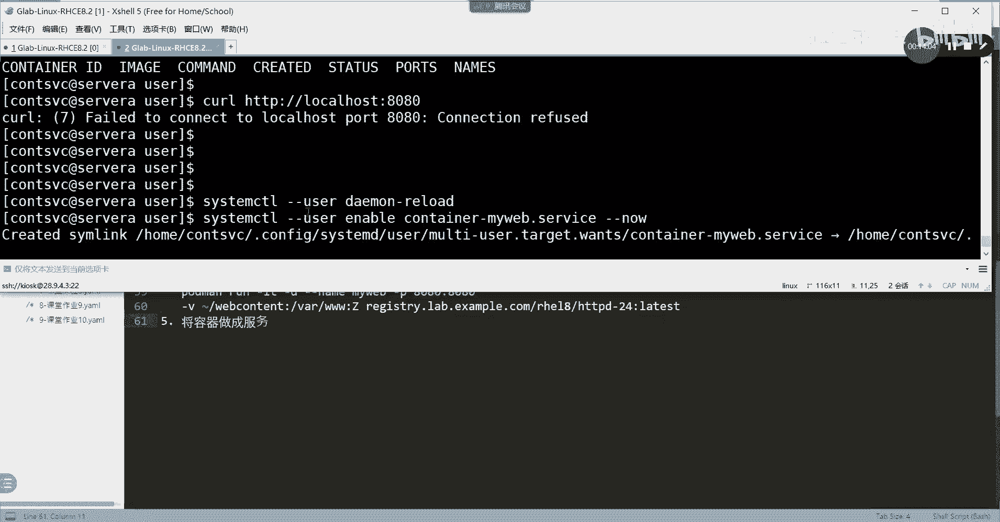
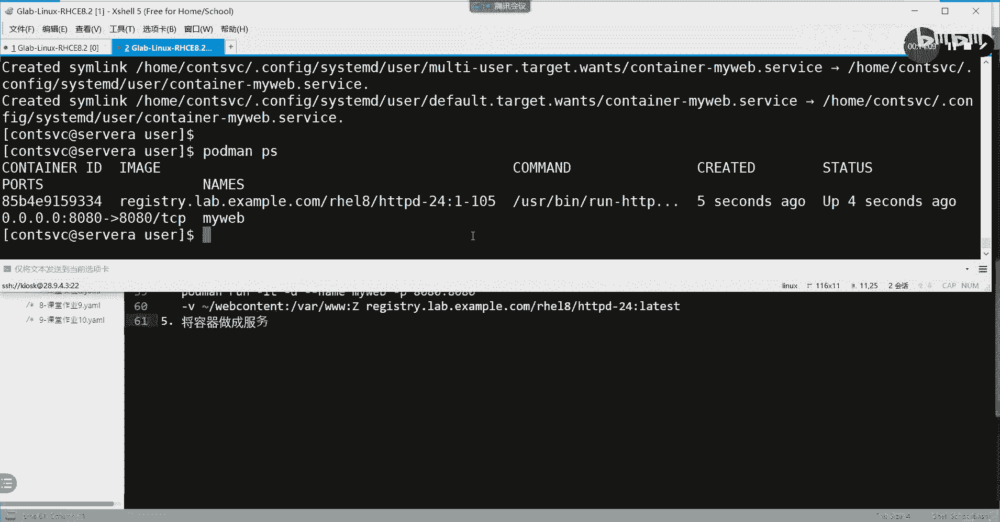
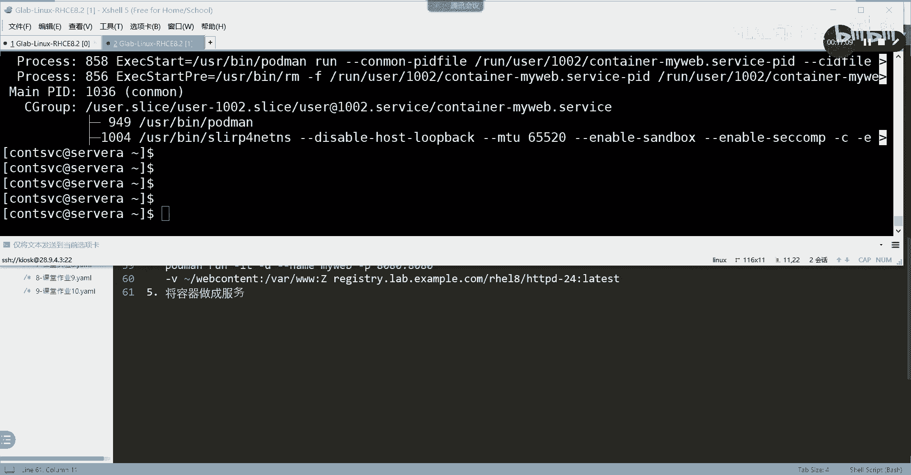
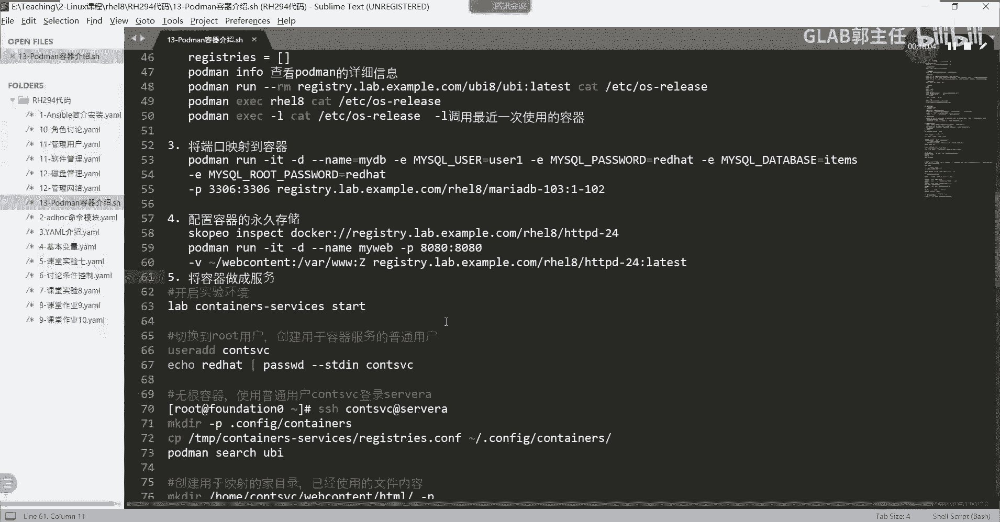

# Linux容器管理：59：将容器配置为系统服务 🚀



在本节课中，我们将学习如何将一个运行中的容器配置为系统服务。这允许容器像常规服务一样在系统上运行，支持开机自启和服务管理，是自动化部署和运维的关键技能。

## 概述

上一节我们介绍了容器的端口映射和文件持久化。本节中，我们来看看如何将容器“服务化”。其核心目标是：创建一个无根容器，将其转换为系统服务，并确保该服务能在系统重启后自动启动，而无需手动执行任何 `podman run` 命令。

## 环境与用户准备

首先，我们需要一个专门用于管理容器的普通用户。在考试环境中，此用户可能已创建好。若未创建，需以 `root` 用户执行以下操作：

```bash
useradd cntsvc
echo "redhat" | passwd --stdin cntsvc
```

创建完成后，使用 `ssh cntsvc@server` 命令切换到该用户进行操作。

## 配置容器存储

接下来，我们需要为容器服务创建必要的配置目录和文件。

1.  **创建配置目录**：服务有规范性要求，需在用户家目录下创建隐藏的配置目录。
    ```bash
    mkdir -p ~/.config/containers
    ```

2.  **复制全局配置文件**：将环境中已预配置好的容器全局配置文件复制到刚创建的目录中。此文件定义了容器运行时的一些全局设置。
    ```bash
    cp /tmp/containers/registries.conf ~/.config/containers/
    ```

## 创建示例Web容器

我们将创建一个运行Apache HTTP服务器的容器作为示例。

1.  **创建网页目录和文件**：
    ```bash
    mkdir -p ~/webcontent/html
    echo "Hello World" > ~/webcontent/html/index.html
    ```

2.  **登录到容器镜像仓库**（如果需要）：
    ```bash
    podman login registry.redhat.io
    ```
    用户名：`your-username`，密码：`your-password`。

3.  **运行容器**：启动一个名为 `myweb` 的容器，映射端口并挂载网页目录。
    ```bash
    podman run -itd --name myweb -p 8080:8080 -v ~/webcontent/html:/var/www/html:Z registry.redhat.io/rhel8/httpd-24:1-105
    ```



4.  **测试容器**：验证容器是否正常运行。
    ```bash
    curl http://localhost:8080
    ```
    应返回 “Hello World”。

## 将容器转换为系统服务 🛠️

这是本节的核心操作。我们将利用现有容器生成一个系统服务单元文件。

1.  **创建服务目录**：为用户级服务创建 `systemd` 目录。
    ```bash
    mkdir -p ~/.config/systemd/user
    cd ~/.config/systemd/user
    ```

2.  **生成服务文件**：使用 `podman generate systemd` 命令基于现有容器生成服务配置文件。
    ```bash
    podman generate systemd --name myweb --files --new
    ```
    此命令会生成一个名为 `container-myweb.service` 的文件，其中定义了服务的启动、停止等操作。

3.  **清理原始容器**：为了证明后续启动的是服务而非我们手动运行的容器，现在删除所有容器。
    ```bash
    podman rm -f -a
    podman ps # 确认容器已删除
    curl http://localhost:8080 # 此时应无法访问
    ```

## 启用并管理容器服务

现在，我们开始启用并测试这个新创建的服务。

以下是启用和管理用户级服务的几个关键步骤：

1.  **重载systemd配置**：让systemd识别新的服务文件。
    ```bash
    systemctl --user daemon-reload
    ```





2.  **启用并立即启动服务**：**此命令必须连在一起执行**，以确保服务立即启动并设置开机自启。
    ```bash
    systemctl --user enable container-myweb.service --now
    ```



3.  **验证服务状态**：检查服务是否成功运行，并确认容器是否随之启动。
    ```bash
    systemctl --user status container-myweb.service
    podman ps
    curl http://localhost:8080 # 此时应能再次访问
    ```



4.  **设置用户服务开机自启**：这是确保服务在系统重启后能自动运行的关键命令。
    ```bash
    loginctl enable-linger
    ```
    该命令允许用户服务在用户未登录时仍保持活动状态。

## 最终测试：重启验证

为了彻底验证服务配置成功，我们需要重启系统。

1.  以 `root` 用户执行重启：`reboot`
2.  系统重启后，**务必使用 `cntsvc` 普通用户重新登录**，因为这是用户级服务。
3.  登录后执行以下检查：
    ```bash
    podman ps # 应看到 myweb 容器已自动运行
    systemctl --user status container-myweb.service # 应显示为 active (running)
    curl http://localhost:8080 # 应能正常访问
    ```

如果以上检查全部通过，则证明容器已成功配置为系统服务，并实现了开机自启。



## 总结



本节课中我们一起学习了将容器配置为系统服务的完整流程。我们首先准备了专用用户和配置环境，然后创建了一个示例Web容器。接着，通过 `podman generate systemd` 命令生成了服务文件，并利用 `systemctl --user` 和 `loginctl enable-linger` 命令实现了服务的启用、管理和开机自启。最终通过系统重启验证了配置的有效性。掌握此技能，可以极大地提升容器化应用的管理效率和可靠性。